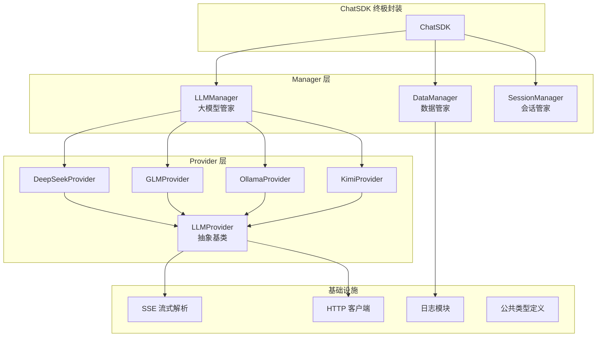
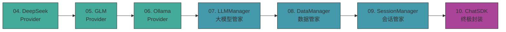

---
tags:
  - moc
  - ai-sdk
  - 项目
  - cpp
aliases:
  - AI-SDK学习入口
  - AI-SDK知识地图
---

# AI-SDK 学习入口

这是你的第一个完整 C++ 项目——从零开始实现一个多模型 AI 聊天 SDK。它综合了 C++ 基础、Linux 网络编程和并发设计的所有知识，也是面试准备的核心素材。

## 前置知识

- [[1.c++学习/00-学习入口]] — C++ 基础：类、继承、多态、模板、STL
- [[2.Linux/00-学习入口]] — Linux 系统编程：线程、互斥锁、网络
- [[muduo库/00-学习入口]] — 网络库设计思路（Buffer、Channel 等概念在本项目中也有体现）

## 项目架构总览

## 开发路线（按实现顺序）

### Provider 实现（从具体到抽象）

- [[从零开始接入AI-SDK/04-DeepSeekProvider的实现]] — 第一个 Provider，跑通 SSE 流式对话
- [[从零开始接入AI-SDK/05-智谱GLMProvider的实现]] — 第二个 Provider，验证抽象接口
- [[从零开始接入AI-SDK/06-OllamaProvider的实现]] — 本地模型接入
- [[从零开始接入AI-SDK/KimiProvider的实现]] — Kimi Provider
- [[从零开始接入AI-SDK/LLMProvider的实现]] — 抽象基类设计

### Manager 层

- [[从零开始接入AI-SDK/07-LLMManager大模型管家的实现]] — 多 Provider 管理、负载均衡
- [[从零开始接入AI-SDK/08-DataManager数据管家的实现]] — 消息持久化
- [[从零开始接入AI-SDK/09-SessionManager会话管家的实现]] — 多会话管理

### 终极封装

- [[从零开始接入AI-SDK/10-ChatSDK终极封装大满贯]] — 对外统一接口

### 面试突击

- [[从零开始接入AI-SDK/11-面试突击篇（上）——C++高级特性与并发安全]]
- [[从零开始接入AI-SDK/12-面试突击篇（下）——架构设计与网络流式传输]]

### 源码与总结

- [[从零开始接入AI-SDK/AI_SDK/README]] — 项目 README
- [[从零开始接入AI-SDK/AI_SDK/BUILD_SUMMARY]] — 构建总结

## 和其他主线的连接

- 语言基础回扣：[[1.c++学习/00-学习入口]]
- Linux 系统回扣：[[2.Linux/00-学习入口]]
- 网络库思路：[[muduo库/00-学习入口]]
- 面试表达：[[7天面试备战计划/00-学习入口]]
- 面试 7 天计划中第 5-6 天专门讲这个项目：[[7天面试备战计划/05-第五天-AI-SDK项目架构]]
