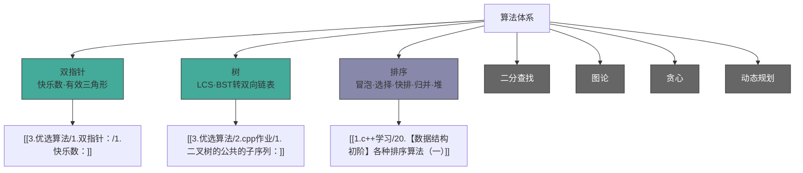

## 算法知识分类树

> 绿色 = 已有笔记，灰色 = 待补充

---

关于「刚接触编程」的同学，如何「高效学习算法」这件事。

> [!note] 关联入口
> - 上位入口：[[3.优选算法/00-学习入口]]
> - 前置知识：[[1.c++学习/00-学习入口]]
> - 相关笔记：[[1.c++学习/20.【数据结构初阶】各种排序算法（一）]]、[[6.4月C++岗位面试冲刺/06. 2026-04-06 - STL容器迭代器与复杂度八股]]
> - 下一步：[[3.优选算法/1.双指针：/1.快乐数：]]

近期有很多大一大二的同学报名蓝桥杯，学习算法的热情非常高，不少同学会问我一些算法问题，在这里集中分享一些针对初学者的学习经验，让大家少走一些弯路。

# 1. 不要盲目攀比，不要妄自菲薄

有些同学会遇到身边有些大佬，分明是同时进入的大学，但是他们在做算法题的时候的得心应手，丝毫不像一个初学者。不禁会有以下的感受：
- 难他天（难道他们是天才）？
- 他们怎么啥都会啊！
- 我也太垃圾了！
- 我还报了比特的课，怎么感觉和他们差距这么大？
- ......

其实大家大可不必急着否定自己，他们这些人大多都是在初中或者高中（甚至小学）就已经接触编程了，而且也打过不少比赛。所以和他们相比，初学者的我们就像稚嫩的婴儿，还不会走路，差距就非常明显。

但是，学习算法这个东西，不是谁起步早谁就会有绝对的优势。从大一大二开始学习，也是可以超越他们的。因此，不要和他们比，我们应该和昨天的自己比，只要每天都在进步，这就足够了。

# 2. 强烈建议语法学好之后（也就是主线课程），再来学算法

这段时间答疑很多111、112、113期的学生，基本上都是刚刚学完 C 语言，然后就转战算法。这里想告诉大家，不是说刚学完 C 语言搞不了算法，而是用 C 语言去解决算法问题会遇到很多麻烦的事情。

比如一个简单的例子：一道算法题需要使用数据结构 - 堆，如果用 C 语言搞，你需要手写一个堆结构，这是很恐怖的。别人已经用 C++、Java 等高级语言十几行就搞定的事情，你可能还在调试自己手写的堆有没有 bug。这是非常低效的。

所以，如果是大一大二刚接触编程的同学，我希望大家先沉淀沉淀，把主线课程中的高级语法知识好好学完之后，再来学习算法。而且在学习主线的课程中，只要能把课程中的所有代码都好好敲一敲，代码能力提上去之后，再去搞算法的时候也会非常轻松。

磨刀不误砍柴工，工欲善其事，必先利其器，都是这个道理。

# 3. 系统的学习，从易到难的刷题，不要漫无目的乱刷题

算法的内容其实是可以分成一块一块的，比如枚举，贪心，动态规划，搜索等等（详细的可以看我贴进来的《蓝桥杯知识点大纲》）。因此我们学习算法的时候，就可以一个模块一个模块的学习，这样学习的时候就会有章程。

其次，在学习每一个模块的时候，应该是先通过基础的题了解这个算法是啥，然后再去刷一些难的题去应用这个算法。而不是刚开始就上难度，这样非常容易劝退。比如学动态规划，上来就背包问题的话，可能会直接懵逼。如果先从简单的路径类 dp 了解这个算法，然后再慢慢上强度，这样的学习就比较舒服。

# 4. 养成写题解的习惯

在座的各位应该都不是过目不忘的天才吧，遗忘是很正常的。学算法的时候经常会遇到之前已经做过的题，但是不会做的情况。这个时候就需要我们在最开始学习的时候，养成写题解的好习惯。

这个题解可以很简单，简单到只有一两句，只要自己往后再看到这道题时，如果忘记怎么做，看到题解能够立马想到解法即可。

你可以写：
- 解题思路
- 算法流程
- 代码注释
- 易错点
- 第一次做的时候哪里出错了

切忌：
这个玩意大多数情况下是写给你自己看的，不要追求好看或者访问量啥的，自己看着舒服，自己能看懂就是最好的题解。

# 5. 尽量独立解决 bug，多调试，多画图，多思考

学算法包括大家以后工作的时候写代码，调试是非常基本且非常常用的一个技能。程序员基本上每天都是在调试代码，一杯茶，一包烟，一个 bug 改一天。因此调试能力是一个程序员最基本的能力。

遇到 bug 多去结合错误用例模拟，多去画图调试，这是学习算法以及学习编程的必经之路。有时候一道题调试一两天都有可能，一定要耐着性子，静下心来去做，不然学习效果非常不好。
（真的希望大家学习的时候把纸和笔拿出来，有的算法画图模拟特别清楚！）

尽量独立解决每一道问题，你让别人给你调试代码，你是在锻炼别人的调试能力嘛？所以，尽量不要让别人给你找 bug。

当然，如果你调试了一两天，已经快要崩溃了，这个时候可以去求助一下别人（比如我，嘿嘿）。

# 6. 看别人的题解不羞耻，但是要独立完成代码的编写工作

要有一个思想指引：题目做不出来的话，看别人的代码或者题解不丢人，这是非常正常的一件事。

我也经常偷看别人的代码，别人的题解，然后学习别人的代码风格，借鉴别人的优美的代码。

但是但是但是：看完之后，不要复制粘贴，也不要一边看着别人的代码，一边写自己的代码。一定要根据思路，自己把代码写出来。

题是做不完的，一定要做一道题就能达到一定的效果。这就是大家上高中的时候，有的学霸做几道题就够了，而有的人需要做很多题，就是你对待每一道题的态度不一样。

# 7. 多思考，多动脑

有和我（或者别人题解）不一样的想法是很正常的，因为算法本身就是一种解决问题的思想，你这样想，我那样想都是很正常的。

每个人看待问题的角度都是不一样的，但是有可能我们都是殊途同归，虽然想的不一样，但是都是可以解决这个问题的。

# 8. 不要只背一个模板，没用

只背一个模板，会导致下面的问题：
- 只会做这一道题，换一道题就凉凉。
- 知道这道题要用这个模板，但是不会套用，不会在模板的基础上修改。

一定要知其然并且知其所以然，只有你了解这个模板背后的算法原理之后，才能用的得心应手。

写在最后：
有时候我们会看到这样的言论：学习算法有啥用？以后工作了基本上用不到算法！

确实，工作中基本上很少用到算法。但是，我们要明确一点，算法的学习，最重要的是对自己各种能力的提升，比如：
- 遇到问题时，会想着用很多种方法去解决（而不是简单的模拟）；
- 代码遇到 bug 的时候，调试起来非常快（算法中复杂的逻辑都能调试明白，业务代码中的逻辑就更清晰了）
- 代码能力的提升（能够把自己所想的东西转化成代码）

说点更现实的，算法不过关，笔试面试都过不去，还找个啥工作呀。所以不要觉得学习算法是在做无用功，这是一个功在当代利在千秋的事情。

最后的最后，祝参加比赛的同学都能取得好成绩，找工作的同学都能找到好工作。

# 祝大家新年快乐~
