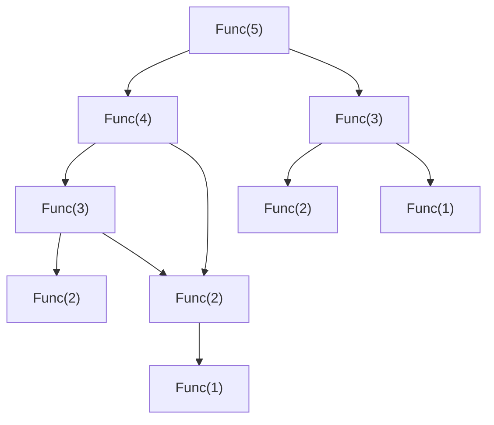
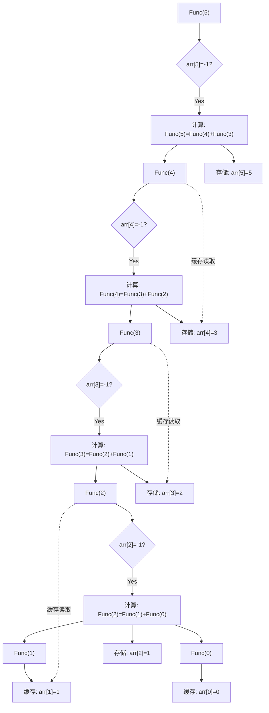
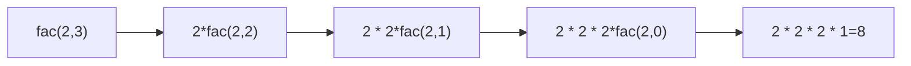

# 题目一： 递归和非递归分别实现求第n个斐波那契数
## 1. 斐波那契数列的简介：
### 斐波那契数列的定义
斐波那契数列（Fibonacci Sequence）是数学中一个经典的数列，其核心特征是**从第三项开始，每一项等于前两项之和**。
#### (1) 严格数学定义：
- 初始条件（基例）：
    - 第 0 项：`F(0) = 0`
    - 第 1 项：`F(1) = 1`
- 递推公式（n ≥ 2 时）：  
    `F(n) = F(n-1) + F(n-2)`
#### (2)举例说明前几项：
按上述定义计算，前几项依次为：  
`F(0)=0`，`F(1)=1`，`F(2)=F(1)+F(0)=1+0=1`，`F(3)=F(2)+F(1)=1+1=2`，`F(4)=3`，`F(5)=5`，`F(6)=8`，……
#### (3)注意：起始条件的差异

部分场景（尤其是编程题）中，斐波那契数列的起始索引可能从第 1 项开始，定义为：

- `F(1) = 1`，`F(2) = 1`，`F(n) = F(n-1) + F(n-2)`（n ≥ 3）。  
    此时前几项为：`1, 1, 2, 3, 5, 8...`（与你问题中“练习题”的代码实现需注意索引匹配）。
### 为什么斐波那契数列常作为编程练习？
斐波那契数列的递归定义非常直观（直接对应数学公式），但**直接递归会导致大量重复计算**（例如计算 `F(5)` 时会重复计算 `F(3)`、`F(2)` 等），因此常被用来练习：
- 递归思想的应用；
- 优化递归（如记忆化搜索）；
- 转换为更高效的迭代（非递归）方法。

## 2.使用递归方式来实现：
```c
int Func(int n)
{
	if (n == 1 || n == 2)
	{
		return 1;
	}
	else {
		return Func(n - 1) + Func(n - 2);//会有大量的重复，导致运算不佳
	}
}

int main()
{
	int n = 0;
	scanf("%d", &n);
	int ret = Func(n);
}
```
由于初步代码会有大量的冗余的计算，导致运算较慢；当计算较大的 `n` 时（例如 `n=5`），递归会不断分解为更小的子问题，但这些子问题会被**重复计算多次。
举例说明（以 `n=5` 为例）：
- 计算 `Func(5)` 需要计算 `Func(4)` 和 `Func(3)`；
- 计算 `Func(4)` 需要计算 `Func(3)` 和 `Func(2)`；
- 计算 `Func(3)` 需要计算 `Func(2)` 和 `Func(1)`；
- 计算 `Func(2)` 直接返回 1（基例）。
此时，`Func(3)` 被计算了 2 次（来自 `Func(4)` 和 `Func(5)`），`Func(2)` 被计算了 3 次（来自 `Func(3)`、`Func(4)`、`Func(5)`）。随着 `n` 增大，重复次数会**指数级激增**（例如 `n=10` 时，`Func(5)` 会被重复计算 8 次以上。
改进的代码如下：
```c
#define  _CRT_SECURE_NO_WARNINGS
#include<stdio.h>

//递归和非递归分别实现求第n个斐波那契
#define max_n 100
int arr[max_n] = { 0 };

int Func(int n) 
{
	if (n <= 1)
		return n;
	if (arr[n] != -1)
		return arr[n];
	arr[n] = Func(n - 1) + Func(n - 2);
	return arr[n];
}


int main()
{
	int sz = sizeof(arr) / sizeof(arr[0]);
	for (int i = 0; i < sz; i++)
	{
		arr[i] = -1;
	}
	arr[0] = 0;
	arr[1] = 1;
	int n = 0;
	scanf("%d", &n);
	int ret = Func(n);
	printf("%d", ret);
}
```

### 改进后代码的运作原理分析及正确性验证
改进后的代码通过**记忆化搜索（Memoization）**优化了原始递归的重复计算问题。其核心是利用一个全局数组 `arr` 作为“缓存”，存储已计算过的斐波那契值，避免重复递归调用。以下是详细分析：
#### **1. 代码运作流程**
改进后代码的关键步骤如下（以计算 `n=5` 为例）：

| 步骤  | 操作描述                                                                | 数组 `arr` 状态变化（初始全为 `-1`）        |
| --- | ------------------------------------------------------------------- | ------------------------------- |
| 1   | 初始化 `arr[0]=0`，`arr[1]=1`（基例）。                                      | `arr[0]=0`, `arr[1]=1`，其余为 `-1` |
| 2   | 调用 `Func(5)`，检查 `arr[5]` 是否为 `-1`（是），进入递归计算。                        | `arr[5] = -1`                   |
| 3   | 计算 `Func(5)` 需先计算 `Func(4)` 和 `Func(3)`。                            |                                 |
| 4   | 调用 `Func(4)`，检查 `arr[4]` 是否为 `-1`（是），继续递归。                          | `arr[4] = -1`                   |
| 5   | 计算 `Func(4)` 需先计算 `Func(3)` 和 `Func(2)`。                            |                                 |
| 6   | 调用 `Func(3)`，检查 `arr[3]` 是否为 `-1`（是），继续递归。                          | `arr[3] = -1`                   |
| 7   | 计算 `Func(3)` 需先计算 `Func(2)` 和 `Func(1)`。                            |                                 |
| 8   | 调用 `Func(2)`，检查 `arr[2]` 是否为 `-1`（是），继续递归。                          | `arr[2] = -1`                   |
| 9   | 计算 `Func(2)` 需先计算 `Func(1)` 和 `Func(0)`。                            |                                 |
| 10  | 调用 `Func(1)`，检查 `arr[1]` 是否为 `-1`（否，值为 `1`），直接返回 `1`。               |                                 |
| 11  | 调用 `Func(0)`，检查 `arr[0]` 是否为 `-1`（否，值为 `0`），直接返回 `0`。               |                                 |
| 12  | `Func(2) = 1 + 0 = 1`，存入 `arr[2]`，返回 `1`。                           | `arr[2] = 1`                    |
| 13  | 回到 `Func(3)`，计算 `Func(2) + Func(1) = 1 + 1 = 2`，存入 `arr[3]`，返回 `2`。 | `arr[3] = 2`                    |
| 14  | 回到 `Func(4)`，计算 `Func(3) + Func(2) = 2 + 1 = 3`，存入 `arr[4]`，返回 `3`。 | `arr[4] = 3`                    |
| 15  | 回到 `Func(5)`，计算 `Func(4) + Func(3) = 3 + 2 = 5`，存入 `arr[5]`，返回 `5`。 | `arr[5] = 5`                    |

最终，`Func(5)` 返回 `5`，与斐波那契数列的第5项（从0开始计数）一致。
#### **2. 正确性验证**
改进后的代码严格遵循斐波那契数列的定义，且通过缓存机制确保每个 `n` 仅计算一次：
- **基例正确**：`n=0` 返回 `0`，`n=1` 返回 `1`（与数学定义一致）。
- **递推正确**：对于 `n≥2`，`arr[n]` 存储的是 `arr[n-1] + arr[n-2]` 的结果，符合 `F(n) = F(n-1) + F(n-2)`。
- **缓存有效性**：数组 `arr` 初始化为 `-1`，仅当 `arr[n] ≠ -1` 时直接返回缓存值，确保已计算的子问题不会重复计算。
### 改进前后代码工作原理对比（Mermaid图表）
以下是原始递归与改进后递归的流程对比（以 `n=5` 为例）：



改进后的代码通过**记忆化缓存（数组 `arr`）**避免了原始递归的大量重复计算，时间复杂度从指数级 `O(2ⁿ)` 优化为线性 `O(n)`，且逻辑正确，能准确返回第 `n` 个斐波那契数。

## 3. 通过迭代的方式来实现
代码如下：
```c
int main()
{
	int  a = 1;
	int b = 0;
	int ret,tmp = 0;
	int n = 0;
	scanf("%d", &n);
	for (int i = 0; i < n; i++)
	{
		ret = a + b;
		tmp = b;
		b = ret;
		a = tmp;
	}
	printf("%d", ret);
}
```
这个代码也解决了斐波那契数列的问题；也没有过多的重复计算。
# 题目二：递归实现n的k次方
先看代码：
```c
int fac(int n, int k)
{
	if(k > 1)
		return n * fac(n,k - 1 );
	if (k == 0)
		return 1;
}

int main()
{
	int n = 0;
	int k = 0;
	scanf("%d %d", &n, &k);
	int ret = fac(n, k);
	printf("%d", ret);
}
```


通过递归来解决这个问题，颇有一种大事化小的感觉。
# 题目三：计算一个数的每位之和（递归实现）
**写一个递归函数DigitSum(n)，输入一个非负整数，返回组成它的数字之和**
例如，调用DigitSum(1729)，则应该返回1+7+2+9，它的和是19
输入：1729，输出：19
```c
int Digitsum(int num)
{
	if (num /10 > 0)
	{
		int a = num % 10;
		return Digitsum(num/10) + a;
	}
	else {
		return num % 10;
	}
	
}

int main()
{
	int num = 0;
	scanf("%d", &num);
	int sum = Digitsum(num);
	printf("%d", sum);
}
```
以下是对题目三“递归实现计算一个数的每位之和”代码的详细分析及优化建议：
### 🔍 一、原始代码分析

```c
int Digitsum(int num) {
    if (num / 10 > 0) {       // 递归条件：数字多于1位
        int a = num % 10;     // 取最后一位数字
        return Digitsum(num/10) + a;  // 递归剩余部分并累加
    }
    else {                    // 基线条件：只剩1位数字
        return num % 10;      // 直接返回该数字
    }
}
```
#### ✅ 核心逻辑解析
1. **递归分解原理**：
    - **取末位**：`num % 10` 获取当前数字的最后一位（如1729 → 9）
    - **截断高位**：`num/10` 移除最后一位（1729 → 172）
    - **递归累加**：末位值 + 剩余部分的递归结果
2. **执行流程示例**（输入`1729`）：
    ```mermaid
    graph LR
    A["Digitsum(1729)"] --> B["9 + Digitsum(172)"]
    B --> C["9 + (2 + Digitsum(17))"]
    C --> D["9+2+(7 + Digitsum(1))"]
    D --> E["9+2+7+1=19"]
    ```
    
3. **时间复杂度**：O(d)  
    （d为数字位数，每个数字仅处理1次）
---
### ⚠️ 二、潜在问题与优化建议
#### 1. 边界条件缺陷
- **问题**：当输入`num=0`时：
    - `0/10=0` → 进入`else`分支
    - `0%10=0` → 返回0（正确）
- **风险**：未显式处理`num<0`的情况（题目要求非负整数）
#### 2. 代码冗余
- **冗余操作**：`else`分支的`num%10`可简化为`num`（因`num<10`时二者等价）
- **变量冗余**：临时变量`a`非必需
#### 3. 可读性优化
- 递归条件`num/10>0`可改为`num>=10`更直观
---
### 🔧 三、优化后代码

```c
#include <stdio.h>

int Digitsum(int num) {
    if (num < 0) return -1; // 处理非法输入
    if (num < 10) return num; // 基线条件：单数字直接返回
    return num % 10 + Digitsum(num / 10); // 递归累加
}

int main() {
    int num;
    scanf("%d", &num);
    printf("Sum: %d", Digitsum(num));
    return 0;
}
```
#### ✅ 优化点说明：

|原代码问题|优化方案|效果|
|---|---|---|
|未处理负数|添加`if(num<0)`校验|避免非法输入导致逻辑错误|
|冗余变量`a`|直接返回表达式|代码更简洁|
|终止条件冗余|`num%10` → `num`|单数字时直接返回更高效|
|条件可读性|`num/10>0` → `num>=10`|逻辑更直观|

---
### 🔄 四、递归与迭代方案对比

|**方案**|**代码示例**|**优点**|**缺点**|
|---|---|---|---|
|**递归**|`return num%10 + Digitsum(num/10);`|逻辑简洁，直接映射数学定义|栈溢出风险（超大数据）|
|**迭代**||||

# 题目四： 递归和非递归分别实现求n的阶乘（不考虑溢出的问题）
## 1.递归方式来实现
代码如下：
```c
int factorial(int n)
{
	if (n >= 1)
		return n * factorial(n - 1);
	if (n == 0)
		return 1;
}
int main()
{
	int n = 0;
	scanf("%d", &n);
	int ret = factorial(n);
	printf("%d", ret);
}
```
## 2.非递归方式来实现：
```c
int main()
{
	int ret = 1;
	int n = 0;
	scanf("%d", &n);
	while (n)
	{
		ret *= n;
		n--;
	}

	printf("%d", ret);
}
```
# 题目五： 递归方式实现打印一个整数的每一位
代码如下：
```c
void print_num(int num)
{
	if (num / 10 > 0)
	{
		print_num(num / 10);
		printf("%d ", num % 10);
	}
	else {
		printf("%d ", num);
	}
}

int main()
{
	int num = 0;
	scanf("%d", &num);
	print_num(num);
 }
```