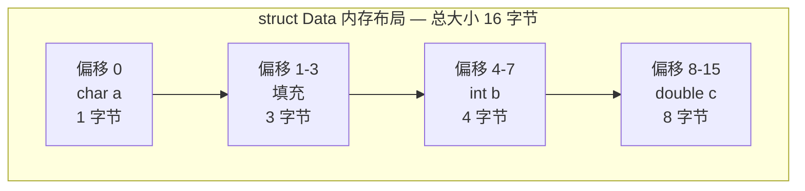
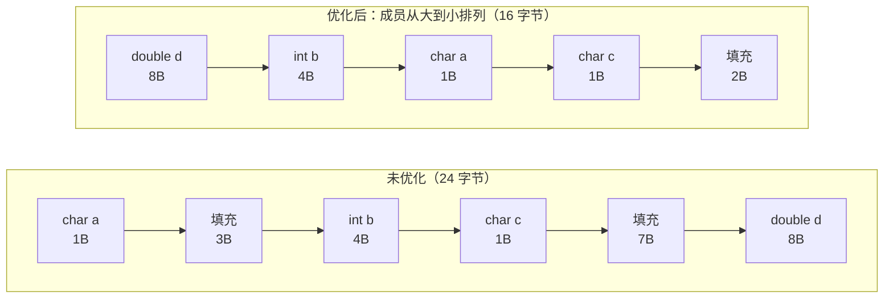

## 一、结构体：数据组织的艺术

结构体（`struct`）是 C 语言中**自定义复合数据类型**的核心工具，它将多个不同类型的变量组合成单一逻辑实体。这种能力让开发者能更自然地描述现实世界的复杂对象（如学生信息、坐标点等）。

### 1.1 为什么需要结构体？

当内置类型（`int`、`char` 等）无法完整描述对象时（如学生需包含姓名、学号、成绩），结构体通过**数据聚合**解决此问题，实现：

- ​**逻辑关联性**​：相关数据集中管理（如 `Point {x, y}`）
- ​**代码可读性**​：命名成员替代晦涩的多变量组合
- ​**高效传递**​：单结构体指针替代多个参数传递

---

## 二、结构体的定义与使用

### 2.1 定义语法（`struct` 关键字）

```C
// 基础定义
struct Student {
    char name[20];  // 字符串成员
    int id;         // 整型成员
    float score;    // 浮点成员
}; // 分号不可省略！
```

### 2.2 使用 `typedef` 简化类型名

```C
typedef struct {
    int x, y;      // 坐标点成员
} Point;           // 直接使用 Point 声明变量

Point p1;          // 无需写 struct 关键字
```

### 2.3 结构体变量初始化（三种方法）

|​**方法**​|​**示例**​|​**适用场景**​|
|---|---|---|
|​**顺序初始化**​|`Student s1 = {"Alice", 1001, 90.5};`|简单结构，成员顺序清晰|
|​**指定成员初始化**​|`Student s2 = {.id=1002, .name="Bob"}; // score 自动赋0`|复杂结构，避免顺序依赖|
|​**指针动态初始化**​|`Student *s3 = malloc(sizeof(Student));`  <br>`strcpy(s3->name, "Charlie");`|动态内存分配场景|

> 注意：​**数组成员**​（如 `name[20]`）必须用 `strcpy` 赋值，不可直接 `=`

---

## 三、深度剖析：结构体内存对齐

### 3.1 为什么需要内存对齐？

- ​**硬件要求**​：CPU 按块（4/8字节）读取内存，对齐后单次读取即可获取数据
- ​**性能优化**​：未对齐数据需多次读取拼接，速度下降 50%+
- ​**平台兼容**​：ARM 等架构直接拒绝访问未对齐数据

### 3.2 内存对齐规则（以 64 位系统为例）

|​**规则**​|​**说明**​|
|---|---|
|​**规则1**​：首地址对齐|结构体首地址 = 最大成员大小的整数倍|
|​**规则2**​：成员偏移对齐|成员偏移量 = `min(成员大小, 编译器默认对齐数)` 的整数倍|
|​**规则3**​：整体大小对齐|结构体总大小 = 最大对齐数的整数倍|

> 编译器默认对齐数：VS 为 8，Linux 为成员自身大小

### 3.3 内存布局可视化（图示分析）

#### 示例结构体

```C
struct Data {
    char a;      // 1 字节
    int b;       // 4 字节
    double c;    // 8 字节
};
```

#### 结构体内存布局图



#### 优化前后对比



> 核心原则：**成员按从大到小排列**，减少填充空隙。


---

## 四、对齐优化技巧与实战

### 4.1 查看成员偏移量

```
#include <stddef.h>
printf("b 的偏移量: %zu\n", offsetof(struct Data, b)); // 输出 4
```

### 4.2 手动优化结构体布局

```C
// 未优化（16 字节）
struct Inefficient {
    char a;     // 1 + 3 填充
    int b;      // 4
    char c;     // 1 + 7 填充
    double d;   // 8
};

// 优化后（12 字节）
struct Optimized {
    double d;   // 8（偏移 0）
    int b;       // 4（偏移 8）
    char a;      // 1（偏移 12）
    char c;      // 1（偏移 13）
                // 总大小 14 → 填充至 16（最大对齐数 8 的倍数）
};
```

> ​**优化原则**​：从大到小排列成员，减少填充空隙

### 4.3 特殊场景对齐控制

```C
// 紧凑模式（牺牲性能，减少内存）
#pragma pack(1)      // 设置对齐系数为 1
struct PackedData {
    char a;
    int b;           // b 可能未对齐
};
#pragma pack()       // 恢复默认对齐

// GCC 显式对齐（C11）
#include <stdalign.h>
struct AlignedData {
    alignas(8) char a;  // 强制 a 按 8 字节对齐
};
```

---

## 五、结构体核心应用场景

1. ​**数据建模**​  
    学生管理系统：
    
    ```C
    typedef struct {
        char id[10];
        char name[20];
        float grades[5];
    } Student;
    ```
    
2. ​**硬件寄存器映射**​（嵌入式开发）
    
    ```C
    struct UART_Reg {
        volatile uint32_t data;  // 数据寄存器
        volatile uint32_t status;// 状态寄存器
    };
    ```
    
3. ​**数据结构实现**​  
    链表节点：
    
    ```C
    struct Node {
        int data;
        struct Node *next;  // 自引用指针
    };
    ```
    
4. ​**文件 I/O 操作**​
    
    ```C
    FILE *fp = fopen("data.bin", "rb");
    Student s;
    fread(&s, sizeof(Student), 1, fp); // 整体读写
    ```
    

---

## 六、总结：关键知识点梳理

|​**主题**​|​**核心要点**​|
|---|---|
|​**定义**​|`struct` + 成员列表 → 自定义复合类型|
|​**初始化**​|顺序初始化、指定成员初始化、指针动态分配|
|​**内存对齐**​|成员偏移 = 对齐数整数倍；总大小 = 最大对齐数整数倍|
|​**优化策略**​|成员降序排列 → 减少填充；`#pragma pack` 控制对齐|
|​**应用场景**​|数据建模、硬件映射、数据结构、文件操作|

> ✨ ​**最佳实践建议**​：
> 
> - 优先使用 `typedef` 简化类型名
> - 传递大型结构体时**传地址**而非值（避免复制开销）
> - 敏感场景验证对齐（`offsetof`）避免跨平台问题
