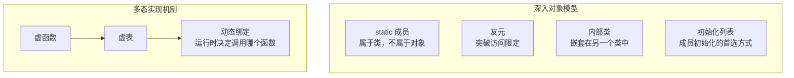

#  1.再探构造函数：




## 1.1.初始化列表的出现与定义：

在我们尝试使用初始化类的时候会发现：我们讲无法初始化常量和引用成员。原因是：

1. c   onst 成员在声明后必须立即初始化，且只能初始化一次。构造函数体内赋值属于“二次修改”，违反常量语义，导致编译错误。

2. 引用必须在声明时绑定对象，且后续不可更改绑定目标。构造函数体内赋值相当于尝试修改引用指向，违反引用语义。

错误如下：

​编辑

那此时应该怎么办呢？cpp提出了初始化列表，用笔者自己的理解就是class里面的成员变量初始化的地方，所以的类里面的变量必须经过的地方：用于在对象创建时**直接初始化成员变量**。它位于构造函数的参数列表之后、函数体之前，以冒号   : 开头，后跟逗号分隔的成员初始化表达式，格式如下：

​编辑

改成这种就是ok的。我们第一种的错误有：

1. **常量成员（const）初始化错误: c**onst成员必须在对象创建时初始化，且只能初始化一次.

2. **引用成员绑定错误:**引用必须在声明时绑定对象，不能重新赋值.

## 1.2.初始化列表的优点：

初始化列表的出现除了解决上面的两个问题，主要还是让cpp的性能提升更大：对**类类型成员**（非内置类型），初始化列表直接调用其拷贝/移动构造函数；若在构造函数体内赋值，会先触发默认构造，再执行赋值运算符，造成双重开销。同时代码初始化时是按照顺序来初始化：**强制初始化顺序规范化**成员初始化顺序**严格按类中声明顺序执行**（与初始化列表书写顺序无关），避免依赖未初始化成员的隐患。

## 1.3对比和总结：

|**特性**|**初始化列表**|**构造函数体内赋值**|
|---|---|---|
|**执行时机**|在构造函数体**之前**执行|在构造函数体**内部**执行|
|**本质**|直接初始化（调用拷贝/移动构造）|先默认构造 + 再赋值操作|
|**效率**|高效（避免冗余的默认构造）|低效（尤其对复杂类型）|
|**适用性**|支持所有类型，**强制**用于常量、引用、无默认构造的类成员|不适用于常量、引用成员|

初始化列表是 C++ 对象初始化的核心机制，其设计初衷是解决**常量、引用及无默认构造的类成员**的初始化问题，同时通过避免冗余操作提升性能。它体现了 C++ “直接初始化”而非“先构造再赋值”的哲学，是编写高效且正确类的关键实践。

# 2.类型转换：

C语言中也是支持类型转换的，比如int转为double，或者相反。而cpp中还支持构造时的类型转换。我们可以看一个例子来说明一下：

```cpp
class A {

public:

A(int a_val = 1, int b_val = 10)

:a(a_val),

b(b_val)

{

}

private:

int a;

int b;

};

int main()

{

A a1(1, 9);

A a2 = (1, 2);

}
```


这里大致时先构造临时变量在进行拷贝构造，但是大部分编译器会进行优化，这样相当于进行类型转换。正如还有一个例子：

```cpp
class A {

public:

A(int a_val) : a(a_val) {} // 单参数构造函数

private:

int a;

};

A a = 42; // 隐式调用A(int)，将int转换为A类型[5](@ref)[8](@ref)
```


这里也是进行类型转换的。

# 3.static：

static是静态的意思,我们可以用它来修饰类的成员变量和成员函数：

1. 用static修饰成员变量就称为静态成员变量，同时我们对他初始化一定要在类外初始化。我们注意到此类变量只是收到域名的影响，但是生命周期仍然是全局的。即：静态成员变量为所有类对象所共享，不属于某个具体的对象，不存在对象中，存放在静态区。

2. 用static来修饰函数就是静态成员函数，静态成员函数没有this指针，同时还有以下几点要注意：

- 静态成员函数中可以访问其他的静态成员，但是不能访问非静态的成员变量，因为没有this指针。

- 静态成员也是类的成员，受public、protected、private访问限定符的限制 。

- 静态成员变量不能在声明位置给缺省值初始化，因为缺省值是个构造函数初始化列表的，静态成员变量不属于某个对象，不走构造函数初始化列表 。

# 4.friend和内部类：

C++提供了多种机制来控制类成员的访问权限，除了公有的（public）、私有的（private）和保护的（protected）访问修饰符外，**友元（Friend）和内部类（Nested Class）** 是两种特殊的访问控制方式，它们允许特定的函数或类访问另一个类的非公有成员。

## 4.1. Friend（友元）

友元是C++中一种**打破封装**的特性，它允许一个外部函数或类访问另一个类的私有（private）和保护（protected）成员。

1. 友元函数是在类内部声明的**非成员函数**，使用    friend  关键字修饰。它不是类的成员函数，但可以访问类的所有私有和保护成员。

```cpp
#include <iostream>

#include <cmath>

using namespace std;

class Point {

private:

double x, y;

public:

Point(double xx, double yy) : x(xx), y(yy) {}

// 声明友元函数

friend double distanceBetweenPoints(const Point& a, const Point& b);

};

// 定义友元函数，计算两点距离

double distanceBetweenPoints(const Point& a, const Point& b) {

return sqrt((a.x - b.x) * (a.x - b.x) + (a.y - b.y) * (a.y - b.y));

}

int main() {

Point p1(1.0, 2.0), p2(4.0, 6.0);

cout << "Distance: " << distanceBetweenPoints(p1, p2) << endl;

return 0;

}


C++

一个类可以将另一个类声明为它的友元类。这样，友元类的所有成员函数都可以访问该类的私有和保护成员。

class TargetClass {

private:

int secretData;

// 声明友元类

friend class FriendClass;

};

class FriendClass {

public:

void modifyTarget(TargetClass& target) {

target.secretData = 100; // 可以直接访问私有成员

}

};
```


1. 友元的特点：

- **单向性**：如果类B是类A的友元，并不意味着类A自动成为类B的友元。

- **不可传递性**：如果类B是类A的友元，类C是类B的友元，并不意味着类C是类A的友元。

- **不可继承性**：友元关系不能继承。如果类B是类A的友元，类D继承自类B，那么类D不是类A的友元。

## 4.2.内部类

内部类（Nested Class）是**定义在另一个类内部的类**。它是一种封装机制，可以将一个只在另一个类中使用的类隐藏起来，减少全局命名空间的污染。内部类可以定义在外部类的 public、protected 或 private 区域，其访问权限受该区域限制。其特点：

1. **访问权限**：内部类可以访问外部类的所有成员（包括私有和受保护的成员），因为它被视为外部类的友元。内部类可以直接访问外部类的静态成员，无需通过对象或类名。

2. **独立性**：内部类是一个独立的类，它不属于外部类。   sizeof(外部类)  仅由外部类的非静态成员变量决定，不包括内部类的大小。

3. **封装性**：内部类可以更好地封装只在外部类中使用的功能。

## 总结：

|特性|Friend（友元）|内部类|
|---|---|---|
|**定义**|外部函数或类|定义在另一个类内部的类|
|**访问权限**|可以访问目标类的私有和保护成员|可以访问外部类的所有成员（包括私有成员）|
|**关系方向**|单向|双向（内部类可访问外部类，但外部类通常不能直接访问内部类私有成员）|
|**封装性**|破坏了封装性，是封装的例外|增强封装性，将相关类组织在一起|
|**内存独立性**|友元函数或类与目标类内存独立|内部类不影响外部类大小，除非外部类包含其实例|
|**适用场景**|需要特定外部函数或类访问当前类私有成员时|需要在类内部定义另一个类，且逻辑上紧密相关时|

​