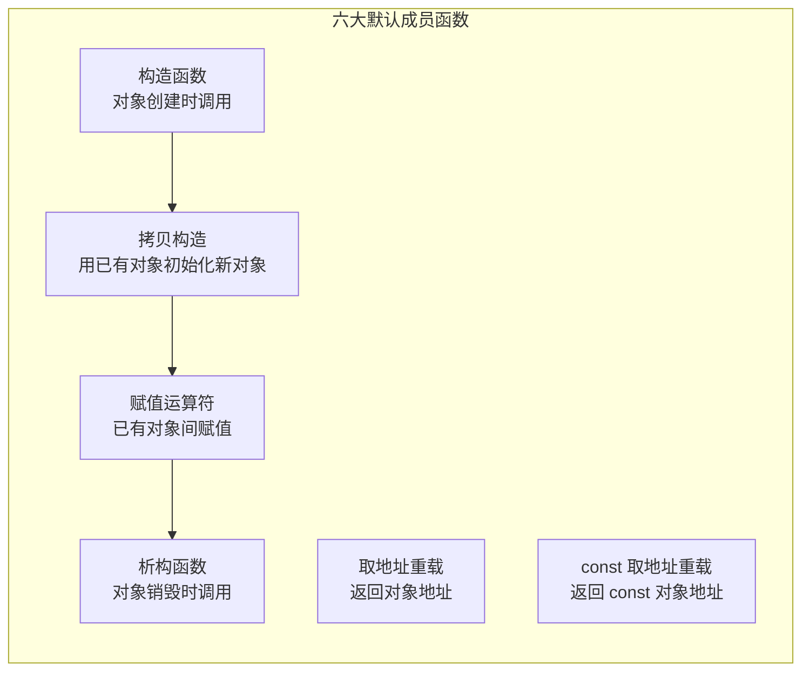

*前言：这篇文章是对上篇文章的延续，接上面的构造函数和析构函数。*


# 1. 拷贝构造函数：



顾名思义，拷贝构造函数也是一种构造函数，这里为什么要单独讲，主要是还是比较难的。我们来详细看看：**拷贝构造函数（Copy Constructor）是 C++ 中一种特殊的构造函数，用于通过同类型的已有对象来初始化新对象。其核心作用是在创建新对象时，将源对象的成员变量值复制到新对象中**。注意这里是用已初始化来初始没有初始化的变量。
## 1.1 基本的定义：
1. ​基本形式​：
拷贝构造函数的参数必须是本类对象的常量引用​（const T&），避免修改源对象并防止无限递归。
- 参数为引用​：若传值（MyClass other），会触发拷贝构造自身，导致无限递归和栈溢出
- const修饰​：确保源对象在拷贝过程中不被修改。
2. 编译器默认生成​
若未显式定义，编译器会自动生成默认拷贝构造函数，执行浅拷贝​（逐成员复制）

这里我们将详细来讲讲为什么会导致无线递归：这里主要是由于c++规定传值的同时会调用拷贝函数来完成拷贝，这里用人话来说就是：假设你有一台特殊的复印机，它的操作规则是：​​“复印任何文件前，必须先复印一份《操作说明书》”​。现在你想复印一份重要文件（比如合同），于是：
1.步骤1​：你放入合同，启动复印机。
2.步骤2​：复印机检测到需要先复印《操作说明书》。
3.步骤3​：复印机开始复印说明书，但此时它发现——复印说明书本身也需要先复印一份《操作说明书》​。
4.步骤4​：复印机再次尝试复印说明书，但又触发同样的规则……
结果：复印机陷入“复印说明书→触发规则→再复印同一份说明书”的死循环，永远无法完成合同的复印任务，直到纸张或墨水耗尽。
我们在看一下书面语言：**当拷贝构造函数的参数为值传递（例如 MyClass(MyClass other)）时，​传递实参的过程会触发拷贝构造函数的调用**
由于自己本身是传值拷贝再次调用自己的时候又要调用自己，一直循环往复。直至栈溢出。


## 1.2 深拷贝和浅拷贝：
​
1. **浅拷贝**（默认行为）​​
- 仅复制指针的值，**新旧对象共享同一内存**。
- ​**风险**​：
析构时同一内存被多次释放（double free）。
一方修改数据影响另一方。
- 总结：
由于浅拷贝是一个一个字节来进行拷贝的，导致两个变量指向的资源完全一样。比如指针都是指向同一块地址（同一块内存）。这样很显然不符合我们的要求。
2. 深拷贝（需手动实现）​​
- 为指针成员分配新内存并复制内容，确保对象独立。


这里是一个栈的类，由于我们没有继续深入c++,我们在这里大量用了C语言的代码。不过比并没有关系，这里我们主要是比较默认的拷贝（浅拷贝）。执行以下代码：

```cpp
int main()
{
	Stack s1(0, 4);
	Stack s2(s1);
	s1.Print();
	s2.Print();
	return 0;
}
```


我们可以看到地址是相同的，但是出现了崩溃，这是为什么呢?，原因是两个指针指向的地址是完全是一样的，我们在执行完return 0 的时候会自动执行析构函数，先进行回收s2，但是已经回收了s2，后面有又收了s1，会导致两次free，导致程序崩溃。具体错误说明：
- 当执行 Stack s2(s1);时，编译器使用默认拷贝构造函数​
- 默认行为：简单复制所有成员的值（包括指针 a）
- 结果：s1.a和 s2.a指向相同的堆内存地址​

- 两次释放导致错误。

改进如下：

```cpp
	Stack(const Stack& s1)
	{
		int* tmp = (int*)malloc(sizeof(int) * s1.capacity);
		if (tmp == nullptr)
		{
			perror("malloc fail");
			exit(1);
		}
		a = tmp;
		memcpy(a, s1.a, s1.size * sizeof(int));
		size = s1.size;
		capacity = s1.capacity;
	}
```

我们完成对拷贝构造函数的构建。最后结构如下：


# 2.运算符重载：
## 2.1主要的运算符重载：
这里也是简单讲一下运算符重载，这里主要是大致理解。后面会详细写出来的
。运算符重载是对已有运算符的重新定义，使其适用于自定义类型，增强代码可读性和直观性。
- ​可重载运算符​：包括算术运算符（+, -, *）、关系运算符（==, <）、I/O 运算符（<<, >>）、赋值运算符（=）、下标运算符（[]）等。
- 不可重载运算符​：

- 不变性​：重载后运算符的优先级、结合性和操作数个数不变。
## 2.2在这里我们只要讲赋值重载：
必须深拷贝​：避免资源重复释放。代码如下：

```cpp
String& String::operator=(const String& other) {
    if (this != &other) {
        delete[] data;
        data = new char[strlen(other.data) + 1];
        strcpy(data, other.data);
    }
    return *this;  // 支持链式赋值
}[6,9](@ref)
```
这段代码比较难，我们来尝试用简单的文字来解答：
1. 拷贝构造函数的触发场景：
对象初始化

```cpp
MyClass obj2(obj1);      // 直接初始化
MyClass obj3 = obj1;     // 隐式初始化（非赋值！）
```
2. 拷贝赋值运算符的触发场景​：
- ​对象间赋值：
```cpp
MyClass x, y;
x = y;                   // 赋值运算符重载
```
- 链式赋值：

```cpp
x = y = z;                // 连续调用赋值运算符[4](@ref)
```


本章后续还有练习和讲解。
