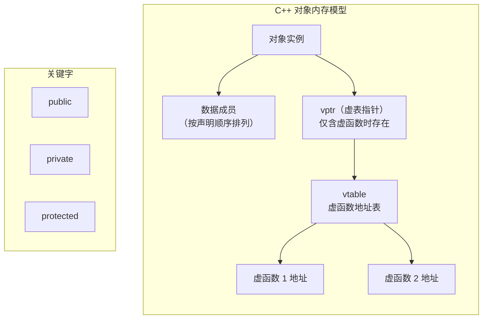




在我们进入深入学习c++的时候就必须要了解c++的特性：类与对象，这里会有很多概念需要理解，可能会弄混。
# 1. 类的初步认识：



类即class，相当于struct的进化版，我们来看一下：官话是怎么说的：**类（Class）是面向对象编程（OOP）的核心概念，用于封装数据（属性）和操作数据的方法（成员函数），支持继承、多态和访问控制。**我们接下来将会更加详细的介绍：
## 1.1 类的展示：
我们先来看：

这里代码写的不太好，但是没有语法问题，我们从这张图片中可以看到，我写了新的两个关键字：``public``和``private``。这个是一种访问控制权限：
这里就提到了封装性：**将数据（成员变量）和操作（成员函数）绑定，支持public、private、protected访问控制，默认成员为private**。
这里public是公开的，是在class外也可以访问，但是private是私有的，在域外是无法访问。
## 1.2 与C语言的struct的对比
在之前的C语言中可以看到struct是无法把函数放进去的，一般都在放在外面，而不是struct里面，我们在用C语言实现栈和队列还要二叉树的时候都是在放在头文件内部，如图所示：

而c++无疑是进步的，他将所有都封装在了一起。同时为了方便使用，class后面的命名就是一个类型，而不需要进行重命名。同时c++的struct也进化了，也可以封装函数了。

1. ​类（Class）​​
- 封装性​：将数据（成员变量）和操作（成员函数）绑定，支持public、private、protected访问控制，默认成员为private。
- ​继承与多态​：支持基类与派生类的层次结构，通过虚函数实现运行时多态。
- 构造函数/析构函数​：提供对象初始化与资源清理的自动化机制。
- ​典型用途​：表示具有复杂行为与状态的实体（如“汽车”“用户”）。
2. ​C语言结构体（Struct）​​
- ​数据聚合​：仅用于组合不同类型的数据成员，无成员函数（C语言）或仅支持简单函数（C++中扩展）
​- 无访问控制​：成员默认public（C++中可显式指定，但C语言无此概念）。
​- 无继承/多态​：不支持继承体系与虚函数。
- 典型用途​：表示简单数据结构（如坐标点Point、日期Date）。

这里就详细的介绍了有何不同。拓展看图：
## 1.3 内存如何计算：
### 我们先来看C语言中的内存是如何计算的：
这里可以详细看我之前写的文章：C 语言结构体：从基础到内存对齐深度解析。但是那边文章讲的不太好，我们再回顾一下:

这个结构体应该怎么算呢？
1. **确定偏移量**： 结构体的第一个成员从偏移量0的地址开始存放。这里从0开始放，那么day是int是4个字节，那么存放0~3.
2. **其他成员对齐​**：每个成员的起始地址必须是其 ​对齐数​ 的整数倍。
​【**对齐数​ = min(成员自身大小, 编译器默认对齐数)**】，这里对齐数是（visual stdio默认是8，min（8，4））4，那么要求从4开始放：month存放再4~7。然后存放year，存放在8到11。
3. **结构体总大小​**:必须是所有成员中 ​最大对齐数​ 的整数倍.这里所有的对齐数都是4，所以是4.那么最后就是12（4的三倍）

在这里我们的空间利用就是100%.是完全正确的。

接下来我们再来看一组：

在这里我们的内存计算方式是和之前一样的：
1. **确定偏移量**： 结构体的第一个成员从偏移量0的地址开始存放。这里从0开始放，那么a1是是4个字节，那么存放0~7.
2. **其他成员对齐​**：每个成员的起始地址必须是其 ​对齐数​ 的整数倍。
​【**对齐数​ = min(成员自身大小, 编译器默认对齐数)**】，这里对齐数是（visual stdio默认是8，min（8，2））2，那么要求从8开始放：a2存放再8~9。然后存放a3，存放在12到15，在是int* 对齐数为8，16到24.
3. **结构体总大小​**:必须是所有成员中 ​最大对齐数​ 的整数倍.这里所有的对齐数都是8，2，4，8，所以是8.那么最后就是24（8的三倍）


### 来看c++中的类是如何计算的：
我们通过在vs中调试发现,类中虽然有函数，但是函数不计入内存结构里面，这样就导致与结构体的内存的计算方式完全相同（这里不考虑后面学的新的）目前仅针对初学的c++。后续情况在后面文章中讲述。
- ​对齐数​：min(成员自身大小, 编译器默认对齐数)（VS 默认 8）
- ​偏移量​：首成员在偏移量 0 处；后续成员起始地址需是对齐数的整数倍。
- ​总大小​：需为最大对齐数的整数倍，编译器可能插入填充字节（Padding）
函数既然在类里面，这是为何知道是哪个成员调用了这个函数，这就不得不提到我们接下来要说接下来的。
## 1.4 ``this``指针：
c++为了确定函数是有谁调用的也是下来苦功夫：给出this指针：
- this是编译器自动生成的指针，类型为 ClassName* const（例如 Date* const），表示指针本身不可修改 （即不能改变指向的对象）
- 生命周期​：仅在成员函数调用期间存在，函数结束时销毁

我们来看一段代码我们就明白了为啥类中的函数没有存在类中，却能精准发现对象：

其实这里的this是可以完全不写的，一般也不推荐写，这里我们会把对象本身的地址传入this，this作为指针解引用来完成赋值。我们再看一段代码：

```cpp
class Date {
public:
    void Init(int year) { 
        this->_year = year;  // 实际编译器处理为 Init(&date, year)
    }
};
Date d;
d.Init(2024);  // 等价于 Init(&d, 2024)
```
这里也可以看出this的作用。我们发现这就是对C语言的大步改进。
# 2. 构造函数：
构造函数也是c++的默认成员函数之一，这里并不是开辟空间创建一个对象，而是类似于初始化对象。一般构造函数的定义大致如下：
- 无参数，或所有参数均有默认值（称为全缺省构造函数）
- 函数名与类名相同，无返回值（包括 void）我们图片上面写的就是一个很好的构造函数。

以下是两种构造函数，加上我们没写的编译器自动生成的一共是三个，他们被称为默认构造函数：

```cpp
// 无参构造
Date() { /* ... */ }  

// 全缺省构造（等效默认构造）
Date(int year = 2024, int month = 1, int day = 1) { /* ... */ }
```
无参构造与全缺省构造不能同时存在，否则调用时产生歧义
下面是带参的：也是构造函数，但不是默认的

```cpp
	Data(int day , int month, int year)
	{
		_day = day;
		_month = month;
		_year = year;
	}
```
那么我上面说到了编译器自动生成，并且自动调用，那么他究竟是什么情况调用呢，初始化是怎么样的?我们来看看：
- 内置类型成员​（int, double, 指针等）
​不初始化，值为未定义（内存随机值）。
- 自定义类型成员​（类/结构体）：
调用其自身的默认构造函数初始化。

在力扣上有一个使用两个栈来实现队列就是不需要写构造函数，他就自动调用了栈的构造函数，来完成他自己的初始化，这样就大大简便了队列的初始化。

# 3. 析构函数：
与构造函数相对应的是析构函数，他是也是成员默认函数。主要是负责类的资源收回。很类似栈中的destory函数。我们来看这个：
- 析构函数名由波浪号 ~加类名组成（如 ~ClassName()）。 
- ​ 无参数、无返回值，且不可重载​（每个类仅允许一个析构函数）
- 若未显式定义，编译器会生成默认析构函数（空实现，仅处理类类型成员的析构）。

其实像我们的data类是不需要析构函数的，他虽然是内置类型，但是并没有涉及到指针和资源清理和防止泄露，对于栈我们也是写他的析构函数，他的内部是有指针的，你malloc了就需要free。但是由两个栈实现的队列是不需要的，他会自己调用栈的析构函数来完成资源销毁。


