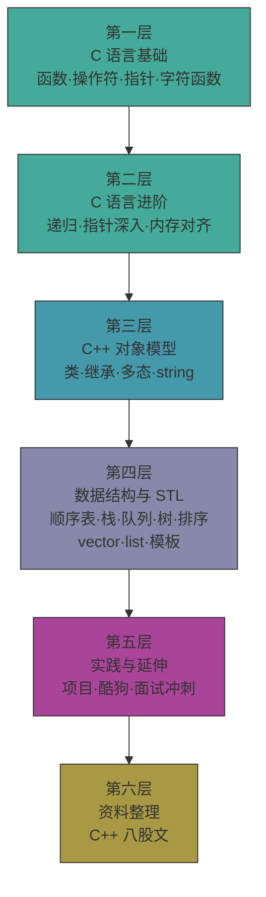

---
tags:
  - moc
  - cpp
  - wiki
aliases:
  - C++学习入口
  - C++知识地图
---

# C++ 学习入口

这条主线是整个仓库的基础盘。后面的 [[2.Linux/00-学习入口]]、[[4.酷狗音乐学习/00-学习入口]]、[[6.4月C++岗位面试冲刺/00-学习入口]] 和 [[7.LLM学习/08-与C++和Linux的连接点]] 都会反复回到这里。

## 学习路径总览

## 第一层：C 语言基础

- [[1.c++学习/1.【C语言基础】函数]]
- [[1.c++学习/2.【C语言基础】扫雷游戏]]
- [[1.c++学习/3.【C语言基础】操作符及其应用]]
- [[1.c++学习/4.【C语言基础】指针及其拓展(0)]]
- [[1.c++学习/5.【C语言基础】指针及其拓展(1)]]
- [[1.c++学习/6.【C语言基础】字符函数]]
- [[1.c++学习/7.【C语言基础】内存函数和自定义变量]]
- [[1.c++学习/8.【C语言基础】练习0]]
- [[1.c++学习/9.【C语言基础】练习1]]

## 第二层：C 语言进阶与底层意识

- [[1.c++学习/10.【C语言进阶】递归的应用]]
- [[1.c++学习/11.【C语言进阶】指针及其拓展(2)]]
- [[1.c++学习/12.【C语言进阶】指针及其拓展(3)]]
- [[1.c++学习/13.【C语言进阶】从基础到内存对齐深度解析]]

## 第三层：C++ 基础对象模型

- [[1.c++学习/14.【c++基础】初步认识C++]]
- [[1.c++学习/22.【c++基础】c++的类和对象]]
- [[1.c++学习/23.【c++基础】类和对象（中）]]
- [[1.c++学习/24.【c++基础】类和对象（下）]]
- [[1.c++学习/25.【c++基础】string类]]
- [[1.c++学习/30.【cpp知识铺子】核心编程思想-继承]]

## 第四层：数据结构与 STL

- [[1.c++学习/15.【数据结构初阶】顺序表（C语言实现）]]
- [[1.c++学习/16.【数据结构初阶】栈（C语言实现）]]
- [[1.c++学习/17.【数据结构初阶】队列（C语言实现）]]
- [[1.c++学习/18.【数据结构初阶】堆的初阶（C语言实现）]]
- [[1.c++学习/19.【数据结构初阶】二叉树的初阶（C语言实现）]]
- [[1.c++学习/20.【数据结构初阶】各种排序算法（一）]]
- [[1.c++学习/21.【数据结构初阶】各种排序算法（二）]]
- [[1.c++学习/26.【c++知识铺子】不可或缺的数据容器-vector]]
- [[1.c++学习/27.【c++知识铺子】超高效级的容器-List]]
- [[1.c++学习/28.【c++知识铺子】相对简单的容器适配器双生子-stack和queue（STL）]]
- [[1.c++学习/29.【c++知识铺子】模板的小知识]]

## 第五层：实践与延伸

- [[1.c++学习/31.【c++基础】项目推荐]]
- [[4.酷狗音乐学习/00-学习入口]]
- [[6.4月C++岗位面试冲刺/00-学习入口]]

## 第六层：资料整理与面试资料

- [[1.c++学习/33.【资料整理】C++八股资料阅读入口]]
- [[1.c++学习/34.【资料整理】亮白风格C++八股文-清洗排版版]]
- [[1.c++学习/32.【资料整理】亮白风格C++八股文-逐页转写版]]

## 推荐复习路径

1. 先把对象模型、引用、拷贝控制、继承多态串起来
2. 再把容器、模板、迭代器和复杂度串起来
3. 再用 [[1.c++学习/33.【资料整理】C++八股资料阅读入口]] 把外部资料接回你自己的原笔记
4. 最后去看 Linux、项目和面试冲刺

## 和其他主线的连接

- C++ 到 Linux：[[2.Linux/00-学习入口]]
- C++ 到项目：[[4.酷狗音乐学习/00-学习入口]]
- C++ 到面试：[[6.4月C++岗位面试冲刺/00-学习入口]]
- C++ 到 LLM：[[7.LLM学习/08-与C++和Linux的连接点]]
