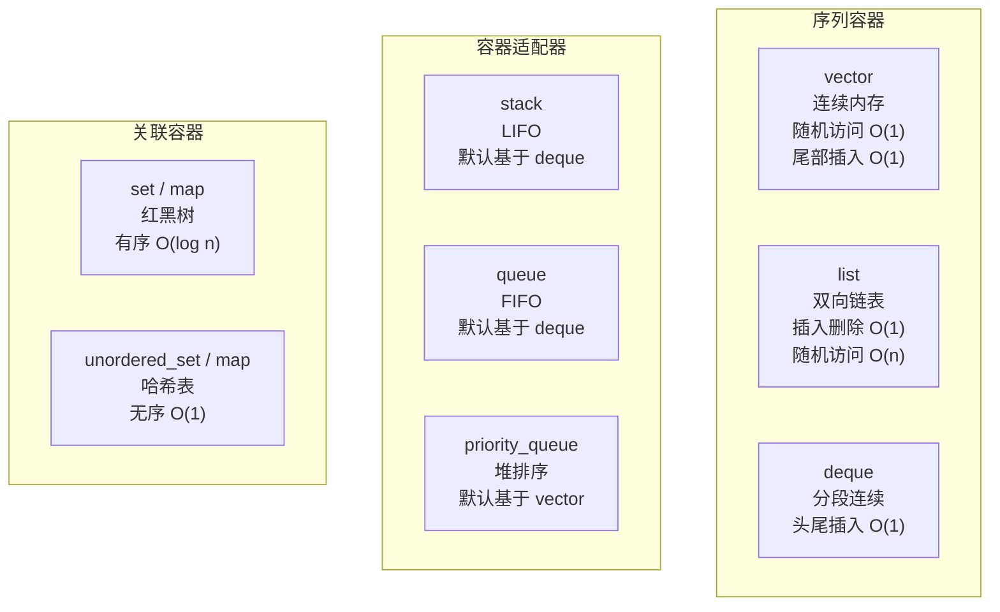



> 个人主页：[爱装代码的小瓶子](https://blog.csdn.net/2301_80127108?type=lately)
# 系列文章目录
 [c++系列文章，已更新至string](https://blog.csdn.net/2301_80127108/category_13027195.html)

---


@[TOC](文章目录)

---

# 前言

## STL 容器对比总览



在C++中，vector 是标准模板库（STL）提供的一种动态数组容器，它能够自动管理内存，并在程序运行时根据需要动态调整其大小，这让你无需再手动处理数组的扩容和缩容问题。与传统数组相比，vector 支持快速的随机访问（时间复杂度为 O(1)），并提供了丰富的方法，例如在尾部高效地添加或删除元素（push_back / pop_back），使用 size() 获取元素数量，以及使用迭代器进行遍历等。它的元素在内存中是连续存储的，这点和数组一样，但提供了更大的灵活性。学习 vector 是掌握 C++ STL 的重要一步，我们将逐步讲解和尝试复写源码。

---


# 一、vector的函数接口。
在之前我们已近学习了string类的函数实现和string函数的使用，相比与string，vector就没有那么冗余：

在这篇文章中，我们主要详解vector的初始化和一些增删查改的重要函数。

>使用vector记得使用头文件``#include<vector>``.笔者刚开始经常忘记。

# 二、详细拆解：
## 2.1 初尝vector和其结构。
>初始化代码如下，我们可以用vector来装各种类型的数据。
```c
#include<iostream>
#include<vector>

using namespace std;

int main()
{
	vector<string> a;
	a.resize(10, "11111111");

	vector<int> aa = { 1,1,1,11 };
}
```


```cpp
#include<iostream>
#include<vector>

using namespace std;

int main()
{
	vector<string> a;
	a.resize(10, "11111111");

	vector<int> aa = { 1,1,1,11 };
	//同样可以使用迭代器来完成遍历。
	vector<string>::iterator it = a.begin();
	while (it != a.end())
	{
		cout << *it << " ";
		it++;
	}
	cout << endl;
	for (auto e : aa)
	{
		cout << e << " ";
	}
	cout << endl;
}
```


打开调试我们可以看到容量和里面的存放内容。我们来看源码，做出以下源码：

```cpp
#include<iostream>

namespace wwh {
	//使用类模板：
	template <class T>
	class vector
	{
	public:

	private:
		T* _start;
		T* _finish;
		T* _end_of_storage;
	};
}
```
初次尝试是这样的结构，但是元来的代码是可以用迭代器来完成遍历的，我们做出调整：

```cpp
#include<iostream>

namespace wwh {
	//使用类模板：
	template <class T>
	class vector
	{
	public:
		typedef T* iterator;

	private:
		iterator _start = nullptr;
		iterator _finish = nullptr;
		iterator _end_of_storage = nullptr;
	};
}
```


## 2.2 vector的构造和析构
### 2.2.1 构造：

```cpp
		vector()
		{};
		//或者：
		vector() = default;
```
第一种不写的话，依旧会走初始化列表，就会尝试使用给的默认值来完成初始化。第二中则是强制初始化，在我们后续写拷贝构造的时候，就不会生成默认构造函数，这时就需要强制生成了。

### 2.2.2 析构：

```cpp
		~vector()
		{
			delete[] _start;
			_start = _finish = _end_of_storage = nullptr;
		}
```
释放指针所指向的那块在堆上动态分配的内存资源，然后置空，就完成了析构，同时析构函数的好处：会自动调用。就一个字爽。

## 2.3 前置必备函数：
### 2.3.1 reserve函数：
这个函数是为了对原来vector进行容量扩充：
先看第一段代码：

```cpp
		void reserve(size_t n)
		{
			if (n > capacity())
			{
				size_t oldSize = size();
				T* tmp = new T[n];

				if (_start)
				{
					for (size_t i = 0; i < oldSize; ++i)
						tmp[i] = _start[i];
					delete[] _start;
				}

				_start = tmp;
				_finish = _start + oldSize;
				_end_of_storage = _start + n;
			}
		}
```
一开始我们尝试使用memmove来完成复制，但是mommove是浅拷贝，无法胜任对vector里面存贮指针的拷贝，这是因为对里面的数据是一个一个字节拷贝的，这样前一个里面资源释放会导致后一个出现野指针。这是比较危险的。

- 在这里我们通过if来判断老v中是否需要复制
- 元素拷贝​：通过循环 for (size_t i = 0; i < oldSize; ++i) { tmp[i] = _start[i]; }，将旧内存中的每个元素逐个复制到新内存的对应位置。这里使用的是 T类型的赋值运算符。如果 T是自定义类型，确保其赋值操作符能正确进行深拷贝至关重要。与 memcpy等浅拷贝方法相比，循环赋值能正确处理包含动态资源的对象。
- 最后在释放老资源，指针全部指向新的资源，避免迭代器失效。

### 2.3.2 size函数：
这个比较简单：

```cpp
	size_t size()const
	{
		return _finish - _start;
	}
```

### 2.3.4 capacity函数：

```cpp
		size_t capacity()const
		{
			return _end_of_storage - _start;
		}
```

### 2.3.5 begin和end函数：

```cpp
		iterator begin()
		{
			return _start;
		}

		iterator end()
		{
			return _finish;
		}
```
还可以定义const_begin和const_end，这两个比较容易我也不写了。
### 2.3.6 empty函数：

```cpp
		bool empty()const
		{
			return _start == _finish;
		}
```
- const成员函数最直接的作用是编译器会保证在该函数内部不会修改类的数据成员​
- 当起始指针 (_start) 和结束指针 (_finish) 指向相同位置时，表示容器内没有元素，函数返回 true；否则返回 false。

### 2.3.7 resize函数：

```cpp
		void resize(size_t n, const T& val = T())
		{
			if (n < size())
			{
				_finish = _start + n;//缩小。
			}
			else
			{
				reserve(n);
				while (_finish != _start + n)
				{
					*_finish = val;
					_finish++;
				}
			}
		}
```
我们只需考虑到当n小于size时，直接减少，多余时，从finish开始复制直至n。
但是我们这个resize和后面的利用其他迭代器来完成初始化会发生冲突。我们后面再讲。

### 2.3.8 clear函数：
在vector中我们时常需要清除数据，函数内部如下：

```cpp
	void clear()
	{
		_finish = _start;
	}
```
我们直接将两个放在一起就完成了对vector的清楚，但是没有调用析构函数，还有一种方法：

```cpp
		void clear()
		{
			vector<T>().swap(*this);
		}
```

创建一个匿名（无名）的、空的 vector<T>临时对象，然后立即将当前对象 (*this) 的内容与这个空临时对象进行交换。交换后，当前对象就变成了一个空的 vector，而原来的所有元素和内存都转移给了那个临时对象。紧接着，这个临时对象会立刻被销毁，从而释放掉原先占用的所有内存。注意里面有().
### 2.3.9 重载 运算符[]
这个也很简单，代码如下：

```cpp
		T& operator[](size_t n)
		{	
			assert(n < size());
			return *(_start + n);
		}
```
放回指定的值即可。后面可以使用迭代器来访问。
## 2.4vector的增加其函数实现：
>在前面已经讲了最重要的迭代器失效，后面就会很简单了。
### 2.4.1 push_back函数

这个就是讲vector的尾加的，之前string我们常用+= ，这里我们常使用push_back或者emplace_back;我们来看：

```cpp
		void push_back(const T& date)
		{
			size_t len = capacity();
			size_t sz = size();
			if (sz == len)
			{
				reserve(len == 0 ? 4 : 2 * len);
			}
			*_finish = date;
			_finish++;
		}
```
如果容量满了就进行扩容，注意扩容时迭代器失效，在前面已近讲过了。注意是让finish++。
### 2.4.2 pop_back函数
我们先判空，后面再--尾标即可，代码如下：

```cpp
		void pop_back()
		{
			assert(!empty());
			--_finish;
		}
```
### 2.4.3 insert函数
我们需要指定位置之前插入val即可，还是注意一下pos位置的迭代器失效。
尝试构建代码：

```cpp
		iterator insert(iterator pos, const T& val)
		{
			assert(pos <= _finish && pos >= _start);
			if (_finish == _end_of_storage)
			{
				size_t len = pos - _start;
				reserve(capacity() == 0 ? 4 : 2 * capacity());
				pos = _start + len;//防止迭代器失效
			}
			iterator end = _finish;
			while (end > pos)
			{
				*end = *(end - 1);
				--end;
			}
			*pos = val;
			++_finish;
			return pos;//更新pos防止失效。
		}
```
我们通过循环来控制移动，是pos位置空出来，这样我们就完成了对目标位置之前完成插入.

### 2.4.4 erase函数

```cpp
		void erase(iterator pos)
		{
			assert(pos >= _start && pos < _finish);
			iterator tmp = pos;
			while (tmp != end())
			{
				*tmp = *(tmp + 1);
				tmp++;
			}
			_finish--;
		}
```
同样是通过循环来解决，完成覆盖，与上面的insert不同的是，这次一般不会有迭代器失效的情况。

---

# 总结
我们在这边学习了大部分vector大部分的接口，通过学习这些代码我们更能掌握vector。

