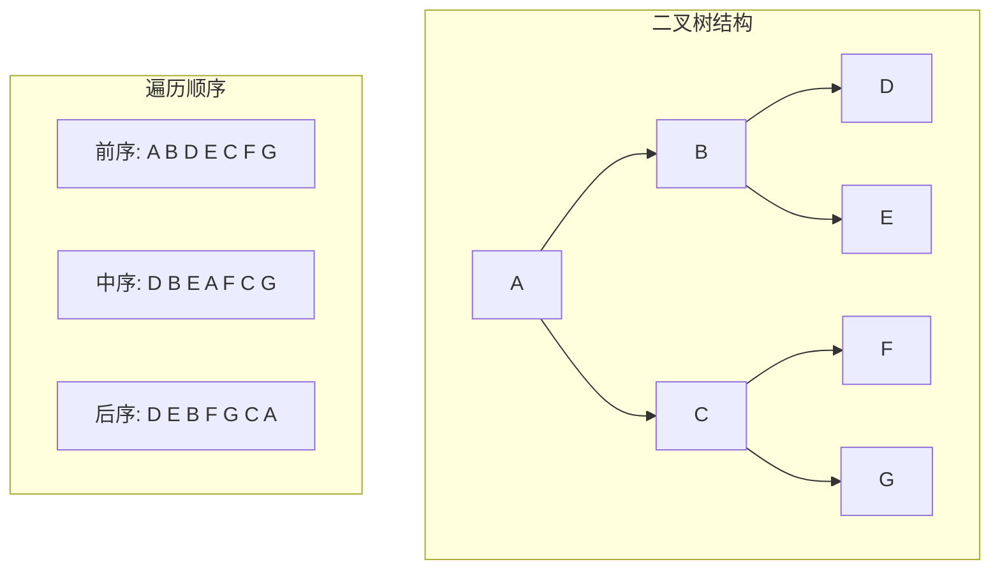

# 1. 二叉树的定义：



## 1.1 二叉树的基本解释：
**二叉树（Binary Tree）**是由有限个节点（n≥0）构成的 **集合**，满足以下条件之一：
1. **空二叉树**​：n=0时，不包含任何节点
2. 包含一个根节点（Root），其余节点分为两个互不相交的子集，分别称**左子树**和**右子树**，且每个子树本身也是二叉树。
3. 看这里的定义，我们将引出本章最重要的思想：**递归的思想** 。

## 1.2 二叉树的特点：
1. ​**度数限制**​：每个节点最多有两个子节点（度 ≤ 2），不存在度大于 2 的节点
2. ​**有序性**​：左子树和右子树严格区分，即使只有一个子树也需明确是左或右子树
3. **非线性结构**​：节点间通过分支连接，形成层次关系，但遍历时可转化为线性    

## 1.3 五种基本形态（逻辑结构）

根据节点分布，二叉树分为以下形态：
1. **空树**​：无节点。
2. ​**仅根节点**​：无子树。
3. **根 + 左子树**​：无右子树。
4. **根 + 右子树**​：无左子树。 
5. **根 + 左右子树**​：完整分支结构
## 1.4 特殊类型

1. **满二叉树**​
    - 所有非叶子节点均有左右子节点，且所有叶子节点均在最底层。
    - 深度为 h的满二叉树节点数为 2h−1（如高度为 3 时，节点数 = 7）可以考虑记住这个公式。
2. ​**完全二叉树**​
    - 除最后一层外，其他层节点数达到最大值，且最后一层叶子节点从左向右连续排序，容易和上面的满二叉树混淆，同时注意从左往右是连续的叶子，不能有空缺。
    - 深度为 h的完全二叉树节点数 n满足：2h−1≤n≤2h−1；深度计算公式为：log​n+1。（底标2省略没写）
## 1.5 重要的特征公式：
1. **层节点上限**​：第 i层最多有 2i−1个节点（i≥1)
2. **叶子与分支关系**​：若叶子节点数（度 0）为 n0​，度为 2 的节点数为 n2​，则 n0​=n2​+1。（很重要的公式，可以通过画图来看出来）
3. **最大节点数**​：深度为 h的二叉树最多有 2h−1个节点。

# 2.二叉树的实现(C语言)：
我们完成对上面的二叉树定义的认识，我们可以通过尝试来完成构建二叉树
我们打开visual stdio 来构建一下项目：
![[Pasted image 20250810103146.png]]
由于C语言本身不支持队列，我们在后面的二叉树的基本功能的实现要使用到队列，所以一起加进去了。
## 2.1 ``tree.h`` 代码解析
在这里我们将我们需要的头文件和二叉树的定义全给出来：
```c
#pragma once
#include<stdio.h>
#include<assert.h>
#include<stdlib.h>
#include<stdbool.h>
typedef char BTDataType;

typedef struct BinaryTreeNode
{
	BTDataType data;
	struct BinaryTreeNode* left;
	struct BinaryTreeNode* right;
}BTNode;
```
给出二叉树结构体的定义和重命名，注意里面的嵌套的使用。
我们定义了二叉树就需要满足于二叉树的各个函数的满足：
```c
// 通过前序遍历的数组"ABD##E#H##CF##G##"构建二叉树
BTNode* BinaryTreeCreate(BTDataType* a, int n, int* pi);
// 二叉树销毁
void BinaryTreeDestroy(BTNode** root);
// 二叉树节点个数
int BinaryTreeSize(BTNode* root);
// 二叉树叶子节点个数
int BinaryTreeLeafSize(BTNode* root);
// 二叉树第k层节点个数
int BinaryTreeLevelKSize(BTNode* root, int k);
// 二叉树查找值为x的节点
BTNode* BinaryTreeFind(BTNode* root, BTDataType x);
// 二叉树前序遍历 
void BinaryTreePrevOrder(BTNode* root);
// 二叉树中序遍历
void BinaryTreeInOrder(BTNode* root);
// 二叉树后序遍历
void BinaryTreePostOrder(BTNode* root);
// 层序遍历
void BinaryTreeLevelOrder(BTNode* root);
// 判断二叉树是否是完全二叉树
bool BinaryTreeComplete(BTNode* root);
```
这些都是我们将来我们需要实现的函数，通过实现是这些函数我们将领悟本章最重要的思想：递归（分而治之），第一次遇到这个思想的时候也是感到这个思想很牛逼哈。
同时我也想尝试新的写法，将``tree.c``和``test.c`` 合并在一起讲
## 2.2 ``test. c`` 和``tree.h``
在这里我们实现一个函数就对这个函数进行测试来完成。
### 2.2.1 二叉树的创建
```c
// 通过前序遍历的数组"ABD##E#H##CF##G##"构建二叉树
BTNode* BinaryTreeCreate(BTDataType* a, int n, int* pi)
{
	if (*pi >= n || a[*pi] == '#')
	{
		(*pi)++;
		return NULL;//终止条件
	}
	//开始创建树：
	BTNode* tmp = (BTNode*)malloc(sizeof(BTNode));
	if (tmp == NULL)
	{
		perror("malloc fail");
		return NULL;
	}
	tmp->data = a[*pi];
	(*pi)++;//根完成
	//继续划分尾作用两个树
	tmp->left = BinaryTreeCreate(a,n ,pi);
	tmp->right = BinaryTreeCreate(a, n, pi);
	return tmp;
}
```
我们先完成对二叉树的初始化，这是深度优先（DFS）,也将应用本章中的分治思想，我们将先给出终止条件，同时对数组的下标加1（为了改变数组的下标，我们就要传指针才能改变实参，所以传入``int* pi`` ），接下来创建节点，既然根创建好了，我们就继续创建左右子树，链接``tmp->left`` 和``tmp->right`` 再次调用函数进行合并。不断的划分根左右子树，直到空，就返回空给树左右指针，这样一颗树就完成了。
```c
	char arr[] = "ABD##E#H##CF##G##";
	int n = sizeof(arr) / sizeof(arr[0]) - 1;//去掉\0便可以了
	int pi = 0;
	BTNode* tree =  BinaryTreeCreate(arr, n, &pi)
```
测试函数的主要内容。这里-1在注释里也有解释。完成对函数的使用
### 2.2.2 二叉树的销毁
```c
void BinaryTreeDestroy(BTNode** root)
{
	if (*root == NULL)
		return;
	BinaryTreeDestroy(&(*root)->left);
	BinaryTreeDestroy(&(*root)->right);
	free(*root);
	*root = NULL;
}
```
同理也是这样，我们给出终止条件，到某个地方就会终止并从深处返回。我们先进去，由于按顺序进去，直到空这样到了最底部再free和置空这样不会导致二叉树销毁断接，依次销毁。
```c
	char arr[] = "ABD##E#H##CF##G##";
	int n = sizeof(arr) / sizeof(arr[0]) - 1;//去掉\0便可以了
	int pi = 0;
	BTNode* tree =  BinaryTreeCreate(arr, n, &pi);
	BinaryTreeDestroy(tree);
```
完成对函数的测试。
### 2.2.2二叉树的节点数量（各种）：
```c
int BinaryTreeSize(BTNode* root)
{
	if (root == NULL)
		return 0;
	return BinaryTreeSize(root->left)
		+ BinaryTreeSize(root->right) + 1;
}
```
这个比较简单，就随便讲讲，只要不是空就继续深入，空了就返回，放回后再返回的时候还要+1（因为不是空就需要计数），依旧是分为左右子树数他的根。这种思想还是很重要的
```c
	char arr[] = "ABD##E#H##CF##G##";
	int n = sizeof(arr) / sizeof(arr[0]) - 1;//去掉\0便可以了
	int pi = 0;
	BTNode* tree =  BinaryTreeCreate(arr, n, &pi);
	printf("%d\n", BinaryTreeSize(tree));	
```
我们来看看对不对吧，图片如下：
![[Pasted image 20250811145733.png]]
我们来看的确是8个节点。
同理我们继续来看叶子节点的个数：
```c
int BinaryTreeLeafSize(BTNode* root)
{
	if (root == NULL)
		return 0;
	if (root->left == NULL && root->right == NULL)
		return 1;
	return BinaryTreeLeafSize(root->right) 
		+ BinaryTreeLeafSize(root->left);
}
```
我们依旧先给出终止条件，并给出技术条件，只要左右孩子为空才能加1，那么的话直至叶子才会加1，而非叶子节点不会进行加1，这样就完成了对叶子节点的统计。
接下来我们再看对第k层节点的统计
```c
int BinaryTreeLevelKSize(BTNode* root, int k)
{
	if (root == NULL)
		return 0;
	//查找k层节点的值
	if (k == 1)
		return 1;
    return BinaryTreeLevelKSize(root->left, k - 1) 
		+ BinaryTreeLevelKSize(root->right,k - 1) ;
}
```
我们依旧使用分治的思想来看，先给出终止条件，如果是空直接返回0，那么不是空就放回1吗？并不是我们加上一个限定k，如果是k == 1我们再返回1，同时没通过一层时我们就将k-1，通过逐步控制来完成计数，这样再依次返回累加，就得到了第k层的节点值。
```c
	char arr[] = "ABD##E#H##CF##G##";
	int n = sizeof(arr) / sizeof(arr[0]) - 1;//去掉\0便可以了
	int pi = 0;
	BTNode* tree =  BinaryTreeCreate(arr, n, &pi);
	printf("%d\n", BinaryTreeSize(tree));
	printf("%d\n", BinaryTreeLeafSize(tree));
	printf("%d", BinaryTreeLevelKSize(tree,3));
	printf("\n");
```
进行测试，结果如下：

![[Pasted image 20250811152305.png]]
我们可以看到当k  = 3的时候时4，叶子节点也为4.
### 2.2.3二叉树的遍历(DFS)
我们将层序遍历和其他遍历分开来写，我们将体会到两种方法的不一样。这里我们先来看前序遍历：
```c
void BinaryTreePrevOrder(BTNode* root)
{
	//先遍历根
	if (root == NULL)
	{
		printf("0");
		return;
	}
	printf("%c", root->data);
	BinaryTreePrevOrder(root->left);
	BinaryTreePrevOrder(root->right);
}
```
每次遇到根就直接打印相应的字符，遇到空可以直接打印“N”，我们这里直接打印0可以更好的区别。后面再打印左子树，等到左子树打印完成后我们再打印右子树，我们通过不断地划分左右子树来完成打印，知道为空时才放回。按照这样的思想我们再看后面的的中序和后序
：中序就时把打印根放在中间，后面再打印右子树，而后序就时根最后再打印，再一次返回
```c
void BinaryTreeInOrder(BTNode* root)
{
	if (root == NULL)
	{
		printf("0");
		return;
	}
	BinaryTreeInOrder(root->left);
	printf("%c", root->data);
	BinaryTreeInOrder(root->right);
}

void BinaryTreePostOrder(BTNode* root)
{
	if (root == NULL)
	{
		printf("0");
		return;
	}
	BinaryTreePostOrder(root->left);
	BinaryTreePostOrder(root->right);
	printf("%c", root->data);
}
```
测试如下：
```c
BinaryTreePrevOrder(tree);
printf("\n");
BinaryTreeInOrder(tree);
printf("\n");
BinaryTreePostOrder(tree);
printf("\n");
```
![[Pasted image 20250811152738.png]]
### 2.2.4二叉树的层序遍历(BFS)
与深度有限遍历不同的是我们在这里是广度优先，先将思路，我们需要使用栈，再上上篇文章我们讲了栈的特点（先进先出）以及栈是如何实现的，由于C语言本身不支持栈，我们需要将之前写的queue.c和queue.h导入。为了让节点的地址存入栈，我们需要改变``typedef struct BinaryTreeNode* QDataType;`` 这样就ok了，先入根的地址，如果栈内不是空，我们就删除根节点，再入非空的左右子树，这样一个带一个，我们就将每一层的节点全部打印了。来看代码：
```c
void BinaryTreeLevelOrder(BTNode* root)//层序遍历
{
	queue q1;
	QueueInit(&q1);
	if (root)
		QueuePush(&q1, root);
	while (!QueueEmpty(&q1))
	{
		BTNode* front =  QueueFront(&q1);
		printf("%c ", front->data);
		QueuePop(&q1);
		if(front->left)
			QueuePush(&q1, front->left);
		if(front->right)
			QueuePush(&q1, front->right);
	}
	QueueDestroy(&q1);
}
```
同时不要忘记了需要销毁栈。回收内存。
![[Pasted image 20250811153721.png]]
### 2.2.判断是否为完全二叉树
我们观察发现,完全二叉树要求：​**除了最后一层，所有层都被填满，且最后一层的节点必须全部靠左排列**。这意味着**节点必须连续出现**​：层序遍历序列中，空节点（`NULL`）​**只能出现在序列末尾**，不能穿插在非空节点之间。
根据上面的层序遍历我们继续使用栈，来完成判断，要是为空也得入栈，这样直至第一个空才停止入栈和删根。再将后面的栈进行遍历，发现有不为空的，就是false。
代码如下:
```c
bool BinaryTreeComplete(BTNode* root)
{
	queue q1;
	QueueInit(&q1);
	if (root)
		QueuePush(&q1, root);
	while (!QueueEmpty(&q1))
	{
		BTNode* front = QueueFront(&q1);
		QueuePop(&q1);
		if (front == NULL)
			break;
		QueuePush(&q1,front->left);
		QueuePush(&q1, front->right);
	}
	//开始判断
	while (!QueueEmpty(&q1))
	{
		BTNode* front = QueueFront(&q1);
		QueuePop(&q1);
		if (front != NULL)
			QueueDestroy(&q1);
			return false;
	}
	QueueDestroy(&q1);
	return true;
}
```
![[Pasted image 20250811154537.png]]

# 3 总结：
借助ai给出的话来做结尾：
1. **递归是灵魂**​：有操作通过**分解-解决-合并**将树结构简化为子问题，大幅降低复杂度
2. **队列是桥梁**​：层序遍历通过队列实现**非线性→线性**转换，是BFS算法的树结构应用
3. ​**完全二叉树的连续性本质**​：**空节点只能集中出现在末尾**。您的双循环检测是标准解法的工业级实现