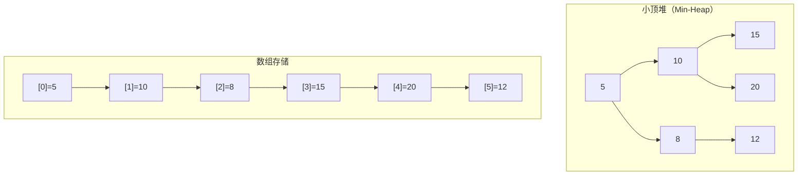

# 1 堆的定义：



堆是计算机科学中一类特殊的数据结构，本质是完全二叉树的数组对象。
- ​**完全二叉树结构**​：堆的逻辑结构是一棵完全二叉树，即除最后一层外，其余层节点均满，且最后一层节点从左向右连续排列。
- ​**堆序性**​：
    - ​**最小堆（小根堆）​**​：任意父节点的值 ≤ 子节点的值，堆顶为最小值。
    - ​**最大堆（大根堆）​**​：任意父节点的值 ≥ 子节点的值，堆顶为最大值。
堆通过**数组**实现物理存储，利用完全二叉树的特性高效定位节点关系：
- 父节点索引为 `i` 时，左子节点索引为 `2i+1`，右子节点为 `2i+2`。
- 反之，子节点索引为 `j` 时，父节点索引为 `⌊(j-1)/2⌋`
# 2 堆的主要实现函数：
我们再次尝试使用C语言来实现堆，在这里要注意我们不是使用左孩子右兄弟的方式来完成实现，而是尝试使用数组来完成堆的实现：这里也就导致物理结构和逻辑结果的大有不同：
```c
#include"heap.h"

void swap(HpDateType* a, HpDateType* b)
{
	HpDateType tmp = *a;
	*a = *b;
	*b = tmp;
}

void AdJustUp(HpDateType* a, int child)
{
	int parent = (child - 1) / 2;
	while (child > 0)
	{
		if (a[child] > a[parent])
		{
			swap(&a[child], &a[parent]);
			child = parent;
			parent = (child - 1) / 2;
		}
		else {
			break;
		}
	}
}

void AdJustDown(HpDateType* a, int size,int parent)
{
	int child = parent * 2 + 1;
	while (child < size)
	{
		if (child + 1 < size && a[child] > a[child + 1])
		{
			child = child + 1;
		}
		if ( a[parent] > a[child] )
		{
			swap(&a[parent], &a[child]);
			parent = child;
			child = parent * 2 + 1;//一定是下一步就更新，之前是重新定义导致还是进入了循环
		}
		else {
			break;
		}
	}
}

void HpInit(Hp* php)
{
	assert(php);
	php->a = NULL;
	php->size = php->capacity = 0;
}

void HpDestroy(Hp* php)
{
	assert(php);
	free(php->a);
	php->a = NULL;
	php->capacity = php->size = 0;
}

void HpPush(Hp* php, HpDateType x)
{
	assert(php);
	//扩容一般扩容成两倍
	if (php->size == php->capacity) 
	{
		int NewCapacity = php->capacity == 0 ? 4 : 2 * php->capacity;
		HpDateType* tmp = (HpDateType*)realloc(php->a,sizeof(HpDateType) * NewCapacity);
		if (tmp == NULL)
		{
			perror("realloc fail");
			exit(1);
		}
		php->a = tmp;
		php->capacity = NewCapacity;
	}
	php->a[php->size] = x;
	AdJustUp(php->a, php->size);
	php->size++;
}

void HpPrint(Hp* php)
{
	for (int i = 0; i < php->size; i++)
	{
		printf("%d ", php->a[i]);
	}
	printf("\n");
}

void HpPop(Hp* php)
{
	//我们要删除的就是堆顶的数据
	assert(php);
	assert(php->size);
	swap(&php->a[0], &php->a[php->size - 1]);
	php->size--;
	AdJustDown(php->a, php->size,0);
}
```
这里我们着重讲一下向下调整和向上调整，一个我们将其用在一开始的建堆的方式上，这是由于此种方式可以很好的帮助我们理解建堆，通过一步步调整来完成堆的建立，但是效率不高，因此后面我们可以尝试使用向下调整建立堆的方式来完成。
## 2.1 两种方式建堆方式的比较：
1.  **第一种：向下调整建堆方式**：
	- 从**最后一个非叶子节点**​（下标为 `(n-2)/2`）开始，​**从后向前**遍历每个节点，对每个节点执行向下调整操作
	- **调整逻辑**​：比较父节点与子节点的值，若父节点不满足堆性质（如大堆中父节点小于子节点），则交换父子节点，并递归向下调整
	- **起始点**​：倒数第二层节点（非叶子节点）开始，逐步向根节点推进（一定要包含根节点，笔者在这个地方错了好多次，即终止条件一定有等于0）
	- **时间复杂度**：**O(n)​** 
2. 第二种：
	- 从**第二个节点**​（下标1）开始，​**从前向后**遍历每个节点，模拟插入操作并向上调整
	- **调整逻辑**​：将新节点与父节点比较，若违反堆性质则交换，并递归向上调整至根节点。
	- ​**起始点**​：从堆的第二个节点开始，逐步扩展到末尾节点。
	- **时间复杂度** ：**O(n log n)​** 

两种方式的推到原理如下
1. 向下调整：
	- ​**数学推导**​：  
	    设树高为 _h_（_h_ ≈ log₂_n_），第 _k_ 层有 _2ᵏ_ 个节点，每个节点最多调整 _(h-k)_ 次。  
	    总调整次数：  _T(n) = Σₖ₌₀ʰ⁻¹ [2ᵏ · (h-k-1)]_  
	    通过错位相减法化简得 _T(n) = O(n)_。
	- ​**效率优势**​：底层节点数量多但调整次数少（仅需1~2次），高层节点数量少但调整次数多，整体均衡为线性复杂度。
2. 向上调整：
	 - 第 _k_ 层有 _2ᵏ_ 个节点，每个节点最多调整 _k_ 次（调整次数与层数成正比）。  
		总调整次数：  _T(n) = Σₖ₌₁ʰ [2ᵏ · k]_  
		化简后为 _O(n log n)_。
	- ​**效率劣势**​：底层节点（占比约50%）需调整 _h-1_ 次（接近树高），而高层节点虽调整次数少但占比低，整体复杂度更高。

# 3 其余配套函数：
有了上面的主函数后，我们还需要搭配如下的配套：
![[Pasted image 20250804155137.png]]
```C
#pragma once
#include<stdio.h>
#include<assert.h>
#include<string.h>
#include<stdlib.h>
#define HpDateType int

struct BinaryHeap
{
	HpDateType* a;//物理结构虽然是数组，但是在逻辑上可以考虑为二叉数
	int size;
	int capacity;
};
typedef struct BinaryHeap Hp;

//这些都是堆所需要的方法
void HpInit(Hp* php);
void HpDestroy(Hp* php);
void HpPush(Hp* php, HpDateType x);
void HpPop(Hp* php);
void HpPrint(Hp* php);

//这些都是堆排序所需要的
void AdJustDown(HpDateType* a, int size,int parent);
void AdJustUp(HpDateType* a, int size);
void swap(HpDateType* a, HpDateType* b);
```
这些初步定义了堆的物理结构和头文件。
测试文件如下：
```c
#define _CRT_SECURE_NO_WARNINGS
#include"heap.h"
#include<time.h>

void test1()
{
	Hp hp1;
	HpInit(&hp1);
	int arr[5] = { 5,2,9,6,3 };
	for (int i = 0; i < 5;i++)
	{
		HpPush(&hp1, arr[i]);
	}
	HpPrint(&hp1);
	HpDestroy(&hp1);
}

void test2()
{
	//尝试不通过使用之前的方式来建堆
	int a[] = { 10,3,5,6,7,2,9,11,22 };
	int sz = sizeof(a) / sizeof(a[0]);
	for (int i = 0; i < sz; i++)
	{
		AdJustUp(a, i);//注意要给i的值，进行对前面进行排序，后面在进去再次排序
	}
	for (int i = 0; i < sz; i++)
	{
		printf("%d ", a[i]);
	}
	//这次就通过向上排序完成了建堆，但是还不算完美，这是因为算法还不够完美
}
void test3()
{
	//尝试使用向下排序来完成
	int a[] = { 10,3,5,6,7,2,9,11,22 };
	int sz = sizeof(a) / sizeof(a[0]);
	for (int i = (sz - 2) / 2; i >= 0; i--)
	{
		//从最后一个叶子的根节点来完成
		AdJustDown(a, sz,i);
	}
	for (int i = 0; i < sz; i++)
	{
		printf("%d ", a[i]);
	}
}

```
为了完善和提出新的解决方式，我们在测试文件中进行大量测试。最终完成。
# 4. top k 问题：
Q:我们将取出最大的五个数字？
Q:是建立小堆还是大堆？
A:我们应该建立大堆
Q:是用向上还是向下呢?
A:应该用向下，尝试：
我们先给出代码，在做出解析：
```c
void test4()
{
	//取出前10个最大的数
	int a[] = { 10,3,5,6,7,2,9,11,22,28,1,44,99,27,4,12,14};
	int sz = sizeof(a) / sizeof(a[0]);
	for (int i = (sz - 2) / 2; i >= 0; i--)
	{
		//从最后一个叶子的根节点来完成
		AdJustDown(a, sz, i);
	}
	for (int i = 0; i < sz; i++)
	{
		printf("%d ", a[i]);
	}
	printf("\n");
	for (int i = 0; i < 10; i++)
	{
		swap(&a[0],&a[sz - i - 1]);
		AdJustDown(a,sz - i - 1,0);
		printf("%d ", a[sz - i - 1]);
	}
}


//大量数据的 top k问题
//首先通过伪随机来创造大量数字
void CreateData()
{
	srand(time(0));//时间作为种子生成随机数
	const char* file = "data.txt";
	FILE* fin = fopen(file, "w");
	if (fin == NULL)
	{
		perror("open error");
		return;
	}
	for (int i = 0; i < 100000; i++)
	{
		int n = rand() + i;//防止随机数重复
		fprintf(fin,"%d\n", n);
	}
	fclose(fin);
}

void test5()
{
	const char* file = "data2.txt";
	FILE* fout = fopen(file, "r");//以读的方式打开，指针指向文件
	//先建立一个k的小堆
	int k = 0;
	printf("请输入k的值;");
	scanf("%d", &k);
	int* arr = (int*)malloc(sizeof(int) * k);
	if (arr == NULL)
	{
		perror("数组创建失败");
		return;
	}
	for (int i = 0;i < k; i++)
	{
		fscanf(fout, "%d",&arr[i]);
	}
	//建立小堆
	for (int i = (k - 2) / 2; i >= 0; i--)
	{
		AdJustDown(arr, k, i);//将前k个数改成小堆
	}
	int x = 0;
	while (fscanf(fout, "%d", &x) == 1)
	{
		if (x > arr[0])
		{
			arr[0] = x;
			AdJustDown(arr, k, 0);
		}
	}
	for (int i = 0; i < k; i++)
	{
		printf("%d ", arr[i]);
	}
	printf("\n");
	fclose(fout);
}


int main()
{
	test5();
	return 0;
}
```
## 4.1 ​**算法选择**​
- ​**小根堆维护 Top K 最大值**​  
    你的代码采用 ​**小根堆**​ 动态维护最大的 K 个数，核心流程：
    1. 从文件读取前 K 个数，构建初始小堆（堆顶为当前最小）。
    2. 遍历剩余数据，若当前值 `x > 堆顶`，则替换堆顶并向下调整，确保堆中始终是 ​**当前遇到的最大 K 个数**。
    3. 最终堆中存储的就是全局最大的 K 个数（无序，但堆顶是其中最小值）
## 4.2 ​**关键代码解析**
```c
// 读取前 K 个数建小堆
for (int i = (k - 2) / 2; i >= 0; i--) {
    AdJustDown(arr, k, i); // 从最后一个非叶子节点向下调整
}

// 遍历剩余数据
while (fscanf(fout, "%d", &x) == 1) {
    if (x > arr[0]) {        // 新数据 > 堆顶
        arr[0] = x;          // 替换堆顶
        AdJustDown(arr, k, 0); // 向下调整维持小堆性质
    }
}
```
- ​**建堆起点**​：`(k-2)/2` 是最后一个非叶子节点索引，避免无效调整。
- ​**调整逻辑**​：`AdJustDown` 确保父节点 ≤ 子节点，时间复杂度 ​**O(log K)**
以下是针对你编写的 Top K 问题代码及核心逻辑的总结，结合算法原理和实现优化点进行分析：

## 4.3 Top K 问题的通用总结

#### 1. ​**适用场景**​

- ​**海量数据**​：数据量远大于内存（如 100 亿数据，内存仅 1GB），无法全局排序。
- ​**动态数据流**​：数据分批到达，需实时更新 Top K。
#### 2. ​**时间复杂度对比**​

| ​**方法**​      | 时间复杂度          | 适用场景         |
| ------------- | -------------- | ------------ |
| ​**全局排序**​    | O(N log N)     | 数据量小，内存充足    |
| ​**小根堆动态维护**​ | O(N log K)     | 海量数据，K 远小于 N |
| ​**分治+堆**​    | O(N + K log K) | 分布式系统，数据分片处理 |

#### 3. ​**堆 vs 其他方案**​
- ​**小根堆优势**​：
    - 空间复杂度 ​**O(K)​**，仅需维护 K 大小的堆。
    - 无需全量数据加载，适合流式数据处理。
- ​**大根堆的局限**​：  
    若直接建大堆取前 K 个，需全局建堆（O(N)），但取 K 个需 O(K log N)，效率低于小根堆方案。