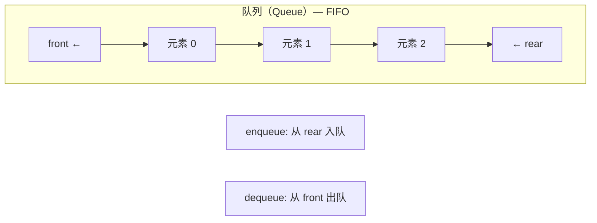

# 1.队列的定义：



队列（Queue）是一种基础且重要的**线性数据结构**，遵循**先进先出（FIFO）​**​ 原则，即最早入队的元素最先出队，与栈不同的是出队列的顺序是固定的。队列具有以下特点：
1. ​**FIFO原则**​：元素按插入顺序处理，队头（Front）删除，队尾（Rear）插入。
2. ​**操作受限**​：仅允许在两端操作（队尾入队、队头出队），中间元素不可直接访问
3. **顺序队列（数组实现）​**​
        - ​**优点**​：内存连续，访问高效。
        - ​**缺点**​：易“假溢出”（数组未满但指针越界），需通过**循环队列**优化：
            - 队尾指针循环：`rear = (rear + 1) % size`。
            - 队满条件：`(rear + 1) % size == front`（牺牲一个存储单元）。
    ​**链式队列（链表实现）​**​
        - ​**优点**​：动态扩容，无固定大小限制

# 2. 队列的实现：
首先我们打开visual studio，我们需要准备以下界面：
![[Pasted image 20250723104619.png]]
## 2.1 ``queue.h``代码
其中queue.h主要是存放函数的调用的头文件，内容如下：
```c
#pragma once
#include<stdio.h>
#include<stdbool.h>
#include<assert.h>
#include<stdlib.h>
#define QDataType int 

struct QueueNode 
{
	QDataType data;
	struct QueueNode* next;//定义 next指针
	//我们可以尝试使用单链表来完成 
};
typedef struct QueueNode QNode;

struct queue
{
	QNode* phead;
	QNode* ptail;
	int size;
	//为什么需要通过结构体来封装两个指针
	//原本需要通过二级指针来完成增加和删除
};
typedef struct queue queue;
//上述完成结构体基本建设

//接下来完成以下接口：
//初始化和销毁
void QueueInit(queue* pq);
void QueueDestroy(queue* pq);

//后增和前删
void QueuePush(queue* pq, QDataType x);
void QueuePop(queue* pq);

//取出之前的数和取出后面的数 
QDataType QueueFront(queue* pq);
QDataType QueueBack(queue* pq);

//返回队列中有效值个数
int QueueSize(queue* pq);

//判空
bool QueueEmpty(queue* pq);
```
这一块代码是栈的头文件，我们给出接口，接下来我们要尝试在``stack.c``里面实现这些代码，即这些头文件的接口具体如何实现
## 1.2 `queue.c`代码

```c
#include"queue.h"

void QueueInit(queue* pq)
{
	pq->phead = pq->ptail = NULL;
	pq->size = 0;
}

void QueueDestroy(queue* pq)
{
	QNode* pcur = pq->phead;
	while (pcur)
	{
		QNode* next = pcur->next;
		free(pcur);
		pcur = next;
	}
	pq->phead = pq->ptail = NULL;
}

void QueuePush(queue* pq, QDataType x)
{
	QNode* tmp = (QNode*)malloc(sizeof(QNode));
	if (tmp == NULL)
	{
		perror("malloc fail");
		return;
	}
	tmp->data = x;
	tmp->next = NULL;
	if (pq->phead == NULL)
	{
		//如果没有初始化
		pq->phead = tmp;
		pq->ptail = tmp;
		pq->size++;
	}
	else {
		pq->ptail->next = tmp;
		pq->ptail = tmp;
		pq->size++;
	}
}

void QueuePop(queue* pq)
{
	assert(pq);
	QNode* Pop = pq->phead;
	pq->phead = pq->phead->next;
	free(Pop);
	pq->size--;
}

QDataType QueueFront(queue* pq)
{
	assert(pq);
	assert(pq->phead);
	return pq->phead->data;
}

QDataType QueueBack(queue* pq)
{
	assert(pq);
	assert(pq->ptail);
	return pq->ptail->data;
}

int QueueSize(queue* pq)
{
	assert(pq);
	return pq->size;
}

bool QueueEmpty(queue* pq)
{
	assert(pq);
	return pq->size == 0;
}
```
我们通过编写依次完成了这些代码的编写。我们接下来测试这些代码是否正常源代码如下：
```c
#include"queue.h"

void test1(queue* pq)
{
	QueueInit(pq);
	QueuePush(pq,1);
	QueuePop(pq);
	QueuePush(pq, 1);
	QueuePush(pq, 2);
	QueuePush(pq, 3);
	printf("%d ", QueueBack(pq));
	printf("%d ", QueueFront(pq));
	printf("%d",  QueueSize(pq));
	QueueDestroy(pq);
}


int main()
{
	queue q1;
	test1(&q1);
}
```
尝试利用代码来调试看看我们完成的接口是否有问题：
![[Pasted image 20250723105513.png]]
目前来看是没有问题的。
# 3 总结：
队列以其严格的FIFO特性和高效的操作，成为管理有序任务的理想工具。理解其实现差异（循环队列 vs 链式队列）和应用场景（调度、缓冲、BFS等），能显著提升系统设计能力。实际开发中需根据**数据规模**​（静态/动态）、**性能需求**​（时间/空间复杂度）和**并发环境**选择合适的实现方式