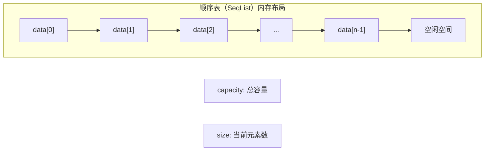

# 一. 介绍顺序表:



顺序表是对数组的改进，顺序表是线性表的顺序存储实现，其底层使用**动态或静态数组**存储元素，通过下标（索引）直接访问任意位置的元素，时间复杂度为 ​**O(1)​**
通常有静态顺序表，同时也有动态顺序表​。我们接下来所要讲的全是动态顺序表。因为动态顺序表相比静态顺序表:


| ​**特性**​    | ​**动态顺序表**​    | ​**静态顺序表**​             |
| ----------- | -------------- | ----------------------- |
| ​**空间分配**​  | 堆内存动态分配，按需扩容   | 编译时固定大小（栈/静态区）          |
| ​**内存管理**​  | 需手动释放（`free`）  | 自动回收，无内存泄漏风险            |
| ​**适用数据量**​ | 未知或变化频繁的数据     | 固定且已知的数据集               |
| ​**扩容开销**​  | 扩容时需数据迁移（时间开销） | 不支持扩容，溢出即失败             |
| ​**典型场景**​  | 用户增长型应用（如社交平台） | 常量存储（如月份名、状态码）<br><br>6 |
# 二 .顺序表的实现:
我们来尝试来尝试来实现顺序表的功能和看看他的基本实现：
打开vs2022
![[Pasted image 20250703153638.png]]
## 2.1 头文件SeqList.h
先看SeqList.h这个头文件需要干什么，我们得首先包含已经需要的头文件。
```c
#pragma once
#include<stdio.h>
#include<stdlib.h>
#include<assert.h>
```

```c
typedef int Seqtype;
```
将int重命名，这样顺序表存取的数据类型保持一致，到时候便于改动。
创建一个顺序表，size表示放入数组内部数字的个数，capacity表示数组的实际容量的大小
```c
struct SeqList {
	Seqtype* arr;//指针指向arr数组
	int size;
	int capacity;
};

typedef struct SeqList sl;//重新命名

```

```c
void SeqListInit(sl* ps);//对顺序表进行初始化，有了初始化就有销毁
void SeqListDestroy(sl* ps);//对顺序表的销毁
void SLCheck(sl* ps);//检查顺序表的容量是否够用
//为了便于观察顺序表内部的情况，我们来尝试写一个 print函数来打印这些
void SLPrint(sl* ps);//打印数组

void SLPushBack(sl* ps,Seqtype num );//尾插
void SLPushFront(sl* ps,Seqtype num);//头插

void SLPopBack(sl* ps);//尾删
void SLPopFront(sl* ps);//头删

void SLAdd(sl* ps,int pos,Seqtype num);//在指定下标的后面添加指定的元素
void SLErase(sl* ps, int pos);//在指定位置删除元素

int SLFind(sl* ps, Seqtype num);
```
这些都是我们这次所需要实现的功能。
## 2.2 源函数SeqList
让我们来看看具体如何实现：（**所有函数的实现我们全部放入在SeqList.c**）
1.对顺序表进行初始化。
```c
void SeqListInit(sl* ps)
{
	ps->arr = NULL;
	ps->capacity = ps->size = 0;
}
```
2.对顺序表进行销毁。
```c
void SeqListDestroy(sl* ps)
{
	free(ps->arr);
	ps->arr = NULL;
	ps->capacity = ps->size = 0;
}

```
3.检查容量是否够用,若不够用,尝试realloc
```c
void SLCheck(sl* ps)
{
	//如果不够就直接开始扩容
	if (ps->size == ps->capacity)
	{
		int NewCapacity = (ps->capacity == 0 ? 4 : ps->capacity * 2);//
		Seqtype* temp = (Seqtype*)realloc(ps->arr, NewCapacity * sizeof(Seqtype));
		//是动态创建一个arr数组啊，不要搞错了

		if (temp == NULL)
		{
			perror("realloc error");
			exit(1);
		}
		ps->arr = temp;
		ps->capacity = NewCapacity;
	}
	//如果容量够的化就不用扩容。
}
```
4.顺序表的尾插,就是从尾部来插入数据
```c
void SLPushBack(sl* ps,Seqtype  num)
{
	assert(ps);
	SLCheck(ps);
	ps->arr[ps->size++] = num;
}
```
5.顺序表的头插:
```c
void SLPushFront(sl* ps, Seqtype num)
{
	assert(ps);
	//创建ps指针接受地址，同时把地址（指针）传给函数内部。
	SLCheck(ps);
	for (int i = ps->size; i > 0; i--)
	{
		ps->arr[i] = ps->arr[i - 1];//arr[1] = arr[0],将 arr[0] 赋值给 arr[1]
	}
	ps->arr[0] = num;
	ps->size++;//头插也需要 size+1
}
```
6.顺序表的头删:
```c
void SLPopFront(sl* ps)
{
	//对于头删来说，只要将后面覆盖到前面
	//首先还需要断言asser
	assert(ps && ps->size != 0);
	for (int i = 0; i < ps->size; i++)
	{
		ps->arr[i] = ps->arr[i + 1];
	}
	ps->size--;//记得实际的size需要减1；
}

```
7.顺序表的尾删:
```c
void SLPopBack(sl* ps)
{
	assert(ps && ps->size != 0);//检查是否为空地址和 size 不能为0
	ps->size--;
	//可以直接减去，也不影响之前的操作。
}
```
对于上面给的功能还是不够的，我们尝试更多的功能：
9.在下表之后添加元素：
``` c
void SLAdd(sl* ps, int pos, Seqtype num)
{
	assert(ps);//断言ps是不是空指针
	if (pos >= 0 && pos < ps->capacity)
	{
		//下标是不是符合操作范围，下表不能超过容量
		SLCheck(ps);//是否需要扩容
		for (int i = ps->size - 1; i > pos; i--)
		{
			ps->arr[i + 1] = ps->arr[i];//最后一个是 arr[pos + 2] = arr[pos + 1]
		}
		ps->arr[pos + 1] = num;
		ps->size++;
	}
}
```
10.删除指定下表位置的元素：
```c
void SLErase(sl* ps, int pos)
{
	assert(ps);
	if (pos >= 0 && pos < ps->size)
	{
		for (int i = pos; i < ps->size - 1; i++)
		{
			ps->arr[i] = ps->arr[i + 1];
		}
		ps->size--;
	}
}
```
11.查找指定元素的下标：
```c
int  SLFind(sl* ps, Seqtype num)
{
	assert(ps);
	for (int i = 0; i < ps->size; i++)
	{
		if (ps->arr[i] == num)
			return i;
	}
	int result = -1;
	if (result == -1)
		printf("没有找到");
}
```
函数全部功能源函数代码如下：
```c
#include"SeqList.h"

void SeqListInit(sl* ps)
{
	ps->arr = NULL;
	ps->capacity = ps->size = 0;
}

void SeqListDestroy(sl* ps)
{
	free(ps->arr);
	ps->arr = NULL;
	ps->capacity = ps->size = 0;
}

void SLCheck(sl* ps)
{
	//如果不够就直接开始扩容
	if (ps->size == ps->capacity)
	{
		int NewCapacity = (ps->capacity == 0 ? 4 : ps->capacity * 2);//
		Seqtype* temp = (Seqtype*)realloc(ps->arr, NewCapacity * sizeof(Seqtype));
		//是动态创建一个arr数组啊，不要搞错了

		if (temp == NULL)
		{
			perror("realloc error");
			exit(1);
		}
		ps->arr = temp;
		ps->capacity = NewCapacity;
	}
	//如果容量够的化就不用扩容。
}

void SLPrint(sl* ps)
{
	for (int i = 0; i < ps->size; i++)
	{
		printf("%d ", ps->arr[i]);
	}
	printf("\n");
}


void SLPushBack(sl* ps,Seqtype  num)
{
	assert(ps);
	SLCheck(ps);
	ps->arr[ps->size++] = num;
}

void SLPushFront(sl* ps, Seqtype num)
{
	assert(ps);
	//创建ps指针接受地址，同时把地址（指针）传给函数内部。
	SLCheck(ps);
	for (int i = ps->size; i > 0; i--)
	{
		ps->arr[i] = ps->arr[i - 1];//arr[1] = arr[0],将 arr[0] 赋值给 arr[1]
	}
	ps->arr[0] = num;
	ps->size++;//头插也需要 size+1
}

void SLPopBack(sl* ps)
{
	assert(ps && ps->size != 0);//检查是否为空地址和 size 不能为0
	ps->size--;
	//可以直接减去，也不影响之前的操作。
}

void SLPopFront(sl* ps)
{
	//对于头删来说，只要将后面覆盖到前面
	//首先还需要断言asser
	assert(ps && ps->size != 0);
	for (int i = 0; i < ps->size; i++)
	{
		ps->arr[i] = ps->arr[i + 1];
	}
	ps->size--;//记得实际的 size需要减1；
}


void SLAdd(sl* ps, int pos, Seqtype num)
{
	assert(ps);//断言ps是不是空指针
	if (pos >= 0 && pos < ps->capacity)
	{
		//下标是不是符合操作范围，下表不能超过容量
		SLCheck(ps);//是否需要扩容
		for (int i = ps->size - 1; i > pos; i--)
		{
			ps->arr[i + 1] = ps->arr[i];//最后一个是 arr[pos + 2] = arr[pos + 1]
		}
		ps->arr[pos + 1] = num;
		ps->size++;
	}
}

void SLErase(sl* ps, int pos)
{
	assert(ps);
	if (pos >= 0 && pos < ps->size)
	{
		for (int i = pos; i < ps->size - 1; i++)
		{
			ps->arr[i] = ps->arr[i + 1];
		}
		ps->size--;
	}
}


int  SLFind(sl* ps, Seqtype num)
{
	assert(ps);
	for (int i = 0; i < ps->size; i++)
	{
		if (ps->arr[i] == num)
			return i;
	}
	int result = -1;
	if (result == -1)
		printf("没有找到");
}
```

# 三 .测试函数：
我们的测试函数是由用户自己调用的，每当写好一个功能的时候都要实现和测试，保证每写一个函数都是正确的。便于自己理解，同时测试的时候更应该保证每个位置都要测到，最后是边缘情况要详细测试和小心。