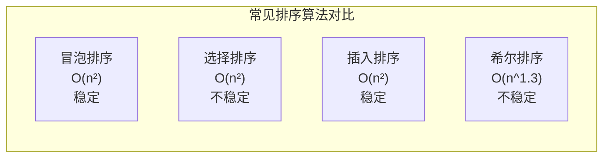

*前言：笔者对这个部分也是比较迷糊，最近正好来整理整理，依旧将其分为两个部分来完成，分为简单排序和高级排序。并对相应的算法来进行优化。同时高级排序快排由于过于麻烦会放在下一节来讲，所以这一部分将分成三个部分来讲*   
# 第一部分：简单排序：



## 1. 1冒泡排序
作为第一个学的算法，也是异常简单，我们对一个数组进行排序，我们进行两两比较，大的往后面放，第一次就把最大的找到了放在最后面，这样进行第二次只需要排序除去最后一个的数的数组。依次进行循环，只剩最后一个数就自然有序了：
先看初步代码：
```c
void BubbleSort(int* a, int n)
{
	for (int j = 0; j < n; j++)
	{
		int flag = 0;
		for (int i = 0; i < n - 1 - j; i++)
		{
			if (a[i] > a[i + 1])
			{
				swap(&a[i], &a[i + 1]);
				flag = 1;
			}
		}
		if (flag == 0)
			break;//如果没有进行交换就直接排除，说明依旧拍好了
	}
}
```
在这里我们加了优化，给了一个flag，如果flag还是为0，那么说明没有发生交换，这也就代表直接进行排序好了，直接break；
**最好情况（已有序）​**​
    仅需**一趟遍历**​（比较相邻元素，无交换发生），时间复杂度为 ​**O(n)** 
**最坏情况（完全逆序）​**
    需进行 ​**n-1 趟排序**，每趟比较 `n-i`次（`i`为趟数），总比较次数为 ​**n(n-1)/2**，时间复杂度为 ​**O(n²)​**​ _示例_：数组 `[5, 4, 3, 2, 1]`需完整执行所有轮次
冒泡排序更多是为了具有教学意义。我们也不在这里浪费太多笔墨。

---

## 1.2 插入排序：
插入排序是我们今天讲的第二个排序，这个排序虽然是简单的排序，是为了引出希尔排序，这个排序还是很重要的，对于后面理解希尔排序具有深刻的意义。
插入排序很类似与打扑克，我们把手上的排看成有序，新来的排进行插入。在这里有一个数组，我们先把第一个数看作有序，分成【0，end】【end + 1，n -1 】，每次填进去一个数，先来看：
```c
int end;
int tmp = a[end + 1];
		while (end >= 0)
		{
			if (tmp < a[end])
			{
				//如果 tmp的值小于前面的值，值后移；
				a[end + 1] = a[end];
				end--;
			}
			else {
				break;
			}
		}
		a[end + 1] = tmp;//插入值
```
我们还不确定end值，我们来看整体：
```c
void InsertSort(int* a, int n)
{
	//先走单趟，在考虑多趟，先分割数组，[0,end][end+1 n-1]
	for (int i = 0; i < n - 1; i++)
	{
		int end = i;
		int tmp = a[end + 1];
		while (end >= 0)
		{
			if (tmp < a[end])
			{
				//如果 tmp的值小于前面的值，值后移；
				a[end + 1] = a[end];
				end--;
			}
			else {
				break;
			}
		}
		a[end + 1] = tmp;
	}//多趟完成
}
```
完成代码的初步建设，接下来进行测试，主要测试函数如下（主函数省略·，下面都是）：
```c
void InsertTest()
{
	int arr[] = { 0, 14, 7,11,2,4,3,12,9 };
	InsertSort(arr,sizeof(arr) / sizeof(arr[0]));
	PrintArr(arr, sizeof(arr) / sizeof(arr[0]));
}
```
![[Pasted image 20250813150530.png]]结果如上，排成升序完成，并没有出现任何错误。

| ​**情况**​    | ​**时间复杂度**​ | ​**说明**​                  |
| ----------- | ----------- | ------------------------- |
| ​**最好情况**​  | O(n)        | 数组已有序，每轮仅需1次比较            |
| ​**最坏情况**​  | O(n²)       | 数组完全逆序，需 `n(n-1)/2`次比较和移动 |
| ​**平均情况**​  | O(n²)       | 随机数据，平均移动次数为 `n²/4`       |
| ​**空间复杂度**​ | O(1)        | 原地排序，仅需常数额外空间             |
观察上表我们发现从理论来看好像冒泡排序似乎和插入排序差不多，其实不然，来看一组测试:
```c
void TestOp()
{
	srand(time(0));//时间做戳，生成随机数
	const int N = 100000;//接下来就不改变N的值了
	int* a1 = (int*)malloc(sizeof(int) * N);
	int* a2 = (int*)malloc(sizeof(int) * N);
	int* a3 = (int*)malloc(sizeof(int) * N);
	int* a4 = (int*)malloc(sizeof(int) * N);
	int* a5 = (int*)malloc(sizeof(int) * N);
	for (int i = 0; i < N; i++)
	{
		a1[i] = rand() + i;
		a2[i] = a1[i];
		a3[i] = a1[i];
		a4[i] = a1[i];
		a5[i] = a1[i];
	}
	//相同的数组作比较才有意义哦
	int start1 = clock();
	ShellSort(a1,N);
	int end1 = clock();

	int start2 = clock();
	InsertSort(a2,N);
	int end2 = clock();

	int start3 = clock();
	//InsertSort(a2, N);
	int end3 = clock();

	int start4 = clock();
	//InsertSort(a2, N);
	int end4 = clock();

	int start5 = clock();
	BubbleSort(a5, N);
	int end5 = clock();

	printf("ShellSort:%d\n", end1 - start1);
	printf("InsertSort:%d\n", end2 - start2);
	printf("ShellSort:%d\n", end3 - start3);
	printf("ShellSort:%d\n", end4 - start4);
	printf("BubbleSort:%d\n", end5 - start5);
}
```
上面的测试内容没有进行很好的改变，只需要看我们要测试的结果就ok了。
![[Pasted image 20250813151629.png]]
只需要关注BubbleSort和InsertSort就行了，发现冒泡排序还是和插入排序还是很有区别的，虽然他们的最长耗时都是O(n²)，最好都是O(n);

---

## 1.3 选择排序：
选择排序也是很好的一门思想，主要是为了引出堆排序，在上上章中我们已近介绍了，这里我们将重新回顾，首先来看选择排序：
我们先遍历数组，找到最大的和最小的进行，将max和end进行交换，然后交换min和begin进行交换，大致思路如此，我们先来写代码看看有没有什么注意的思路：
第一版代码如下：
```c
void swap(int* a, int* b)
{
	int tmp = *a;
	*a = *b;
	*b = tmp;
}

void SelectSort1(int* a, int n)
{
	//选择排序，先遍历数组，找出最大的和最小的
	int begin = 0;
	int end = n - 1;
	while (begin < end)
	{
		int max = end;
		int min = begin;//记录下标ok了
		for (int i = begin; i < end + 1; i++)
		{
			if (a[i] > a[max])
				max = i;
			if (a[i] < a[min])
				min = i;
		}
		swap(&a[max], &a[end]);
		swap(&a[min], &a[begin]);
		end--;
		begin++;
	}
}
```
乍一看似乎没有什么错误，但是我们细细想想还是有不少问题的，首先是最小值如果刚好是end，但是你先换了end和max，那么不就导致后续的操作失误，那么我们就继续改进：
```c
void SelectSort1(int* a, int n)
{
	//选择排序，先遍历数组，找出最大的和最小的
	int begin = 0;
	int end = n - 1;
	while (begin < end)
	{
		int max = end;
		int min = begin;//记录下标ok了
		for (int i = begin; i < end + 1; i++)
		{
			if (a[i] > a[max])
				max = i;
			if (a[i] < a[min])
				min = i;
		}
		swap(&a[max], &a[end]);
		if (min == end)
		{
			swap(&a[max], &a[begin]);
		}
		else {
			swap(&a[min], &a[begin]);
		}
		end--;
		begin++;
	}
}
```
在这里我们完善了这段代码，但是还是不好看，逻辑冗余，而且操作复杂，虽然几轮测试下来没有问题，我们来改善这段代码，从命名和最后的逻辑来看：
```c
void SelectSort(int* a, int n)
{
	int begin = 0;
	int end = n - 1;
	while (begin < end)
	{
		int max_i = begin;
		int min_i = begin;//两个小标都放在 begin
		for (int i = begin; i < end + 1; i++)
		{
			if (a[i] > a[max_i])
				max_i = i;
			if (a[i] < a[min_i])
				min_i = i;
		}
		swap(&a[min_i], &a[begin]);
		if (max_i == begin)
			max_i = min_i;
		swap(&a[max_i], &a[end]);
		begin++;
		end--;
	}
}
```
这样就清楚很多了，更加符合操作的规矩，逻辑也更加清楚。
接下来完成测试：
```c
void SelectTest()
{
	int arr[] = { 0, 14, 7,11,2,4,3,12,9 };
	SelectSort(arr, sizeof(arr) / sizeof(arr[0]));
	PrintArr(arr, sizeof(arr) / sizeof(arr[0]));
}
```
![[Pasted image 20250813154635.png]]