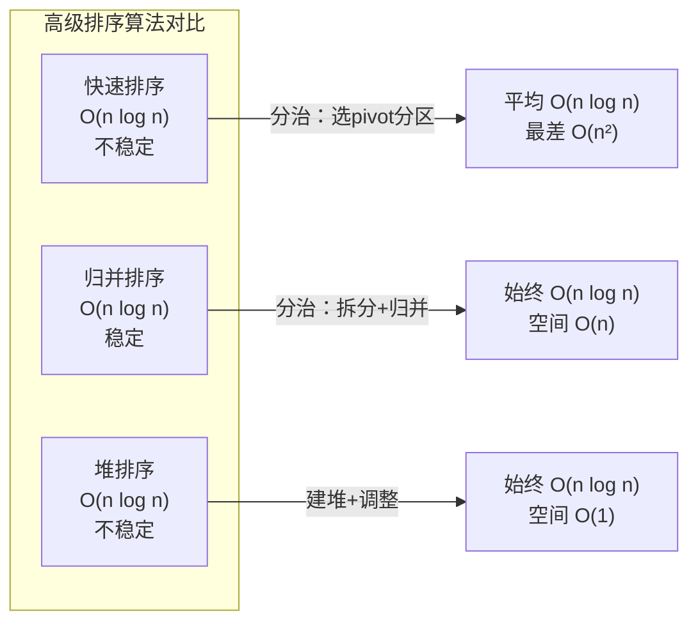

借助上文的势头我们来完成今天这篇小文章：
# 第二部分：复杂排序：



# 1.1 希尔排序：
希尔排序就是对插入排序的进化，我们发现插入排序还是太慢了，在希尔的思路想法下，我们可以先尝试预排：我们先进行分组，没间隔gap为一组，这样就分成了gap组了，不如gap = 3，那么就分成了3组，这样做的好处就是可以让大的快速到后面去，小的能够快速到前面去。这真的是一个很厉害的思想，有了这样的思想，我们就可以改进我们的插入排序：
```c
void ShellSort(int* a,int n)
{
	//对于希尔排序的区别就是 gap的值有所变化，先进行预排序
	//先写第一趟
	int gap = 3;
	while (gap)
	{
		//但是我们还要进行完成希尔排序，还要一层循环
		for (int j = 0; j < gap; j++)
		{
			for (int i = j; i < n - gap; i += gap)//将j赋值给i后可以控制每组的预排
			{
				int end = i;//end 的值不知道的话先不确定
				int tmp = a[end + gap];
				while (end >= 0)
				{
					if (tmp < a[end])
					{
						//如果比他小，我们就要把 end的值往 end+gap 移动，end还需要再减 gap
						a[end + gap] = a[end];
						end = end - gap;
					}
					else {
						//说明和他相等或者比他大
						break;
					}
				}
				a[end + gap] = tmp;//把 tmp的值加进去
			}
		}
		gap--;
}
```
笔者在写这一段代码时候我也很难受，主要是还是挺难的，我们进行不断拆分：先想成了gap = 3，对里面进行第一次预排，最里面的循环就只完成了一组，在通过j来控制3组，最后在通过gap来控制gap--，来往希尔排序，这里只是初步的排序，还是不太好看，也不符合真正的希尔排序，我们还要继续进行改进：
```c
void ShellSort(int* a, int n)
{
	//我们结合上面的第一版来进行改善
	int gap = n;
	while (gap > 1)
	{
		gap = gap / 3 + 1;
		//原本是有一个循环控制 gap组的预排，现在直接同时排序
		for (int i = 0; i < n - gap; i++)
		{
			int end = i;
			int tmp = a[end + gap];
			while (end >= 0)
			{
				if (tmp < a[end])
				{
					a[end + gap] = a[end];
					end -= gap;
				}
				else {
					break;
				}
			}
			a[end + gap] = tmp;
		}
	}
}
```
讲一下为什么选择``/3+ 1``，主要是大部分教材都是这样的，我们来看：
**快速缩小增量**​
- ​ **`gap / 3`** ：相比传统的折半（`gap / 2`），除以 3 能更快缩小增量，减少预排序轮次，提升效率。
- **`+1`的保障作用**​：确保最后一次 `gap`一定为 1（即最终进行直接插入排序），避免因整除导致 `gap`跳过 1（如 `gap=2/3≈0`会遗漏排序）
在gap选择3的时间复杂度
希尔排序的时间复杂度**依赖 `gap`序列**，使用 `gap / 3 + 1`时：
- ​**平均时间复杂度**​：​**O(n^{1.25}) ~ O(n^{1.3})​**​
    通过预排序减少逆序对，最后一轮插入排序时数组已基本有序，移动次数接近线性。
- **最坏时间复杂度**​：​**O(n^{1.5})​**​（若初始序列完全逆序）。
- ​**最优时间复杂度**​：​**O(n)​**​（数组已有序时）
![[Pasted image 20250813160920.png]]
希尔排序以**分组插入+增量缩减**为核心，在插入排序基础上实现效率跃升，是算法优化的经典案例。其设计思想（分阶段逼近有序）深刻影响了后续算法（如快速排序分区策略）。尽管非稳定且理论分析复杂，其简洁性与实用效率仍使其成为工程排序的常用基础方案

---
# 1.2 堆排序：
堆排序是借助堆的特性来完成的，堆是一种特殊的二叉树，这种排序类似与选择排序很类似，都是把大的往后放，在建立堆，我们建立大堆，记得使用向下建堆方式(效率更高)，从第一个非叶子节点开始建堆，建完堆后我们进行排序，把大的和最后一个进行交换，end-1，进行向下调整。这样还是第二大的就排序上去了，依次如此：
```c
void AdJustDown(int* a, int size, int parent)
{
	//向下调整算法：
	int child = parent * 2 + 1;
	while (child < size)
	{
		if (child + 1 < size && a[child] < a[child + 1])
		{
			child = child + 1;
		}
		if (a[child] > a[parent])
		{
			swap(&a[child], &a[parent]);
			parent = child;
			child = parent * 2 + 1;
		}
		else {
			break;
		}

	}
}


void HeapSort(int* a,int n)
{
	//排升序，我们建立大堆
	//向下建堆
	for (int i = (n - 1) / 2; i >= 0; i--)
	{
		AdJustDown(a, n, i);
	}
	for (int i = 0; i < n; i++)
	{
		swap(&a[0], &a[n - i - 1]);
		AdJustDown(a, n - i - 1,0);
	}
}
```
完成代码的构建，由于之前写过还是比较得心应手的。

---
# 1.3 测试：
两端测试：
```c
void HeapTest()
{
	int arr[] = { 0, 14, 7,11,2,4,3,12,9 };
	HeapSort(arr, sizeof(arr) / sizeof(arr[0]));
	PrintArr(arr, sizeof(arr) / sizeof(arr[0]));
}
```
```c
void SelectTest()
{
	int arr[] = { 0, 14, 7,11,2,4,3,12,9 };
	SelectSort(arr, sizeof(arr) / sizeof(arr[0]));
	PrintArr(arr, sizeof(arr) / sizeof(arr[0]));
}
```
两次测试结果都很好。
![[Pasted image 20250813162336.png]]