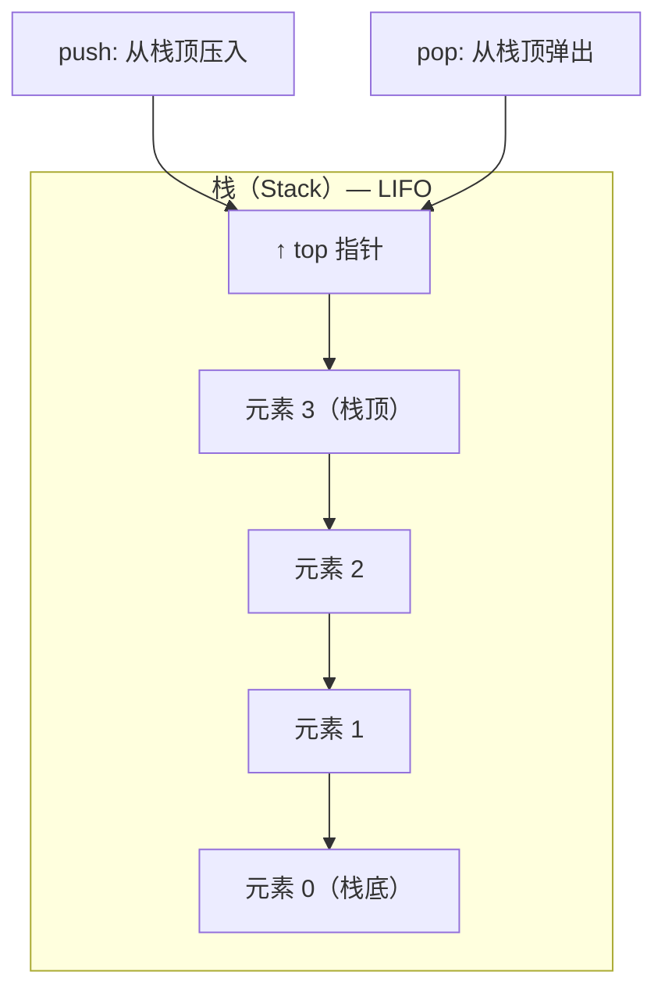

---
tags:
  - 数据结构
time: 2025-07-21
---
# 1. 栈的定义



栈是限定**仅在一端**​（称为栈顶，Top）进行插入（入栈）和删除（出栈）操作的线性表。
**操作原则**​：最后插入的元素最先被删除，即后进先出（LIFO）。
​**术语**​：
- ​**栈顶（Top）​**​：允许操作（插入/删除）的一端。
- ​**栈底（Bottom）​**​：固定不动、不允许操作的另一端。
- ​**空栈（Empty Stack）​**​：栈中无元素的状态
# 2.通过C语言来实现
## 2.1栈支持以下核心操作：
1. ​**入栈（Push）​**​：在栈顶插入新元素，栈大小增加。
2. ​**出栈（Pop）​**​：删除栈顶元素，栈大小减少。
3. ​**取栈顶（Top/Peek）​**​：获取栈顶元素值，不修改栈结构。
4. ​**判空（IsEmpty）​**​：检查栈是否为空。
5. ​**初始化（Init）与销毁（Destroy）​**​：创建空栈或释放栈内存。
## 2.2具体代码如下：
首先要有以下的格式分类：
![[Pasted image 20250721161145.png]]
```c
#pragma once
#include<stdio.h>
#include<assert.h>
#include<stdbool.h>
#include<stdlib.h>

#define STDatatype int

struct Stack
{
	STDatatype* a;
	int top;//栈顶
	int capacity;//栈的容量
};
typedef struct Stack st;

//栈的初始化和销毁
void StackInit(st* pst);
void StackDestroy(st* pst);

//入栈和出栈
void StackPop(st* pst);
void StackPush(st* pst, STDatatype date);
```
这一块代码是栈的头文件，我们给出接口，接下来我们要尝试在``stack.c``里面实现这些代码，即这些头文件的接口具体如何实现
```c
#include"Stack.h"

void StackInit(st* pst)
{
	pst->a = NULL;
	pst->top = 0;
	pst->capacity = 0;
}
void StackDestroy(st* pst)
{
	free(pst->a);
	pst->a = NULL;
	pst->top = pst->capacity = 0;
}

void StackPop(st* pst)
{
	assert(pst);//断言是否为空指针
	assert(pst->top > 0);
	pst->top--;
	//直接减一就ok
}

void StackPush(st* pst, STDatatype date)
{
	assert(pst);
	if (pst->top == pst->capacity)
	{
		int NewCapacity = pst->capacity == 0 ? 4 : 2 * pst->capacity;
		STDatatype* tmp = (STDatatype*)realloc(pst->a, NewCapacity*sizeof(STDatatype));
		if (tmp == NULL)
		{
			perror("realloc fail");
			exit(1);
		}
		pst->a = tmp;
		pst->capacity = NewCapacity;
	}
	pst->a[pst->top] = date;
	pst->top++;
}

bool StackEmpty(st* pst)
{
	assert(pst);
	return pst->top == 0;//capacity 可能开辟了变大了
}//为空就返回真值

STDatatype StackTop(st* pst)
{
	assert(pst);
	assert(pst->top > 0);
	return pst->a[pst->top - 1];
}

int StackSize(st* pst)
{
	assert(pst);
	return pst->top;
	//top 其实就是有效的数量。
}
```
我们通过编写依次完成了这些代码的编写。
我们接下来测试这些代码是否正常源代码如下：
```c

#include"stack.h"

void test1(st* pst)
{
	StackInit(pst);
	int ret = StackEmpty(pst);
	printf("%d\n", ret);
	StackPush(pst, 1);
	StackPush(pst, 2);
	StackPush(pst, 3);
	StackPush(pst, 4);
	printf("%d\n", StackSize(pst));
	while (pst->top)
	{
		printf("%d ", StackTop(pst));
		StackPop(pst);
	}
	printf("\n");
	printf("%d", StackSize(pst));
	StackDestroy(pst);
}

int main()
{
	st s1;
	test1(&s1);
	return 0;
	}
```
打印结果如下：
![[Pasted image 20250721161620.png]]
这样我们就完成了C语言代码实现的栈
# 3.总结
栈的本质是**操作受限的线性表**，通过LIFO原则和单端操作特性，高效支持特定场景（如函数调用、递归）。其实现需关注边界条件（空/满栈）和存储方式（顺序/链式）的选择，以平衡性能与内存需求。
