---
tags:
  - 面试
  - cpp
  - linux
  - ai-sdk
  - 7天冲刺
aliases:
  - 7天面试备战计划
  - C++ Linux 面试冲刺
---

# 7天面试备战计划

## 7 天时间线

```mermaid
gantt
    title 7 天面试备战甘特图
    dateFormat  X
    axisFormat Day %s

    section 八股冲刺
    Day1 C++基础与内存       :d1, 0, 1
    Day2 C++对象模型与STL   :d2, 1, 2
    Day3 Linux进程线程与文件 :d3, 2, 3
    Day4 网络编程与IO模型   :d4, 3, 4

    section 项目表达
    Day5 AI-SDK项目架构     :d5, 4, 5
    Day6 并发存储与异常处理 :d6, 5, 6
    Day7 项目答辩与模拟追问 :d7, 6, 7
```



> 来源：ChatGPT 共享会话《7天面试备战计划》
> 目标：前 4 天压 C++ / Linux / 网络高频八股，后 3 天压 AI-SDK 项目表达、追问和模拟面经。

## 使用规则

1. 本文件夹只放题目、要求、追问方向和折叠提示，不放完整答案。
2. 每道题先口述 30 秒，再补到 1 到 2 分钟。
3. 遇到不会的题，只记录关键词，不要马上背答案。
4. 每天结束时把不会的题标记为 `#待复盘`。
5. 项目题必须尽量关联你的 AI-SDK：`ChatSDK`、`LLMManager`、`SessionManager`、`DataManager`、Provider、SSE。

## 每日入口

- [[7天面试备战计划/01-第一天-C++基础与内存]]
- [[7天面试备战计划/02-第二天-C++对象模型与STL]]
- [[7天面试备战计划/03-第三天-Linux进程线程与文件]]
- [[7天面试备战计划/04-第四天-网络编程与IO模型]]
- [[7天面试备战计划/05-第五天-AI-SDK项目架构]]
- [[7天面试备战计划/06-第六天-AI-SDK并发存储与异常处理]]
- [[7天面试备战计划/07-第七天-项目答辩与模拟追问]]
- [[7天面试备战计划/08-终极面经-模拟面试与追问清单]]
- [[7天面试备战计划/09-总题库-只看题目版]]

## 推荐复习比例

```text
前 4 天：
C++ 40%
Linux 30%
网络 30%

后 3 天：
项目 70%
八股复盘 20%
手写代码 10%
```

## 原笔记链接

- C++ 主线：[[1.c++学习/00-学习入口]]
- Linux 主线：[[2.Linux/00-学习入口]]
- 网络笔记：[[2.Linux/一文总结网络：]]
- 算法主线：[[3.优选算法/00-学习入口]]
- AI-SDK 专栏：[[从零开始接入AI-SDK/AI_SDK/README]]
- AI-SDK 总结：[[从零开始接入AI-SDK/AI_SDK/BUILD_SUMMARY]]
- 项目面试上篇：[[从零开始接入AI-SDK/11-面试突击篇（上）——C++高级特性与并发安全]]
- 项目面试下篇：[[从零开始接入AI-SDK/12-面试突击篇（下）——架构设计与网络流式传输]]

## 口述要求

每个问题都按这个顺序练：

```text
先一句话结论
再讲核心机制
再讲项目/代码里的例子
最后补风险、优化或边界条件
```

> [!tip]- 不会时怎么说
> - 先承认这个点没有完全展开过。
> - 说出你已经知道的边界：它解决什么问题、常见场景是什么。
> - 把答案拉回项目：如果在 AI-SDK 里遇到，会从哪几个文件、哪几层去查。
> - 不要硬编具体源码细节。

## 每天验收

- 能连续回答 30 道题，不查资料。
- 能把 10 道高频题讲到 1 分钟以上。
- 能手写 2 到 3 个基础代码题。
- 能把当天内容和 AI-SDK 项目至少关联 5 次。

