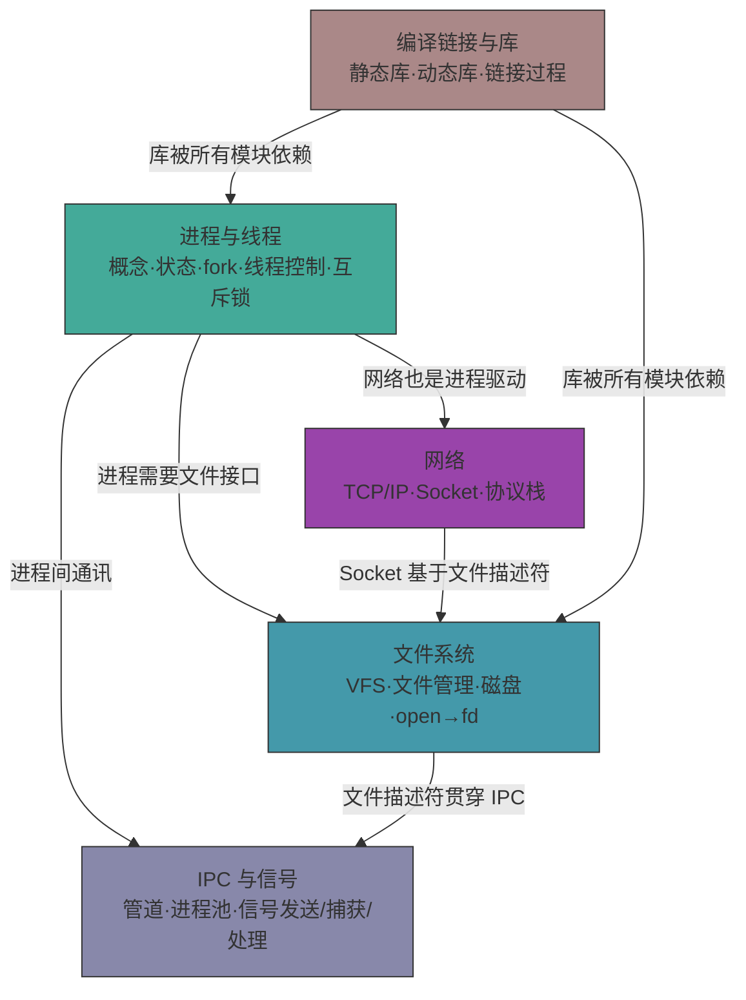

---
tags:
  - moc
  - linux
  - wiki
aliases:
  - Linux学习入口
  - Linux知识地图
---

# Linux 学习入口

这条主线是 C++ 系统能力的放大器，也会直接连接到 [[6.4月C++岗位面试冲刺/00-学习入口]] 和 [[7.LLM学习/05-推理与部署]]。

## 五大模块关系图

## 进程与线程

- [[2.Linux/1.【Linux基础】构筑基础概念---进程的概念和状态 (1)]]
- [[2.Linux/14.初步认识线程]]
- [[2.Linux/15.线程的控制和线程的封装]]
- [[2.Linux/16.线程的互斥-锁的概念引出]]
- [[2.Linux/17.互斥锁的封装]]

## 文件系统与文件接口

- [[2.Linux/2.【c++与Linux基础】文件篇（4）虚拟文件系统VFS]]
- [[2.Linux/3.【c++与Linux基础】文件篇（5）- 文件管理系统：]]
- [[2.Linux/5.【C++与Linux基础】文件篇（7）磁盘文件系统：从块、分区到inode与ext2]]
- [[2.Linux/6.【C++与Linux基础】文件篇（8）进程如何打开磁盘文件：从open()到文件描述符的奇妙旅程]]

## 编译、链接与库

- [[2.Linux/7.【C++与Linux基础】动静态库]]

## IPC 与信号

- [[2.Linux/8.【C++与Linux基础】进程间通讯方式：匿名管道]]
- [[2.Linux/9.【C++与Linux基础】进程池的基础理解]]
- [[2.Linux/10.进程间的信号]]
- [[2.Linux/11.进程信号的保存]]
- [[2.Linux/12.进程间信号的处理]]
- [[2.Linux/13.信号的处理与系统中断]]

## 网络与杂项

- [[2.Linux/一文总结网络：]]
- [[2.Linux/关闭时HEAP_CORRUPTION修复记录]]
- [[2.Linux/未命名]]

## 推荐学习顺序

1. 进程 / 线程
2. 文件系统 / 文件描述符
3. IPC / 信号
4. 网络
5. 编译链接与工程问题

## 和其他主线的连接

- 基础语言：[[1.c++学习/00-学习入口]]
- 面试压缩：[[6.4月C++岗位面试冲刺/00-学习入口]]
- 项目落地：[[4.酷狗音乐学习/00-学习入口]]
- LLM 系统：[[7.LLM学习/08-与C++和Linux的连接点]]
