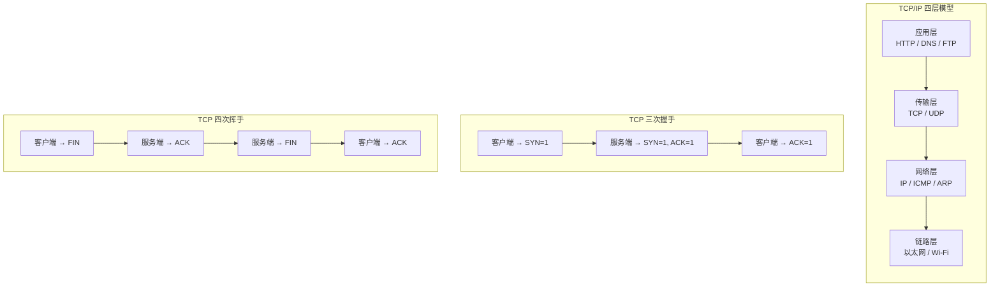

## TCP/IP 四层模型与核心流程

# 1.本文所包含的知识点：
我们需要将清楚浏览器向服务器发送http请求，建立tcp协议会发生什么？是怎么在网络上面传输的。为了解释这一个过程，我们需要知道下面的名词：
1. 序列化和反序列化。
2. NAT转换。
3. IP地址：ipv4和ipv6端口号
4. TCP三次握手，四次挥手

# 2. 先画出网络的结构：

暂时，先这么画着，我们将要一步一步的向下分析，这里可能不对，我先说进行，总结，不对的在划掉。

这里着重说TCP协议。

# 3. 表达我的过程：

## 3.1 浏览器和服务器进行三次握手：
我们在浏览器中输入 `www.baidu.com` 此时浏览器会进行DNS解析成为百度服务器的IP地址。我们的浏览器会发起一个请求，此时这个请求里面的有效载荷是0，（因为不知道对方的接收缓冲区和序号）此时，我们在传输层的tcp首部中将SYN置为1.表示这是一个建立联系的请求：
其中TCP的首部长这样： 

此时，我们百度的服务器的某个进程会收到这个信息，收到这个报文了之后，会在将ack置为1，表示这是一个回应报文，为了效率，同服务器向浏览器发送建立的请求。这样就算了第二次。同时浏览器也会做出应答。
大致的图示向这样：

其中序号是随机初始化的，比如为x，那么第二次应答加请求就是应答序号为x+1，同时初始化自己的为y，那么最后一次的就为y+1.

### 3-1-1 需要注意什么：
1. 需要注意到浏览器向客户端发送请求的时候，只要客户端回应之后才算接收到请求，我们不对请求的回应做回应（不然就出现了无限死循环）
2. 初始化的序号是要随机的，不然在网络中不消散的报文容易影响下次的建立联系。
3. 三次挥手的时候，有效载荷一般为0。

我们后面再说正常的请求和交流，什么是滑动窗口，什么是接收和发送缓冲区。
## 3-2 下一层次：网络层
刚刚我们说了传输层所需要的事情，那么网络层负责做什么呢，传输层是告诉操作系统是那个进程直接的通话，而网络层次是需要解决，是哪个主机来完成通讯，他在哪里的问题。
这个就是IP协议：
先来看看什么是IP协议的首部吧：

1. 第一行：
	 - 版本号：是ipv4还是ipv6
	 - 首部长度，一个表示为5字节，那么4bit `1111` 表示60字节，那么表示首部最多60（12 *  5）字节，最少是20字节、
	 - 服务类型：这里大致理解为不同的报文，优先度不同
	 - 总长度：$2^{16} - 1 = 65535$，但是受限于mtu的影响，不可能这么大。
2. 第二行：
	- 标识位：上面讲道理由于长度过大，IP协议会进行裁切，那么如果是一个报文就是一个标识，比如12345。表示这是一个请求或者应答
	- 标记位：如果是1，表示后面还有报文，0的话表示结束
	- 偏移量：记录了这个IP报的偏移量
3. 第三行：
	- TTL：time to live 。路由器每次转发这个包，TTL 就减 1。减到 0 还没到目的地，路由器就会把包丢弃，并给源 IP 发一个 ICMP 报错。
	- 协议：当目标主机的网络层剥开这个 IP 头，看到“协议”字段的值是 **6**，它就知道有效载荷里装的是一个 **TCP 报文**（就是你上次画的那个图），于是把它交给内核的 TCP 模块处理；如果是 **17**，就交给 UDP 模块处理。

我们刚刚说到了网络层，我们的经过封装的Tcp协议经过向下交付来到这里，我们来到这里，我们填充IP地址，IP首部，相当于解决了网络向哪里发送

## 3-3 该讲讲如何在网络中如何进行传播了

