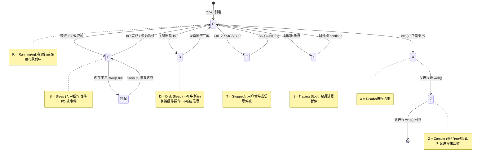

>本系列主要旨在帮助初学者学习和巩固Linux系统。也是笔者自己学习Linux的心得体会。

> [!note] 关联入口
> - 上位入口：[[2.Linux/00-学习入口]]
> - 相关笔记：[[2.Linux/14.初步认识线程]]、[[6.4月C++岗位面试冲刺/10. 2026-04-10 - Linux进程线程与调度八股]]
> - 下一步：[[2.Linux/8.【C++与Linux基础】进程间通讯方式：匿名管道]]


个人主页：   [爱装代码的小瓶子](https://blog.csdn.net/2301_80127108?spm=1000.2115.3001.5343)
文章系类：                         [Linux](https://blog.csdn.net/2301_80127108/category_13061104.html?fromshare=blogcolumn&sharetype=blogcolumn&sharerId=13061104&sharerefer=PC&sharesource=2301_80127108&sharefrom=from_link)

---

# 1. 进程的前言（操作系统）：
什么是操作系统，这个在生活中可以常常见到的东西，但是我们并没有深究他，我们先打个比方：	计算机系统的“大管家”，负责管理所有硬件和软件资源，并为上层应用提供稳定、高效的运行环境，类似于公司的总经理。总经理不直接管理每个员工，而是通过制定规章制度和审阅各部门的报告（数据）来管理整个公司。或者学校里的校长一样.
## 1.1 一个贯穿始终的概念：
这里还要提一个Linux系统中最重要的概念：** 先描述后组织**。这个概念对于操作系统来说就是：
操作系统进行资源管理的方法论。先将管理对象抽象成数据模型（描述），再通过数据结构将它们系统地管理起来（组织），打个比方来说就是：类似于先为每个学生建立一份详细的学籍档案（描述），然后按照班级、学号等顺序将档案归档（组织），学校的管理就变成了对档案库的增删改查。
有了这个概念对于我们后面完成对于系统和进程概念的熟悉更加得心应手。

## 1.2 概念形成的方法：
这种方法是理解操作系统如何实现管理的钥匙。
1. 先描述：
“描述”指的是为每一个需要管理的实体（如一个进程、一个打开的文件、一块硬件设备）创建一个数据结构。这个结构体包含了该实体的所有关键属性（或称元数据）。例如，用于描述进程的结构体（在Linux中叫task_struct）会记录进程的ID、状态、优先级、内存指针等信息。这个过程就是为管理对象建立了一份详细的“档案”。

2. 后组织:
“组织”则是在“描述”的基础上，将这些分散的数据结构通过高效的数据结构（如链表、树、哈希表）关联起来。例如，操作系统将所有处于“就绪”状态的进程的task_struct结构体链接成一个“就绪队列”。这样，当需要调度一个新进程运行时，调度器只需要从这个队列里取出一个即可，而无需关心这个进程具体代码是什么。管理的重心就从直接操作实体，转变为对这些数据结构进行增、删、改、
## 1.3 操作系统的作用：
既然已经讲到了什么是操作系统，那操作系统的是不是好好看看，我们来详细了解：

- 核心角色：操作系统是覆盖在计算机硬件之上的第一层软件，是其他所有软件运行的基础。它就像是硬件和用户（或应用程序）之间的“中间人。这是理解作用的前提。
- 五大管理功能：作为一个高效的“大管家”，它的工作主要涵盖五个方面：
	1. 进程管理：决定哪个程序先使用CPU，协调多个程序的运行。
	2. 内存管理：为程序分配和回收内存空间，保证它们互不干扰。
	3. 文件管理：管理磁盘上的文件，实现按名存取和文件共享保护。
	4. 设备管理：驱动和管理各种输入输出设备，如键盘、显示器等。
	5. 作业管理：负责对用户提交的整个任务进行调度和控制。

那我们今天主要讲的就是进程管理。

---
# 2.主场- 进程
## 2.1 什么是进程：
1. 书本上的说法：	程序的一次动态执行过程，是系统进行资源分配和独立调度的基本单位。
2. 组成部分：	主要包括程序代码、程序处理的数据以及至关重要的进程控制块(PCB)。图片如下：
4. 我们的理解：进程 = 程序（代码 + 数据） + PCB（描述、控制信息）。操作系统采用“先描述，后组织”的方法来管理进程：“描述”就是为每个进程创建一个PCB，记录其所有属性；“组织”则是通过链表等数据结构将所有进程的PCB按状态分类管理起来。这使得操作系统对进程的管理，最终转化为对PCB数据结构的操作，从而高效地实现了进程的创建、调度、切换和销毁。我这段话可能也没有讲清楚什么是进程。我们可以详细的来说说：
pcb是什么？pcb是程序的主要属性，如图所示：


在这里我们的理解进程就是pcb+程序数据和代码。

## 2.2.进程的状态：
了解完了进程，我们可以看看进程的状态：

#### Linux 进程状态转换图




这张图片主要描述进程的状态，一般在课本上我们我们只需要知道三种状态，即运行，阻塞和挂起。我们将细细讲到。
### 2.2.1 运行状态：
书本中的语言：
在操作系统中，运行状态 (Running)是进程生命周期中的一个核心状态。它指的是进程已经获得CPU（中央处理器）资源，并且其指令正在被CPU执行的那个阶段。
详细解释：在我们的计算机中有一个运行链表（runqueue）我们这里比作一个队伍，只要我们在这个队伍（链表）中我们就算运行状态。可能与上面的图片有所区别。书本中的重点：**在Linux内核中，运行状态对应着 R (running)状态标志。需要注意的是，这里的 R状态有一个比较宽泛的含义：它不仅包括进程正在CPU上执行的情况，也包括进程在运行队列中，一切就绪、等待被调度器选中执行的情况。所以，当你看到进程状态显示为 R时，它可能正在运行，也可能在排队等待运行**。


### 2.2.2 阻塞状态：
书本中的概念：在操作系统中，阻塞状态（Blocked State），也常被称为等待状态（Waiting State），是进程生命周期中的一种关键状态。它描述的是一个进程因为正在等待某个特定事件的发生，而暂时无法继续执行的情况。即使此时CPU空闲，这个进程也无法运行。
其实也很好理解，就是等带硬件资源做出输入，比如你的代码有scanf,这时就需要你等待键盘输入，所以这时就时阻塞状态。

一个进程进入阻塞状态，总是由某些内部或外部事件触发的。常见的原因包括：
- I/O 请求：这是最常见的原因。例如，进程请求从硬盘读取文件、从网络接收数据、或者等待用户的键盘输入。由于这些设备的速度远慢于CPU，进程在发出请求后必须等待操作完成。
- 等待资源：进程可能需要等待一个当前正被其他进程占用的共享资源，比如一个打印机或者一个共享数据段。
- 进程同步：在多进程协作的环境中，一个进程可能需要等待另一个进程完成某项工作或发出某个信号（信号量操作），才能继续执行。


### 2.2.3 挂起状态：
在操作系统中，挂起状态是一种特殊的进程状态，其主要特征是进程的代码和数据被临时移出内存，存放到磁盘（外存）的特定区域（如交换空间/Swap分区），以节省紧张的内存资源。
在我们的理解下：系统很卡，需要移除一些程序代码和数据，这是pcb继续留在链表中，但是指针链接的数据移除内存，解决燃眉之急。：当系统物理内存严重不足时，操作系统会将暂时不运行的进程（尤其是那些需要等待很久的阻塞进程）挂起，将其占用的内存空间释放出来，保证更重要的进程能够运行。


### 三种状态类比和总结：
|                |      挂起状态 (Suspend)   |        	阻塞状态 (Blocked)                            |
| -------------- | ----------------------------- | ---------------------------------- |
| **  <br>资源位置** | 进程的**代码和数据被交换到磁盘**            | 进程的**所有资源都保留在内存中**                 |
| **触发原因**       | 通常是**系统内存不足**，或**用户/系统的主动请求** | 进程**等待资源**（如I/O操作完成、信号量）           |
| **行为性质**       | 更多是一种**主动行为**（由OS或用户发起）       | 更多是一种**被动行为**（因所需资源未就绪而必然发生）       |
| **恢复方式**       | 需要**主动激活**（由OS或用户），将数据重新载入内存  | 在**等待的事件发生或资源就绪**后，由OS自动将其唤醒移回就绪队列 |

那么打个比方：用一个更简洁的比喻来帮你理解运行、阻塞和挂起状态。我们就把计算机的CPU想象成一位**餐厅里唯一的厨师**，而一个个进程就是等待烹饪的**菜品订单**。

|状态|比喻|核心特征|
|---|---|---|
|**运行 (Running)**|厨师正在灶台前烹饪你这道菜。|**占有核心资源（CPU）**，指令正在被执行。|
|**阻塞 (Blocked)**|菜做到一半，需要一种特殊调料，但仓库正在配送。厨师只好先把你的菜放到一边**等待调料**。|由于等待**外部事件**（如I/O操作）而**无法继续**，但所有材料（资源）仍在厨房（内存）<br><br>。|
|**挂起 (Suspend)**|厨房灶台全满，新来的订单又很重要。厨师长决定把你这份“等待调料”的菜连同半成品**暂时挪到外部仓库（硬盘）**，只为在拥挤的厨房里腾出空间。|进程的**代码和数据被移出内存**，以缓解内存压力。通常发生在阻塞的进程上，但极端情况下运行的进程也可能被挂起<br><br>。|

这个比喻能帮你直观地理解三者的核心区别：**阻塞是“在原地等待”，而挂起是“被请出内存，为其他进程腾地方”**


# 3.结合Linux讲讲：
## 3.0工具准备：

我们在Linux下做个实验吧：
我们可以使用以下命令来完成实验：

```bash
wwh@iZbp1d5rltw6ubizz031qiZ:~$ ls /proc/
```

详解：/proc文件系统：这是一个虚拟文件系统，内核通过它向用户空间暴露详细的进程和系统信息。你可以通过读取 /proc/PID/目录下的文件（如 status, cmdline）来获取某个进程最原始、最全面的信息 
。例如，cat /proc/1234/status可以查看PID为1234的进程状态摘要。其实我们后面常常用ps来完成：
ps命令是最基础的进程查看工具，其参数主要有UNIX风格（带-）和BSD风格（不带-）两种。常用组合示例：
- ps aux：以BSD风格列出所有用户的详细进程信息，包括USER（用户）、PID（进程ID）、%CPU（CPU占用）、%MEM（内存占用）、COMMAND（启动命令）等 。
- ps -ef：以标准UNIX风格列出所有进程的完整信息，可以显示PPID（父进程ID）。


比如下图：
这里用到了以下命令：

```bash
wwh@iZbp1d5rltw6ubizz031qiZ:~$ ps -ajx | grep devices
# 旨在查询进程为devices的进程
```
我们创建一个自己代码，打开vim，完成编辑，代码如下：


```c
#include <stdio.h>      // 引入标准输入输出库，用于printf函数
#include <unistd.h>     // 引入Unix标准库，提供fork(), getpid(), getppid(), sleep()等函数
#include <sys/types.h>  // 引入系统类型定义库，定义pid_t等数据类型

int main()  // 程序主函数入口
{
    int count = 10;     // 定义并初始化整型变量count，初始值为10
    pid_t pid = fork(); // 创建子进程：fork()调用会创建一个当前进程的副本（子进程）
                        // 在父进程中，fork()返回子进程的PID（正整数）
                        // 在子进程中，fork()返回0
                        // 如果创建失败，返回-1

    if(pid == 0)        // 判断：如果当前是子进程（fork()返回值为0）
    {
        while(count)    // 子进程循环：当count不为0时继续循环
        {
            --count;    // 子进程中的count减1（注意：这是子进程独立的count副本）
            printf("我是子进程,我的pid :%d,我的父进程为:ppid:%d\n", getpid(),getppid());
                        // 打印子进程信息：
                        // getpid() - 获取当前进程（子进程）的ID
                        // getppid() - 获取父进程的ID
            sleep(1);   // 子进程休眠1秒，让出CPU
        }
    }
    
    if(pid > 0)         // 判断：如果当前是父进程（fork()返回值>0，即子进程的PID）
    {
        while(count)    // 父进程循环：当count不为0时继续循环
        {
            --count;    // 父进程中的count减1（这是父进程独立的count副本）
            printf("我是父进程,我的pid :%d,我的父进程为:ppid:%d\n", getpid(),getppid());
                        // 打印父进程信息：
                        // getpid() - 获取当前进程（父进程）的ID
                        // getppid() - 获取父进程的父进程（即当前进程的祖父进程）的ID
            sleep(1);   // 父进程休眠1秒，让出CPU
        }
    }
    
    return 0;           // 程序正常退出，返回0
}
              
```

我们来详细解释一下这段代码：
这段代码演示了Linux/Unix系统中进程创建的基本概念。通过 fork()系统调用，程序会创建一个与自己几乎完全相同的子进程，然后父子进程分别执行不同的代码逻辑。fork()的工作原理：
- 调用 fork()后，操作系统会创建当前进程的一个完整副本（子进程）。
- 父子进程从 fork()返回处同时开始执行。
- 返回值不同是区分父子进程的关键

| 进程  | `fork()`返回值 | 说明                          |
| --- | ----------- | --------------------------- |
| 子进程 | `0`         | 在子进程中，`fork()`返回0           |
| 父进程 | 子进程的PID（>0） | 在父进程中，`fork()`返回新创建子进程的进程ID |
| 错误  | `-1`        | 创建进程失败                      |

他们两个进程是同时并发进行的，也就是说，运行时那句话在前，我们也是不知道的。
** 一个重要的问题：为什么父进程是大于0，而子进程只有0这一个？**
核心原因：区分父子进程的执行路径
fork()的唯一目的是创建一个新进程。创建成功后，父子进程会从 fork()调用之后的地方开始执行完全相同的代码。那么，最关键的问题就是：如何让父子进程执行不同的任务？
答案就是通过 fork()的返回值来区分。这个设计基于一个简单而强大的原则：给每个进程一个明确的、独一无二的“身份标识”。
这是一个非常好的问题，它触及了 fork()系统调用设计的核心逻辑。这个设计非常巧妙，主要是为了实用性和效率。

核心原因：区分父子进程的执行路径
fork()的唯一目的是创建一个新进程。创建成功后，父子进程会从 fork()调用之后的地方开始执行完全相同的代码。那么，最关键的问题就是：如何让父子进程执行不同的任务？

答案就是通过 fork()的返回值来区分。这个设计基于一个简单而强大的原则：给每个进程一个明确的、独一无二的“身份标识”。

1. 父进程为什么得到子进程的PID（> 0）？
目的：让父进程有能力管理和监控子进程。
在父进程中，fork()返回新创建的子进程的进程ID（一个正整数）。这就像是父母在孩子出生时拿到了一份出生证明，上面有孩子的身份证号。
父进程拿到子进程PID有什么用？
	- 等待子进程结束：使用 waitpid(pid, ...)函数，父进程可以等待特定的子进程结束。
	- 检查子进程状态：父进程可以查询子进程是否还在运行、是否正常退出等。
	- 向子进程发送信号：例如，如果子进程失控，父进程可以用 kill(pid, SIGKILL)终止它。

简而言之，返回值 > 0 给父进程提供了一个“句柄”，让它能对自己创建的孩子进行管理和交互。

2. 子进程为什么得到 0？
**目的：简单、快速地表明“我是子进程”。**
在子进程中，fork()返回 0。这个设计非常精妙，原因如下：
	- 效率极高：子进程不需要复杂的逻辑来判断自己是谁。一个简单的 if (pid == 0)条件判断就能立刻确认自己的身份。0是一个常量，判断起来最快。
	- 无需获取自己的PID：子进程已经知道如何获取自己的PID（通过 getpid()系统调用）。它不需要 fork()再返回一遍。
	- 可以轻松找到父进程：子进程也已经知道父进程是谁（通过 getppid()系统调用）。它不需要父进程的PID。

| 进程  | `fork()`返回值 | 说明                          |
| --- | ----------- | --------------------------- |
| 子进程 | `0`         | 在子进程中，`fork()`返回0           |
| 父进程 | 子进程的PID（>0） | 在父进程中，`fork()`返回新创建子进程的进程ID |
| 错误  | `-1`        | 创建进程失败                      |
## 3.1 R状态：
在Linux系统中，**R状态（Running）**是进程的一种基本状态，但它包含的含义比字面上的“正在运行”更广泛一些。下面这个表格能帮你快速抓住核心要点。

|特性维度|具体说明|
|---|---|
|**官方名称**|Running（运行状态）|
|**内核表示**|`TASK_RUNNING`|
|**本质**|进程**正在CPU上执行**，或**已在运行队列中排队等待**CPU调度|
|**通俗理解**|进程已经“万事俱备，只欠CPU”；只要获得CPU时间片，就能立即投入运行|
|**查看命令**|在`ps`或`top`命令的输出中，状态栏显示为 **`R`**|

我们先来看myproc的运行状态：命令如下：

```bash
wwh@iZbp1d5rltw6ubizz031qiZ:~$ ps -ajx | grep myproc
```

发现没有头标签，无法一一对应，我们在前面加入ps -ajx | head -1 ，此时这两个可以组合，使用&& 合并。

```bash
wwh@iZbp1d5rltw6ubizz031qiZ:~$ ps -ajx |head -1 && ps -ajx | grep myproc
```

但是下面总是有``  69902   69957   69956   69902 pts/1      69956 S+    1001   0:00 grep --color=auto myproc``，这是因为grep也是一个进程，也查询到他了，我们可以加上这个``grep -v grep``做反向匹配，注意使用``|``。最后结果如图：

也可以看到他们不是r状态，这是我还没有启动，接下来我将启动：
结果令人吃惊的是所有的进程全是s状态，这不炸了，不慌，我来告诉你：
在运行时我们发现它一直是 S 状态，不应该是运行状态吗？其实是因为我们的进程运行我们的 printf 函数的时间是极短的，大量的时间都是去在硬件队列和调度队列间切换的阻塞，所以这里显示的是 S（如果运气好的话可能能看到 R）
所以此时我们要重新写一个死循环，这样才能有机会看到r状态：
这里的后面跟了一个+号，指的是在前台（命令行）中启动的。
## 3.2 S状态
刚刚我们已经看到了Linux下的阻塞状态，我们来详细讲讲吧：
在Linux中，printf函数本身并不会直接使进程进入睡眠状态（S状态），但它触发的底层I/O操作（尤其是向标准输出设备写入数据）是导致进程进入可中断睡眠状态（S状态）的关键原因。这背后是CPU高速与外部设备低速之间的矛盾。

| 场景             | 示例代码（在 `while(1)`循环中）  | 进程主要状态       | 原因分析                                                       |
| -------------- | ---------------------- | ------------ | ---------------------------------------------------------- |
| **有 `printf`** | `printf("Running\n");` | **S (睡眠状态)** | 进程绝大部分时间在等待显示设备准备就绪并进行写入操作，这些I/O等待时间远超过CPU执行计算的时间<br><br>。 |
| **无 `printf`** | `;`(空循环)               | **R (运行状态)** | 进程不需要等待任何慢速外设，其代码始终在运行队列中，要么正在CPU上执行，要么在排队等待执行             |


因此，printf导致进程显示为S状态，根本原因在于其触发的底层I/O操作需要等待慢速的外设。操作系统为了高效利用CPU，会让等待事件的进程暂时睡眠。这种S状态是可中断睡眠，通常可以响应外部信号。除了 printf，其他如等待用户输入（scanf）、读取磁盘文件等涉及I/O的操作，也都会使进程进入S状态
。与之相对，还有一种 D状态（不可中断睡眠），通常发生在与磁盘等底层硬件的关键交互中，这种状态下进程甚至不响应 kill -9信号，以免导致数据不一致。

## 3.3 D状态
这里不做实验了，我只是来讲讲：D状态也是一种阻塞状态，只不过这个状态不能接受信号删除。我们来详细解释：D状态的核心在于保护内核关键流程的完整性。当进程通过系统调用进入内核态，并与硬件（如磁盘控制器）进行关键交互时，如果被信号随意打断，可能会导致内核数据不一致或硬件处于不可预知的状态。因此，内核会将这些进程设置为D状态，确保它们完成当前的关键操作后再响应外部信号。如果出现了D状态其实一种非常危险的状态：一般情况下可能是出现了磁盘问题，需要及时更换。

我们来打个比方

| 角色/场景           | 比喻对应                          | 核心特征        |
| --------------- | ----------------------------- | ----------- |
| **进程**          | 一位**押运主管**，负责处理重要款项（数据）       | 执行关键任务      |
| **金库操作**        | 向金库内存入或取出巨额现金（**关键的磁盘I/O操作**） | 涉及核心资源，不能出错 |
| **D状态**         | 主管进入金库，**大门已关闭并进入保险状态**       | **不可中断**    |
| **操作系统/用户**     | 银行经理或外部人员                     | 系统的管理者      |
| **`kill -9`信号** | 在外面用力敲门甚至试图破门而入，大声喊叫让主管立刻出来   | **强制终止信号**  |


1. 为何“不可中断”？
当主管在金库内操作时，整个流程是隔离且受保护的。如果因为外面的呼喊就中途开门出来，不仅会中断正在进行的业务，更可能导致现金清点错误、手续不全，甚至造成不可挽回的资金损失。这正如D状态进程在进行关键磁盘I/O时，如果被信号强行打断，极有可能导致文件系统数据不一致或硬件状态错误.

2. 为何kill -9都无效？
在比喻中，金库大门一旦进入保险状态，从外部是难以强行打开的。这是操作系统内核设计的一种保护机制：对于处于D状态的进程，内核直接“无视”任何信号（包括最强力的kill -9），从而保障底层硬件操作能够原子性地完成，避免对系统造成更大范围的损害。

3. D状态通常由什么引起？
通常是进程在请求慢速设备（如硬盘、网络存储NFS）进行读写时，由于设备繁忙、硬件故障、网络断开等原因，导致进程需要等待设备响应。此时，进程就像主管在等待一个极其缓慢的金库内部传送带


## 3.4 X状态：
X 就是死亡状态，也就是一个进程死掉了，对应我们 Linux 的就是结束状态。X 状态看不到。进程一瞬间就退出了。


## 3.5 t状态 
在Linux系统中，t状态（tracing stop）是一种特殊的进程暂停状态，表示进程正在被调试器跟踪，并在一个断点处停止执行。
当使用调试工具（如 gdb）对程序进行调试时，调试器会在程序的特定位置设置断点。当被调试的进程执行到断点位置时，它会自动暂停，此时进程的状态就会变为 t状态。这个状态的核心特征是，进程**并非由于错误或外部信号而停止**，而是**主动配合调试器**，等待调试器下达下一步的指令（如单步执行、继续运行等。

## 3.6 T状态：
在Linux系统中，T状态（Stopped）表示进程被暂停或挂起，其执行被暂时中止，直到收到恢复信号。下面这个表格汇总了它的核心信息，帮你快速把握要点。

| 特性         | 说明                                                                                  |
| ---------- | ----------------------------------------------------------------------------------- |
| **状态名称**   | 停止状态 (Stopped / Traced)                                                             |
| **PS命令显示** | `T`                                                                                 |
| **本质**     | 进程执行被**主动暂停**，不参与CPU调度                                                              |
| **常见场景**   | 1. 用户主动暂停（如按 `Ctrl+Z`）  <br>2. 调试器干预（如GDB断点）  <br>3. 收到特定信号（如 `SIGSTOP`, `SIGTSTP`） |
| **恢复方式**   | 发送 `SIGCONT`信号（如 `kill -SIGCONT <PID>`或 `fg`命令）                                     |
|            |                                                                                     |

在我们的好盆友中的文章中是这样讲的：
>我们可以看到 T 状态的出现。也就是说如果我们的进程不是通过 gdb 暂停的，而是用户通过键盘操作将其暂停的就是我们的 T 状态。暂停和阻塞不同，阻塞状态是我们的进程在等待某种资源，而我们的暂停则是某种条件不具备，或者进程做了非法操作，OS 就会把你的进程暂停了。它属于 Linux 特有的状态。我们的 T 状态是用来做止损的，就比如我们想将某一文件写入某个地方，但是实际上确是不支持这样做，我们的 OS 检测到后就怀疑我们进程出错后进行 T 状态的暂停。然后就交给我们的用户，让我们来决定要不要继续运行
————————————————
版权声明：本文为CSDN博主「励志不掉头发的内向程序员」的原创文章，遵循CC 4.0 BY-SA版权协议，转载请附上原文出处链接及本声明。
[https://blog.csdn.net/2302_80177460/article/details/152307847](https://blog.csdn.net/2302_80177460/article/details/152307847)


## 3.7 Z状态：
在Linux系统中，进程的Z状态，就是我们常说的僵尸进程。它代表一个已经执行完毕并终止的进程，但其父进程尚未读取到它的退出状态。
我们有一个代码，代码如下：

这个代码的意思是父进程一直进行死循环，但是子进程在第15后退出，此时我们的进程会出现Z+的标志。

本质：当一个进程执行完毕退出后，内核会释放其占用的内存、CPU等大部分资源，但会保留一个简化的数据结构。这个结构体包含了进程的PID、退出状态等信息，等待其父进程来“查验”。只有当父进程通过 wait()或 waitpid()系统调用读取了这个退出状态后，这个僵尸进程的条目才会从进程表中彻底删除。可以把它想象成一个已经办完离职手续但人事档案还没被HR核销的员工，他虽然不再占着工位干活，但在公司系统里还占着一个员工编号


## 3.8 孤儿进程:
孤儿进程的产生源于父子进程生命周期的不同步。具体过程如下：

1. 父进程创建子进程后提前退出：通过 fork()系统调用，一个进程可以创建另一个进程（子进程）。如果父进程在完成自己的工作后先于子进程调用 exit()退出。
2. 子进程成为“孤儿”：此时，仍在运行的子进程便失去了其父进程，成为了一个“孤儿”。
3. init进程出面收养：操作系统（内核）为了处理这种情况，会将这个孤儿进程的父进程重置为 init 进程（进程号通常为1）。init 进程就像一个专门的“孤儿院”，它会周期性地调用 wait()来等待其收养的任何子进程结束。
4. init进程完成善后：当被收养的孤儿进程最终结束时，init 进程会负责回收其资源，获取其退出状态，从而确保系统资源被正确释放，避免它演变成有害的僵尸进程

实验代码如下：

我们可以看到子进程是一个无限循环的程序，但是父进程在第15秒后会停止，这是不是很像：孤儿，所以这个状态的描述还是形象的。

可以看到此时已经看不到父进程了，只剩下孤儿进程了。


## 小对比：
|           |                            |                       |
| --------- | -------------------------- | --------------------- |
| **进程状态**  | 已终止，不可运行                   | 可能仍在运行，或已终止（可能变为僵尸进程） |
| **父进程状态** | 父进程存在但未回收它                 | 原始父进程已终止              |
| **新父进程**  | 无（仍是原父进程的子进程）              | 被内核重新指定为init进程（PID 1） |
| **资源占用**  | 不消耗CPU和内存，**但占用进程号**       | 运行中的孤儿进程消耗正常资源        |
| **主要影响**  | 占用有限的PID资源，大量存在可能导致无法创建新进程 | 通常无害，init进程会接管并最终回收   |
| **清除方式**  | 父进程调用`wait()`，或终止父进程       | init进程自动回收已终止的孤儿进程    |


---
# 总结：
上文详细的讲述了进程的概念和状态。还有很多细小的知识点没有讲，比如pcb里面是怎么设计的。我们可能在后面补充。


感谢各位对本篇文章的支持。谢谢各位点个三连吧！

---


