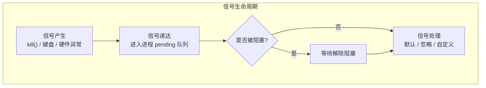

# 1. 前言：



在我们之前学习了进程的退出码和进程间的通讯（ipc），今天我们要来将进程的信号，这个和进程间的通讯的信号量是两回事。这里我们注意分辨。

我们先来说说什么是信号？
信号是 Linux 中最古老、最轻量级的**进程间通信（IPC）方式**，用来通知进程发生了某种**异步事件**。

信号的本质我们会在信号的后面详细的讲述，这里我们再来对比一下信号和信号量，这俩虽然名字像，但在操作系统里是**完全不同的两个物种**，解决的是完全不同的问题。
1. 我们所说的信号量讲述的是一个计数器，是为了保证资源（公共资源不被抢占的）。
2. 信号本质是通知进程停止手中事情，去做或者忽略某些事情。

| **维度**   | **信号 (Signal)**              | **信号量 (Semaphore)**                          |
| -------- | ---------------------------- | -------------------------------------------- |
| **英文原名** | Signal                       | Semaphore                                    |
| **核心目的** | **通知与中断**（告诉进程出事了）           | **同步与互斥**（保护共享资源不被哄抢）                        |
| **工作方式** | **异步**（随时可能被打断）              | **同步**（排队等待，拿不到锁就阻塞休眠）                       |
| **数据结构** | 位图 / 链表（存放在进程控制块中）           | 一个整数计数器 + 一个等待队列                             |
| **生活类比** | **火警警报器**：响了就得立刻停下手中的活去处理。   | **银行取号机/厕所坑位**：只有 3 个坑位，第 4 个人必须排队等别人出来（释放）。 |
| **典型场景** | `Ctrl+C` 终止程序、段错误崩溃、通知子进程结束。 | 多线程同时修改同一个全局变量、多进程竞争访问同一块共享内存。               |

一句话总结就是：**信号是用来“打断”的，信号量是用来“排队”的。**

# 2. 初步认识信号：
我们先通过一个简单的小代码来了解一下信号是什么：
```cpp
#include <iostream>
#include <signal.h>
#include <unistd.h>


int main()
{
    while(true)
    {
        std::cout << "I am process ,i am waiting a signal" << std::endl;
        sleep(1);
    }
    return 0;
}
```
这个是一个死循环，它每隔一秒就打印一句这个话，我们应该怎么让他停止呢？这里最简单的方式就是直接在键盘按住 `ctrl` + `c`这两个按键，此时会往进程发送2号信号。


## 2-1 你怎么知道是2号信号嘞？
这里我们可以新的函数：`signal` 函数：

这个函数可以理解成原本这个信号是要执行本身默认的命令（任务），通过这个函数可以自定义这个命令。比较难的就是下面这一行：
```c
typedef void (*sighandler_t)(int);
```
这行代码的作用是**起别名**。它定义了一个叫 `sighandler_t` 的新类型。 这个类型是什么呢？它是一个**函数指针**，指向一种长这样的函数：
- **输入：** 必须接收一个 `int` 参数（系统会把收到的信号编号传进来）。
- **输出：** 返回值必须是 `void`（不返回任何东西）。
而前面的参数1`signum`： 你想捕捉的信号编号。

我们可以利用这个来完成验证刚刚从键盘上面按下的 `ctrl` + `c`这两个按键是不是2号信号了。
```cpp
void headlersig(int sig)
{
    std::cout << "我捕获了一个信号sig:" << sig << std::endl;
}


int main()
{
    signal(2,headlersig);
    while(true)
    {
        std::cout << "I am process ,i am waiting a signal" << std::endl;
        sleep(1);
    }
    return 0;
}
```
我们捕获了2号信号，我们在按住`ctrl` + `c`这两个按键这两个按键还会有作用吗？我们接下来再看看这个作用：


## 2-2 已经没有作用了，应该怎么办？
对于这个进程来说，2号信号已经没有用了，这应该怎么办呢？我们可以按住 `ctrl` + `\`这两个按键来退出

此时还产生了core dumped，这个我们后面在讲。
这里我们主要学习的信号大概只有31个：

这里我们发现，这里是没有32号信号，也没有33号信号。
1. 普通信号（非实时信号，编号 1 ~ 31）
2. 实时信号（编号 34 ~ 64）

(你可能会好奇，32 和 33 去哪了？这两个通常被 Linux 的 NPTL 底层线程库偷偷保留自用了，所以我们在用户层面上直接能用的普通信号是 1-31，实时信号是 34-64。)
## 2-3 如果全部自定义，此时？
如果这个程序是一个病毒或者是一个bug，我们并且自定了1到31号的信号，此时不就是完蛋了吗，这个病毒就会一直占据并运行的。这个时候应该怎么办呢？
```cpp
int main()
{
    for(int i = 1; i <= 31; i++)
        signal(i,headlersig);

    for(int i = 1; i <= 31;i++)
    {
        sleep(2);
        raise(i);
    }
    while(true)
    {
        std::cout << "I am process ,i am waiting a signal" << std::endl;
        std::cout << "我的pid是:" << getpid() << std::endl;
        sleep(1);
    }
    return 0;
}
```
其中 `raise`函数是自己向自己发送信号，这样我们可以通过循环快速判断出第一个不能自定义捕获的接口：

我们可以看到第一个无法被改变的就是9号这个信号 `SIGKILL`。我们稍微再改装一下我们的循环再看看后面还有什么不能被发生改变：

我们可以看到9号和19号是不可以被改变的。我们再稍微改一下逻辑，最后全部跑完来看看：

我们观察发现，只有9和19号信号，不能发生改变。在 Linux 中，9 号信号是 **`SIGKILL`**，19 号信号是 **`SIGSTOP`**。它们之所以绝对不能被自定义（不能被捕捉、不能被阻塞、不能被忽略），完全是出于**操作系统的自我保护机制**。
再来认识一个函数接口：

`int kill(pid_t pid, int sig);` 是 Linux 系统的底层系统调用（System Call）。
我们在终端里敲的 `kill` 命令，底层其实调用的就是这个 C 函数。
- **`pid_t pid`：** 目标进程的 ID（你想把信号发给谁）。
- **`int sig`：** 信号的编号（你想发送几号信号，比如 9、15）。
- **返回值 `int`：** 如果成功把信号投递给了目标，返回 0；如果失败（比如进程不存在，或者你没有权限发给它），返回 -1。
    
**总结：** 如果说 `signal()` 是接收方用来“布下防御结界”的，那么 `kill()` 就是发送方用来“发射导弹”的。

有了这个函数，我们就可以利用这个来写一个自己的信号发射器：

```cpp
#include <iostream>
#include <sys/types.h>
#include <csignal>
#include <string>

int main(int argc, char *argv[])
{
    // ./Mykill signumber pid 一共3个
    if (argc != 3)
    {
        std::cout << "./mykill signumber pid" << std::endl;
        return 1;
    }

    pid_t target = std::stoi(argv[2]);
    int signum = std::stoi(argv[1]);

    for(int i = 1;i <= 31;i++)
    {
        sleep(2);
        kill(target,signum);
    }

    return 0;
}
```
我们可以看到运行结果：的确没有问题。

# 3.信号的产生：
在上面我们简单的谈了什么是信号，但是没有系统的讲述信号是怎么产生的：

这里我们来详细的讲讲信号是怎么产生的，我在这里把他分成两大类：
信号的产生可以分为两大类：**硬件产生**和**软件产生**。

1. **硬件产生（由硬件异常触发，内核发送）：**
    - **终端按键：** 比如你按 `Ctrl+C` 产生了 `SIGINT`（中断信号），`Ctrl+\` 产生了 `SIGQUIT`（退出信号）。   
    - **硬件异常：** 比如 CPU 检测到除以 0 错误（产生 `SIGFPE`），或者进程访问了非法的内存地址（MMU 触发异常，内核发送 `SIGSEGV` 即段错误）。
2. **软件产生（通过系统调用触发）：**
    - **命令或函数：** 使用 `kill` 命令或 `kill()` 函数向指定进程发信号。
    - **自己发给自己：** `raise()` 函数或 `abort()` 函数（触发 `SIGABRT`）。
    - **定时器：** `alarm()` 函数设置定时器，超时后内核发送 `SIGALRM`。
    - **携带数据的信号：** `sigqueue()` 函数（常用于实时信号）。

在前文中，我们详细的解释了什么是终端按键和`kill` 命令。下面我来详细的介绍什么是硬件异常：
## 3-1 硬件异常
我们来一段程序，用一个整数来除以0来演示发生错误：
```cpp
void headlersig(int sig)
{
    std::cout << "我捕获了一个信号sig:" << sig << std::endl; 
    exit(1);
}


int main()
{
    for(int i = 1;i <= 31;i++)
        signal(i,headlersig);
    int a = 10;
    a = a / 0; //发生除0错误。
    return 0;
}

```
我们可以看到我们也不知道段错误是几号错误。我们和上面一样，都是采用把所有的信号开始捕捉。再次查看：
```bash
wwh@iZbp1d5rltw6ubizz031qiZ:~/classBox/lessson16$ rm -f test
wwh@iZbp1d5rltw6ubizz031qiZ:~/classBox/lessson16$ g++ -o test test.cc
test.cc: In function ‘int main()’:
test.cc:19:11: warning: division by zero [-Wdiv-by-zero]
   19 |     a = a / 0; //发生除0错误。
      |         ~~^~~
wwh@iZbp1d5rltw6ubizz031qiZ:~/classBox/lessson16$ ./test
我捕获了一个信号sig:8
```
我们不用管，这个初步发生的错误。我们再次尝试运行。最后发现出现信号是8号。我们可以看到：

这个8号信号就是CPU 检测到除以 0 错误。
>在这里我们还需要引入一个概念：这里接受了信号。进程会短暂的陷入到内核态。（无论是什么信号都会陷入内核态）。**所有信号处理都会进入内核态**，这不是 `SIGFPE` 特有的。

我们还可以再看一段代码，主要错误是 空指针解引用：
```cpp

void headlersig(int sig)
{
    std::cout << "我捕获了一个信号sig:" << sig << std::endl; 
    exit(1);
}


int main()
{
    for(int i = 1;i <= 31;i++)
        signal(i,headlersig);

    int* p = nullptr;
    *p = 10;//这里就是空指针解引用。
    
    
    // int a = 10;
    // a = a / 0; //发生除0错误。
    return 0;
}
```
可以看到这个也是一个很明显的错误。我们来看看他会捕捉到什么信号：

我们可以看到是11号信号 ：`SIGSEGV`。
这两个情况都是硬件异常所导致而发生信号的。其中硬件异常还包括：用户按键发生信号：比如你按 `Ctrl+C` 产生了 `SIGINT`（中断信号），`Ctrl+\` 产生了 `SIGQUIT`（退出信号）。   

## 3-2 软件异常：
### 3-2-1 kill信号的发生：
在Linux中，我们常用kill来发生信号，似乎这个命名似乎已经不符合发生信号的意思：
为什么叫 "kill"？简单来说：**最初它确实只能用来杀掉进程。**
在 Unix 的早期版本中，`kill` 命令的设计初衷非常单一：强行终止失控的进程。随着系统的发展，开发者意识到需要一种通用的**异步事件通知机制**（即“信号”），让进程之间或者内核与进程之间能够“打个招呼”。
随着后续发展，后面有很多其他的类型信号发展了，就逐渐不符合这个命名的意思了。

我们可以看到上面的图片有很多信号，对于我们的学习，只需要先了解这些就可以了：

| **信号名称**      | **编号** | **默认动作**   | **常见用途**                                              |
| ------------- | ------ | ---------- | ----------------------------------------------------- |
| **SIGHUP**    | 1      | 终止进程       | **挂断信号**。常用于让 Web 服务器（如 Nginx）**重新加载配置文件**而不重启服务。     |
| **SIGINT**    | 2      | 终止进程       | **中断信号**。就是你在终端按下 `Ctrl + C` 时发送的信号。                  |
| **SIGQUIT**   | 3      | 终止+产生 Core | **退出信号**。按下 `Ctrl + \` 触发，不仅退出还会留下“尸体”（Core Dump）供调试。 |
| **SIGKILL**   | 9      | **强行终止**   | **必杀信号**。该信号不能被捕获或忽略，由内核直接收割进程。通常是最后手段。               |
| **SIGTERM**   | 15     | 终止进程       | **终止信号**（默认）。这是 `kill` 不带参数时的默认行为，给进程留点时间清理资源。        |
| **SIGSTOP**   | 17/19  | **暂停进程**   | 类似于按下 `Ctrl + Z`，把进程挂起。                               |
| **SIGCONT**   | 18/19  | 继续运行       | 让被 `SIGSTOP` 暂停的进程继续干活。                               |
| **SIGUSR1/2** | 10/12  | 终止进程       | **用户定义信号**。开发者可以随意定义它们的用途（比如触发日志翻转）。                  |

在后面的工作，对于不会的，可以去手册中去查询。

### 3-2-2 `raise()` 函数的使用：
这个函数是自己（进程）给自己发送信号，这个也比较简单，我们先来看一个程序：
```cpp
#include <iostream>
#include <csignal>
#include <unistd.h>
#include <signal.h>


int main()
{
    int cnt = 10;
    while(cnt--)
    {
        std::cout << "正在处理" << std::endl;
        if(cnt == 5) 
        {
            raise(2);
            //如果cnt == 5 ,就执行2号信号
        }
    }
    return 0;
}
```
在我们的预期中，这个函数大概只能打印出5个”正在处理“，我们来看结果：


`raise` 的作用非常简单：向当前进程（也就是调用它的程序自己）发送一个信号。


### 3-2-3 `alarm()` 函数的使用：

我们可以看到这个函数接口是14号信号，再来看一个程序：
```cpp
void headler(int sig)
{
    std::cout << "我捕获了一个信号：" << sig << std::endl;
    exit(1);
    //记得退出
}


int main()
{
    signal(14,headler);
    alarm(5);
    while(1)
    {
        std::cout << "时间未到，继续任务" << std::endl;
        sleep(1);
    }
    return 0;
}
```
可以预见的是，这里依旧会打印五个时间未到，继续任务。


# 4 总结：
在今天我们初步的认识什么是信号，只是初步的认识了什么是信号和信号的产生，在后面的文章中，我们将会继续信号的深层理解。

目前还在信号产生的阶段。