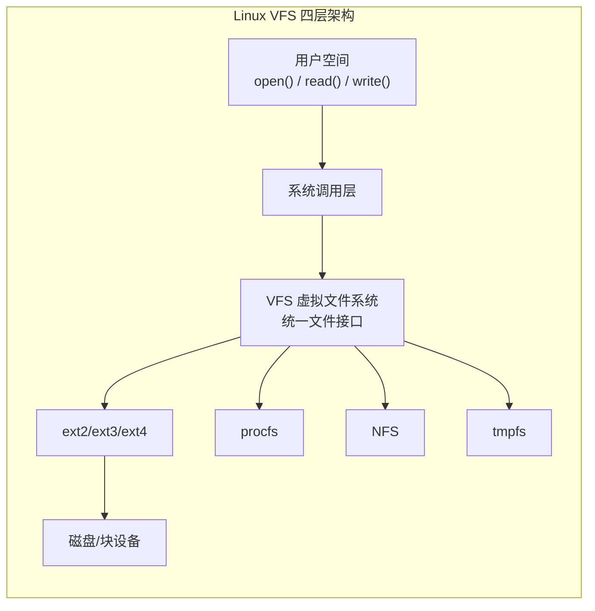

# 1.回顾前置的知识点，继续学习



在上一篇文章，我们学习什么是`fd`的本质，是一个指针数组的下标，我们再利用`dup2`函数进行重定向,随后利用这个特性来完成了minishell的重定向。
>`dup2`这个函数还是比较难的，容易搞混淆的。我在上一个文章中说了，这个就是像赋值一样，前面是你要写入的fd，后面是要替换的文件fd。类似于 `a = 1`，把后面的参数赋值给了前面

在今天我将继续深入研究文件操作的底层，研究Linux的底层。

我们已经讲完了文件重定向，接下来就是特别难的一切都是文件的思想了，虽然我之前已经理解过了，但是这里还是要继续深入研究。

学完了今天的文章，我们将理解：
1. 怎么理解一切都是文件？
2. 理解Linux的几个结构体
3. 理解VFS设计模式下的多态

今天的文章真的很难，希望大家能够理解，follow我的脚步：

# 2. 再谈一切皆文件的思想：
我们之前讲Linux下面的所有的东西都是文件，比如键盘和鼠标或者屏幕，我们可以看到这个图片中：将显示器和键盘都当作了文件，在`struct_file`中进行封装。

我们之前也是讲过这个图片，详细的交代了什么是`fd`是怎么来的。"这里也能看到file结构体里的f_op字段，它指向file_operations结构体，里面定义了read、write等接口"

这项技术的核心思想是将计算机中的各种资源（不仅是磁盘文件，还包括硬件设备）都抽象为“文件”，从而提供统一的操作接口。
• **统一抽象**：在 Windows 中不是文件的东西，在 Linux 下也被视为文件。这包括：
	- **硬件设备**：显示器、键盘、磁盘、网卡。
	- **进程通信**：管道（Pipe）。
	- **其他**：进程信息、Socket 套接字等。

• **统一接口**：开发者只需要使用一套 API（如 `open`, `read`, `write`, `close`），就可以对绝大部分系统资源进行操作。例如，读取文件和读取网卡数据都可以使用 `read` 函数；向文件写入和向屏幕打印都可以使用 `write` 函数。


## 2-1 为什么要这样设计：
我们从Linux的文件和进程来看，我们把这些都当作一些文件，极大的方便了进程通过一系列指针来控制这些外设，无论你是把它究竟是一个屏幕还是键盘，或者是打印机，他都可以当作一个文件提供操作给文件。极大的方便了进程的统一管理。

你可以相信，万一没有这样实现：
- 读取硬盘里的文本，你需要一套“硬盘指令”。
- 读取麦克风的声音，你需要一套“音频指令”。
- 读取网络发来的数据，你又需要一套“网络指令”。 

这太乱了！Linux 的做法是：**把它们全都伪装成文件。**
通过这种**抽象（Abstraction）**，操作系统只需要提供一组通用的“五大金刚”接口：
1. **Open**（打开）
2. **Read**（读取）
3. **Write**（写入）
4. **Close**（关闭）    
5. **Seek**（定位）
无论你面对的是一块磁盘、一个键盘，还是一个远程服务器，你用的代码逻辑几乎是一模一样的。这种**统一性**极大地降低了系统开发的复杂度。


# 3. 一切皆文件思想的底层：VFS
要想彻底理解一切皆是文件，我们需要扒开Linux的底层，我们不得不得提到VFS（虚拟文件系统）。
我们简单介绍一下这个系统：
**虚拟文件系统（Virtual File System, VFS）** 是 Linux 内核中的一个**抽象层**。
你可以把它想象成操作系统里的“万能翻译官”或者“通用接口标准”。它向上对用户程序提供统一的 `open`, `read`, `write` 接口，向下兼容各种千奇百怪的文件系统（ext4, NTFS, NFS, procfs 等）。
> 在软件工程中，这体现了 **“依赖倒置原则”**：高层模块不应依赖低层模块，二者都应依赖抽象；抽象不应依赖细节，细节应依赖抽象。VFS 正是这样一个“抽象层”，让系统能够统一而灵活地管理各类文件系统。

无论怎么讲，它实在是太抽象了，太难以理解了。我们将分下面几点来详细谈谈：

## 3-1 VFS到底包括什么！
VFS 的四大核心对象（The Big Four）
VFS 在内存中维护了四个核心结构体，它们各司其职。理解了这四个，就理解了 VFS 的骨架:
### 1. 超级块对象 (Superblock) —— `struct super_block`
- **代表什么：** 代表一个**已挂载的文件系统**（比如你挂载的整个 C 盘，或者插入的一个 U 盘）。
- **包含什么：** 文件系统的元数据。比如：块大小、魔数、文件系统类型、根目录在哪里。  
- **生命周期：** 挂载（mount）时创建，卸载（umount）时销毁。

### 2. 索引节点对象 (Inode) —— `struct inode`
- **代表什么：** 代表**具体的一个文件**（或者目录）。**它是文件唯一的标识符**。
- **包含什么：** 文件的元数据。比如：文件大小、拥有者、权限、时间戳、数据块在磁盘上的位置。**注意：Inode 不包含文件名**。
- **生命周期：** 当文件被访问时，内核会把磁盘上的 Inode 信息读入内存构建这个结构体。
### 3. 目录项对象 (Dentry) —— `struct dentry`
- **代表什么：** 代表路径中的**一项**。用于连接“文件名”和“Inode”。
- **为什么需要它：** Inode 里没有文件名，Linux 为了解析路径（比如 `/home/user/a.txt`），需要把路径拆分为 `home`、`user`、`a.txt` 三个部分。每一部分都是一个 Dentry。
- **包含什么：** 文件名、指向对应 Inode 的指针、指向父目录 Dentry 的指针。
- **关键作用：** **Dentry Cache (dcache)**。内核会缓存这些对象，下次再访问同一个路径时，不需要再去磁盘读 Inode，直接查内存里的 Dentry，速度极快。
### 4. 文件对象 (File) —— `struct file`
- **代表什么：** 代表**进程打开的一个文件**。    
- **包含什么：** 当前的读写位置（offset）、打开模式（只读/读写）、指向对应 Dentry 的指针。
- **生命周期：** `open()` 时创建，`close()` 时销毁。**它是进程级别的，不同进程打开同一个文件，会有不同的 `file` 结构体（因为读写进度可能不同），但它们指向同一个 `inode`**.


我们这里我们详细的讲述`struct file`，和我们的进程的关系。


## 3-2 进程启动时VFS起到的作用：
我们先来看调用的流程：
一个程序启动，虚拟内存的内核态中会存放这个进程的PCB(`struct_task`)，这里面有一个结构体指针，指向File table（`file_struct`)，这个里面有一个关键的数组（`fd_array`）里面记录了`struct_file`的指针，通过通过这个，我们能找到`struct_file`。在 `struct file` 里，有一个名为 **`f_op`** 的指针。它指向的是 **`struct file_operations`**。这里给出文件的操。这里以读写为主。尽管是不同的文件，但是`struct file_operations`里面的函数指针都是一致的。

这里只是我们简单的来讲讲这个流程，前面的`task_struct` (进程) $\rightarrow$ `files_struct` (文件表) $\rightarrow$ `fd_array` (数组) $\rightarrow$ `struct file` (打开的文件对象)。在之前就讲了，后面才是VFS设计的最为精彩的，最值得我们每一个C++/C语言工作者，学习的设计思想。

## 3-3 VFS的设计思想：
这个设计思想，在这里我就直接点破了：是多态。你可能会疑惑：Linux的底层语言不是C语言吗，怎么会有多态呢？待会就带你领会一下大神的设计和coding能力。
要想理解多态，我们要回顾一下c++的多态是什么：[【c++知识铺子】最后一块拼图-多态](https://blog.csdn.net/2301_80127108/article/details/155203443?fromshare=blogdetail&sharetype=blogdetail&sharerId=155203443&sharerefer=PC&sharesource=2301_80127108&sharefrom=from_link)这里详细了介绍了什么多态。
我们这里简单介绍一下， **每个有虚函数的类（类型）有一个虚函数表**（不是每个对象）
**每个对象有一个指向该虚函数表的指针**（vptr）。在C++中，我们有:
- 父类和子类各有自己的虚函数表
- 子类的虚函数表**基于父类的虚函数表创建**：

    - 如果子类重写了虚函数，表中对应位置替换为子类的函数地址
    - 如果子类没有重写，表中保留父类的函数地址

在Linux中靠C语言是如何手搓一个多态的呢：
我们先提供一个基类：`struct file_operations`，里面全是函数指针：
```C
// <linux/fs.h>

struct file_operations {
    struct module *owner;
    // 读文件的函数指针
    ssize_t (*read) (struct file *, char __user *, size_t, loff_t *);
    // 写文件的函数指针
    ssize_t (*write) (struct file *, const char __user *, size_t, loff_t *);
    // 打开文件的函数指针
    int (*open) (struct inode *, struct file *);
    // ... 其他操作如 poll, mmap, flush 等
};
```
里面全是函数指针，这些指针都是指向一个一个具体的文件驱动的函数：
场景 A：如果你操作的是 Ext4 文件系统上的文件（这里的这个可以暂时不用考虑Ext4是 什么东西）。
```C
// ext4 的“多态”实现
const struct file_operations ext4_file_operations = {
    .read_iter  = ext4_file_read_iter, // 指向 Ext4 具体的读函数
    .write_iter = ext4_file_write_iter,
    .open       = ext4_file_open,
    // ...
};
```
你看，这里就像子类一样，给这些函数指针具体的指向了这些函数。
场景 B：如果你操作的是鼠标 (字符设备)
鼠标驱动里会写好另一个结构体：
```C
// 鼠标驱动的“多态”实现
const struct file_operations mousedev_fops = {
    .read    = mousedev_read,   // 指向鼠标驱动具体的读函数
    .write   = mousedev_write,
    .open    = mousedev_open,
    // ...
};
```
同样姓名的函数指针，通过在不同的结构体里面，指向了不痛的地方，驱动给出不同但是具体的函数，这些函数实现了怎么用，怎么写，怎么读。我们这里不需要管。

那怎么用呢，或者将它是怎么动起来的（注意多态的感觉）？
就拿`read`来说吧！当我们的进程动起来的时候，他会通过fd 找到 指定的`struct_file`,这里面有指定的f_op,这里的f_op里面在open的时候就被绑定了不同的设备，如果是什么他就绑定什么。

再来看看read，通过这个VFS来调用read函数。
```c
// 系统调用入口
SYSCALL_DEFINE3(read, unsigned int, fd, char __user *, buf, size_t, count) {
    // 1. 根据fd找到file结构体
    struct file *file = fget(fd);  // 从current->files->fd_array[fd]获取
    
    // 2. 调用VFS层的通用read函数
    ret = vfs_read(file, buf, count, &pos);
    
    fput(file);
    return ret;
}

// VFS层的vfs_read（统一接口）
ssize_t vfs_read(struct file *file, char __user *buf, size_t count, loff_t *pos) {
    // 权限检查等...
    
    // 3. 关键的一行：多态调用
    if (file->f_op->read) {
        return file->f_op->read(file, buf, count, pos);
    } else if (file->f_op->read_iter) {
        // 或者使用read_iter（新接口）
        // ...
    }
    
    return -EINVAL;
}
```

**这就是多态！** `vfs_read` 函数根本不在乎它读的是什么，它只管调用 `f_op->read`。
- 如果 `file` 是 **a.txt**，`f_op->read` 实际上跳到了 `ext4_file_read_iter`。
-  如果 `file` 是 **/dev/mouse**，`f_op->read` 实际上跳到了 `mousedev_read`。

>多态的感觉
>- **对外**：统一的`read()`接口
>- **对内**：`file->f_op->read`指向不同函数
>- **运行时**：根据`f_op`动态调用正确的实现


## 3-4 整体来看VFS的作用：
他相当于一个润滑剂，抹平了不同硬件之间的差异。这就是VFS的威力：也是他的强悍的地方：


# 总结：
今天的内容还是比较难的，希望大家好好想一想这个文章吧！

  回顾我们今天的内容，一切皆文件不只是一句口号，而是Linux最核心的设计哲学。通过VFS这层抽象，Linux把硬盘、键盘、显示器、网络、进程信
  息这些完全不同的东西，都装进了同一个框架里。

  VFS做了什么？ 说到底就两件事：
  1. 对上，提供统一的接口 —— 不管你是操作文件还是设备，都只用 open、read、write、close
  2. 对下，用函数指针实现多态 —— 不同的文件系统各自实现这些接口，VFS负责把调用分发给正确的实现
  正是这种设计，让Linux能够轻松支持几十种不同的文件系统，让用户程序无需关心底层细节。好的架构不是把简单的东西搞复杂，而是把复杂的东
  西变得简单。

  希望这篇文章能帮你理解VFS的本质。万事开头难，能把这些概念理清楚并写出来，你已经迈出了重要的一步。继续加油！