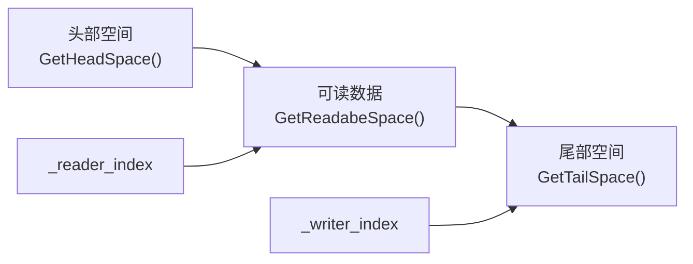
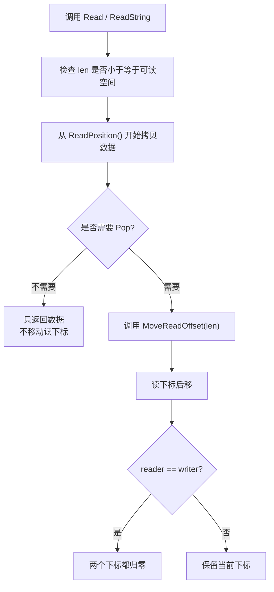
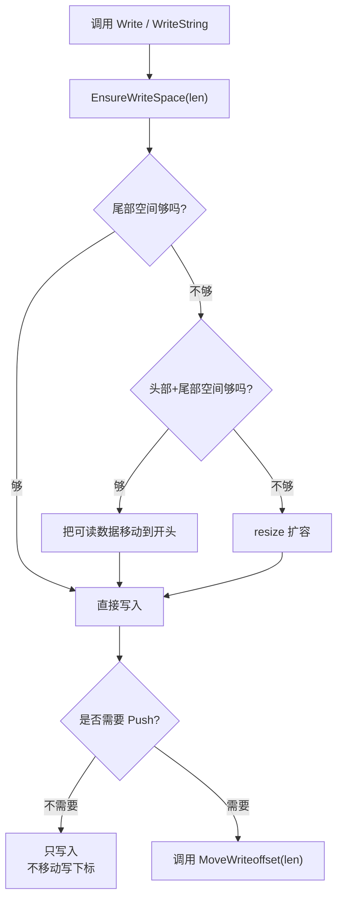

# 1. buffer模块的成员：

```cpp
private:
    std::vector<char> _buffer;
    uint64_t _reader_index; // 读位置的偏移量
    uint64_t _writer_index; // 写位置偏移量
```
为什么选择使用 `vector<char>`作为底层呢！，这是因为：
因为网络收发本质是“字节流”，`char` 最适合表示一个字节；`vector<char>` 又能提供连续内存、自动扩容、RAII 管理，所以 muduo 用它做底层 Buffer。

同时我们还需要提供读和写两个偏移量。你可能现在不太清楚，但是后面的操作很快就能理解

## 1.1 构造函数和简单功能的实现：
 我们来看看怎么写构造函数和一些简单功能：
```cpp
    Buffer() : _buffer(BUFFER_DEFAULT_SIZE), _reader_index(0), _writer_index(0) {}
    char *Begin() { return _buffer.data(); }

    // 1. 获取写入读取的地址
    char *WritePosition() { return Begin() + _writer_index; }
    char *ReadPosition() { return Begin() + _reader_index; }

    // 2. 获取尾部和头部的空间和可读空间
    uint64_t GetTailSpace() { return _buffer.size() - _writer_index; }
    uint64_t GetHeadSpace() { return _reader_index; }
    uint64_t GetReadabeSpace() { return _writer_index - _reader_index; }
```
来着重讲一下可读空间，其实本质就是吧写的偏移量减去读的偏移量，这些便是我们还可以读取的区域。

## 1.2 将读写的位置进行偏移：
```cpp
    // 3. 将读写位置的下标进行偏移
    void MoveReadOffset(uint64_t len)
    {
        if (len == 0)
            return;
        assert(len <= GetReadabeSpace());
        _reader_index += len;
        if (_reader_index == _writer_index)
        {
            _reader_index = 0;
            _writer_index = 0;
        }
    }
    void MoveWriteoffset(uint64_t len)
    {
        if (len == 0)
            return;
        assert(len <= GetTailSpace());
        _writer_index += len;
    }
```
在移动读的坐标的时候，需要确保读的偏移量不能大于写的偏移量。所以这里我们需要断言，如果相等就同时清除成为0.
这里这个也很简单，还是比较容易的。

## 1.3 读取类函数：
```cpp
    // 4. 读取：
    void Read(void *buf, uint64_t len)
    {
        assert(len <= GetReadabeSpace());
        std::copy(ReadPosition(), ReadPosition() + len, (char *)buf);
    }
    
    void ReadAndPop(void *buf, uint64_t len)
    {
        Read(buf, len);
        MoveReadOffset(len);
    }
    
    std::string ReadString(uint64_t len)
    {
        if (len == 0)
            return "";
        assert(len <= GetReadabeSpace());
        std::string ret;
        ret.resize(len);
        Read(&ret[0], len);
        return ret;
    }
    std::string ReadStringPop(uint64_t len)
    {
        std::string str = ReadString(len);
        MoveReadOffset(len);
        return str;
    }
```
先提供普通的read函数，就是把我们的Buffer中的指定内容拷贝一下进入buf,这个buf就是输出型函数。这个就是后面函数实现的基础：
1. 读取之后还需要移动下标，结合两个基础函数完成。
2. 像读取字符串情况下读取，并且是返回了字符串，其中最重要的是先设置大小，随后通过read写入，所以是 `Read(&ret[0], len);`，其中`&ret[0]`为什么不是`ret.c_str()`,本质是因为：`ret.c_str()`是常量，不可以进行修改。而 `&ret[0]` 可以拿到字符串内部可写缓冲区的首地址。
3. 读取并且改变小标，同样调用第二个函数和moveReadOffset就可以了。


## 1.4 写入类函数：
```cpp
    void EnsureWriteSpace(uint64_t len)
    {
        if (len <= GetTailSpace())
            return;
        if (len <= GetTailSpace() + GetHeadSpace())
        {
            uint64_t rsz = GetReadabeSpace();
            std::copy(ReadPosition(), WritePosition(), _buffer.begin());
            _reader_index = 0;
            _writer_index = rsz;
        }
        else
        {
            _buffer.resize(_buffer.size() + len);
        }
    }
```
这个是为了下面的写做准备的，需要确保写的区域够用，分三种情况来看：
1. 如果尾部空间够用就直返回，完全不需要扩容
2. 如果头部加尾部够用，进行移动，移动至开头，同时下标需要调整
3. 如果都不够的话，就直接进行扩容，大小为原本大小 + size；

下面就是写入函数：
```cpp
    // 4.5 写入：
    void Write(const void *data, uint64_t len)
    {
        if (len == 0)
            return;
        EnsureWriteSpace(len);
        const char *d = (const char *)data;
        std::copy(d, d + len, WritePosition());
    }
    
    void WriteAndPush(const void *data, uint64_t len)
    {
        Write(data, len);
        MoveWriteoffset(len);
    }
    void WriteString(std::string data) { Write(&data[0], data.size()); }
    
    void WriteBuffer(Buffer &data) { Write(data.ReadPosition(),   data.GetReadabeSpace()); }
    
    void WriteStringAndPush(std::string data)
    {
        Write(&data[0], data.size());
        MoveWriteoffset(data.size());
    }
    
    void WriteBufferPush(Buffer &data)
    {
        WriteBuffer(data);
        MoveWriteoffset(data.GetReadabeSpace());
    }
    
```
第一个就是正常的拷贝进入_buffer里面，将其拷贝到写的下标之后，这个也是下面写的基础，这里没有移动的下标，只是单独的写入，将其拷贝到我们的buffer里面。
    
1. `void WriteAndPush(const void *data, uint64_t len)`这个就是写入的时候，还需要移动下标，直接调用 `MoveWriteoffset(len);`可以了。
2. 随后两个是写入字符串，和写入缓冲区，就是缓冲区的元素直接写入就好了，还是比较简单的。
3. 剩下的就是写入并且下标也会移动。

## 1.5 一些为了方便调用的函数：
上面的读写函数已经可以完成基本操作了，但是在网络编程中，我们经常还会遇到一些更具体的需求。
比如：
1. 从缓冲区中读取一行数据。
2. 判断当前缓冲区里面有没有完整的一行。
3. 使用完之后清理缓冲区。

所以这里再额外提供几个比较方便调用的函数：
```cpp
    char *FindCRFL() { return (char *)memchr(ReadPosition(), '\n', GetReadabeSpace()); }
    std::string GetLine()
    {
        char *pos = FindCRFL();
        if (pos == nullptr)
            return "";
        return ReadString(pos - ReadPosition() + 1); // 希望这个\n也出现在里面
    }
    std::string GetLineAndPop()
    {
        std::string str = GetLine();
        MoveReadOffset(str.size());
        return str;
    }

    // 5 清理内存：
    void Cleer()
    {
        _reader_index = 0;
        _writer_index = 0;
    }
```

我们来一个一个看：

1. `char *FindCRFL()`
    这个函数的作用就是：从当前可读区域里面查找 `\n`。
    ```cpp
    memchr(ReadPosition(), '\n', GetReadabeSpace());
    ```
    这里的意思就是，从 `ReadPosition()` 开始，在 `GetReadabeSpace()` 这么长的范围里面，查找字符 `\n`。
    为什么是找 `\n` 呢？这是因为很多网络协议里面，一行数据通常是以换行结尾的，比如 HTTP 中常见的 `\r\n`。这里只要找到了 `\n`，基本就可以说明当前 Buffer 里面已经有一整行数据了。
    如果找到了，就返回这个 `\n` 的地址；如果没找到，就返回 `nullptr`。
    
2. `std::string GetLine()`
    这个函数的作用就是：获取一行数据，但是不移动读下标。
    首先调用 `FindCRFL()` 找到换行符的位置：
    ```cpp
    char *pos = FindCRFL();
    ```
    如果找不到，说明现在缓冲区里面还没有完整的一行，所以直接返回空字符串：
    ```cpp
    if (pos == nullptr)
        return "";
    ```
    如果找到了，就说明可以读取一行了：
    ```cpp
    return ReadString(pos - ReadPosition() + 1);
    ```
    这里 `pos - ReadPosition()` 算出来的是从读位置到 `\n` 之前的长度，但是我们希望把 `\n` 也读取出来，所以需要 `+ 1`。
    也就是说，这个函数返回的字符串里面是包含换行符 `\n` 的。
    
3. `std::string GetLineAndPop()`
    这个函数就是在 `GetLine()` 的基础上，再把读下标往后移动。
    ```cpp
    std::string str = GetLine();
    MoveReadOffset(str.size());
    return str;
    ```
    所以它的逻辑也很简单：
    1. 先读取一行数据。
    2. 再根据这一行的长度移动读下标。
    3. 最后返回这一行数据。
    这样这行数据就相当于从 Buffer 中被“取走”了，下次读取的时候就不会再读到这一行了。
    
4. `void Cleer()`
    这个函数的作用就是清空缓冲区。
    注意这里并不是真的把 `_buffer` 里面的每个字符都清掉，而是直接把读写下标都设置为 0：
    ```cpp
    _reader_index = 0;
    _writer_index = 0;
    ```
    因为对于 Buffer 来说，真正有效的数据范围是 `_reader_index` 到 `_writer_index` 之间。只要把这两个下标归零，就表示当前没有任何可读数据了。
    这种做法比真的清空数组更加高效。
最后注意一下，这里的函数名 `FindCRFL` 和 `Cleer` 可能是我的之前的拼写问题，一般更常见的写法是 `FindCRLF` 和 `Clear`。


# 总结：
## Buffer模块核心思想：
Buffer本质上就是一块连续的内存，再配合两个下标来管理数据。
一个是 `_reader_index`，表示当前读到哪里了；一个是 `_writer_index`，表示当前写到哪里了。
所以整个 Buffer 的核心就是：
1. 写数据的时候，从 `_writer_index` 开始写。
2. 读数据的时候，从 `_reader_index` 开始读。
3. 读完之后移动 `_reader_index`。
4. 写完之后移动 `_writer_index`。
5. 如果两个下标相等，说明数据都被读完了，就可以一起归零。



## 各个模块做的事情：
| 模块    | 作用                                |
| ----- | --------------------------------- |
| 成员变量  | 用 `vector<char>` 保存数据，用两个下标记录读写位置 |
| 基础函数  | 获取读写位置、头部空间、尾部空间、可读空间             |
| 偏移函数  | 读完或者写完之后，移动对应下标                   |
| 读取函数  | 从 Buffer 中读取数据，可以选择是否移动读下标        |
| 写入函数  | 向 Buffer 中写入数据，可以选择是否移动写下标        |
| 行处理函数 | 查找 `\n`，读取一整行数据                   |
|  清理函数 | 把读写下标归零，表示 Buffer 当前没有可读数据        |

## 读数据的流程：


## 写数据的流程：


## 重点理解：
1. `Read()` 和 `Write()` 只负责拷贝数据，本身不移动下标。
2. 带 `Pop` 的读取函数，会在读取之后移动 `_reader_index`。
3. 带 `Push` 的写入函数，会在写入之后移动 `_writer_index`。
4. `EnsureWriteSpace()` 是写入之前的准备工作，用来保证后面一定有足够的空间写。
5. `GetLine()` 是读取一行，但是不删除这一行；`GetLineAndPop()` 是读取一行，并且把这一行从 Buffer 中移走。
6. `Clear()` 不是真的清空 vector，而是把读写下标归零，这样就表示没有可读数据了。

## 一句话总结：
Buffer模块的本质就是：用一块连续内存保存字节流，再用读写两个下标维护哪些数据已经读过、哪些数据可以读取、哪些空间可以继续写入。
