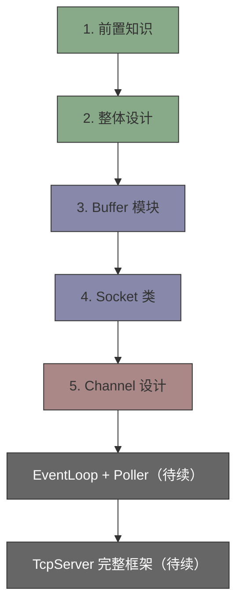
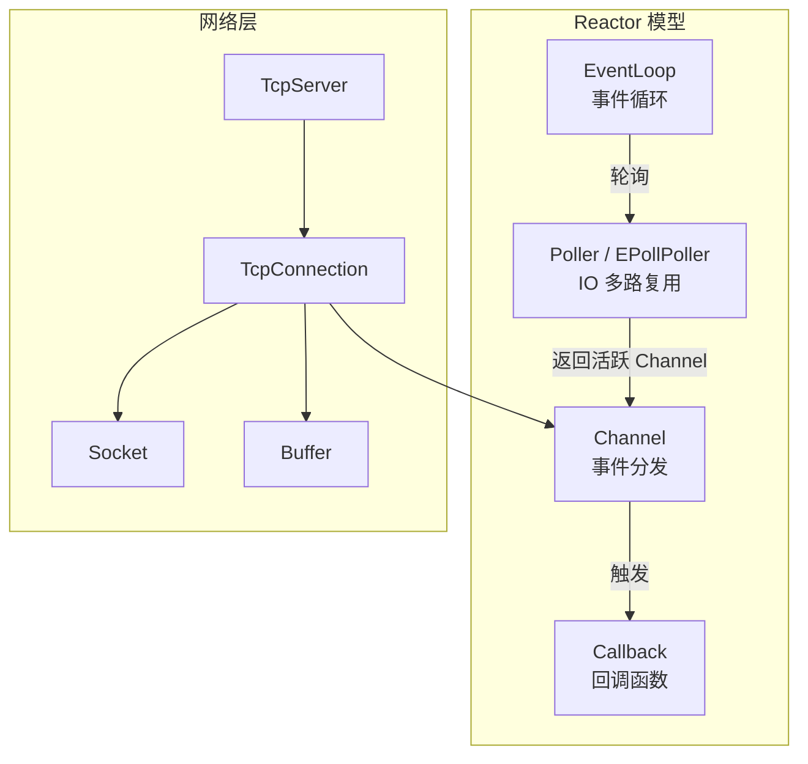

---
tags:
  - moc
  - muduo
  - 网络编程
aliases:
  - muduo库学习入口
  - muduo知识地图
---

# muduo 库学习入口

muduo 是陈硕设计的高性能 C++ 网络库，基于 Reactor 模型。这条主线是 Linux 网络编程知识的工程化落地，直接连接 [[从零开始接入AI-SDK/00-学习入口]] 中的网络层设计。

## 前置知识

在开始之前，确保你已经掌握：

- [[2.Linux/1.【Linux基础】构筑基础概念---进程的概念和状态 (1)]] — 进程和线程基础
- [[2.Linux/14.初步认识线程]] — 线程的概念
- [[2.Linux/16.线程的互斥-锁的概念引出]] — 互斥锁
- [[2.Linux/一文总结网络：]] — TCP/IP 基础

## 模块学习顺序

- [[muduo库/1. 了解前置知识：]] — Reactor 模型概述、muduo 的设计哲学
- [[muduo库/2. 开始muduo库的设计：]] — 整体架构搭建、CMake 工程结构
- [[muduo库/3. 设计buffer模块]] — 读写缓冲区的设计与实现
- [[muduo库/4. 准备socket类]] — Socket 封装、地址处理
- [[muduo库/5.   Channel的设计：]] — Channel 抽象、事件分发机制

## 核心架构总览

## 和其他主线的连接

- 系统基础：[[2.Linux/00-学习入口]]
- 项目应用：[[从零开始接入AI-SDK/00-学习入口]]
- 面试表达：[[7天面试备战计划/00-学习入口]]
- 语言基础：[[1.c++学习/00-学习入口]]
