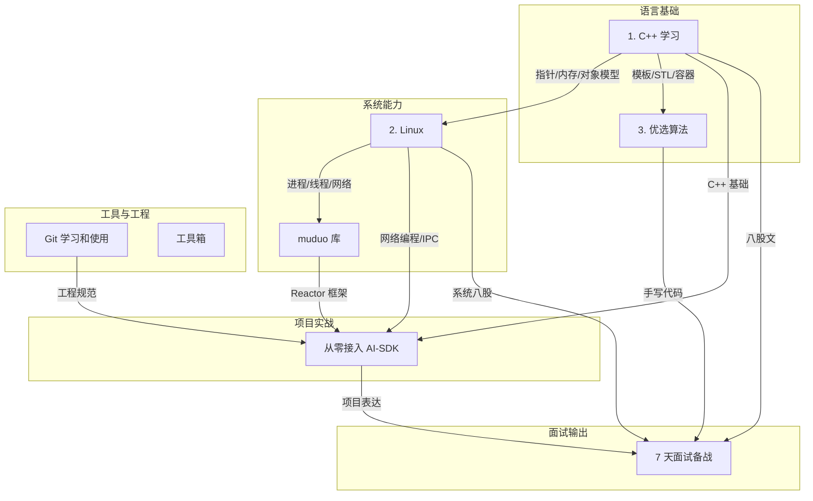
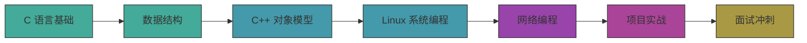

---
tags:
  - moc
  - 首页
  - wiki
aliases:
  - 首页
  - 知识体系总览
  - NingBottle Wiki
---

# C++ 后端工程师知识体系

这个仓库是一个 C++ 后端工程师的完整知识体系，从语言基础到系统能力、项目实战和面试准备，层层递进。

## 全局知识地图



## 主线入口

### 语言基础

- [[1.c++学习/00-学习入口]] — C 语言基础 → C 语言进阶 → C++ 对象模型 → 数据结构与 STL → 项目延伸，六层递进
- [[3.优选算法/00-学习入口]] — 双指针、树、排序算法，训练题感和复杂度意识

### 系统能力

- [[2.Linux/00-学习入口]] — 进程/线程 → 文件系统 → IPC/信号 → 网络，C++ 系统能力的放大器
- [[muduo库/00-学习入口]] — 基于 Reactor 模型的高性能网络库，从 Buffer 到 Channel 逐模块实现

### 项目实战

- [[从零开始接入AI-SDK/00-学习入口]] — 完整的 C++ AI-SDK 项目：Provider 抽象 → Manager 层 → ChatSDK 封装，含面试突击

### 工具与工程

- [[git的学习和使用/00-学习入口]] — 从安装配置到分支管理、远程协作、冲突解决

### 面试输出

- [[7天面试备战计划/00-学习入口]] — 前 4 天压八股，后 3 天压项目表达和模拟面经

## 推荐学习路径



## 辅助资源

- [[文档处理/OCR文字识别]]、[[文档处理/PDF编辑处理]]、[[文档处理/Word文档处理]]、[[文档处理/PowerPoint制作]]
- [[设计创作/架构图设计]]
- [[笔记管理/Obsidian笔记]]
- [[AI编码代理完全指南]]

## 仓库结构一览

```text
Obsidian-notes/
├── 1.c++学习/          ← 语言基础（34 篇）
├── 2.Linux/            ← 系统能力（17 篇）
├── 3.优选算法/          ← 算法训练（5 篇）
├── 从零开始接入AI-SDK/  ← 项目实战（11 篇 + 源码）
├── muduo库/            ← 框架实战（5 篇）
├── 7天面试备战计划/     ← 面试冲刺（10 篇）
├── git的学习和使用/     ← 工具指南（11 篇）
├── 文档处理/            ← 辅助工具
├── 设计创作/            ← 辅助工具
├── 笔记管理/            ← 辅助工具
├── Excalidraw/          ← 手绘图
└── attatchment/         ← 图片附件
```
