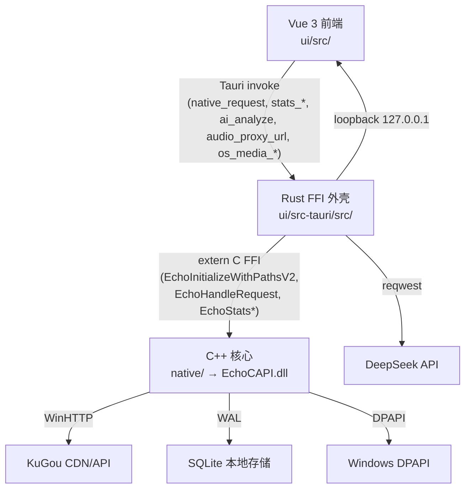
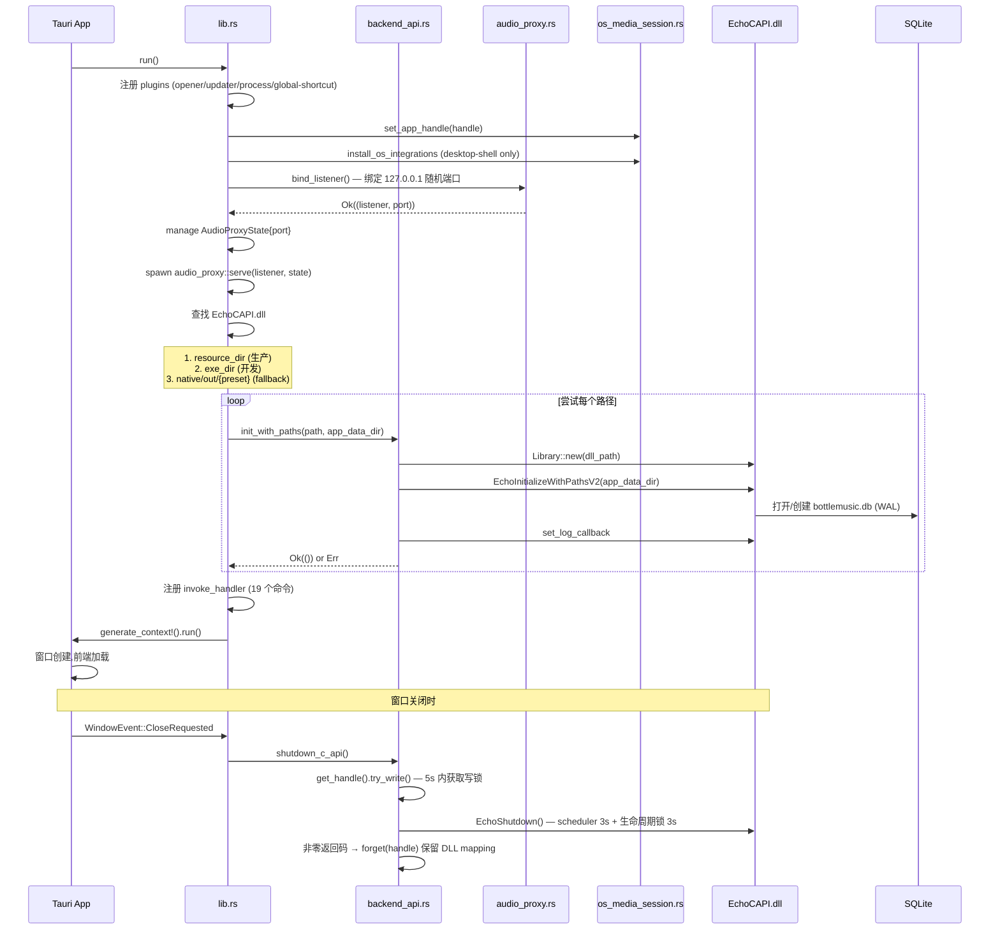
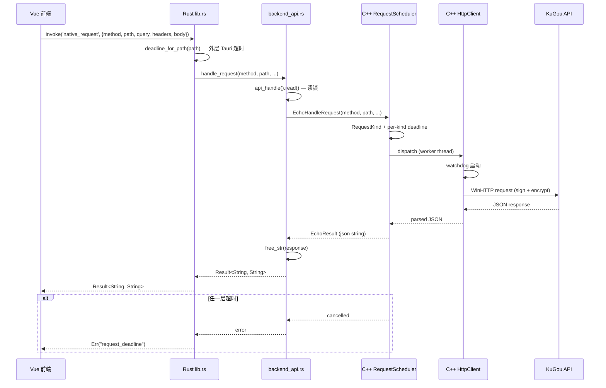
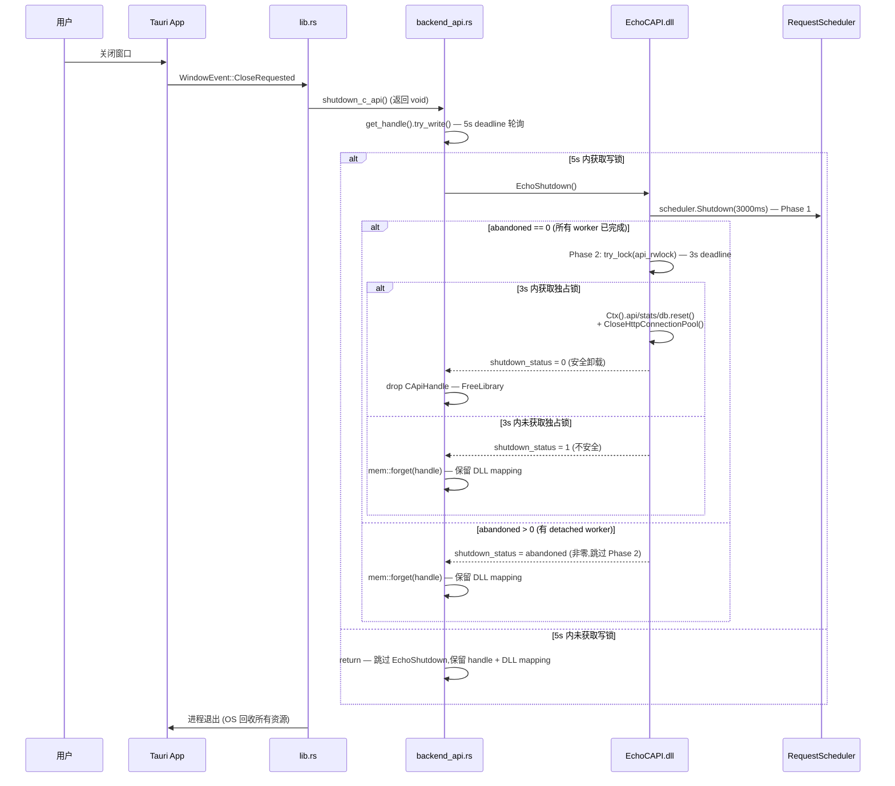

# 架构总览

> 基于 [evidence-report.md](./evidence-report.md) 的事实重建。
> 本文档只描述**当前实现**;未来提案见 [maintenance.md](./maintenance.md)。

## 三层架构

BottleMusic 采用三层架构,通过 Tauri IPC 和 C ABI 串联:



### 各层职责

| 层 | 路径 | 职责 | 不负责 |
|---|---|---|---|
| Vue 3 前端 | `ui/src/` | UI、播放控制、EQ graph、状态管理、CircuitBreaker | 直接 HTTP、直接 SQLite |
| Rust FFI | `ui/src-tauri/src/` | Tauri 命令、DLL 加载、audio_proxy loopback、DeepSeek 调用、OS Media Session | 业务逻辑(在 C++ 或前端) |
| C++ 核心 | `native/` → `EchoCAPI.dll` | KuGou API 路由、WinHTTP、加密签名、SQLite stats、RequestScheduler | UI、Tauri IPC |

### 旁路:server/ 子模块

`server/` 是 git submodule,指向 `MakcRe/KuGouMusicApi`(MIT,作者 Lines)。**不进入生产链路**(见 [evidence-report.md § 1.3](./evidence-report.md#13-server-是否进入生产链路已确认不进入))。

- 用途:KuGou API 路由的 Node.js 参考实现,C++ CompatApi 翻译时对照
- 运行时:无(生产不启动 Node.js 进程)
- 策略提案:见 [testing-and-release.md](./testing-and-release.md) 中的 `server-strategy-rfc.md` 链接

## FFI 边界

### C ABI 导出(`EchoCAPI.dll`)

由 `native/core/C_API.cpp` 实现,通过 `libloading` 在 `ui/src-tauri/src/backend_api.rs` 加载:

| 符号 | 用途 | 调用方 |
|---|---|---|
| `EchoInitializeWithPathsV2` | 初始化 C++ 后端,传入 app_data_dir | `backend_api::init_with_paths` |
| `EchoHandleRequest` | 主请求入口 | `backend_api::handle_request` |
| `EchoStatsRecordPlay` | 记录播放 | `stats::stats_record_play` |
| `EchoStatsGetSummary` / `Top` / `Timeline` / `Recent` / `Recommendations` | 查询统计 | `stats::stats_get_*` |
| `EchoShutdown` | 有界关闭(Rust 写锁 5s + C++ scheduler 3s + 生命周期锁 3s) | `backend_api::shutdown_c_api` |
| `EchoFreeString` | 释放 C++ 分配的字符串 | `backend_api::CApiHandle::free_str` |

### 全局状态(`C_API.cpp`)

```cpp
struct EchoContext {
  std::shared_ptr<echo::core::CompatApi> api;
  echo::async::RequestScheduler scheduler{4};  // 4-worker 线程池
  // stats 和 storage 由 Database/PlayStatsService 持有
};
static EchoContext& Ctx();  // Meyers singleton,内部 shared_mutex 保护
```

**注意**:旧 `CONTEXT.md` 描述的 `g_playback` 已不存在(MFS 播放栈移除后清理)。

### Rust 端 `CApiHandle`(`backend_api.rs`)

- 用 `RwLock<Option<CApiHandle>>` 保护
- 读锁:并发 C API 调用(允许多读者)
- 写锁:shutdown 时独占,等所有 in-flight 调用完成才 unload DLL
- `_lib: Library` 字段持有 DLL 句柄,`CApiHandle` drop 时自动 unload

## 启动流程



### 关键启动不变量

1. **audio_proxy 必须先于 DLL 加载**:audio_proxy 是独立的 Tokio task,不依赖 DLL;DLL 加载失败不影响 audio_proxy(但 EQ 会降级)
2. **DLL 路径查找顺序**:生产 `resource_dir` → 开发 `exe_dir` → fallback `native/out/{preset}`
3. **app_data_dir**:由 Tauri `path().app_data_dir()` 提供,DLL 用它定位 `bottlemusic.db`
4. **desktop-shell feature**:OS Media Session 集成仅在 `desktop-shell` feature 下启用(避免 `cargo test --lib` 时 tray-icon 崩溃)

## 请求流程



### 三层 deadline

| 层 | 位置 | 触发 |
|---|---|---|
| 外层 | `lib.rs::deadline_for_path` | Tauri `tokio::time::timeout`,按 path 分类(10s/8s/6s/...) |
| 中层 | `native/async/RequestScheduler.cpp` | per-kind deadline,取消 token 传播 |
| 内层 | `native/core/HttpClient.cpp` | watchdog,超时关闭 WinHTTP 连接句柄 |

外层超时返回 `Err("request_deadline")`,前端 CircuitBreaker 计入失败次数。

## 关闭流程



### 关闭不变量

- **有界**:Rust 写锁 5s + C++ scheduler 3s + C++ 生命周期锁 3s,总上限 11s;超时不阻塞,保留 handle 由 OS 回收
- **独占**:Rust 端 `RwLock` 写锁保证 shutdown 期间无新 `handle_request` 调用;C++ 端 `shared_mutex` 独占锁保证 teardown 期间无 in-flight worker
- **安全卸载**:仅当 `EchoShutdown` 返回 0(所有 worker 已完成且独占锁获取成功)时才 `FreeLibrary`;非零返回保留 DLL mapping(避免 use-after-unload)

## 架构原则

1. **单一请求入口**:所有 KuGou API 调用经 `native_request` Tauri 命令 → `EchoHandleRequest` C ABI,无旁路
2. **签名不入 JS**:KuGou 签名盐和密钥在 C++ 编译期常量,JS 堆中无签名
3. **audio_proxy 服务端注入**:CDN Authorization header 由 Rust 端注入,JS 看不到
4. **HTML5-only 播放**:Media Foundation 播放栈已移除(2026-07-17),生产仅 `Html5AudioBackend`
5. **无 Pinia**:模块级 `reactive`/`ref` 单例 + HMR 共享引用(`window.__bottlemusic_audio__`)
6. **Storage Actor 串行化**:所有 SQLite 访问经 actor mailbox 串行化,无 TLS
7. **EQ 拓扑安全**:`captureStream → MediaStreamSource → AudioWorkletNode → GainNode → destination`,绝不 `createMediaElementSource`

## 子项目状态(S1-S5)

| 子项目 | 状态 | 关键交付 |
|---|---|---|
| S1 Resilience | ✅ Complete | 三层 deadline、CircuitBreaker、有界 Shutdown/Restart |
| S2 Auto-update/CI | ✅ Complete | ci.yml、release.yml、sync-version.mjs |
| S3 Skin system | ✅ Complete | themeStore、Aurora + Newsprint、FOUC 预防 |
| S4 Playback+EQ | ✅ Complete | HTML5 backend + Web Audio EQ、PlaySessionTracker |
| S5 Statistics | ✅ Complete | PlayStatsService、StatsView、DeepSeek AI |

详见各专题文档。
