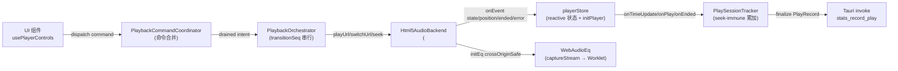
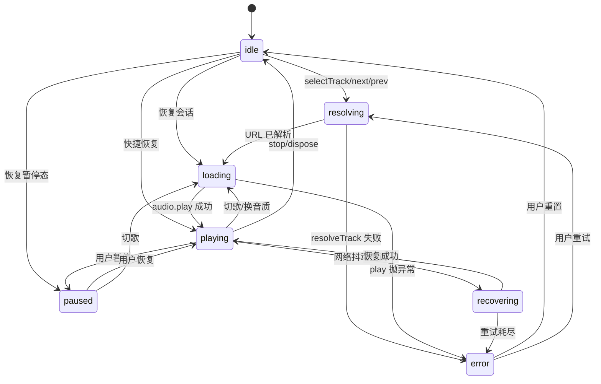

# 前端层(Vue 3)

> 基于 [evidence-report.md](./evidence-report.md) 与代码核验重建。
> 本文档只描述**当前实现**;已知风险与未来提案见文末两节及 [maintenance.md](./maintenance.md)。

## 概览

BottleMusic 前端是 Tauri 应用内的 Vue 3 单页应用,定位为"UI 渲染 + 播放控制 + 状态管理 + 弹性网关"。它不直接发起 HTTP 请求,也不直接读写 SQLite —— 所有外部访问经 Tauri `invoke` 进入 Rust 外壳(详见 [architecture.md § 请求流程](./architecture.md#请求流程))。

**技术栈**(`ui/package.json`):

| 依赖 | 版本 | 用途 |
|---|---|---|
| `vue` | ^3.5.13 | 视图层(`<script setup>`) |
| `vue-router` | ^4.6.4 | 路由 |
| `vite` | ^6.0.3 | 构建/HMR |
| `gsap` | ^3.15.0 | 页面过渡、皮肤 crossfade、首屏 launch intro |
| `vitest` | ^4.1.7 | 单元测试 |
| `@vue/test-utils` | ^2.4.10 | 组件挂载 |
| `jsdom` | ^29.1.1 | 测试环境 |
| `playwright` | ^1.61.1 | **仅设计 QA 截图脚本**,非 E2E(见 [evidence-report.md § 4](./evidence-report.md#4-playwright-是否实际使用)) |

包管理器为 **pnpm**(`pnpm-lock.yaml` + `pnpm-workspace.yaml` + CI `pnpm/action-setup@v4`)。

## 入口与路由

### 入口 `main.ts`

[main.ts](../../ui/src/main.ts) 负责:

1. 导入 self-hosted 字体(`@fontsource/*`,替换被墙的 Google Fonts CDN)
2. 导入样式层级:`tokens.css` → `progress.css` → `style.css` → `skins/aurora.css` + `skins/newsprint.css`
3. **FOUC 预防**:`useThemeStore().init()` 与 `useLyricFocusStore().init()` 在 `createApp(App)` **之前**同步调用,确保 `document.documentElement` 上的 `data-skin` / `data-mode` 在 Vue 挂载前已就位(详见 [皮肤系统](#皮肤系统))
4. `app.use(router)` + `app.mount("#app")`

### 根组件 `App.vue`

[App.vue](../../ui/src/App.vue) 通过 `themeStore.skinId` 动态选择外壳组件(`AuroraShell` 或 `NewsprintShell`),并通过具名插槽填充 `sidebar` / `topbar` / `playerbar` / `extras` / `banner` 五个槽位。

关键行为:

- **`onMounted`**:依次调用 `initPlayer()`(创建/复用 `<audio>`)、`initPlayerBackend()`(挂载 `Html5AudioBackend`)、`bindOsMediaBridge()`(仅在 Tauri 环境下)、`checkLoginStatus()`、`ping()` 轮询(每 5s 探测后端,失败时显示 `networkDegraded` 横幅)
- **`KeepAlive`**:`include` 列表由 `router.getRoutes().filter(r => r.meta.keepAlive)` 动态生成,当前只有 `home` 路由标记了 `keepAlive: true`
- **页面过渡**:Aurora 模式使用 overlap(无 `mode`),Newsprint 模式使用 `out-in` 串行;过渡钩子委托给 [motion.ts](../../ui/src/shared/motion/motion.ts) 的 `transitionEnter` / `transitionLeave`,并经 [navigationLifecycle.ts](../../ui/src/app/navigation/navigationLifecycle.ts) 注册到全局活动集合(供路由跳转时 `cancelPageTransition` 杀掉残留 GSAP tween)
- **`PageRecoveryBoundary`**:包裹 `RouterView`,捕获子组件渲染异常并以新 `retryKey` 重挂

### 路由

[router.ts](../../ui/src/app/navigation/router.ts) 默认导出 `createAppRouter(createWebHistory())`,导出工厂 `createAppRouter(history)` 供测试用 `createMemoryHistory()` 注入。`installNavigationLifecycle(router)` 安装 `beforeEach` 守卫:从 `lyric` 路由离开时调用 `cancelPageTransition()` 清理全屏过渡残留。

[routes.ts](../../ui/src/app/navigation/routes.ts) 定义 10 条路由记录(导出为 `routeRecords`,命名常量为 `routeNames`):

| 路径 | name | 视图 | 特殊 |
|---|---|---|---|
| `/` | `home` | `HomeView` | `meta.keepAlive: true` |
| `/stats` | `stats` | `StatsView` | |
| `/history` | `history` | `HistoryView` | |
| `/equalizer` | `equalizer` | `EqualizerView` | |
| `/settings` | `settings` | `SettingsView` | |
| `/search` | `search` | `SearchView` | `props: { query: route.query.q }` |
| `/playlist/:id` | `playlist` | `PlaylistView` | `props: { playlistId, playlistName }` |
| `/lyric` | `lyric` | `LyricView` | |
| `/login` | `login` | `LoginView` | |
| `/visualizer` | `visualizer` | `VisualizerView` | |

## 状态管理

**当前实现:不使用 Pinia。** 全部状态以模块级 `reactive` / `ref` 单例形式住在 [ui/src/playback/](../../ui/src/playback/) 与 `features/*/` 各文件顶层,通过 ES 模块单例语义共享。设计理由与未来迁移提案见 [maintenance.md](./maintenance.md) 的 "Pinia 化迁移提案"。

关键 store(每个文件导出一个单例):

| 单例 | 文件 | 职责 |
|---|---|---|
| `playerStore` | [playerStore.ts](../../ui/src/playback/playerStore.ts) | `reactive<PlayerState>`,持有 `currentTrack` / `queue` / `currentTime` / `playbackPhase` / `eqBands` 等;`initPlayer()` / `initPlayerBackend()` 入口 |
| `playbackOrchestrator` | [playbackOrchestrator.ts](../../ui/src/playback/runtime/playbackOrchestrator.ts) | `PlaybackOrchestrator` 类实例,编排 `resolveTrack → playUrl → initEq → recordStats`,串行化 `transitionSeq` 防止竞态 |
| `playSessionTracker`(`PlaySessionTracker`) | [playSessionTracker.ts](../../ui/src/playback/playSessionTracker.ts) | 统计会话累加器,seek-immune(`SEEK_THRESHOLD=2s`),达 `MIN_RECORD_LISTENED_SECONDS=60s` 才 finalize,经 `stats_record_play` 上报 |
| `playbackCommandCoordinator`(`PlaybackCommandCoordinator`) | [playbackCommandCoordinator.ts](../../ui/src/playback/commands/playbackCommandCoordinator.ts) | 命令合并层:`next/prev` 相对合并、`selectTrack/seek` latest-wins、`clearQueue` 屏障、`removeTrack` 严格 FIFO、`ended` 每 epoch 一次 |
| `themeStore`(`useThemeStore()`) | [themeStore.ts](../../ui/src/app/appearance/themeStore.ts) | 转发 `appearanceStore` 的 `skinId` / `mode` / `setSkin` / `setMode` / `init` |
| `appearanceStore`(`useAppearanceStore()`) | [appearanceStore.ts](../../ui/src/app/appearance/appearanceStore.ts) | `skin` / `mode` / `accent` / `compactList` / `lyricAlign` 五维外观状态;`applyToDom()` 写 `data-skin` / `data-mode` 等 DOM 属性 |
| `favoriteStore` | [favoriteStore.ts](../../ui/src/features/library/favoriteStore.ts) | `reactive` 播放列表发现 + 喜欢列表,本地 outbox + 匿名收藏迁移 |
| `homeFeedStore` | [homeFeedStore.ts](../../ui/src/features/home/homeFeedStore.ts) | `reactive` 三段首页 feed(`daily` / `playlists` / `albums`),generation 守卫防止过期请求回写 |
| `fmSession` | [fmSession.ts](../../ui/src/playback/fm/fmSession.ts) | 私人 FM 推荐 append,按 `FileHash` 去重,`generation` 标记会话,被 supersede 时丢弃 in-flight 结果 |
| `playHistory`(`uploadPlayHistory`) | [playHistory.ts](../../ui/src/playback/data/playHistoryGateway.ts) | 静默上传播放历史到 KuGou(`/playhistory/upload`),失败仅 `console.warn` |
| `recentPlayedStore` | [recentPlayedStore.ts](../../ui/src/playback/data/recentPlayedStore.ts) | `ref<RecentPlayedEntry[]>`,本地 `recent_played` 持久化,上限 100 条 |
| `userStore` | [userStore.ts](../../ui/src/features/account/userStore.ts) | `reactive<UserState>`,登录态 / VIP 等级 / 头像;`checkLoginStatus()` 拉取 |
| `playbackDiagnostics` | [playbackDiagnostics.ts](../../ui/src/playback/playbackDiagnostics.ts) | 诊断事件总线,记录 `media_event` / `proxy_prep`,供 SettingsView 调试面板展示 |
| `lyricFocusStore` | [lyricFocusStore.ts](../../ui/src/features/lyrics/lyricFocusStore.ts) | 歌词聚焦状态(首屏 `init()` 同步读 localStorage) |
| `skippedVersion`(`useSkippedVersion`) | [skippedVersion.ts](../../ui/src/app/update/skippedVersion.ts) | 自动更新"跳过此版本"标记,响应式 ref |

> **注意**:任务规格提到的 `settingsStore` 实际不存在;设置项散落在 `appearanceStore` / `skippedVersion` / `playbackDiagnostics` 等模块中,由 `SettingsView` 直接组合调用。同样,`statsApi.ts` / `aiAnalysisApi.ts` 也不存在 —— 统计与 AI 调用直接通过 `invoke('stats_*')` / `invoke('ai_analyze')` 写在 [StatsView.vue](../../ui/src/views/StatsView.vue) 内,无独立 API 封装层。

## 播放控制

播放栈由四个模块协作,职责严格分层:

### 关键不变量

- **事件单一所有权**:`Html5AudioBackend.onEvent` 是 `play` / `pause` / `timeupdate` / `ended` / `error` 的**唯一来源**([playerStore.ts](../../ui/src/playback/playerStore.ts) `initPlayer` 注释明确说明);`playerStore` 只额外监听 `durationchange` / `loadedmetadata` / `play`(后者仅为 `resumeAudioContext()` 应对 autoplay policy)
- **Phase 权威**:`playerStore.playbackPhase` 是状态机的唯一真源,`isPlaying` / `isLoading` 由 [playbackPhase.ts](../../ui/src/playback/playbackPhase.ts) `flagsFromPhase()` 单向投影,不允许直接赋值
- **SourceLease**:`Html5AudioBackend` 每次 `playUrl` / `switchUrl` 发放递增 `sourceLeaseId`,异步 `audio.play()` 返回后用 `ownsPlayback(lease, attachSeq)` 验证仍持有租约,否则放弃后续 `initEq`
- **TransitionSeq**:`PlaybackOrchestrator` 的 `transitionSeq` 在每次切歌递增;`Html5AudioBackend` 在 `play()` 前后用 `isAttachTransitionCurrent(seq)` 防止上一曲的 EQ attach 回写本曲
- **Ended 路由**:`onEvent('ended')` 不直接切歌,而是 `coordinator.dispatch({ type: 'ended' })`,由 `PlaybackCommandCoordinator` 决定是否 barrier(每 epoch 一次)

### 播放状态机

[playbackPhase.ts](../../ui/src/playback/playbackPhase.ts) 定义 7 个 phase 与合法转移边。`transitionPhase()` 对非法边抛 `illegal_playback_transition`,`canTransition()` 用于软忽略(竞态时只记日志不抛)。

> **说明**:任务规格提到的 `Ended` 状态实际不存在 —— `ended` 是事件而非 phase;`onEvent('ended')` 触发后,phase 通常停在 `playing` 或转 `loading`(由 coordinator 决定下一曲动作)。详见 [maintenance.md](./maintenance.md) 的 "onEnded phase guard 延期"。

## API 层

### 通用请求 `backend.ts`

[backend.ts](../../ui/src/playback/runtime/playerBackend.ts) 是前端 → C++ 后端的唯一入口。设计:

- **不重试**:重试由 C++ `HttpClient` 负责(详见 [architecture.md § 三层 deadline](./architecture.md#三层-deadline));前端只做单次调用
- **单次超时**:`FRONTEND_TIMEOUT_MS = 14_000`,通过 `withTimeout` 包装 `invoke('native_request', ...)`
- **分桶熔断**:按 path 前缀分 4 桶(`playback` / `lyric` / `search` / `generic`),每桶独立 `CircuitBreaker`;`pickBucket(path)` 用最长前缀匹配(`/song/url` / `/personal/fm` → `playback`,`/search/lyric` / `/lyric` → `lyric`,`/search` → `search`,其余 `generic`)
- **导出**:`apiGet` / `apiPost` / `ping` / `backendHealth` / `isCircuitOpen`

调用链:`apiGet → apiGetNoRetry → cb.isClosed 检查 → apiGetOnce → ipcRequest → withTimeout(invoke('native_request'))`。

### 熔断器 `circuitBreaker.ts`

[circuitBreaker.ts](../../ui/src/platform/tauri/circuitBreaker.ts) 是极简实现:`failureThreshold=5` / `openDurationMs=30_000`。达到阈值后 `openedAt = Date.now()`,`isClosed()` 在 30s 后自动半开并重置计数。无 half-open 探针(下一个请求成功即 `recordSuccess` 全量重置)。

### 音频代理 `audioProxy.ts`

[audioProxy.ts](../../ui/src/platform/tauri/audioProxy.ts) 的 `prepareAudioSourceUrl(url)` 调 `invoke('audio_proxy_url', { url })` 拿到 `127.0.0.1:<port>/...` 的本地代理 URL(`crossOriginSafe: true`),失败则回退原始 URL(`crossOriginSafe: false`)。`crossOriginSafe` 决定 `WebAudioEq` 是否走 `captureStream` 分支(详见 [playback-runtime.md](./playback-runtime.md))。

### 统计与 AI 调用(无独立 API 文件)

`stats_*` 与 `ai_analyze` 命令**没有封装成独立 `statsApi.ts` / `aiAnalysisApi.ts` 模块**,而是直接在视图内 `invoke`:

- [StatsView.vue](../../ui/src/views/StatsView.vue):`invoke('stats_get_summary')` / `invoke('stats_get_top')` / `invoke('stats_get_timeline')` / `invoke('ai_analyze', { ... })`
- [playerStore.ts](../../ui/src/playback/playerStore.ts):`emitPlayRecord` 内 `invoke('stats_record_play', { json })`,fire-and-forget(失败静默)

DeepSeek API Key **仅在内存 ref**(`StatsView.vue` `aiApiKey = ref('')`),不写 localStorage;模块加载时 `localStorage.removeItem('deepseek_api_key')` 清理升级用户旧数据。详见 [evidence-report.md § 5](./evidence-report.md#5-deepseek-key-真实存储生命周期) 与 [security-and-privacy.md](./security-and-privacy.md)。

## 视图层级

[ui/src/views/](../../ui/src/views/) 下共 **10 个根视图**(对应 10 条路由)+ 2 个子目录:

| 视图 | 路径 | 职责 |
|---|---|---|
| `HomeView.vue` | [views/HomeView.vue](../../ui/src/views/HomeView.vue) | 首页,按 skin 切换 `AuroraHome` / `NewsprintHome`,加载三段 feed |
| `PlaylistView.vue` | [views/PlaylistView.vue](../../ui/src/views/PlaylistView.vue) | 歌单详情,`playlistId` / `playlistName` 来自路由 props |
| `SearchView.vue` | [views/SearchView.vue](../../ui/src/views/SearchView.vue) | 搜索结果,`query` 来自 `route.query.q` |
| `LyricView.vue` | [views/LyricView.vue](../../ui/src/views/LyricView.vue) | 歌词全屏,按 skin 切换 `AuroraLyricStage` / `NewsprintLyricStage` |
| `StatsView.vue` | [views/StatsView.vue](../../ui/src/views/StatsView.vue) | 统计 + DeepSeek AI 分析 |
| `HistoryView.vue` | [views/HistoryView.vue](../../ui/src/views/HistoryView.vue) | 播放历史(读 `recentPlayedStore`) |
| `LoginView.vue` | [views/LoginView.vue](../../ui/src/views/LoginView.vue) | 登录(QR 码) |
| `SettingsView.vue` | [views/SettingsView.vue](../../ui/src/views/SettingsView.vue) | 设置(外观 / 设备 / VIP / 更新 / 存储 / 诊断 6 段) |
| `EqualizerView.vue` | [views/EqualizerView.vue](../../ui/src/views/EqualizerView.vue) | 10 段 EQ 调音台 |
| `VisualizerView.vue` | [views/VisualizerView.vue](../../ui/src/views/VisualizerView.vue) | 频谱可视化 |

子目录:

- [views/home/](../../ui/src/views/home/):`AuroraHome.vue` / `NewsprintHome.vue` / `AuroraAtmosphere.vue` + `homeViewModel.ts`(共享视图模型,合同测试见 `homeViewModel.contract.test.ts`)
- [views/lyric/](../../ui/src/views/lyric/):`AuroraLyricStage.vue` / `NewsprintLyricStage.vue` / `AuroraPlaylistShelf.vue` / `CoverWebGLParticles.vue` / `LyricFollowFooter.vue` + `useLyricStage.ts` / `useAutoHideControls.ts`

## 组件层级

[ui/src/components/](../../ui/src/components/) 下的组织:

| 子目录/文件 | 内容 |
|---|---|
| [components/player/](../../ui/src/components/player/) | `PlayerBar.vue`(根,按 skin 分发) / `AuroraPlayerBar.vue` / `NewsprintPlayerBar.vue` / `PlayerProgress.vue` / `AuroraDockParticles.vue` / `usePlayerControls.ts`(组合式封装 playerStore + coordinator) |
| [components/primitives/](../../ui/src/components/primitives/) | `SkinButton.vue` / `SkinEmptyState.vue` / `SkinListRow.vue` / `SkinPageHeader.vue` —— skin 无关的原子组件 |
| [components/shell/](../../ui/src/components/shell/) | `AuroraShell.vue` / `NewsprintShell.vue`(grid 布局外壳) / `WindowControls.vue` / `FullscreenWindowControls.vue` / `PageRecoveryBoundary.vue`(渲染异常兜底) |
| [components/Sidebar.vue](../../ui/src/components/Sidebar.vue) | 左侧导航 + 用户歌单列表 + 自动更新 badge |
| [components/Topbar.vue](../../ui/src/components/Topbar.vue) | 顶部搜索栏 + 前进/后退 + 窗口控制 |
| [components/QueuePanel.vue](../../ui/src/components/QueuePanel.vue) | 播放队列侧栏(过滤、封面、拖拽) |
| [components/EqualizerPanel.vue](../../ui/src/components/EqualizerPanel.vue) | EQ 面板(被 EqualizerView 复用) |
| [components/AddToPlaylistModal.vue](../../ui/src/components/AddToPlaylistModal.vue) | "添加到歌单"模态框 |
| [components/PlayerBar.vue](../../ui/src/components/PlayerBar.vue) | 底部播放条根组件 |

## 皮肤系统

**双皮肤**:`aurora`(极光,默认) + `newsprint`(报刊)。每个皮肤有独立外壳组件(`AuroraShell` / `NewsprintShell`)、独立 PlayerBar、独立 Home/Lyric Stage 视图。

### 切换机制

[appearanceStore.ts](../../ui/src/app/appearance/appearanceStore.ts) `applyToDom()` 在 `document.documentElement` 写入:

- `data-skin="aurora" | "newsprint"`
- `data-mode="light" | "dark"`
- `data-compact-list` / `data-lyric-align`
- `classList.toggle('compact' | 'lyric-left')`
- `--accent` 自定义色(无则移除,回落到 tokens.css 的 `TOKEN_ACCENTS`)

`tokens.css` 用 `[data-skin='aurora'][data-mode='light']` 等 4 个组合选择器覆盖语义 token(`--app-bg` / `--surface-1` / `--accent` / `--progress-*` 等)。皮肤 CSS(`aurora.css` / `newsprint.css`)只写布局和皮肤特有样式,不重定义 token。

### FOUC 预防

[main.ts](../../ui/src/main.ts) 在 `createApp(App)` **之前**同步调用 `useThemeStore().init()`(转调 `appearanceStore.init()`),后者同步读 `localStorage` 并 `applyToDom()`。这样 Vue 挂载时 `:root` 已带正确 `data-skin` / `data-mode`,CSS 立即命中正确分支,无白屏闪烁。

`SettingsView` 切换皮肤时通过 [motion.ts](../../ui/src/shared/motion/motion.ts) `crossfadeTheme(() => appearanceStore.setSkin(id))` 做交叉淡入,避免硬切。

## 样式系统

| 文件 | 作用 |
|---|---|
| [styles/tokens.css](../../ui/src/styles/tokens.css) | 4 个 `skin × mode` 组合的语义 token 定义;`:root` 兜底为 Aurora light |
| [styles/skins/aurora.css](../../ui/src/styles/skins/aurora.css) | Aurora 外壳 grid 布局 + 沉浸式三区桌面 shell |
| [styles/skins/newsprint.css](../../ui/src/styles/skins/newsprint.css) | Newsprint 外壳布局 + 报刊排版风 |
| [styles/progress.css](../../ui/src/styles/progress.css) | 进度条通用样式(`--progress-track` / `--progress-fill` / `--progress-thumb-*`) |
| [style.css](../../ui/src/style.css) | 全局基础样式 |

字体策略([main.ts](../../ui/src/main.ts) 顶部):全部 self-hosted(`@fontsource/inter` / `eb-garamond` / `libre-caslon-display` / `zcool-xiaowei` / `noto-serif-sc`),替换被墙的 Google Fonts CDN;`noto-serif-sc` 限制 400/700 两个权重以控制 CJK payload 体积。

## HMR 共享

Vite HMR 重新求值 [playerStore.ts](../../ui/src/playback/playerStore.ts) 模块时会生成全新 `playerStore`(其 `audio` 为 `null`),而上一模块创建的 `<audio>` 元素可能仍在播放。**僵尸音频防护**机制:

- `window.__bottlemusic_audio__`:全局引用,`initPlayer()` 优先复用此元素而非 `new Audio()`
- `window.__bottlemusic_player_cleanup__`:由当前活跃模块注册的清理函数;HMR 时新模块调用它清理旧监听 / Worklet,但**不**调用 `dispose()`(避免清空队列覆盖 localStorage)
- `window.__bottlemusic_pagehide__`:单_owner `pagehide` 处理器,只有持有 `<audio>` 的活跃模块才能注册(防止孤儿模块 flush 空 queue 覆盖刚保存的会话)
- `detachCoordinatorForHmr()`:`coordinator.detach()` 取消 in-flight intent,但不在 backend 上 pause / clear src

关键不变量:**HMR 重建模块时不重建 `<audio>` 元素**,只重建模块状态与监听。

## 测试

| 项 | 值 | 证据 |
|---|---|---|
| 测试文件数 | **78** | `Get-ChildItem -Recurse *.test.ts \| Measure-Object` = 78,与 [evidence-report.md § 3.2](./evidence-report.md#32-真实用例统计2026-07-23-基线) 一致 |
| 框架 | `vitest@^4.1.7` | [package.json](../../ui/package.json) |
| 环境 | `jsdom@^29.1.1` | [vitest.config.ts](../../ui/vitest.config.ts) `environment: 'jsdom'` |
| 工具 | `@vue/test-utils@^2.4.10` | [package.json](../../ui/package.json) |
| 配置 | `globals: true`,`setupFiles: ['./src/test/setup.ts']` | [vitest.config.ts](../../ui/vitest.config.ts) |
| 命令 | `pnpm test` (= `vitest run`) / `pnpm test:watch` | [package.json](../../ui/package.json) `scripts` |

测试文件分布(`__tests__/` 目录)覆盖 `api/` / `components/` / `components/player/` / `components/primitives/` / `components/shell/` / `navigation/` / `test/` / `views/` / `views/home/` / `views/lyric/`。`test/setup.ts` 提供全局 mock(如 `window.matchMedia`、`AudioContext` 桩)。

Playwright 在 `package.json` devDependencies 中,但**仅用于设计 QA 截图脚本**(`scripts/capture-aurora-qa.mjs` 等),**非 E2E 测试**,CI 不执行。详见 [evidence-report.md § 4](./evidence-report.md#4-playwright-是否实际使用)。

## 已知风险

> 完整列表与处理进度见 [maintenance.md](./maintenance.md) 的 "已知问题"。

1. **EQ 重初始化顺序延期**:`Html5AudioBackend.playUrl` 在 `audio.play()` 成功后才 `initEq`,但 `captureStream` 必须在元素有源后立即取,否则拿到空流。当前用 `sourceLease` + `transitionSeq` 双重守卫规避,但跨 epoch 的 race 仍未根因修复。详见 [maintenance.md](./maintenance.md) "EQ 重初始化顺序延期"。

2. **onEnded phase guard 延期**:`onEvent('ended')` 当前不显式转 phase(如 `idle` 或 `ended`),直接 `coordinator.dispatch({ type: 'ended' })`。若 coordinator 决定不切歌(如 queue 空且非 loop),phase 会停在 `playing`,UI 仍显示播放图标直到下次事件。详见 [maintenance.md](./maintenance.md) "onEnded phase guard 延期"。

3. **CircuitBreaker 半开探测缺失**:[circuitBreaker.ts](../../ui/src/platform/tauri/circuitBreaker.ts) `isClosed()` 在 30s 后直接全量重置 `failures=0`,无 half-open 探针;若后端持续故障,会立即放行全量请求再立即熔断,造成抖动。

4. **`apiGetNoRetry` 双重否定易误读**:[backend.ts](../../ui/src/playback/runtime/playerBackend.ts) `apiGetNoRetry` 中 `if (!cb.isClosed()) throw new Error('circuit_open')` —— 语义正确(`isClosed()` 返回 false 即熔断打开,取反后抛错),但 `!isClosed()` 双重否定易被误读为 bug,建议未来引入 `isOpen()` 别名提升可读性。需在 [maintenance.md](./maintenance.md) 记录。

## 未来提案

> 详细 RFC 见 [maintenance.md](./maintenance.md)。

1. **Pinia 化迁移**:当前模块级 `reactive` / `ref` 单例在 HMR、SSR(若未来引入)、测试隔离上均有成本。提案:将 `playerStore` / `appearanceStore` / `favoriteStore` 等逐步迁到 Pinia store,保留 `window.__bottlemusic_audio__` 全局引用作播放层 HMR 桥。详见 [maintenance.md](./maintenance.md) "Pinia 化迁移提案"。

2. **statsApi / aiAnalysisApi 抽离**:将 [StatsView.vue](../../ui/src/views/StatsView.vue) 内散落的 `invoke('stats_*')` / `invoke('ai_analyze')` 抽成独立 API 模块,便于 mock 与复用。

3. **CircuitBreaker half-open 探针**:引入经典三态(closed / open / half-open),open 到期后放行单个探针请求,成功才全量恢复。

4. **`PlaybackPhase` 增加 `ended` 子态**(对应 onEnded phase guard):让 queue 空且非 loop 时的 UI 状态显式回落到 `idle`,而非停在 `playing`。

---

> 修订记录:2026-07-23 首次生成(基于 `22ba7951` 基线,由 `codex/wiki-audit` worktree 产出)
