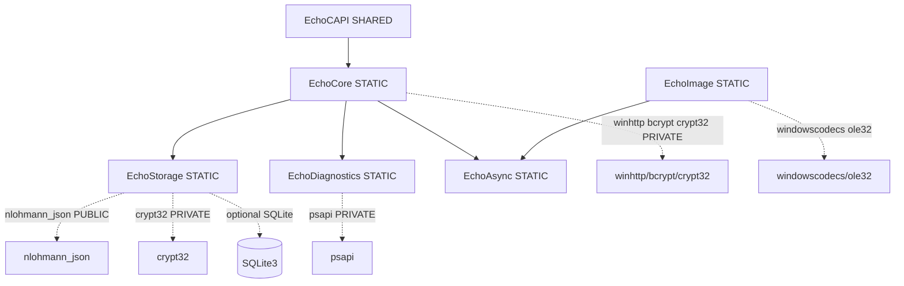
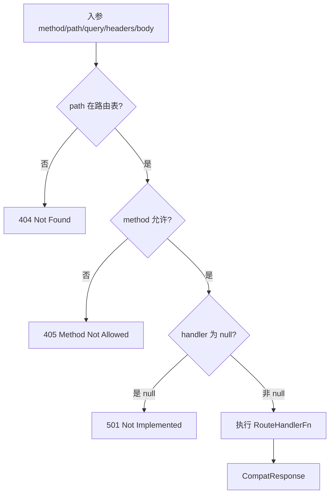
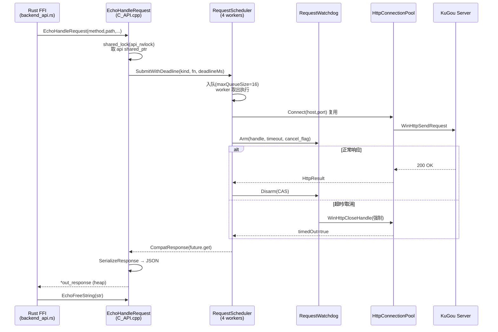
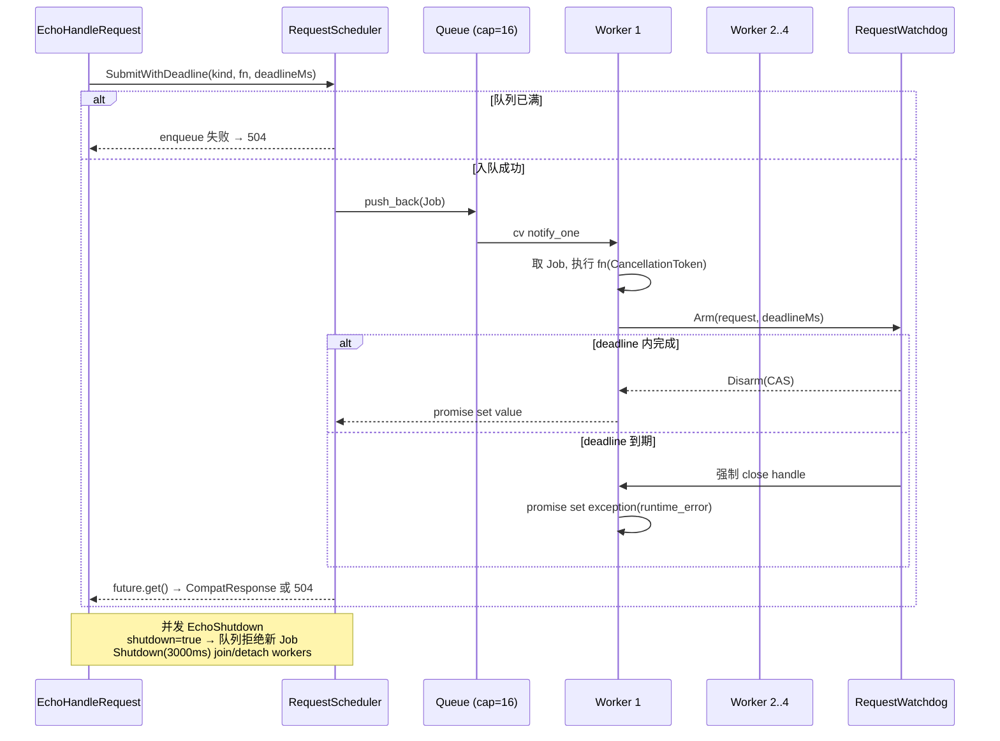

# C++ 核心层(Code Wiki)

> 适用范围:BottleMusic 项目 `native/` 目录下的 C++ 核心层。
> 基线 commit:`22ba7951`(main,codex/wiki-audit worktree)。
> 事实来源:`docs/wiki/evidence-report.md`、`native/CMakeLists.txt`、`native/core/C_API.cpp`、`native/core/CompatApi.cpp`、`native/core/Crypto.cpp`、`native/core/HttpClient.cpp`、`native/async/RequestScheduler.cpp`、`native/include/echo/core/KuGouProfile.h`、`native/include/echo/core/RequestDeadlines.h`、`native/include/echo/async/RequestScheduler.h`。
> 编写规范:所有结论附**文件名 + 类/函数名**作为锚点,不绑定行号;当前实现、已知风险、未来提案明确分离。

## 1. 概览

C++ 核心层是 BottleMusic 三层架构的最底层,负责**所有 KuGou API 路由、网络 I/O、加密签名、SQLite 持久化与播放统计**。它通过 `EchoCAPI.dll`(C ABI)被 Rust FFI 外壳(`ui/src-tauri/src/backend_api.rs`)动态加载,不直接被前端 Vue 调用。

**核心定位**:

- **KuGou API 路由**:`CompatApi` 将类 NeteaseCloudMusicMusicApi 风格的 path(如 `/song/url`、`/search`、`/playlist/detail`)分发到对应 handler。
- **WinHTTP 网络**:`HttpClient` 基于 WinHTTP 同步 API + 连接池 + watchdog,所有出站请求的唯一通道。
- **加密签名**:`Crypto.cpp` 实现 MD5 / AES-CBC / RSA-1024-PKCS1-v1_5,以及 4 套 KuGou 签名盐。
- **SQLite 统计**:`EchoStorage` 在 WAL 模式下以 Actor 模式封装 SQLite,服务设备注册、会话、设置、播放统计。

**技术栈基线**(详见 [CMakeLists.txt](../../native/CMakeLists.txt)):

| 项 | 值 |
|---|---|
| 语言标准 | C++20(`CMAKE_CXX_STANDARD 20`,`CXX_EXTENSIONS OFF`) |
| 编译器 | MSVC(Windows-only,依赖 WinHTTP / WIC / BCrypt / Crypt32) |
| 源码编码 | `/utf-8`(`add_compile_options(/utf-8)`) |
| 全局宏 | `UNICODE _UNICODE WIN32_LEAN_AND_MEAN NOMINMAX` |
| CMake 最低版本 | 3.24 |
| 项目版本 | 1.0.0 |

**与 Tauri/Rust 层的边界**:Rust 通过 `libloading` 加载 `EchoCAPI.dll`,显式 `get` 符号 `EchoInitializeWithPathsV2`、`EchoHandleRequest`、`EchoStats*`、`EchoShutdown` 等(详见 [backend_api.rs](../../ui/src-tauri/src/backend_api.rs))。**注意**:旧 Wiki 称主请求入口为 `echo_request` / `Echo_request` —— 不正确,实际 C ABI 符号是 `EchoHandleRequest`。

## 2. CMake 构建系统

构建脚本位于 [CMakeLists.txt](../../native/CMakeLists.txt),定义 **6 个库目标**,依赖关系图如下:



### 2.1 关键构建约束

- **SQLite Release 强制要求**:`find_package(unofficial-sqlite3 CONFIG QUIET)` 与 `find_package(SQLite3 QUIET)` 双路探测。当 `CMAKE_BUILD_TYPE STREQUAL "Release"` 或多配置树包含 `Release` 时,**缺失 SQLite 直接 `FATAL_ERROR`**,不允许静默回退到 JSON 文件 fallback。仅 Debug 本地构建允许 WARNING + fallback。
- **vcpkg 集成**:默认 vcpkg 安装目录 `${CMAKE_CURRENT_SOURCE_DIR}/vcpkg_installed/x64-windows`。若存在则 `list(PREPEND CMAKE_PREFIX_PATH)`,使后续 `find_package` 优先命中 vcpkg 提供的库。
- **测试强制 `/UNDEBUG`**:`ECHO_NATIVE_TESTS` 列表中的所有测试可执行,在 MSVC 下 `target_compile_options(... PRIVATE /UNDEBUG)`,在其它平台用 `-UNDEBUG`。理由:测试使用标准 `assert` 宏作为失败信号,Release preset 定义 `NDEBUG` 会展开 `assert` 为空,导致 CTest 误报通过(false green)。
- **测试 PATH 修复**:`set_tests_properties(... PROPERTIES ENVIRONMENT_MODIFICATION "PATH=path_list_prepend:${ECHO_NATIVE_VCPKG_INSTALLED_DIR}/bin")`,确保测试进程能加载 vcpkg 提供的动态库,避免 `0xc0000135` 启动失败。
- **C_API.cpp 单文件归属**:`C_API.cpp` 仅存在于 `EchoCAPI`(L140 `add_library(EchoCAPI SHARED core/C_API.cpp)`),不在 `EchoCore` 中重复编译。注释明确这是修复 P2-L "dual-compiled in EchoCore + EchoCAPI" 问题后的结果。

## 3. 库目标详解

### 3.1 EchoStorage(STATIC)

**职责**:SQLite 持久化层,WAL 模式 + Actor 单线程访问模型。

**源文件**:

- [storage/AppPaths.cpp](../../native/storage/AppPaths.cpp) —— 应用数据目录与默认数据库路径解析(`GetDefaultDatabasePath`)。
- [storage/ApiCache.cpp](../../native/storage/ApiCache.cpp) —— API 响应缓存。
- [storage/Database.cpp](../../native/storage/Database.cpp) —— `Database` 类,SQLite 连接封装,`Open` / `Initialize` / WAL 配置。
- [storage/DeviceRepository.cpp](../../native/storage/DeviceRepository.cpp) —— 设备指纹存储(`DeviceRepository`)。
- [storage/SessionRepository.cpp](../../native/storage/SessionRepository.cpp) —— 会话 token / userid 存储(`SessionRepository`)。
- [storage/SettingsRepository.cpp](../../native/storage/SettingsRepository.cpp) —— 应用设置 KV(`SettingsRepository`)。

**链接**:`PUBLIC nlohmann_json::nlohmann_json`、`PRIVATE crypt32`、条件 `PUBLIC unofficial::sqlite3::sqlite3` 或 `SQLite::SQLite3`(并定义 `ECHO_NATIVE_HAS_SQLITE=1`)。

**头文件**:`include/echo/storage/{Database,AppPaths,ApiCache,DeviceRepository,SessionRepository,SettingsRepository}.h`。

### 3.2 EchoDiagnostics(STATIC)

**职责**:诊断与日志基础设施,所有层共用。

**源文件**:

- [diagnostics/EchoDiagnostics.cpp](../../native/diagnostics/EchoDiagnostics.cpp) —— 全局日志回调注册(`SetLogCallback`),被 `EchoSetLogCallback` 暴露到 C API。
- [diagnostics/MemorySnapshot.cpp](../../native/diagnostics/MemorySnapshot.cpp) —— 进程内存快照,服务 `/diagnostics/memory` 路由。
- [diagnostics/ScopedTimer.cpp](../../native/diagnostics/ScopedTimer.cpp) —— RAII 计时器(`ScopedTimer` / `Stopwatch`),`RequestScheduler::Job` 用 `Stopwatch` 测量队列滞留时间。
- [diagnostics/Redaction.cpp](../../native/diagnostics/Redaction.cpp) —— **脱敏器**,在日志中遮蔽 token / userid / 手机号等敏感字段。

**链接**:`PRIVATE psapi`(Windows 进程内存信息查询)。

### 3.3 EchoAsync(STATIC)

**职责**:异步任务调度,4-worker 线程池 + per-kind 取消令牌 + watchdog。

**源文件**:

- [async/EventQueue.cpp](../../native/async/EventQueue.cpp) —— 单线程消费的事件队列。
- [async/TaskScheduler.cpp](../../native/async/TaskScheduler.cpp) —— 通用任务调度器。
- [async/RequestScheduler.cpp](../../native/async/RequestScheduler.cpp) —— `RequestScheduler` 核心,4-worker 线程池 + 队列容量上限(`maxQueueSize = workerCount * 4 = 16`)+ per-kind generation 取消。
- [async/RequestWatchdog.cpp](../../native/async/RequestWatchdog.cpp) —— 进程级 watchdog,单例 `RequestWatchdog::Instance()`,负责在 WinHTTP 超时不生效时强制关闭 request handle。

**无外部链接**(纯标准库 + `EchoDiagnostics` 头)。

### 3.4 EchoCore(STATIC)

**职责**:**业务核心**。包含 CompatApi 路由分发、7 个 compat_routes 模块、20+ service、HttpClient、加密。

**源文件**(按职责分组):

| 分类 | 文件 | 关键符号 |
|---|---|---|
| 路由 | [core/CompatApi.cpp](../../native/core/CompatApi.cpp) | `CompatApi::Handle`、`GetRouteTable()`、`IsKnownCompatRoute` |
| 路由上下文 | [core/CompatRequestContext.cpp](../../native/core/CompatRequestContext.cpp) | `CompatRequestContext` |
| 路由模块 | [core/compat_routes/DiagnosticsRoutes.cpp](../../native/core/compat_routes/DiagnosticsRoutes.cpp) | `HandleHealth` / `HandleServerNow` / `HandleDiagnosticsMemory` |
| 路由模块 | [core/compat_routes/LoginRoutes.cpp](../../native/core/compat_routes/LoginRoutes.cpp) | `HandleLoginQrKey/Create/Check` / `HandleAuthLogout` / `HandleSettingsDevice` |
| 路由模块 | [core/compat_routes/UserRoutes.cpp](../../native/core/compat_routes/UserRoutes.cpp) | `HandleUserDetail` / `HandleUserVipDetail` / `HandleUserPlaylist` / `HandleUserHistory` / `HandleUserCloud` / `HandlePlayHistoryUpload` |
| 路由模块 | [core/compat_routes/PlaylistRoutes.cpp](../../native/core/compat_routes/PlaylistRoutes.cpp) | `HandlePlaylistAdd/Del/Detail/TracksAdd/TracksDel/Tags/TrackAll` / `HandleTopPlaylist` |
| 路由模块 | [core/compat_routes/MediaRoutes.cpp](../../native/core/compat_routes/MediaRoutes.cpp) | `DispatchSongUrl` / `HandleLyric` / `HandleSearchLyric` / `HandleSongClimax` / `HandleImagesAudio` / `HandleAlbumDetail/Songs` / `HandleArtistDetail/Audios/Albums` |
| 路由模块 | [core/compat_routes/YouthVipRoutes.cpp](../../native/core/compat_routes/YouthVipRoutes.cpp) | `HandleYouthDayVip` / `HandleYouthListenSong` / `HandleYouthVipAd` |
| 路由模块 | [core/compat_routes/RegisterRoutes.cpp](../../native/core/compat_routes/RegisterRoutes.cpp) | `HandleRegisterDev` |
| 服务 | [core/Authorization.cpp](../../native/core/Authorization.cpp) | 授权 token 注入 |
| 服务 | [core/CatalogService.cpp](../../native/core/CatalogService.cpp) | 专辑/歌手目录 |
| 服务 | [core/DeviceService.cpp](../../native/core/DeviceService.cpp) | 设备指纹生成 |
| 服务 | [core/DeviceRegisterService.cpp](../../native/core/DeviceRegisterService.cpp) | `/register/dev` 注册,AES+RSA 双层加密 |
| 服务 | [core/HomeService.cpp](../../native/core/HomeService.cpp) | 首页推荐 |
| 服务 | [core/LoginService.cpp](../../native/core/LoginService.cpp) | 扫码登录状态机 |
| 服务 | [core/LyricParser.cpp](../../native/core/LyricParser.cpp) | LRC 解析 |
| 服务 | [core/LyricService.cpp](../../native/core/LyricService.cpp) | 歌词获取 |
| 服务 | [core/PlaylistService.cpp](../../native/core/PlaylistService.cpp) | 歌单 CRUD |
| 服务 | [core/PrivilegeService.cpp](../../native/core/PrivilegeService.cpp) | `/privilege/lite` |
| 服务 | [core/RankService.cpp](../../native/core/RankService.cpp) | 排行榜 |
| 服务 | [core/SearchService.cpp](../../native/core/SearchService.cpp) | 搜索 |
| 服务 | [core/SongUrlService.cpp](../../native/core/SongUrlService.cpp) | `/song/url` 派发 |
| 服务 | [core/SongService.cpp](../../native/core/SongService.cpp) | 歌曲元信息 |
| 服务 | [core/PlayHistoryService.cpp](../../native/core/PlayHistoryService.cpp) | 播放历史上传 |
| 服务 | [core/UserCloudService.cpp](../../native/core/UserCloudService.cpp) | 用户云盘 |
| 服务 | [core/UserService.cpp](../../native/core/UserService.cpp) | 用户详情 / VIP |
| 网络 | [core/HttpClient.cpp](../../native/core/HttpClient.cpp) | `HttpClient::Get/Post`、`HttpConnectionPool`、`ArmRequestHandleWatchdog` |
| 网络 | [core/HttpUtils.cpp](../../native/core/HttpUtils.cpp) | URL 解析、HeaderMap/QueryMap 工具 |
| 加密 | [core/Crypto.cpp](../../native/core/Crypto.cpp) | `CalculateMd5` / `SignatureWebParams` / `SignatureAndroidParams` / `SignatureRegisterParams` / `RsaPkcs1Encrypt` / AES |
| 加密 | [core/KuGouProfile.cpp](../../native/core/KuGouProfile.cpp) | `GetKuGouProfile` / `GetConceptUrlParams` |
| 加密 | [core/KuGouAndroidRequest.cpp](../../native/core/KuGouAndroidRequest.cpp) | Android 客户端请求构造 |
| 工具 | [core/JsonHelpers.cpp](../../native/core/JsonHelpers.cpp) | Device 序列化 |
| 工具 | [core/StringUtils.cpp](../../native/core/StringUtils.cpp) | 字符串工具 |
| 统计 | [stats/PlayStatsService.cpp](../../native/stats/PlayStatsService.cpp) | `PlayStatsService`,写入 SQLite |

**链接**:`PUBLIC EchoStorage EchoDiagnostics EchoAsync nlohmann_json::nlohmann_json`、`PRIVATE winhttp bcrypt crypt32`。

### 3.5 EchoCAPI(SHARED)

**职责**:对外 C ABI 边界,产物 `EchoCAPI.dll`(被 Tauri 打包到 `bundle.resources`,见 `tauri.conf.json`)。

**源文件**:**单文件** [core/C_API.cpp](../../native/core/C_API.cpp)。

**链接**:`PUBLIC EchoCore`(传递依赖 Storage / Diagnostics / Async)。

**设计要点**(详见 §4):Meyers singleton(`static EchoContext ctx;`)+ `std::shared_mutex` 读写锁,FFI 签名不带 `EchoContext*` 句柄(单进程桌面应用,无多租户需求)。

### 3.6 EchoImage(STATIC)— 预留功能

**职责**:**封面图缓存基础设施**(内存 LRU + 磁盘 LRU + WIC 解码)。

**当前状态**:**预留,未挂载主链路**。证据见 `evidence-report.md` §1.4:

- `EchoCore` 和 `EchoCAPI` 的 `target_link_libraries` 均**不含** `EchoImage`。
- 仅 `EchoNativeSmokeTests` 链接 `EchoImage`。
- 代码完整:`MemoryImageCache`(默认 16MB 预算,`tests/basic_contract_tests.cpp` 验证)、`DiskImageCache`(磁盘 LRU)、`ImageLoader`(WIC 解码,`LoadFile` / `LoadRemote`)。

**源文件**:

- [image/ImageCache.cpp](../../native/image/ImageCache.cpp) —— `MemoryImageCache` 内存 LRU。
- [image/ImageLoader.cpp](../../native/image/ImageLoader.cpp) —— `DiskImageCache` 磁盘 LRU + `ImageLoader` WIC 解码(`IWICImagingFactory` / `IWICBitmapDecoder` / `IWICFormatConverter`,目标格式 `GUID_WICPixelFormat32bppPBGRA`)。

**链接**:`PUBLIC EchoAsync`、`PRIVATE windowscodecs ole32`。

**结论**:不应删除,应在 Wiki 中明确标注"当前未挂载主链路,为未来封面缓存预留"。

## 4. C_API 边界

C ABI 实现见 [core/C_API.cpp](../../native/core/C_API.cpp),符号声明见 [include/echo/core/C_API.h](../../native/include/echo/core/C_API.h)。

### 4.1 进程内全局状态

`EchoContext` 是进程内全局状态簇,**Meyers singleton**(`static EchoContext ctx;`,通过 `Ctx()` 访问):

```cpp
struct EchoContext {
  std::unique_ptr<echo::storage::Database> db;
  std::shared_ptr<echo::core::CompatApi> api;
  echo::async::RequestScheduler scheduler{4};      // 4-worker 线程池
  std::shared_mutex api_rwlock;                    // 读写锁保护 api/db/stats
  std::atomic<bool> shutdown{false};               // 关闭标志
  std::unique_ptr<echo::stats::PlayStatsService> stats;
  std::string last_error;
};
```

**设计约束**(代码注释明确):

- `api` 用 `shared_ptr` 而非 `unique_ptr`,目的是让 `EchoHandleRequest` 提交到 scheduler 的 lambda 能持有 strong ref,即使 `EchoShutdown` 并发重置 `Ctx().api` 指针,worker 仍能安全完成调用。
- `shutdown` 是 atomic,写入不持锁(`EchoShutdown`),读取在 shared_lock 下。
- FFI 签名故意**不**句柄化(无 `EchoContext*` 参数),因单进程桌面应用无多租户/多后端需求。

### 4.2 导出函数

| 符号 | 签名 | 语义 |
|---|---|---|
| `EchoInitializeWithPathsV2` | `int (const char* app_data_dir)` | 初始化,持独占锁;成功返回 0,失败返回 1 并写 `last_error`。**唯一真正初始化函数**,其余 `EchoInitializeV2` / `EchoInitializeWithPaths` / `EchoInitialize` 都是它的兼容包装 |
| `EchoInitializeV2` | `int ()` | 调用 `EchoInitializeWithPathsV2(nullptr)`,使用默认路径 |
| `EchoInitializeWithPaths` | `void (const char*)` | 旧签名,丢弃返回值 |
| `EchoInitialize` | `void ()` | 旧签名,丢弃返回值 |
| `EchoGetLastError` | `char* ()` | 返回堆分配字符串,调用方需 `EchoFreeString` |
| `EchoHandleRequest` | `void (const char* method, const char* path, const char* query_json, const char* headers_json, const char* body, char** out_response)` | **主请求入口**(不是旧 Wiki 误称的 `Echo_request`)。共享锁获取 `api` strong ref → `scheduler.SubmitWithDeadline` → 序列化为 JSON 字符串(含 `status`/`headers`/`body`)写入 `out_response` |
| `EchoShutdown` | `int ()` | 两阶段关闭,详见 §8;返回非零表示 DLL 不可安全卸载(有 detached worker 或锁占用) |
| `EchoFreeString` | `void (char*)` | 释放 `_dup_str` 分配的字符串,内部 `delete[]` |
| `EchoSetLogCallback` | `void (EchoLogCallback, void*)` | 注册日志回调,直接转发到 `echo::diagnostics::SetLogCallback` |
| `EchoStatsRecordPlay` | `void (const char* json_record)` | 解析 JSON → `PlayRecord` → `PlayStatsService::RecordPlay` |
| `EchoStatsGetSummary` | `const char* (const char* range)` | 汇总统计 |
| `EchoStatsGetTop` | `const char* (const char* dim, const char* range, int limit)` | Top N(按维度) |
| `EchoStatsGetTimeline` | `const char* (const char* range)` | 时间线 |
| `EchoStatsGetRecent` | `const char* (int limit, int offset)` | 最近播放 |
| `EchoStatsGetRecommendations` | `const char* (int limit)` | 推荐 |

### 4.3 EchoHandleRequest 端到端流程

`EchoHandleRequest` 是主请求入口,完整流程(基于 [C_API.cpp](../../native/core/C_API.cpp) 实现):

1. **参数解析**:把 `query_json` / `headers_json` 用 `nlohmann::json::parse` 反序列化为 `QueryMap` / `HeaderMap`;非字符串值用 `.dump()` 转字符串。解析异常被 `catch (...) {}` 静默吞掉(视为空 map)。
2. **路径分类**:`KindForPath(pathStr)` 前缀匹配得到 `RequestKind`,`DeadlineMsForKind(kind)` 查 `RequestDeadlines.h` 常量得到 `deadlineMs`。
3. **共享锁获取 api strong ref**:2s 超时内 `try_lock` shared_mutex(`std::defer_lock` + 10ms 轮询)。超时返回 503 `shutdown_in_progress`;`Ctx().api` 为空或 `shutdown` 为 true 返回 500 `C API is not initialized or was shut down`。锁释放前拷贝 `apiShared = Ctx().api`(`shared_ptr` 引用计数 +1)。
4. **提交到 scheduler**:`scheduler.SubmitWithDeadline(kind, lambda, deadlineMs)`,lambda 捕获 `apiShared` by value,内部构造 `HttpClientCancellationScope cancelScope(token.Flag())` 把 scheduler 的 `CancellationToken` flag 透传给嵌套 HttpClient 调用(代码标记为 P1-C),然后 `apiShared->Handle(...)`。
5. **结果序列化**:`future.get()` 同步等待;`std::runtime_error` 转 504(超时 / 队列满),`std::exception` 转 500,`...` 转 500 `Unknown`。`SerializeResponse` 把 `CompatResponse` 序列化为 `{"status":httpStatus, "headers":{"Content-Type":...}, "body":...}` JSON 字符串,堆分配到 `*out_response`。
6. **释放**:调用方拿到 `*out_response` 后,必须用 `EchoFreeString` 释放(`delete[] str`)。

### 4.4 初始化与 `EnsureInitializedLocked`

`EchoInitializeWithPathsV2` 持独占锁,调用 `EnsureInitializedLocked(app_data_dir)`:

- 先检查 `shutdown` 标志,若已 shutdown 直接返回(允许重入)。
- 调用 `scheduler.Restart()`,若返回 false(前次 bounded shutdown abandoned 了 worker),设置 `shutdown = true` 并抛 `"request scheduler restart failed"`。
- 若 `Ctx().db` 为空,构造 `Database`、解析 db 路径(`app_data_dir` 优先,否则 `GetDefaultDatabasePath()`)、`Open` + `Initialize`,然后构造 `CompatApi(*Ctx().db)` 和 `PlayStatsService(*Ctx().db)`。
- Windows 平台用 `reinterpret_cast<const char8_t*>(app_data_dir)` 显式构造 `std::filesystem::path`,规避 MSVC C++20 `char8_t` 与 `char` 路径构造的歧义。
- 失败回滚:`api.reset()` / `stats.reset()` / `db.reset()` / `shutdown = true` / `scheduler.Shutdown(3000ms)`,写 `last_error`。

### 4.5 异常安全

`extern "C"` 边界**绝不抛异常**。所有 `try/catch` 在内部捕获 `std::exception` 与 `...`,转写 `last_error` 或返回 500/504 状态。`SerializeResponse` 自身也包了 try/catch,序列化失败返回固定字符串 `{"status":500,"error":"serialization failed"}`,保证 `*out_response` 总是被赋值。

**`KindForPath` 映射**(`C_API.cpp` 内部 helper,前置路径匹配决定 deadline):

| 路径前缀 | `RequestKind` | 对应 deadline 常量 |
|---|---|---|
| `/song/url` | `SongUrl` | `kDeadlineSongUrlMs = 10000` |
| `/search` | `Search` | `kDeadlineSearchMs = 12000` |
| `/images/` | `Image` | `kDeadlineImageMs = 8000` |
| `/login/qr/` | `LoginPoll` | `kDeadlineLoginPollMs = 6000` |
| `/playlist`、`/rank`、`/top/`、`/album`、`/artist` | `Playlist` | `kDeadlinePlaylistMs = 12000` |
| 其它 | `Generic` | `kDeadlineGenericMs = 12000` |

deadline 常量定义在 [include/echo/core/RequestDeadlines.h](../../native/include/echo/core/RequestDeadlines.h),并要求 Rust `deadline_for_path` 与前端 timeout ≥ 这些值,保证 C++ 先失败、Rust 后兜底。

## 5. CompatApi 路由

实现见 [core/CompatApi.cpp](../../native/core/CompatApi.cpp)。

### 5.1 当前实现:统一路由表

`CompatApi` 已经是**路由表化**实现 —— `GetRouteTable()` 返回 `static const std::unordered_map<std::string, RouteHandlerFn>`,作为"路由识别 + 派发"的单一真相源。每条路由出现且仅出现一次;不在表中的 path 返回 404;表中 `nullptr` 的 path 表示"尚未移植",派发时回落 501。

`CompatApi::Handle` 的派发流程:



**method 策略**(注释:"read-strict / write-loose"):前端目前所有流量都走 GET(`apiPost` 是死代码),因此写路由必须允许 GET,否则 `/auth/logout`、`/playlist/add` 等会以 405 失败。`AllowedMethods` 用单独的 `kWriteRoutes` 表标记 POST-only 路由。

### 5.2 七个 compat_routes 模块

handler 实现按业务域拆分到 7 个 `.cpp` 文件,每个文件一组 `Handle*` 自由函数,被路由表 lambda 捕获调用:

| 模块文件 | 主要 cmd → handler 概念映射 |
|---|---|
| [LoginRoutes.cpp](../../native/core/compat_routes/LoginRoutes.cpp) | `/login/qr/key`、`/login/qr/create`、`/login/qr/check` → 二维码登录三段式;`/auth/logout` → 清会话;`/settings/device` → 设备设置(双 GET/POST) |
| [UserRoutes.cpp](../../native/core/compat_routes/UserRoutes.cpp) | `/user/detail`、`/user/vip/detail`、`/user/playlist`、`/user/history`、`/user/cloud`、`/playhistory/upload` |
| [PlaylistRoutes.cpp](../../native/core/compat_routes/PlaylistRoutes.cpp) | `/playlist/add`、`/playlist/del`、`/playlist/tracks/add`、`/playlist/tracks/del`、`/playlist/detail`、`/playlist/track/all`、`/playlist/track/all/new`、`/playlist/tags`、`/top/playlist` |
| [MediaRoutes.cpp](../../native/core/compat_routes/MediaRoutes.cpp) | `/song/url`(派发到 `DispatchSongUrl`)、`/lyric`、`/search/lyric`、`/song/climax`、`/song/ranking`、`/song/ranking/filter`、`/images/audio`、`/album/detail`、`/album/songs`、`/artist/detail`、`/artist/audios`、`/artist/albums`、`/comment/{music,playlist,album}`(共享 handler) |
| [YouthVipRoutes.cpp](../../native/core/compat_routes/YouthVipRoutes.cpp) | `/youth/day/vip`、`/youth/day/vip/upgrade`、`/youth/listen/song`、`/youth/vip/ad` |
| [RegisterRoutes.cpp](../../native/core/compat_routes/RegisterRoutes.cpp) | `/register/dev` → AES+RSA 加密设备注册 |
| [DiagnosticsRoutes.cpp](../../native/core/compat_routes/DiagnosticsRoutes.cpp) | `/health`、`/healthz`(alias)、`/server/now`、`/diagnostics/memory` |

`/song/url` 单独提取为 `DispatchSongUrl` 函数,以便路由表内联引用 —— 它支持 handler override(`ctx.handlers.songUrl`)和 fallback 自构造 `CompatRequestContext` + `SongUrlService` 两条路径。

**搜索/发现类路由**(`HandleSearchHot`、`HandleSearchDefault`、`HandleSearchSuggest`、`HandleSearch`、`HandleRankList`、`HandleTopSong`、`HandleRankAudio`、`HandleEverydayRecommend`、`HandlePersonalFm` 等)在 `CompatApi.cpp` 中以自由函数形式直接实现,未被分到独立 routes 文件 —— 是未来可拆分点。

### 5.3 CompatApiHandlers 注入机制

`CompatApi` 提供**双构造路径**(见 [include/echo/core/CompatApi.h](../../native/include/echo/core/CompatApi.h)):

- `CompatApi(storage::Database&)` —— 默认构造,`handlers_` 全空,所有 handler override 走 fallback 自构造 service 路径。
- `CompatApi(storage::Database&, CompatApiHandlers handlers)` —— 注入式构造,允许调用方提供 11 个可选 handler(`search` / `songUrl` / `lyricSearch` / `lyricDetail` / `playlistTracks` / `loginQrKey` / `loginQrCheck` / `playlistDetail` / `userPlaylist` / `userDetail` / `userVip` / `everydayRecommend`)。生产链路 `EchoInitializeWithPathsV2` 走默认构造,handler 注入路径主要服务测试场景(测试可注入 mock handler,绕开真实 HttpClient)。

handler override 语义:路由表 lambda 内部检查 `ctx.handlers.xxx` 是否为空 —— 非空调用注入的 handler(返回 `nlohmann::json`),空则 fallback 自构造 service。例如 `DispatchSongUrl` 先检查 `ctx.handlers.songUrl`,非空直接返回,否则构造 `CompatRequestContext` + `SongUrlService::Resolve`。

### 5.4 CompatRequestContext

[core/CompatRequestContext.cpp](../../native/core/CompatRequestContext.cpp) 封装"从 Database 取当前会话/设备"的常用上下文:`Device()` 返回 `DeviceInfo`,`UserIdOr(default)` / `TokenOrEmpty()` 从 `SessionRepository` 读取。路由 handler 通过它避免重复访问 Database,并保证设备指纹 + 用户身份在单次请求内一致。

## 6. HttpClient

实现见 [core/HttpClient.cpp](../../native/core/HttpClient.cpp)。

### 6.1 当前实现

- **底层**:WinHTTP 同步 API(`WinHttpOpen` / `WinHttpConnect` / `WinHttpOpenRequest` / `WinHttpSendRequest` / `WinHttpReceiveResponse`)。
- **连接池**:`HttpConnectionPool` 单例(Meyers singleton,`HttpConnectionPool::Instance()`),`g_pool` 用 mutex 保护。`Connect(host, port)` 复用 host+port 维度的 session/connect 句柄;坏句柄通过 `Evict(host, port)` 剔除,避免永久复用中毒句柄。`CloseHttpConnectionPool()` 在 `EchoShutdown` 第二阶段调用。
- **Watchdog**:`ArmRequestHandleWatchdog(request, totalTimeoutMs, watchdogCancelled)` 在请求发送前注册。WinHTTP 在旧版 Windows 上不一定遵守 per-op timeout,watchdog 在进程级线程中 CAS-set `claimed = true` 后强制 `WinHttpCloseHandle(request)`,**race-critical ordering**:watchdog 必须先 CAS 成功才能关 handle,避免与正常完成路径双重关闭。
- **GET 重试**:`HttpClient::Get` 实现有界重试,最多 3 次 attempt(`for attempt in [0, 2]`),backoff `[500, 2000]` ms。**总预算共享**:`totalTimeoutMs` 是所有 attempt + backoff 的**总预算**(非 per-attempt),防止 9s 超时被放大成 27s+。attempt > 0 时若剩余预算 `< totalTimeoutMs / 3 + 100`,直接放弃并返回 `total_budget_exhausted`。**GET 是唯一的重试 owner**。
- **POST 不重试**:`HttpClient::Post` 单次 attempt,无重试逻辑(防止写操作幂等性问题)。
- **取消支持**:`const std::atomic_bool* cancelled` 参数,`IsCancelled` 检查后返回 `timedOut = true` + `error = "cancelled"`。`EchoHandleRequest` 通过 `HttpClientCancellationScope` 将 scheduler 的 `CancellationToken` flag 透传给嵌套 HttpClient 调用(注释标记为 P1-C)。
- **响应大小限制**:`maxBodyBytes` 参数截断响应体,防止内存炸裂。

### 6.2 路由与并发的端到端时序



## 7. 加密体系

实现见 [core/Crypto.cpp](../../native/core/Crypto.cpp) 与 [include/echo/core/KuGouProfile.h](../../native/include/echo/core/KuGouProfile.h)。

### 7.1 三种原语

| 原语 | 实现 | Windows API |
|---|---|---|
| MD5 | `CalculateMd5(input)` → 32 字符 hex | `BCryptOpenAlgorithmProvider(BCRYPT_MD5_ALGORITHM)` |
| AES-CBC | `PlaylistAesEncrypt` / `PlaylistAesDecrypt`(设备注册响应体) | `BCRYPT_AES_ALGORITHM` |
| RSA-1024-PKCS1-v1_5 | `RsaPkcs1Encrypt(payload, saltKind)` | `CryptImportPublicKeyInfoEx2` + `BCryptEncrypt` |

### 7.2 RSA 公钥

`Crypto.cpp` 内嵌两把 KuGou RSA-1024 公钥(Base64 DER / SPKI):

- `kKuGouPublicKeyB64` —— Standard 客户端公钥,匹配 `server/util/crypto.js` 的 `publicRasKey`。
- `kKuGouLitePublicKeyB64` —— Lite/Concept 客户端公钥。

`GetKuGouPublicKey(saltKind)` 按 `KuGouSaltKind` 选择公钥。

### 7.3 签名盐(编译期常量)

`Crypto.cpp` 中所有盐都是函数内 `const char*` 字面量,无运行时构造开销。任务描述里的 "4 套签名盐" 对应以下分组(基于代码事实,**不存在** `cloud_salf` 字样):

| 盐类别 | 函数 | Lite/Concept 值 | Standard 值 |
|---|---|---|---|
| Web 盐 | `SignatureWebParams` | `"NVPh5oo715z5DIWAeQlhMDsWXXQV4hwt"`(无 Lite/Standard 区分) | 同左 |
| Register 盐 | `SignatureRegisterParams` | `"1014"`(前后包装,`md5("1014"+sorted(values)+"1014")`) | 同左 |
| Android 盐(`AndroidSalt`) | `SignatureAndroidParams` | `"LnT6xpN3khm36zse0QzvmgTZ3waWdRSA"` | `"OIlwieks28dk2k092lksi2UIkp"` |
| Key 盐(`KeySalt`) | `SignParamsKey` / `SignKey` | `"185672dd44712f60bb1736df5a377e82"` | `"57ae12eb6890223e355ccfcb74edf70d"` |

**签名公式**:

- `SignatureWebParams(params)` = `md5(web_salt + sorted(k=v).join("") + web_salt)`
- `SignatureRegisterParams(params)` = `md5("1014" + sorted(values).join("") + "1014")`
- `SignatureAndroidParams(params, data, saltKind)` = `md5(android_salt + sorted(k=v).join("") + data + android_salt)`
- `SignParamsKey(time, appid, clientver, saltKind)` = `md5(appid + key_salt + clientver + ...)`(详见 [Crypto.cpp](../../native/core/Crypto.cpp) `SignParamsKey` / `SignKey`)
- `SignKey(hash, mid, userid, appid, saltKind)` = `md5(hash + key_salt + appid + mid + (userid.empty() ? "0" : userid))`

### 7.4 edition 与 appid

`KuGouProfile.h` 定义两个 edition:

| edition | appid | clientver | busiType | saltKind |
|---|---|---|---|---|
| `Concept`(概念版,项目默认) | `"3116"` | `"11440"` | `"concept"` | `Lite` |
| `Standard`(仅对照诊断) | `"1005"` | `"20489"` | `""` | `Standard` |

**项目全局基线**:`kProjectEdition = KuGouEdition::Concept`,字面量 3116 / 1005 / 11440 / 20489 在项目中唯一允许出现在 `KuGouProfile.cpp`。

**特殊覆盖**:

- `HomeService.cpp` 注释:`appid=1014, clientver=20000, saltKind=Lite`(Lite 平台 appid,非概念版默认 3116)。
- `DeviceRegisterService.cpp` 注释:`appid=3116` + `SignatureAndroidParams` + `KuGouSaltKind::Lite` 是真实流量所需;曾错误使用 `appid=1014 + salt="1014"`,会得到 `error_code 20010`。
- 扫码登录:`QrLoginAppId = "1001"`(`/v2/qrcode` 要求 1001 或 1014)。
- `/v5/url` 专用:`V5UrlClientver = "11430"`(覆盖概念版默认 11440,匹配 MakcRe `song_url.js` dataMap)。

### 7.5 设备注册双层加密流程

[DeviceRegisterService.cpp](../../native/core/DeviceRegisterService.cpp) 实现 `/register/dev` 路由的 KuGou 风控对接,是加密体系最复杂的端到端用例:

1. **AES 加密设备指纹**:`PlaylistAesEncrypt(fingerprint)` 用随机 6 字符 key + MD5 派生的 `encryptKey` / `iv`,CBC + PKCS7 填充,返回 base64 密文 + 种子 key。
2. **RSA 加密 AES 密钥包装**:`RsaPkcs1Encrypt({"aes":key, "uid":..., "token":...}, Lite)` 让 KuGou 风控服务用私钥解出 AES key,再用 AES 解密指纹体——KuGou 永远不看到明文 key。**大小写坑**:`RsaPkcs1Encrypt` 返回大写 hex,MakcRe 的 `forge.util.bytesToHex` 输出小写,必须 `std::tolower` 转换,否则签名不一致得到 `error_code 20010`。
3. **Android 签名**:`SignatureAndroidParams(params, body, Lite)` + `appid=3116`(概念版),**无 `plat` 参数**。注释明确纠正了旧代码用 `SignatureRegisterParams`(salt="1014")的错误。
4. **POST 提交**:AES 密文作为 body,headers 对齐 `useAxios`。
5. **响应解密**:KuGou 风控可能返回两种格式——(a) AES 加密的 base64 `{status:1, data:{dfid:...}}`(happy path);(b) 原始 AES 二进制字节。代码先尝试明文 JSON parse,失败再 `PlaylistAesDecrypt` 解二进制。

## 8. RequestScheduler 并发

实现见 [async/RequestScheduler.cpp](../../native/async/RequestScheduler.cpp) 与 [include/echo/async/RequestScheduler.h](../../native/include/echo/async/RequestScheduler.h)。

### 8.1 当前实现

- **线程池**:`RequestScheduler(workerCount = 4)`(由 `EchoContext` 默认构造时传入 4)。`maxQueueSize_ = workerCount_ * 4 = 16`,超出则 `EnqueueJob` 返回 false(队列满,调用方收到 504)。
- **Worker 循环**:`WorkerLoop` 在 `mutex_ + cv_` 上等待,`shutdown_ || !queue_.empty()` 时唤醒;`shutdown_ && queue_.empty()` 时退出。Job 抛异常被 `catch (...)` 吞掉,worker 不死。
- **per-kind 取消**:`RequestKind` 枚举(`SongUrl` / `Search` / `Playlist` / `LoginPoll` / `Image` / `Generic`)共 6 个槽位。`generations_[idx]` 每个 kind 一个 generation 计数器;`PrepareLatestToken(kind, outGen)` 自增 generation,把旧 token 标记取消,装入新 token。`SubmitLatest` 用此机制实现"同 kind 仅最新生效"语义。
- **Deadline**:`SubmitWithDeadline(kind, fn, deadlineMs)` 包装 fn 为 future,在 deadline 到期后设置 `CancellationToken` flag 并(通过 watchdog 协助)取消嵌套 HttpClient 调用。future 在 `EchoHandleRequest` 中 `.get()`,超时抛 `std::runtime_error` → 转 504。
- **Restart**:`Restart()` 在 `EchoInitializeWithPathsV2` 中调用,要求前次 `Shutdown(maxWait)` 未 abandon 任何 worker(否则返回 false,初始化失败)。原因:abandoned worker 可能仍引用此 scheduler 对象。
- **两阶段 Shutdown**(`EchoShutdown` 调用):
  1. **Phase 1**:`shutdown.store(true)` → `scheduler.Shutdown(3000ms)`。bounded shutdown 取消所有 active token,等待最多 3s;未结束的 worker 被 detached(进程退出,资源泄漏可接受),返回 abandoned 数。**必须**在持独占锁之前调用,否则 worker 持 shared lock 时会死锁。
  2. **Phase 2**:若 `abandoned == 0`,所有 job 已结束,尝试 3s 内获取独占锁(10ms 轮询 `try_lock`),成功后 `api.reset()` / `stats.reset()` / `db.reset()` + `CloseHttpConnectionPool()`。若 3s 内未获得锁(直接 C API 调用方仍持 shared lock),返回 1,不重置(进程退出,泄漏可接受)。
- **abandoned > 0 的安全权衡**:`CompatApi` 持 `Database&` 引用(非 shared_ptr),若 reset `Ctx().db`,detached worker 仍可能在 `apiShared->Handle(...)` 中 use-after-free。因此 abandoned > 0 时**故意泄漏**,跳过 teardown 与连接池关闭,让 OS 回收。

### 8.3 提交 API 语义对比

`RequestScheduler` 提供四种提交 API + 两种取消 API(模板定义在头文件中):

| API | 语义 | 用途 |
|---|---|---|
| `Submit(kind, fn)` | 普通入队,返回 future;队列满时 future 立即设置异常 | 通用异步任务 |
| `SubmitWithDeadline(kind, fn, deadlineMs)` | Submit + deadline,超时设置取消 flag 并让 future 抛 `runtime_error` | `EchoHandleRequest` 主链路 |
| `SubmitLatest(kind, fn)` | 同 kind 只保留最新:旧 token `store(true)` 取消,新 generation 入队 | UI 刷新场景(旧请求作废) |
| `SubmitDetached(kind, fn)` | fire-and-forget,无 future 返回 | 不关心结果的后台任务 |
| `SubmitLatestDetached(kind, fn)` | SubmitLatest + Detached | 后台刷新但只要最新 |
| `Cancel(kind)` | 取消某 kind 当前所有 active token | 主动取消 |

### 8.4 并发控制时序



## 9. 测试

测试入口配置在 [CMakeLists.txt](../../native/CMakeLists.txt) L151-242,`enable_testing()` 开启,`ctest --preset bottlemusic-check` 运行。共 **11 个测试可执行**(每个测试一个 `.cpp`),全部强制 `/UNDEBUG`。`EchoDatabaseWalConcurrencyTest` 仅在 `ECHO_NATIVE_SQLITE_AVAILABLE` 时构建。

| 测试目标 | 源文件 | 链接库 | 覆盖点 |
|---|---|---|---|
| `EchoNativeSmokeTests` | [tests/basic_contract_tests.cpp](../../native/tests/basic_contract_tests.cpp) | `EchoCore EchoAsync EchoImage EchoDiagnostics` | 路由 / 加密 / 服务契约全覆盖;唯一链接 `EchoImage` 的测试(验证 `MemoryImageCache` 默认 16MB) |
| `EchoRouteContractTest` | [tests/route_contract_test.cpp](../../native/tests/route_contract_test.cpp) | `EchoCore EchoStorage` | 路由识别 / method 校验 |
| `EchoSongUrlContractTest` | [tests/songurl_contract_test.cpp](../../native/tests/songurl_contract_test.cpp) | `EchoCore` | `/song/url` 派发 |
| `EchoPlaylistContractTest` | [tests/playlist_contract_test.cpp](../../native/tests/playlist_contract_test.cpp) | `EchoCore` | 歌单 CRUD 路由 |
| `EchoProfileSignatureContractTest` | [tests/profile_signature_contract_test.cpp](../../native/tests/profile_signature_contract_test.cpp) | `EchoCore` | KuGou 签名盐 / appid / RSA |
| `EchoHomeContractTest` | [tests/home_contract_test.cpp](../../native/tests/home_contract_test.cpp) | `EchoCore` | `HomeService` 路由 |
| `EchoHttpClientResilienceTest` | [tests/http_client_resilience_test.cpp](../../native/tests/http_client_resilience_test.cpp) | `EchoCore ws2_32` | 重试预算 / watchdog / 连接池 |
| `EchoRequestSchedulerResilienceTest` | [tests/request_scheduler_resilience_test.cpp](../../native/tests/request_scheduler_resilience_test.cpp) | `EchoCore EchoAsync` | 4-worker 队列 / per-kind 取消 / bounded shutdown |
| `EchoDatabaseActorLifecycleTest` | [tests/database_actor_lifecycle_test.cpp](../../native/tests/database_actor_lifecycle_test.cpp) | `EchoStorage` | Actor 单线程访问(无 TLS) |
| `EchoDatabaseWalConcurrencyTest` | [tests/database_wal_concurrency_test.cpp](../../native/tests/database_wal_concurrency_test.cpp) | `EchoStorage`(仅 SQLite 可用时) | WAL 并发读 / 串行写 |
| `EchoPlayStatsTest` | [tests/play_stats_test.cpp](../../native/tests/play_stats_test.cpp) | `EchoCore EchoCAPI` | `PlayStatsService` 经 C API 端到端 |

**失败信号**:所有测试使用标准 `assert` 宏,因此 `/UNDEBUG` 强制开。无 gtest / Catch2 / doctest 框架,纯 `assert` + `main()` 直驱。

## 10. 已知风险

详见 `docs/wiki/maintenance.md`(本节仅摘要,不展开):

1. **`httplib` / `spdlog` / `wil` 死依赖**(证据报告 §2):`vcpkg.json` 声明、`CMakeLists.txt` `find_package(... QUIET)` 探测,但全 `native/` 树**零源码 `#include`**,`target_link_libraries` 也无引用。清理候选:逐项删除 + 独立 commit + ctest 验证,`git revert` 可恢复。
2. **CHANGELOG 严重滞后**(证据报告 §6.2):最后条目 2026-05-22,早于 v1.0.0(2026-06-04)发布;`release.yml` 无 changelog 生成步骤,`package.json` 无 `standard-version` / `changesets` / `git-cliff`。后续 v1.0.0+ 发布均未记录。
3. **`/UNDEBUG` 强约束的脆弱性**:测试目标依赖 `assert` 宏,若未来某次 CMake 重构意外移除 `/UNDEBUG` 标记,Release preset 下会出现 false green。建议迁移到真正的测试框架(见 §11)。
4. **abandoned worker 的 use-after-free 边界**:`CompatApi` 持 `Database&`,迫使 `EchoShutdown` 在 abandoned > 0 时故意泄漏。若未来 `CompatApi` 改持 `shared_ptr<Database>`,可解锁安全 teardown。
5. **EchoImage 未挂载主链路**:代码完整且有测试,但无 ADR 说明挂载计划(证据报告 §8 UNKNOWN 项)。若长期不挂载,需明确决策"保留 / 删除",避免成为永久死代码。

## 11. 未来提案

详见 `docs/wiki/maintenance.md`,本节仅摘要:

1. **路由表进一步集中化**:当前 `GetRouteTable()` 已统一派发,但搜索/发现类 handler(`HandleSearchHot`、`HandleRankList`、`HandleTopSong` 等)仍以自由函数形式散落在 `CompatApi.cpp`,未分到独立 routes 文件。提案:按 7 个 compat_routes 模块的拆分模式,继续按业务域抽离 `DiscoveryRoutes.cpp` / `CatalogRoutes.cpp` 等。
2. **测试框架迁移 gtest**:替换 `assert` + `main()` 直驱为 gtest(或 Catch2 / doctest),消除 `/UNDEBUG` 强约束,获得 `EXPECT_*` / fixture / 死亡测试能力。提案要求:迁移期间保留 `assert` 兼容路径,逐测试文件迁移 + ctest 验证。
3. **EchoImage 挂载主链路**:若决策保留,需设计 `ImageLoader` 经 `CompatApi` 路由 `/images/cover` 的接入路径,并在 `EchoCore` 的 `target_link_libraries` 中加入 `EchoImage`。当前 `EchoImage` 仅 `EchoAsync` 依赖,无 `EchoCore` 链。
4. **`CompatApi` 持 `shared_ptr<Database>`**:解锁 §10.4 的 abandoned worker 安全 teardown,使 `EchoShutdown` 总能完成 Phase 2 资源回收。
5. **死依赖清理**:`httplib` / `spdlog` / `wil` 三项 vcpkg + CMakeLists 同步清理(逐项独立 commit,可 revert)。

---

> 本文档所有事实结论以 `docs/wiki/evidence-report.md` 与上述源码文件为唯一依据。与旧 Code-Wiki.md 冲突处(如 `Echo_request` 误称、`EchoImage` 死代码定性、`cloud_salf` 不存在等)以本文为准。
