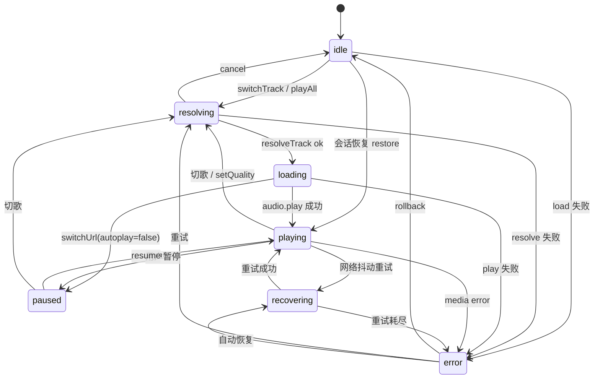
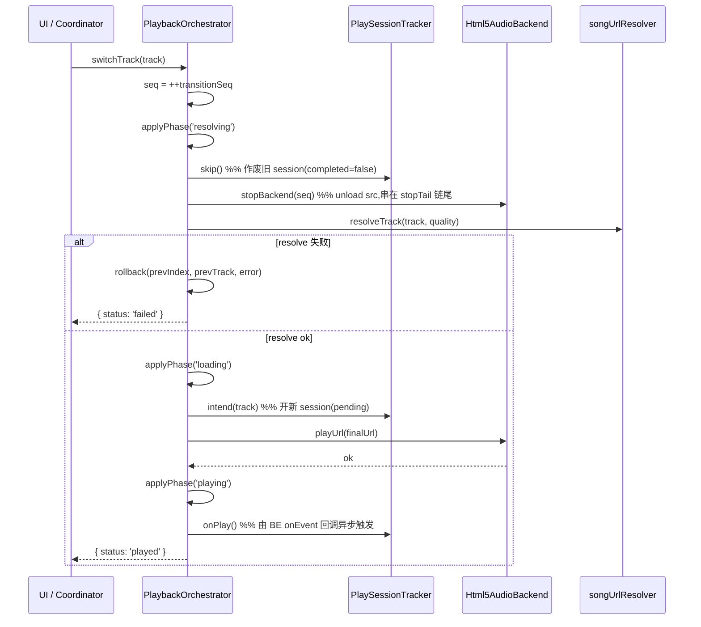
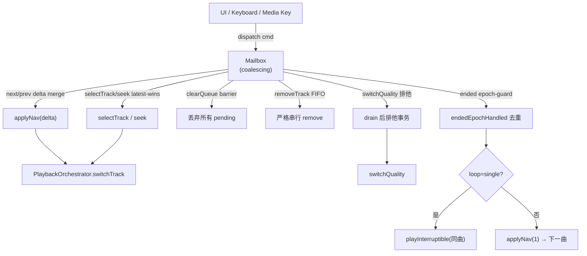
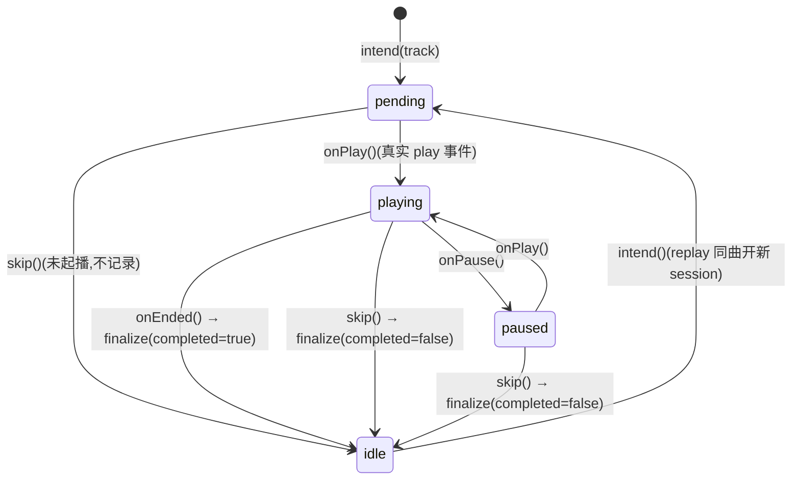
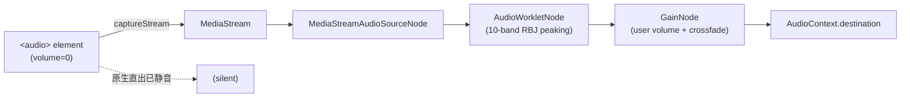

# 播放运行时 Playback Runtime

> BottleMusic Code Wiki 章节
> 基线 commit:`22ba7951` (main, codex/wiki-audit worktree)
> 事实来源:[evidence-report.md](./evidence-report.md) + 源码重新核验
> 编写规范:中文叙述,关键英文符号保留;结论附**文件 + 类/函数名**锚点(不依赖固定行号)

## 1. 概览

播放运行时是 BottleMusic 前端最核心的子系统,负责把"用户点击一首歌"到"扬声器出声 + 统计入库"之间的全部状态机、并发竞态与媒体管线串起来。当前实现由六个协作模块组成,全部位于 [ui/src/playback/](../../ui/src/playback/) 与各 Feature 目录下:

| 模块 | 文件 | 职责 |
|---|---|---|
| Html5AudioBackend | [html5Backend.ts](../../ui/src/playback/runtime/html5Backend.ts) | **唯一生产后端**,封装 `<audio>` 元素 |
| PlaybackOrchestrator | [playbackOrchestrator.ts](../../ui/src/playback/runtime/playbackOrchestrator.ts) | Resolve + PlaySession + Backend 顺序协调 |
| PlaybackCommandCoordinator | [playbackCommandCoordinator.ts](../../ui/src/playback/commands/playbackCommandCoordinator.ts) | 命令合并 mailbox,消除 race |
| PlaySessionTracker | [playSessionTracker.ts](../../ui/src/playback/playSessionTracker.ts) | 统计会话,seek-immune 累加器 |
| WebAudioEq | [webAudioEq.ts](../../ui/src/playback/eq/webAudioEq.ts) + [eqWorkletProcessor.ts](../../ui/src/playback/eq/eqWorkletProcessor.ts) | 10 段 RBJ peaking EQ |
| audio_proxy | [audioProxy.ts](../../ui/src/platform/tauri/audioProxy.ts) + [audio_proxy.rs](../../ui/src-tauri/src/audio_proxy.rs) | KuGou CDN 反向代理加 CORS 头 |

运行时边界(**已确认**):

- **HTML5-only**:`<audio>` 元素是唯一媒体源,不调用任何原生解码器。
- **Web Audio EQ**:通过 `captureStream` 接管音频管线,**绝不** `createMediaElementSource`。
- **Media Foundation 已移除**:旧 `native/playback/` 目录与 `PlaybackControllerMFP.cpp` / `BiquadFilter.cpp` 在 2026-07-17 commit `refactor(native): remove MF playback stack and BackendFacade` 中删除,`ui/src-tauri/src/playback.rs` 同步移除。详见 [evidence-report.md §7.2 / §7.3](./evidence-report.md)。
- **C++ 核心只负责 KuGou API 请求调度 + SQLite 统计存储**,不含播放栈(见 [evidence-report.md §7.1](./evidence-report.md):`C_API.cpp` 全局状态仅有 `api` 与 `scheduler`,无 `g_playback`)。

装配入口在 [playerStore.ts](../../ui/src/playback/playerStore.ts):`PlaybackOrchestrator` 实例化于模块顶层,依赖 `activeBackend`(`Html5AudioBackend`)、`playSession`(`PlaySessionTracker`)、`resolveTrack`、`patchState` 等,通过 `playbackOrchestrator` 单例对外暴露。

## 2. Html5AudioBackend

[html5Backend.ts](../../ui/src/playback/runtime/html5Backend.ts) 中的 `Html5AudioBackend` 类实现 [playerBackend.ts](../../ui/src/playback/runtime/playerBackend.ts) 的 `PlayerBackend` 接口,是**唯一生产后端**(`playerStore.backend` 字段类型为 `'html5' | null`)。

### 2.1 事件出口:`onEvent` 是唯一事件源

`onEvent(cb)` 方法在 `<audio>` 元素上注册原生事件监听,把 DOM 事件翻译为统一的 `PlaybackEvent` 后通过回调上行:

| 原生事件 | 上行 `PlaybackEvent` |
|---|---|
| `play` | `{ type: 'state', state: 'playing' }` |
| `pause` | `{ type: 'state', state: 'paused' }` |
| `timeupdate` | `{ type: 'position', position, duration }` |
| `ended` | `{ type: 'ended' }`(并经 `recordDiagnostic` 记录 `media_event / ok`) |
| `error` | `{ type: 'error', error }`(格式化 `readyState/networkState/mediaError` 等) |
| `waiting` / `stalled` / `suspend` / `abort` | 仅 `warnMediaEvent` 诊断,**不上行** |

`onEvent` 返回 unsubscribe 函数。`playerStore` 的 `handlePlaybackEvent` 是该回调的唯一消费者,所有 UI 状态变化、统计累加、自动 next、错误展示都从这条管道流出。**除 `onEvent` 外,运行时不直接监听 `<audio>` 事件**。

### 2.2 source lease 与 attach transitionSeq 双重所有权

`playUrl` / `switchUrl` 在每次播放前调用 `beginSourceLease()` 取得 `SourceLease`(`{ id }`,源自递增的 `sourceLeaseId`),并在 `await audio.play()` 前后通过 `ownsPlayback(lease, attachSeq)` 双重校验:

1. **source lease**:`ownsSourceLease(lease)` 判断 `lease.id === this.sourceLeaseId`,防止旧 `playUrl` 在 `await` 期间被新 `playUrl` 覆盖后还误以为自己是 owner。
2. **attach transitionSeq**:`isAttachTransitionCurrent(attachSeq)` 由 orchestrator 注入(`getAttachTransitionSeq` / `isAttachTransitionCurrent` 选项),确保 EQ attach 不会绑到已被 supersede 的旧 transition 上。

任一校验失败立即返回 `false` 而不抛错,让上层 orchestrator 走 `superseded` 分支。

### 2.3 `switchUrl` 的 resume position 与 metadata 等待

`switchUrl(url, { position, autoplay })` 用于切音质/恢复场景。当 `position > 0` 时,在 `setPreparedSource` 之后调用 `waitForMetadata(timeoutMs = 500)`:

- 若 `readyState >= 1` 直接 resolve;
- 否则等 `loadedmetadata` 事件或 500ms 超时(任一先到),然后 `audio.currentTime = position`。
- seek 失败(best-effort):某些媒体在 metadata 不足时拒绝 seek,此时仍继续播放,不阻塞。

`waitForMetadata` 用 `{ once: true }` 注册一次性监听 + `clearTimeout` 双向 cleanup,保证不泄漏监听器。

### 2.4 `stop()` unload src 防止 stale resume

```ts
async stop(): Promise<void> {
  this.beginSourceLease();          // 作废所有在途 lease
  this.options.disconnectEq?.();     // 断开 EQ captureStream
  this.audio.pause();
  this.audio.removeAttribute('src'); // 关键:清空 src
  this.audio.load();                // 触发 empty load,丢弃旧媒体资源
}
```

`removeAttribute('src') + load()` 确保 `<audio>` 不残留旧媒体句柄,避免在 HMR 或后台恢复时"自动 resume 到上一首的尾巴"。`disconnectEq` 在此触发而非等 GC,保证 EQ graph 与 `<audio>` 生命周期对齐。

### 2.5 crossOrigin 与 EQ 挂钩

`setPreparedSource` 据 `prepareSourceUrl` 返回的 `crossOriginSafe` 标志决定是否设 `audio.crossOrigin = 'anonymous'`,并把标志存入 `lastCrossOriginSafe` 供后续 `initEq` 读取。只有 `crossOriginSafe === true` 时才会走 `captureStream` + Web Audio 接管路径;否则 `<audio>` 直接出声(无 EQ),并经 `eqState.available` 在 UI 提示降级。`prepareSourceUrl` 失败时记录 `proxy_prep / fail` 诊断并 re-throw。

## 3. 播放状态机

[playbackPhase.ts](../../ui/src/playback/playbackPhase.ts) 定义 7 个 phase 的纯状态机(无 I/O、无 Vue、无 backend):

```
idle | resolving | loading | playing | paused | recovering | error
```

合法边由 `LEGAL` 表声明,`canTransition(from, to)` 查表;`transitionPhase(from, to)` 在非法边抛 `illegal_playback_transition: from → to`。`flagsFromPhase(phase)` 单向投影出 `isPlaying` / `isLoading` 兼容旧 UI 字段:

- `playing` → `isPlaying: true`
- `resolving` / `loading` / `recovering` → `isLoading: true`
- 其余全 `false`



> 说明:上图只画主路径,`LEGAL` 表允许的 restore/quality 捷径(如 `idle → playing`、`paused → loading`、`error → playing`)未全部绘出,以保持可读性。完整合法边集合见 `playbackPhase.ts` 顶部 `LEGAL` 常量。

`playbackPhase` 是**显式可观测状态**(`playerStore.playbackPhase` 字段),`isPlaying` / `isLoading` 不再被业务逻辑直接写入,而是由 `applyPhase` / `applyStorePhase` 经 `flagsFromPhase` 单向派生。这是 Phase 1 稳定性改造的核心不变量:phase 是唯一真相源,布尔标志是投影。

**R1 强制（runtime-stability-refactor）**:`patchPlayerState` 现在在 `playbackPhase` 存在时**剥离** patch 对象中的 `isPlaying` / `isLoading`,强制经 `flagsFromPhase` 派生。调用方无法再通过传入 stale flag 覆盖 phase 派生值。无 phase 的 patch（如 `currentTime` / `duration` / `errorMsg`）不触碰 flags。测试入口 `__patchPlayerStateForTests` 锁定此不变量。

**R2 强制（runtime-stability-refactor）**:`initPlayer` HMR 复用 `<audio>` 时不再直接写 `isPlaying = !audio.paused && !audio.ended`。改为：audio 中播 → `applyStorePhase('playing')`;audio 暂停且有 currentTrack → `applyStorePhase('paused')`;无 track → 留 `idle`。phase 与 flags 在 HMR 后立即一致。

### 3.1 transitionSeq supersede 旧 session

`PlaybackOrchestrator.switchTrack` 第一步:

```ts
const seq = ++this.transitionSeq;   // 单调递增
```

之后每个 `await` 点(`stopBackend`、`resolveTrack`、`backend.playUrl`)之后都调用 `this.isCurrent(seq)` 检查;若 `seq !== this.transitionSeq` 则当前 transition 已被新切歌 supersede,直接返回 `{ status: 'superseded' }` 不再继续推进状态。这保证:**新 transition 永远赢,旧 transition 在任意 await 点都会主动让位**,不会回写过期的 `playing` phase 或错误的统计会话。

## 4. PlaybackOrchestrator

[playbackOrchestrator.ts](../../ui/src/playback/runtime/playbackOrchestrator.ts) 的 `PlaybackOrchestrator` 类是 Resolve + PlaySession + Backend 的顺序协调器。`switchTrack(track)` 的标准序列:



关键不变量(对应代码事实):

1. **transitionSeq 单调递增**:`switchTrack`、`switchQualityAtPosition`、`resumeOrReloadCurrent`、`replaySameTrack` 入口都 `++this.transitionSeq`。任何在途 await 完成后若发现 `seq` 落后,即返回 `superseded` 不再写状态。
2. **`intend()` 严格在 `play()` 之前**:`applyPhase('loading')` → `playSession.intend(normalized)` → `backend.playUrl(finalUrl)`。这是 **Bug A 不变量**(见 §9):统计 session 在 `pending` 态等待真实 `play` 事件确认,被拒的 play() 永远不会开启 ghost session。
3. **旧 `onEnded` 被 phase guard 静默丢弃**:`handlePlaybackEvent` 的 `ended` 分支会经 coordinator 派发 `applyNav(fromEnded)`,但 coordinator 内部 `endedEpochHandled` 与 epoch 校验会丢弃跨 epoch 的迟到 ended(详见 §9)。
4. **`stopTail` 串行化 stop**:`stopBackend(seq, backend)` 接在 `this.stopTail` Promise 链尾(`waitForStops`),避免旧 stop 的 unload 与新 play 的 load 在原生层 race。`switchQualityAtPosition` 与 `resumeOrReloadCurrent` 都显式 `await this.waitForStops(seq)` 后再推进。
5. **rollback 路径**:resolve / play 失败时调用 `rollback(prevIndex, prevTrack, error)`,把 `currentIndex` / `currentTrack` 还原到切换前,并 `applyPhase('error')`(play 失败)或保留 `resolving` 错误信息(resolve 失败)。`prevTrack === null` 时清空 currentTrack。

`PlaybackResult` 三态显式区分:`'played'` / `'superseded'` / `'failed'`。`superseded` 不更新 UI、不写统计、不上报历史,只返回给调用方让它 settle 自己的 waiter。

### 4.1 `switchQuality` 切音质路径

`switchQuality(quality)` 委托 `switchQualityAtPosition(quality)`。它与 `switchTrack` 的差异:

- **保留 position**:`position = state.currentTime`,切音质后从原位续播。
- **优先用缓存 URL**:`availableQualities.find(q => q.quality === quality && q.url)` 命中即跳过 `resolveTrack`;未命中才重新 resolve 并刷新 `availableQualities`。
- **phase-aware autoplay**:若当前 `isPlaying` 或 phase ∈ {`playing`, `resolving`, `loading`, `recovering`},则 `autoplay = true`(注释:"mid resolve/load 仍表示想播");`paused` 态切音质则 `autoplay = false`,切完停在 paused。
- **走 `switchUrl` 而非 `playUrl`**:backend 侧用 `switchUrl(finalUrl, { position, autoplay })`,支持 resume position。

`switchQualityAtPosition` 同样 `skip()` 旧 session → `intend(current)` → `switchUrl`,保持 Bug A 不变量。

### 4.2 `resumeOrReloadCurrent` 恢复路径

恢复播放时按 backend `hasSource()` 分流:

- **有 source**:直接 `backend.resume()`,`applyPhase('playing')`。
- **无 source**:`applyPhase('recovering')` → 走 `switchTrack(current)` 全流程重新 resolve + play。
- **边缘**:等 stop 期间若又丢失 source,退到 `switchQualityAtPosition(state.quality, state.currentTime, true)`。

`recovering` phase 在此作为"已知丢源,正在重建"的中间态,避免 UI 在恢复期间误显示 idle。

### 4.3 `replaySameTrack` 重播路径

`replaySameTrack()` 用于"从头重播当前曲":等 stop 后,若无 source 走 `switchQualityAtPosition(quality, 0, true)`(position=0,autoplay=true);有 source 时(未读取到的分支)走 seek 0 + play。与单曲循环 §9 的 `playInterruptible` 互补:`replaySameTrack` 是用户主动触发,单曲循环是 ended 自动触发。

## 5. PlaybackCommandCoordinator

[playbackCommandCoordinator.ts](../../ui/src/playback/commands/playbackCommandCoordinator.ts) 的 `PlaybackCommandCoordinator` 是**所有播放意图的唯一入口**(single mailbox)。它做的是 **coalescing,不是 FIFO**——连续点击 / 键盘连按 next 时合并为一次 delta 跳转,避免中途切歌 race。

命令类型(`PlaybackCommand`):`next` / `prev` / `selectTrack` / `seek` / `togglePlay` / `switchQuality` / `clearQueue` / `removeTrack` / `ended` / `playAll` / `addToQueue`。

合并规则(文件顶部注释):

| 命令 | 合并策略 |
|---|---|
| `next` / `prev` | 相对 delta merge(连按 3 次 next = 跳 3 首) |
| `selectTrack` / `seek` | latest-wins |
| `clearQueue` | barrier,丢弃所有待处理 nav/select/seek/ended/quality |
| `removeTrack` | 严格 FIFO,removes 之间不合并(索引会漂移) |
| `ended` | 每 epoch 仅处理一次 |
| `switchQuality` | 当 drain 后作为排他事务 |
| `togglePlay` | 等当前 track intent settle 后再处理 |



每个 dispatch Promise 绑定到自己的 intent ticket:settling seek 不会误 resolve 一个 pending 的 quality/select Promise(`takeWaiters` + `resolveWaiters` 分桶 resolve,每类命令有自己的 waiter bucket,如 `endedWaiters`)。

### 5.1 `ended` 的 epoch 去重

`ended` 命令的 epoch 去重由 `endedEpochHandled` 字段保证:同一播放 epoch(一次成功 `playUrl` 到下一次 `switchTrack` 之间)内即便 `ended` 事件迟到多次,也只触发一次 `applyNav(fromEnded)`。`dispatch` 入口处:

```
if (command.type === 'ended' && this.endedEpochHandled === this.epoch && !this.pendingEnded) {
  return immediate noop;
}
```

跨 epoch 的迟到 ended(旧 transition 的尾巴)被 `endedEpochHandled === this.epoch` 判等直接 `noop`。`endedEpochHandled` 在切歌 / playAll / clearQueue 等场景被重置为 `-1`,开启新 epoch。

## 6. PlaySessionTracker

[playSessionTracker.ts](../../ui/src/playback/playSessionTracker.ts) 的 `PlaySessionTracker` 是纯逻辑统计机(无 Tauri / DOM 依赖,完全可单测)。它的职责是产出 `PlayRecord`(`song_hash` / `duration_seconds` / `completed` / `listened_seconds` / `quality` / `played_at` …)并经 `emit` fire-and-forget 上报(`playerStore.emitPlayRecord` → `invoke('stats_record_play')`,失败静默)。

### 6.1 session 状态机

session 内部 `Phase` 为 `idle | pending | playing | paused`(独立于 `PlaybackPhase`,只关心统计语义):



`onPlay()` 特例:若 session 已 `finalized`(replay 同曲),会原地开一个新 session(`listened: 0`,phase 直接 `playing`),保证第二次听完被独立记录。

### 6.2 session 仅在真实 `play` 事件时打开

`intend(track)` 把 session 置为 `pending`(`phase: 'pending'`,不累加);只有 `onPlay()` 把 `phase` 推到 `'playing'` 才开始累加。这保证被 autoplay-block / broken src 拒绝的 `play()` **永远不会开启 ghost session**。若 `intend` 后从未 `onPlay`,`skip()` 检测到 `phase === 'pending'` 直接 `finalized = true` 不发 record。

### 6.3 `listened_seconds` 防跳转累加器

`onTimeUpdate(currentTime)` 仅在 `phase === 'playing'` 时累加,且只接受**前向小增量**:

```ts
const delta = currentTime - last;
if (delta > 0 && delta < SEEK_THRESHOLD) {   // SEEK_THRESHOLD = 2s
  this.session.listened += delta;
}
```

- **seek**(大前向跳)→ delta ≥ 2s → 忽略
- **replay / 后退**(后向跳)→ delta ≤ 0 → 忽略
- **正常播放**→ 0 < Δ < 2s → 计入

这样跳转、循环重启、后台 suspend 都不会虚增 `listened_seconds`。`lastTime` 始终更新,保证下一次 delta 基准正确。

### 6.4 `completed` 用累加器而非 duration

`finalize(completed)` 在 `onEnded`(completed=true)或 `skip`(completed=false)时触发。**`completed` 字段与"是否播到 duration"无关**;真正决定是否发 record 的是 `listenedSeconds`:

```ts
const listenedSeconds = Math.max(0, Math.round(this.session.listened));
if (listenedSeconds <= MIN_RECORD_LISTENED_SECONDS) return;  // < 60s 不记录
```

`MIN_RECORD_LISTENED_SECONDS = 60`:即便歌曲时长 5 分钟但用户只听了 50s 就切走,也不会被记入统计。`completed` 字段表示"是否自然播完",与"是否达到记录门槛"是两件事。

### 6.5 `setQuality` 期间保持 quality 准确

`switchQuality` 走 `switchQualityAtPosition` 路径:先 `playSession.skip()`(作废旧 session,`completed: false`),再在新 transition 里 `intend()` + `switchUrl()`。`quality` 字段由 `QualityProvider`(`() => playerStore.quality || ''`)在 `finalize()` 时**实时读取**,所以即便切音质时 session 被重置,最终上报的 `quality` 始终是"用户最后实际播放的音质"而非"打开 session 时的音质"。

## 7. Web Audio EQ

[webAudioEq.ts](../../ui/src/playback/eq/webAudioEq.ts) + [eqWorkletProcessor.ts](../../ui/src/playback/eq/eqWorkletProcessor.ts) 实现 10 段 EQ。EQ 是 AudioWorklet 重设计的 Phase 1(DSP)+ Phase 2(graph)产物,设计文档:`docs/superpowers/specs/2026-06-28-eq-audioworklet-redesign-design.md`。

### 7.1 10 段频段

[equalizerConfig.ts](../../ui/src/playback/eq/equalizerConfig.ts) 的 `EQ_BANDS` 常量声明 10 段中心频率:31 / 62 / 125 / 250 / 500 / 1K / 2K / 4K / 8K / 16K Hz。每段附 `label` / `display` / `tone` 元数据供 UI 渲染。

### 7.2 DSP:RBJ peaking from Audio EQ Cookbook

[eqWorkletProcessor.ts](../../ui/src/playback/eq/eqWorkletProcessor.ts) 的 `computePeakingCoeffs(freq, gainDb, Q, sampleRate)` 实现标准 RBJ peaking filter(参考 Robert Bristow-Johnson《Audio EQ Cookbook》),`Q = 1 / Math.SQRT2` 与旧 `BiquadFilterNode` 默认 Q 对齐。

> **Spec 偏差修正**(文件顶部注释):设计文档原称 DSP "翻自 `native/playback/BiquadFilter.cpp`",但该文件在 MF 移除时已删除(见 [evidence-report.md §7.2](./evidence-report.md))。核验后改用标准 Cookbook 公式实现,行为等价。
>
> `clampFreq(freq, sampleRate)` 在 `[20Hz, 0.95 * sr/2]` 内钳位(`EQ_MIN_FREQ_HZ = 20`、`EQ_NYQUIST_CEIL = 0.95`),避免 Nyquist 附近数值失稳;`gainDb = 0` 时 `A = 1`,分子分母相等,`H(z) ≡ 1`(全通,但 `b1/b2/a1/a2` 各系数非零,全通性来自 num ≡ den 而非零系数)。`sampleRate` 由 `AudioContext` 提供,**不硬编码 48000**。

### 7.3 拓扑安全:captureStream 链路

**绝不调用 `createMediaElementSource`**。graph 拓扑(见 `WebAudioEq.attachSource`):



`captureStream` 抓 `<audio>` 解码后的 PCM 流为 `MediaStream`,经 `MediaStreamAudioSourceNode` 进入 Web Audio graph;`<audio>` 自身 `volume = 0` 防止双重出声。这条路径**只创建 MediaStreamSource,不创建 MediaElementSource**,因此 `<audio>` 元素的控制权仍归 `Html5AudioBackend`,EQ 只是一个旁路处理节点。`createMediaElementSource` 的"一旦调用即接管元素、阻断原生控制"陷阱因此被绕过。

### 7.4 EQ graph build order

`WebAudioEq.init(opts)`(经 `doInit`)在**应用启动时**异步建好 worklet graph(`buildGraph`):

```
createCtx() → loadWorklet(ctx) → new AudioWorkletNode(ctx,'eq-processor') → createGain()
workletNode.connect(gainNode); gainNode.connect(ctx.destination);
postBands(); postEnabled();
```

graph 在 `awaitReady()` 完成。`attachSource(audio)` 只把 `<audio>` 的 `captureStream` 接到已存在的 `sourceNode → workletNode`,**不重建 graph**。**整条 worklet 链路在 `<audio>` 拿到 src 之前就已就绪**——graph 不依赖媒体源存在,只依赖 `AudioContext` 可用。`doInit` 二次调用时(`initStarted === true`)只刷新 `enabled` / `bands` 并 `postBands` / `postEnabled`,不重建节点。

### 7.5 Worklet 消息协议

`AudioWorkletNode.port.postMessage` 协议(双向):

| 消息 | 方向 | 载荷 |
|---|---|---|
| `setBands` | UI → worklet | `{ type:'setBands', bands: number[] }` |
| `setEnabled` | UI → worklet | `{ type:'setEnabled', enabled: boolean }`(随后跟一次 setBands) |

`setBand(index, gainDb, enabled)`:单段更新,`enabled=false` 时 no-op,否则 `clampEqGain` 后 postMessage。
`setEnabled(enabled, bands)`:整体开关,`enabled=false` 时 bands 全置 0,`enabled=true` 时恢复用户 bands。

### 7.6 AudioContext lifecycle 与 HMR-safe

- `AudioContext` 在 `buildGraph` 时创建,生命周期与应用一致;`resume()` 在 `state === 'suspended'` 时调用。
- HMR 重建模块时,**`<audio>` 元素不重建**(通过 `window.__bottlemusic_audio__` 全局引用保留,见 §11),因此 `captureStream` 流不中断;EQ graph 因挂在独立 `AudioContext` 上也不重建。
- `close()`:cleanup 全部节点(`disconnectSource` → `workletNode.disconnect` → `gainNode.disconnect`)、`revokeObjectURL(blobUrl)`、`ctx.close()`、复位 `initStarted` / `workletFailed` / `readyPromise`。
- `GAIN_CROSSFADE_MS = 50`:`gainNode.gain` 切换用 50ms 线性 ramp(`rampGainTo`),避免 EQ 启停时的 click 噪声。

### 7.7 degradation / recovery

EQ 接管失败(AudioContext 无法 resume、worklet load 失败、或运行中出错)时进入降级:

- `enterDegradation(audio, vol)`:`rampGainTo(0)` → 断开 `sourceNode → workletNode` → stop `currentStream` tracks → `rerouted = false` → 50ms 后 `audio.volume = vol`(交还原生出声)→ `onDegradedCb`。
- `recoverFromDegradation(audio)`:`audio.volume = 0` → `attachSource(audio)`(重建 captureStream 链)→ `rampGainTo(outputVolume)`(渐入)→ `onRecoveredCb`。
- `workletFailed` 标志:worklet 初始化失败后所有 `setBand` / `setEnabled` / `attachSource` 均 no-op,直到 `close()` 复位。

降级与恢复都是**双向可逆**的,不会因一次失败永久禁用 EQ。

### 7.8 内置预设(6 个)

[equalizerConfig.ts](../../ui/src/playback/eq/equalizerConfig.ts) 的 `EQ_PRESETS`:

| 预设 | 中文名 | band 增益(dB) |
|---|---|---|
| Flat | 中性 | 全 0 |
| Bass Boost | 低频增强 | `[4,5,4,1,0,0,0,1,1,0]` |
| Vocal | 人声 | `[-1,-1,0,1,2,3,3,2,1,0]` |
| Rock | 摇滚 | `[3,4,3,1,-1,-1,1,3,4,3]` |
| Harman Kardon | 哈曼卡顿 | `[2,3,2,0,-1,0,1,2,2,1]` |
| 125Hz Test | 125Hz 测试 | `[0,0,6,0,0,0,0,0,0,0]` |

`EQ_PRESET_LABELS` 提供中英双语展示名。`clampEqGain(gain)` 在 `EQ_MIN_GAIN_DB / EQ_MAX_GAIN_DB` 内钳位防越界;`normalizeEqBands(input)` 把任意输入归一为 10 段合法数组。

## 8. audio_proxy 协作

### 8.1 问题:KuGou CDN 无 CORS

KuGou 媒体 CDN 不返回 `Access-Control-Allow-Origin`,前端 `<audio>` 直连会被浏览器 CORS 策略阻断(尤其需要 `crossOrigin = 'anonymous'` 才能进 Web Audio graph 的场景)。

### 8.2 方案:loopback 反向代理加 CORS

[audio_proxy.rs](../../ui/src-tauri/src/audio_proxy.rs) 在 Tauri 后端起一个 `127.0.0.1` 上的本地 TCP listener(`StdTcpListener::bind(("127.0.0.1", 0))`,端口由 OS 分配)。前端经 `invoke('audio_proxy_url', { url })` 拿到 `http://127.0.0.1:{port}/audio/{id}` 形式的代理 URL,代理侧用 `reqwest` 向 KuGou CDN 发请求,**回包时追加 CORS 头**(`append_cors_headers`):

- `Access-Control-Allow-Origin: {origin}`(按白名单回填,**不**用 `*`)
- `Access-Control-Allow-Methods: GET, OPTIONS`
- `Access-Control-Allow-Headers: Range`
- `Access-Control-Expose-Headers: Content-Length, Content-Range, Accept-Ranges`

`Range` 头支持使 `<audio>` 的 seek 仍能走分段请求。白名单含 `tauri://localhost` / `http://tauri.localhost` / `https://tauri.localhost` / `http://localhost:1420`(dev server)。未受信 origin 不回填 `Access-Control-Allow-Origin`(连 wildcard 都不回,防止 loopback 上任意页面读取代理音频——见 `options_omits_cors_origin_for_untrusted_origin` 测试)。`is_supported_audio_url` 显式排除 `127.0.0.1` / `localhost` 自身,防止代理递归。

### 8.3 前端接入与降级提示

[audioProxy.ts](../../ui/src/platform/tauri/audioProxy.ts) 的 `prepareAudioSourceUrl(url)`:

- 非 `http(s)` URL(如 blob:)→ 原样返回,`crossOriginSafe: false`。
- 调 `invoke('audio_proxy_url', { url })`:成功返回代理 URL,`crossOriginSafe: true`;失败或返回空 → 原样返回 + `crossOriginSafe: false` + `console.warn('Audio proxy unavailable; falling back to direct playback')`。

`Html5Backend.setPreparedSource` 据 `crossOriginSafe` 决定是否设 `crossOrigin = 'anonymous'`,并经 `recordDiagnostic(proxy_prep)` 记录结果(`prepared; crossOriginSafe=...; url=...`)。EQ 侧据 `crossOriginSafe` 决定走 `captureStream` 接管路径还是直出降级路径;UI 经 `eqState.available` 标志展示"EQ 不可用(代理未启用)"降级提示。

## 9. 单曲循环 replay

单曲循环(`loopMode === 'single'`)的 replay 路径**不走 `next()`**,而是 `ended` handler 内分支:

[playbackCommandCoordinator.ts](../../ui/src/playback/commands/playbackCommandCoordinator.ts) `applyNav` 中(`fromEnded && loop === 'single'` 分支):

```ts
if (fromEnded && loop === 'single') {
  const track = state.queue[idx];
  if (!track) return { status: 'noop' };
  return this.playInterruptible(track);   // 回到 switchTrack 全流程
}
```

`playInterruptible(track)` 复用 `PlaybackOrchestrator.switchTrack`,因此单曲 replay 仍走完整 `resolving → loading → playing` 序列,而不是简单的 `audio.currentTime = 0; audio.play()`。这保证:

- replay 也会重新 `resolveTrack`(URL 可能过期)
- replay 也会重新 `intend()` + 真实 `play()` 确认
- replay 也会经 phase guard / transitionSeq 防御
- replay 的统计 session 与首次播放独立(`onEnded` finalize 旧 session → `intend` 开新 session)

### 9.1 Bug A 不变量:`intend()` 在 `play()` 之前

`switchTrack` 顺序铁律:

```
applyPhase('loading') → playSession.intend(track) → backend.playUrl(url)
```

`intend()` 把 session 置为 `pending`,但**不开始累加**;只有 `Html5AudioBackend.onEvent` 上行 `play` 事件后,`PlaySessionTracker.onPlay()` 才把 phase 推到 `'playing'` 并开始累加 `listened_seconds`。

**这是 Bug A 的修复不变量**:历史 Bug A 是统计在 `play()` 调用瞬间即开 session,导致被 autoplay-block 或 broken src 拒绝的 `play()` 留下 ghost session。当前实现把"开 session"延迟到"真实 `play` 事件确认",任何被拒的 play 都不会污染统计。改这个顺序前必须先评估对 ghost session 的回归。`switchQualityAtPosition` 同样遵循此顺序(`skip → intend → switchUrl`)。

## 10. Event ownership

### 10.1 唯一事件源

`Html5AudioBackend.onEvent` 是运行时**唯一**媒体事件出口(`<audio>` → `PlaybackEvent` → `playerStore.handlePlaybackEvent`)。`handlePlaybackEvent` 内部:

- `position` → 更新 `currentTime` / `duration`(仅 `Number.isFinite && > 0`),转发 `playSession.onTimeUpdate` + `playbackDiagnostics.markActivity`。
- `state/playing` → `playSession.onPlay()` + `applyStorePhase('playing')` + `markActivity`,清空 `errorMsg`。
- `state/paused` → `playSession.onPause()` + `applyStorePhase('paused')`,清空 `errorMsg`。
- `ended` → `playSession.onEnded()` + 派发 `coordinator.dispatch({ type: 'ended' })`(失败仅 `console.error`)。
- `error` → `playSession.onPause()` + 写 `errorMsg` + `applyStorePhase('error')`。

### 10.2 `initPlayer` 只处理 durationchange/loadedmetadata

[playerStore.ts](../../ui/src/playback/playerStore.ts) 的 `initPlayer` 在 `<audio>` 上额外注册的监听仅用于初始化 UI(`duration` / metadata 就绪),**不**重复处理 play/pause/ended。所有播放语义事件都归 `onEvent`。历史上"双 ended handler 各自拉取 `/song/url` 造成重复请求"的 bug 已在迁移到 `onEvent` 单一出口时修复,当前架构下 `<audio>` 的 `ended` 只会触发一次 `PlaybackEvent`,由 coordinator 的 epoch 去重二次兜底。

## 11. HMR 共享

[playerStore.ts](../../ui/src/playback/playerStore.ts) 顶部声明:

```ts
type BottleMusicAudioGlobal = Window & {
  __bottlemusic_audio__?: HTMLAudioElement;
  __bottlemusic_player_cleanup__?: () => void;
  __bottlemusic_pagehide__?: (event: Event) => void;
};
```

- `__bottlemusic_audio__`:Vite HMR 重建 `playerStore` 模块时,**不重建 `<audio>` 元素**——新模块实例从全局引用取回旧元素。这避免 HMR 期间播放中断,也避免多个 `<audio>` 元素并存导致 `onEvent` 监听泄漏。
- `__bottlemusic_player_cleanup__`:旧模块在 HMR 替换前的 cleanup 钩子(unsubscribe `onEvent`、断开 EQ、**释放分析 AudioContext**）。
- `__bottlemusic_pagehide__`:`pagehide` 事件单 owner;HMR / re-import 时替换前一个 handler,保证不会注册多个重复 handler。

`cleanupCurrentModuleForHmr()`（[playerStore.ts](../../ui/src/playback/playerStore.ts) L132-151）在 HMR 时执行：`detachCoordinatorForHmr()`（supersede mailbox,不 stop/pause/clear）→ `disposeFmSession()` → drop backend ref → `closeWebAudioEq()`（关 EQ context）→ **`disposeAudioLevelMonitor()`**（关分析 context,R3 修复）。两个 AudioContext 在 HMR 时都显式释放,新模块重建 fresh graph。

`shutdownCoordinatorInstance` 在应用退出时停掉 coordinator 但**不**清空队列(队列已由 `flushSaveQueue` 落盘),注释明确禁止用 `dispose()`(会 barrier-empty 队列并覆盖 localStorage 为空会话)。

**R4（runtime-stability-refactor）**:`playerPersistence.ts` 不再在模块顶层注册 `beforeunload` 监听。`pagehide` → `disposePlayerRuntime()` → `flushSaveQueue()` 是唯一的退出时 flush owner（在 `initPlayer` 中绑定,只有 live 模块持有）。旧的 `beforeunload` 监听冗余且在 orphan HMR 模块中也会注册,已移除。

## 12. 已知风险

### 12.1 EQ 重初始化顺序(延期处理)

EQ graph 的 build order 要求"full chain 在 createMediaElementSource 之前",但当前架构已通过 `captureStream` 路径绕过 `createMediaElementSource`,故该顺序约束在**当前拓扑下不会触发**。若未来为支持 Safari / Firefox(无 `HTMLAudioElement.captureStream`)而回退到 `createMediaElementSource`,需重新评估"graph 必须先于 element source 建立"的约束。

> **当前影响**:**无**。在 audio_proxy 启用前(`crossOriginSafe = false`)EQ 直接降级直出,不建 graph;audio_proxy 启用后走 `captureStream` 路径,`createMediaElementSource` 从不被调用。此项为**延期跟踪项**,不阻塞发布。

### 12.2 `onEnded` phase guard(防御性代码)

`handlePlaybackEvent` 的 `ended` 分支经 coordinator epoch 去重 + phase guard 双重防御。这是为应对 transitionSeq supersede 后旧 `<audio>` `ended` 事件迟到的场景(例如切歌瞬间上一首正好播完触发 ended)。该 guard 是**防御性代码**,在正常路径下不生效,只在 race 边界起作用。

> 详见 [maintenance.md](./maintenance.md)(如已存在)的"防御性代码"章节。本节仅声明其存在与触发条件,不展开维护策略。

### 12.3 audio_proxy 不可用时的降级

代理失败时回退到直连,`crossOriginSafe = false`,EQ 自动降级为直出(无 EQ 处理)。UI 经 `eqState.available` 标志提示。**风险**:用户在代理不可用时无法使用 EQ,且若 KuGou CDN 同时拒绝 CORS,`<audio>` 可能完全无声(此时走 `error` 事件 → `error` phase)。这是已知的功能限制,非 bug。

## 13. 未来提案

**无**。当前架构(HTML5-only + Web Audio EQ + audio_proxy + Orchestrator + SessionTracker + CommandCoordinator)经 Phase 1 稳定性改造与 Phase 2 AudioWorklet 重设计后已稳定,无待落地的架构级提案。如未来出现以下需求,应先在 `docs/adr/` 写 ADR 再动手:

- 多后端支持(如 WebAudioDecoder / WebAssembly 解码器):需扩展 `PlayerBackend` 接口与 `playerStore.backend` 字段。
- 非 Chrome/WebView2 浏览器支持:`captureStream` 兼容性回退(可能需 `createMediaElementSource`,触发 §12.1 风险)。
- 跨会话播放恢复(restore to exact position):已有 `idle → playing` 合法边,但当前只恢复 phase 不恢复精确 position,需评估持久化策略。

---

## 附:关键文件索引

| 文件 | 关键导出 |
|---|---|
| [playerStore.ts](../../ui/src/playback/playerStore.ts) | `playerStore` (reactive)、`handlePlaybackEvent`、`initPlayer`、`playbackOrchestrator` 实例 |
| [html5Backend.ts](../../ui/src/playback/runtime/html5Backend.ts) | `Html5AudioBackend` (implements `PlayerBackend`)、`onEvent`、`stop`、`beginSourceLease`、`waitForMetadata` |
| [playerBackend.ts](../../ui/src/playback/runtime/playerBackend.ts) | `PlayerBackend` 接口、`PlaybackEvent` 类型 |
| [playbackOrchestrator.ts](../../ui/src/playback/runtime/playbackOrchestrator.ts) | `PlaybackOrchestrator`、`switchTrack`、`switchQuality`、`resumeOrReloadCurrent`、`replaySameTrack`、`transitionSeq` |
| [playbackPhase.ts](../../ui/src/playback/playbackPhase.ts) | `PlaybackPhase`、`canTransition`、`transitionPhase`、`flagsFromPhase`、`LEGAL` |
| [playbackCommandCoordinator.ts](../../ui/src/playback/commands/playbackCommandCoordinator.ts) | `PlaybackCommandCoordinator`、`PlaybackCommand`、`dispatch`、`endedEpochHandled`、`applyNav` |
| [playSessionTracker.ts](../../ui/src/playback/playSessionTracker.ts) | `PlaySessionTracker`、`PlayRecord`、`intend`、`onPlay`、`onTimeUpdate`、`finalize` |
| [webAudioEq.ts](../../ui/src/playback/eq/webAudioEq.ts) | `WebAudioEq`、`attachSource`、`disconnectSource`、`setBand`、`setEnabled`、`enterDegradation`、`recoverFromDegradation` |
| [eqWorkletProcessor.ts](../../ui/src/playback/eq/eqWorkletProcessor.ts) | `computePeakingCoeffs`、`clampFreq`、`loadEqWorklet` |
| [equalizerConfig.ts](../../ui/src/playback/eq/equalizerConfig.ts) | `EQ_BANDS`、`EQ_PRESETS`、`EQ_PRESET_LABELS`、`clampEqGain`、`normalizeEqBands` |
| [audioProxy.ts](../../ui/src/platform/tauri/audioProxy.ts) | `prepareAudioSourceUrl` |
| [audio_proxy.rs](../../ui/src-tauri/src/audio_proxy.rs) | `audio_proxy_url` Tauri command、`append_cors_headers`、`is_supported_audio_url` |
| [songUrlResolver.ts](../../ui/src/playback/data/songUrlGateway.ts) | `resolveTrack` (被 orchestrator 注入) |

> 本文档所有结论以 [evidence-report.md](./evidence-report.md) 与源码为准;与旧 Code-Wiki.md 冲突处以本文档为准。
