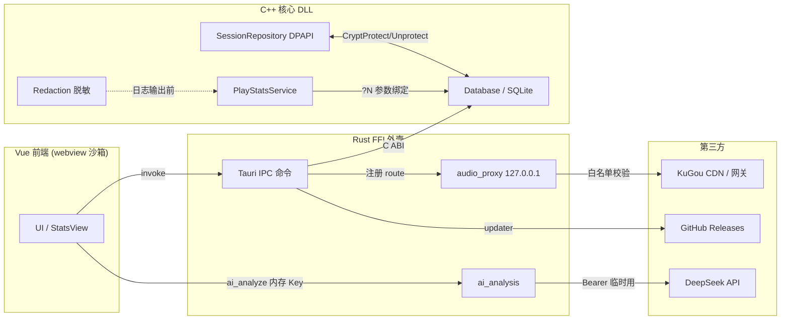
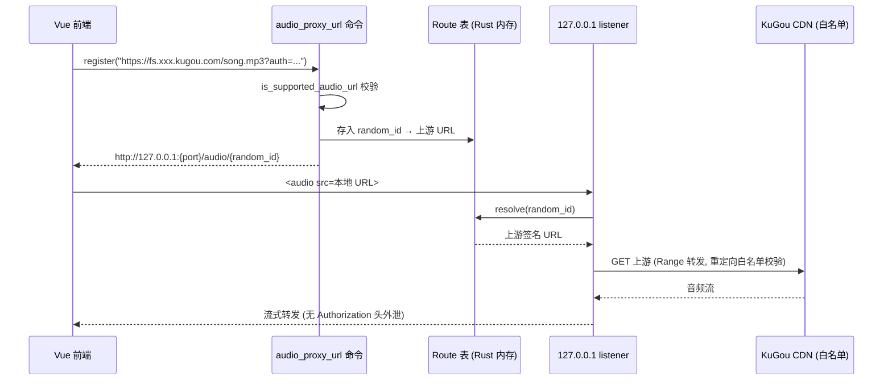
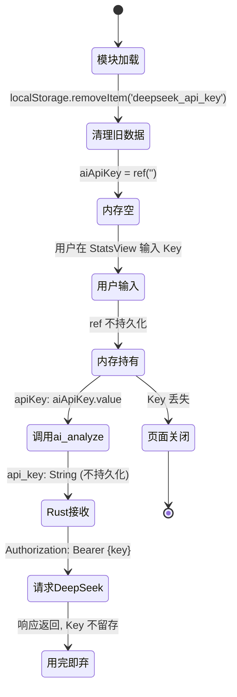
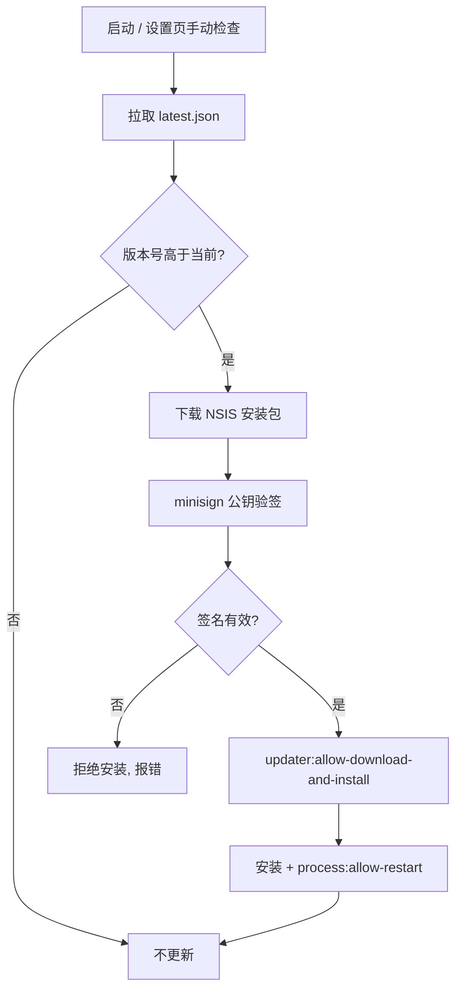
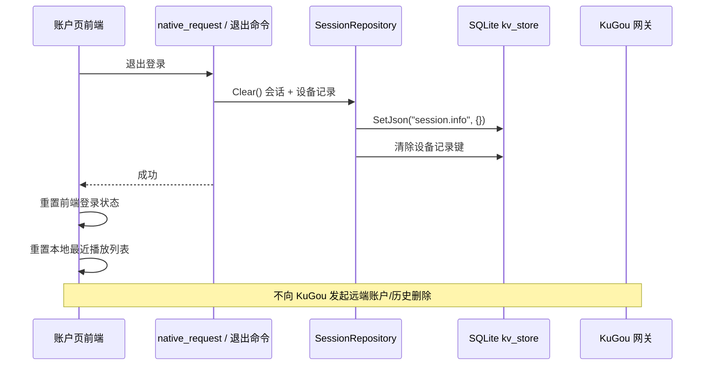

# 安全与隐私

> Code Wiki · 安全与隐私层
> 基线 commit:`22ba7951`(main,codex/wiki-audit worktree)
> 事实来源:[evidence-report.md](./evidence-report.md) + 仓库源码核验(2026-07-23)
> 隐私说明原文:[PRIVACY.md](../../PRIVACY.md)

## 1. 概览

BottleMusic 是面向 Windows 的非官方桌面客户端,采用三层架构(Vue 前端 / Rust FFI 外壳 / C++ 核心 DLL)。安全设计围绕以下原则展开,均以代码事实为准:

- **最小权限**:Tauri capability 白名单仅放行实际需要的命令,`opener` 外链限定单一域名;NSIS 安装为 `currentUser`,无需管理员。
- **签名验证**:应用更新走 Tauri updater + minisign 公钥验签,公钥内置 [tauri.conf.json](../../ui/src-tauri/tauri.conf.json) `plugins.updater.pubkey`,私钥不在仓库。
- **DPAPI 会话保护**:账号会话经 `CryptProtectData` 按当前 Windows 用户范围加密后存入 SQLite,明文读取路径在一次性迁移后已关闭。
- **SSRF 防护**:`audio_proxy` 仅绑定 `127.0.0.1`,上游 URL 必须命中 KuGou CDN 域名白名单,重定向目标同样校验。
- **内存清零**:DPAPI 输出缓冲与会话明文用 `SecureZeroMemory` 清零后释放。
- **日志脱敏**:`Redaction.cpp` 对 token / userid / Cookie / Authorization / 签名 URL 查询串等敏感字段脱敏后再写入诊断日志。



> 本图标注信任边界:前端 webview 受 CSP 约束;Rust 层负责 SSRF 收口;C++ 层负责 DPAPI 与 SQL 安全;第三方请求仅 KuGou / DeepSeek / GitHub 三类,**无开发者自建遥测**。

### 1.1 信任边界与威胁模型

| 边界 | 信任方 | 防护机制 | 对应章节 |
|---|---|---|---|
| Webview ↔ 公网 | 不信任任意远程源 | 严格 CSP + capability 白名单 | §3 |
| 前端 ↔ Rust | IPC 受 Tauri 桥接收口 | 仅 17 个 `invoke_handler` 命令,参数显式 | §3.4 |
| Rust ↔ 上游 CDN | 不信任 URL 输入 | SSRF allowlist + loopback only + 重定向校验 | §5 |
| C++ ↔ SQLite | 不信任动态 SQL 拼接 | `?N` 参数绑定 + 标识符 switch 白名单 | §4.4 |
| 本机 ↔ 磁盘会话 | 不信任本机明文存储 | DPAPI 当前用户加密 + 内存清零 | §4.1 |
| 应用 ↔ 更新源 | 不信任网络下载内容 | minisign 公钥验签后才安装 | §7 |
| 日志 ↔ 外部提交 | 不信任日志中残留敏感串 | Redaction 脱敏 + 提交前手动二次检查 | §4.3 |

> BottleMusic 假设运行在用户自己的 Windows 账户下;DPAPI 的保护密钥由 Windows 用户配置文件管理,**不能替代**对 Windows 账户、设备和恶意软件的防护(详见 [PRIVACY.md](../../PRIVACY.md)「账号会话」)。

---

## 2. 数据分类与存储

| 数据类别 | 存储介质 | 加密 / 保护 | 负责模块 | 说明 |
|---|---|---|---|---|
| 播放历史与统计 | SQLite(`play_history_v2`) | 本机明文,无敏感数据 | `Database` + `PlayStatsService` | 最近播放、播放次数、听歌时长、完成率、时间线 |
| 账号会话 | SQLite(`kv_store` `session.info`) | **DPAPI** 当前用户范围 | `SessionRepository` | token / userid / t1 / nickname / pic |
| 设备记录 | 本地 + 远端 | 本地明文(KV),远端由 KuGou 管 | `SessionRepository` / CompatApi | 退出登录时本地清除,远端不删 |
| 偏好(队列/音量/EQ/外观) | `localStorage` | 本机明文,无敏感数据 | 前端各 store | 可随时清空不影响功能 |
| 诊断日志 | 本地 AppData | 明文 + **Redaction 脱敏** | `Redaction.cpp` | 提交前需手动二次脱敏 |
| DeepSeek API Key | **仅内存会话** | 不入任何持久层 | `StatsView.vue` `aiApiKey = ref('')` | 页面刷新/关闭即丢失 |
| minisign 私钥 | **不在仓库** | GitHub Secrets + 维护者本地 | release workflow | 仓库中只有对应公钥 |

> 详见 [PRIVACY.md](../../PRIVACY.md)「应用本地保存的数据」与「应用会向哪些第三方发送数据」两节。存储层技术细节见 [storage-and-data.md](./storage-and-data.md)。

---

## 3. Tauri 安全配置

### 3.1 严格 CSP([tauri.conf.json](../../ui/src-tauri/tauri.conf.json) `app.security.csp`)

| 指令 | 取值 | 安全含义 |
|---|---|---|
| `default-src` | `'self'` | 默认仅同源,拒绝任意外部资源 |
| `connect-src` | `ipc: http://ipc.localhost http://127.0.0.1:*` | 仅允许 Tauri IPC 与本地 audio_proxy;**不放行公网 fetch** |
| `script-src` | `'self' blob:` | 禁止远程脚本,Web Worker blob 允许 |
| `style-src` | `'self' 'unsafe-inline'` | 内联样式(Vue scoped style 需要) |
| `img-src` | `'self' asset: http://asset.localhost data: blob: http: https:` | 允许封面图远程加载 |
| `media-src` | `'self' blob: http: https: http://127.0.0.1:*` | 允许 audio_proxy 流与远程媒体 |
| `object-src` / `base-uri` / `frame-src` / `form-action` | `'none'` / `'none'` / `'none'` / `'none'` | 全面禁用插件/框架/表单外发 |

附加安全响应头:

```
X-Content-Type-Options: nosniff
Permissions-Policy: camera=(), microphone=(), geolocation=()
```

`devCsp` 在生产 CSP 基础上额外放行 `localhost:1420/1421` 与 WebSocket,仅开发期生效。

### 3.2 自绘 titlebar

`app.windows[0].decorations: false` — 关闭系统标题栏,由前端自绘;配合 `core:window:allow-start-dragging` 实现拖拽。这避免了系统边框注入,但拖拽权限被限制在白名单内。

### 3.3 NSIS 安装范围

`bundle.windows.nsis.installMode: "currentUser"` — 安装到当前用户目录,**不需要管理员权限**;`bundle.targets: "all"`(注:evidence-report §7.7 纠正了旧 Wiki 称 `["nsis"]` 的错误)。

### 3.4 Capability 最小权限白名单([capabilities/default.json](../../ui/src-tauri/capabilities/default.json))

`identifier: "default"`,`windows: ["main"]`,仅放行以下权限:

| 权限 | 用途 |
|---|---|
| `core:event:allow-listen` / `allow-unlisten` | 前端事件订阅 |
| `core:window:allow-start-dragging` / `minimize` / `toggle-maximize` / `close` | 自绘 titlebar 控件 |
| `core:tray:default` / `core:menu:default` | 系统托盘与菜单 |
| `opener:allow-open-url`(限定 `https://m.kugou.com/*`) | 仅允许打开酷狗移动站外链 |
| `updater:allow-check` / `allow-download-and-install` | 更新检查与安装 |
| `process:allow-restart` | 更新后重启进程 |

> **注意**:`opener` 用对象形式 `allow: [{ "url": "https://m.kugou.com/*" }]` 做了 URL 白名单收口,不是全量 `opener:default`。无文件系统、shell 执行、HTTP 全量 fetch 等高危权限。

---

## 4. C++ 安全措施

### 4.1 DPAPI 会话保护与内存清零([SessionRepository.cpp](../../native/storage/SessionRepository.cpp))

`ProtectForCurrentUser` 调用 `CryptProtectData`,描述字符串为 `L"BottleMusic account session"`,标志 `CRYPTPROTECT_UI_FORBIDDEN`;`UnprotectForCurrentUser` 调用 `CryptUnprotectData` 解密。会话以 Base64 编码的密文存入 SQLite `kv_store` 的 `session.info` 键,版本号 `kProtectedSessionVersion = 1`。

**内存清零**(提交 `8744a1f5 fix(native): zero plaintext and DPAPI buffers from memory`):

- `ProtectForCurrentUser`:DPAPI 输出 `output.pbData` 在 Base64 编码后用 `SecureZeroMemory` 清零,再 `LocalFree`;异常路径同样清零。
- `UnprotectForCurrentUser`:解密输出 `output.pbData` 拷贝为 `plaintext` 后立即 `SecureZeroMemory` + `LocalFree`。
- `Save`:序列化明文 `plaintext.dump()` 写库后 `SecureZeroMemory(plaintext.data(), plaintext.size())`。

### 4.2 明文会话路径关闭(提交 `7e5949c2 fix(native): close plaintext session path after one-time migration`)

`Load()` 检测到旧版明文 `session.info` 时执行**一次性迁移**:解出明文会话 → 调用 `Save` 重新加密写入 → 设置 `session.encryption_migrated = true` 标志。迁移完成后,若再次遇到明文 payload,`Load()` 拒绝信任并返回 `std::nullopt`(日志 `refusing plaintext session.info after migration; ignoring`),防止备份恢复或其它写入者降级到明文。

### 4.3 诊断日志脱敏([Redaction.cpp](../../native/diagnostics/Redaction.cpp))

`RedactSensitive(text)` 在日志输出前依次执行:

1. **`mask_url_queries`**:扫描所有 `http(s)://` URL,将查询串(`?` 之后)每个 `key=value` 的 value 替换为 `***`。KuGou 签名播放 URL 把 `auth`/`ssig`/`expires`/`token` 放在 query 而非独立 header,此步在 key-list 脱敏前先抹掉签名值。
2. **`mask_param`**(按 `key=value` 形式,值截至空格/`&`/`;`/引号):
   - `token`、`Cookie`、`KugooID`、`t1`、`access_token`、`auth_token`、`session_token`、`secret`、`set-cookie`、`signature` → 全掩码 `***`
   - `dfid` → 保留前 3 + 后 3(`MaskMiddle`)
   - `userid` → 保留前 2 + 后 2
3. **`mask_header_line`**(按 `Header: value` 形式):`Cookie`、`Authorization` 头值替换为 `***`。
4. **JSON `"token"` 值**:匹配 `"token": "..."` 形式,值替换为 `***`。
5. `TruncateForLog(text, maxBytes)` 对超长文本截断并标注 `truncated=true`。

> Rust 侧 `audio_proxy.rs` 的 `redact_url_queries` 提供等价的 URL 查询串脱敏,用于代理错误信息(`proxy_error`)。

**脱敏示例**(示意,非真实 token):

```
输入: GET https://fs.audio.kugou.com/song.flac?auth=ABC123&ssig=XYZ&token=TKN
      Cookie: kukey=secret; userid=8842
      Authorization: Bearer sk-deepseek-abcdef
输出: GET https://fs.audio.kugou.com/song.flac?auth=***&ssig=***&token=***
      Cookie: ***
      Authorization: ***
      (userid=88***42  保留前2后2)
```

> `mask_url_queries` 必须先于 `mask_param` 执行:KuGou 把签名放在 URL query,若 key-list 先跑会把整个 URL 当普通值处理而漏脱敏。代码注释明确说明了这一顺序。

### 4.4 SQL 注入防护

**参数绑定**([Database.cpp](../../native/storage/Database.cpp)):`ExecuteBound` / `ExecuteQueryBound` 通过 `sqlite3_prepare_v2` + `sqlite3_bind_text` / `sqlite3_bind_int64` / `sqlite3_bind_double` 绑定值,占位符为 `?1` / `?2` / `?3` 形式。所有用户可控值(时间戳、limit、offset、最小听歌秒数)走参数绑定。

**标识符白名单**([PlayStatsService.cpp](../../native/stats/PlayStatsService.cpp)):`DimGroupCol(dim)` 是一个 switch,把前端传入的维度字符串映射为固定列名:

```cpp
// Column names for GROUP BY / SELECT must stay on a switch whitelist —
// SQLite cannot bind identifiers, only values.
static const char* DimGroupCol(const std::string& dim) {
  if (dim == "song") return "song_hash";
  if (dim == "artist") return "singer_name";
  return "album_id";
}
```

> **纠正**:任务描述中提到的 `SqlEscape` 函数在仓库中**实际不存在**。SQL 注入防护靠「值用 `?N` 绑定 + 标识符用 switch 白名单」组合实现,以代码为准。

### 4.5 shared_mutex 读写锁

`std::shared_mutex` 用于保护全局/共享状态,出现在 `C_API.cpp`(全局 `api` / `scheduler`)、`Database.cpp`(数据库访问串行化)、`RequestWatchdog.cpp`、`RequestScheduler.cpp`。读操作取 `shared_lock`,写操作取 `unique_lock`,避免统计查询与会话写入竞争。

---

## 5. audio_proxy SSRF 防护([audio_proxy.rs](../../ui/src-tauri/src/audio_proxy.rs))

audio_proxy 是一个运行在**仅 loopback** 的 HTTP 服务,把 KuGou 签名播放 URL 转换为本地 `127.0.0.1` URL,供 `<audio>` 元素加载。三道防线:

### 5.1 仅绑定 127.0.0.1

`bind_listener` 调用 `StdTcpListener::bind(("127.0.0.1", 0))`,端口由系统分配,**不监听任何外部接口**。前端拿到的 URL 形如 `http://127.0.0.1:{port}/audio/{id}`。

### 5.2 上游域名白名单(SSRF allowlist)

`is_supported_audio_url` 校验 scheme 为 `http`/`https` 且 host 命中 `is_allowed_kugou_cdn_host`:

- `imge.kugou.com`(封面图 CDN)
- `fs.<label>.kugou.com`,其中 `<label>` 非空且全为 ASCII 字母数字(如 `fs.wbpz.kugou.com`)

显式拒绝:`169.254.169.254`(云元数据)、`127.0.0.1`、`localhost`、`10.0.0.4`、`cdn.example`、`m.kugou.com`、`gateway.kugou.com`,以及后缀攻击(`fs.kugou.com.evil.com`)、空 label(`fs..kugou.com`)。测试 `supported_audio_url_allows_only_kugou_file_cdn_hosts` / `allowlist_rejects_suffix_and_trailing_domain_attacks` 覆盖这些场景。

### 5.3 重定向策略

`build_audio_proxy_client` 使用 `reqwest::redirect::Policy::custom`,每跳调用 `audio_redirect_decision`:

- 目标必须再次通过 `is_supported_audio_url`
- 累计跳数 `< MAX_AUDIO_REDIRECTS`(=5)

不通过则 `attempt.stop()`(不暴露重定向目标),防止 CDN 302 跳转到内网。

### 5.4 签名 URL 服务端注入,JS 堆中无 Authorization

前端通过 `audio_proxy_url` 命令注册上游 URL,得到不可猜测的 16 字节随机 route id(`random_route_id` 用 `getrandom`)。route 表(`MAX_ROUTES = 128`,LRU 淘汰)在 Rust 侧维护 id → 上游 URL 映射。`<audio>` 只持有本地 `127.0.0.1` URL,**不接触 KuGou 签名串或任何 Authorization header**,签名参数留在 Rust 进程内。

**route 表安全属性**:

- **不可枚举**:route id 为 128 bit 随机十六进制(32 字符),猜测概率可忽略;测试 `register_uses_unguessable_route_ids` 验证两次注册 id 不同且非递增。
- **容量有界**:`MAX_ROUTES = 128`,超过时按 `created_at` 最旧优先淘汰,防止内存无限增长;测试 `route_table_stays_bounded_by_max_routes` 覆盖。
- **不主动过期**:route 在容量内长期存活,保证 `<audio>` 暂停后恢复 seek 不会因 TTL 失效拿到 404(测试 `route_survives_beyond_old_ttl_for_active_audio_element`);旧版 10 分钟 TTL 已移除。
- **错误信息脱敏**:`proxy_error` 调用 `redact_url_queries`,错误日志中上游 URL 的 query 串被替换为 `<redacted>`,测试 `proxy_errors_redact_signed_url_query_values` 断言 `SECRET`/`SIGNED`/`TOKEN` 不出现在错误串中。
- **断流续传**:`ResumePlan` 在上游 body 中断时按已转发字节数重新发 `Range` 请求(`BODY_RETRY_LIMIT = 2`),`validate_retry_response` 校验响应 `Content-Range` 起始偏移与预期一致,防止上游返回错误偏移数据。



> **CORS 收口**:`is_allowed_origin` 仅反射 `tauri://localhost` / `http://tauri.localhost` / `https://tauri.localhost` / `http://localhost:1420` 四个来源,**绝不返回通配 `*`**;无 Origin 头时不输出 `Access-Control-Allow-Origin`。

---

## 6. DeepSeek API Key 生命周期

> 本节为 evidence-report §5 的结论摘要。**PRIVACY.md 描述正确,CONTEXT.md L98 过时**。



| 阶段 | 代码位置 | 行为 |
|---|---|---|
| 模块加载清理 | `StatsView.vue` `localStorage.removeItem('deepseek_api_key')` | 清除旧版本残留的 localStorage Key(迁移路径) |
| 内存持有 | `StatsView.vue` `const aiApiKey = ref('')` | Vue ref,仅当前页面会话内存 |
| 调用传入 | `StatsView.vue` `apiKey: aiApiKey.value` | 调 `ai_analyze` 时传内存值 |
| Rust 接收 | [ai_analysis.rs](../../ui/src-tauri/src/ai_analysis.rs) `ai_analyze(api_key: String, ...)` | 接收 String,**不写盘** |
| 请求使用 | `ai_analysis.rs` `.header("Authorization", format!("Bearer {}", api_key))` | 临时用于一次 HTTP 请求 |
| 持久化 | 无 | 不入 localStorage / SQLite / 任何文件 |

测试 `StatsView.test.ts` 用 `'legacy-secret'` 断言 `localStorage.getItem('deepseek_api_key')` 为 `null`,验证清理生效。

---

## 7. 更新签名验证

Tauri updater 端点为 `https://github.com/Ningbottle/BottlePlayer/releases/latest/download/latest.json`,minisign 公钥内置 [tauri.conf.json](../../ui/src-tauri/tauri.conf.json) `plugins.updater.pubkey`(Base64 编码)。私钥由 release workflow 从 GitHub Secrets 读取(`TAURI_SIGNING_PRIVATE_KEY` + `TAURI_SIGNING_PRIVATE_KEY_PASSWORD`),**不在仓库**,维护者本地另存一份用于本地构建签名包。



> 公钥与私钥分离是签名链的根信任:公钥编译进应用配置,私钥仅在受控环境(GitHub Actions / 维护者机器)出现。Release 流程详见 [testing-and-release.md](./testing-and-release.md) 与 evidence-report §6.1。

### 7.1 签名密钥管理

| 项 | 位置 | 说明 |
|---|---|---|
| minisign 公钥 | [tauri.conf.json](../../ui/src-tauri/tauri.conf.json) `plugins.updater.pubkey` | Base64 编码,随应用分发,公开可见 |
| minisign 私钥 | GitHub Secrets `TAURI_SIGNING_PRIVATE_KEY` | 仅 release workflow 运行时可读 |
| 私钥口令 | GitHub Secrets `TAURI_SIGNING_PRIVATE_KEY_PASSWORD` | 解锁私钥用,与私钥分离存储 |
| 维护者本地副本 | 维护者机器(不在仓库) | 用于本地构建可验签的测试包 |

`release.yml` 在 `v*` tag 触发时,从 Secrets 注入私钥与口令,Tauri 构建器对 NSIS 产物签名并生成 `latest.json`(含版本号、下载地址、签名)。`createUpdaterArtifacts: true` 确保每次 release 都产出可验签的更新工件。私钥永不写入仓库、日志或构建产物;若 GitHub Secrets 泄露,维护者可轮换密钥并发布新公钥版本。

---

## 8. 第三方数据发送

应用功能所需的第三方请求,**无开发者自建遥测**:

| 第三方 | 触发 | 发送内容 | 备注 |
|---|---|---|---|
| KuGou 网关 / CDN | 登录、播放、搜索、歌单 | 扫码登录、会话校验、账号资料、VIP、搜索、歌词、封面、音频地址、播放历史同步、设备注册 | 由 KuGou 自身政策约束;BottleMusic 不声称已获授权 |
| DeepSeek API | 用户在统计页**主动**点击 AI 分析 | 听歌摘要 + 自定义 prompt;API Key 作 Bearer 认证 | 可选功能,Key 仅内存会话 |
| GitHub Releases | 启动时自动检查 / 设置页手动检查 | 仅 HTTP 请求 latest.json 与安装包下载 | GitHub 按其政策处理网络信息 |

> 详见 [PRIVACY.md](../../PRIVACY.md)「应用会向哪些第三方发送数据」。BottleMusic 不把酷狗、DeepSeek、GitHub 视为开发者拥有或控制的服务。

---

## 9. 数据清理

| 场景 | 操作 | 范围 |
|---|---|---|
| 退出登录 | 应用内点击退出登录 | 本地会话(DPAPI 密文)+ 设备记录 + 前端登录状态 + 本地最近播放列表重置;**不**删 KuGou 云端数据 |
| 删除 AppData | 手动删除 `%LOCALAPPDATA%\EchoMusicNative` 及 `com.bottlemusic.app` 对应目录 | 全部本地数据:数据库、统计、缓存、日志、受保护会话、WebView localStorage、播放器偏好 |
| 卸载应用 | Windows 设置 → 已安装的应用 → 卸载 | 仅程序文件,**不**删用户数据;卸载后需手动检查 AppData 残留 |
| 第三方数据 | 不支持 | BottleMusic 不能替用户删除 KuGou / DeepSeek / GitHub 保存的数据,需按各自流程申请 |

> **当前实现**:应用**没有**「一键清除所有本地数据」按钮,需手动按 [PRIVACY.md](../../PRIVACY.md)「清理全部本地数据」三步操作。

### 9.1 退出登录数据流



> `SessionRepository::Clear()` 把 `session.info` 写为空 JSON 对象,DPAPI 密文随之失效;设备记录同步从本地 KV 清除。前端状态重置由 Vue store 完成,不依赖后端回传。

---

## 10. SECURITY.md 漏洞报告

[PRIVACY.md](../../PRIVACY.md) 多处引用 ``[SECURITY.md](./SECURITY.md)`` 作为私密漏洞报告入口,并要求「涉及令牌、账号、个人信息或安全漏洞时,请不要公开贴出原文,优先按照 SECURITY.md 的私密报告流程提交」。

> **核对结果**:[SECURITY.md](../../SECURITY.md) 存在于仓库根目录(2026-07-17 由 commit `80a423ea` 引入),PRIVACY.md 的链接指向有效文件。SECURITY.md 落地了 GitHub Security Advisory 作为私密报告渠道,并明确了响应预期、报告范围与处理注意事项。

---

## 11. 已知风险

> 完整清单见 [maintenance.md](./maintenance.md)。本节仅列与安全/隐私相关项。

- **无重大已知安全风险**:SSRF / DPAPI / SQL 注入 / CSP / capability 白名单均有对应防护与测试覆盖。
- **DeepSeek URL 缺 `/v1` 前缀**:`ai_analysis.rs` 中 `DEEPSEEK_API_URL = "https://api.deepseek.com/chat/completions"`,与官方 `/v1/chat/completions` 路径不一致,可能导致部分 Key 鉴权失败。属功能/兼容性问题而非安全漏洞,详见 [maintenance.md](./maintenance.md)。

---

## 12. 未来提案

> 详见 [maintenance.md](./maintenance.md)。本节仅列与安全/隐私相关项。

- **一键清除本地数据按钮**:当前需手动三步清理,未来可在设置页提供「清除全部本地数据」入口,内部依次执行退出登录 + 删除 AppData 目录 + 重置前端状态,降低用户误留敏感数据的风险。
- **同步 CONTEXT.md DeepSeek Key 描述**:本轮已将 CONTEXT.md L98 从「localStorage `deepseek_api_key`」同步为「内存会话」,与 PRIVACY.md 及代码对齐;未来如有新的 Key 存储变更需保持三处同步。

---

> 本文档所有结论以 [evidence-report.md](./evidence-report.md) 与仓库源码为准。安全相关变更应同步更新本文件与 [PRIVACY.md](../../PRIVACY.md)。
