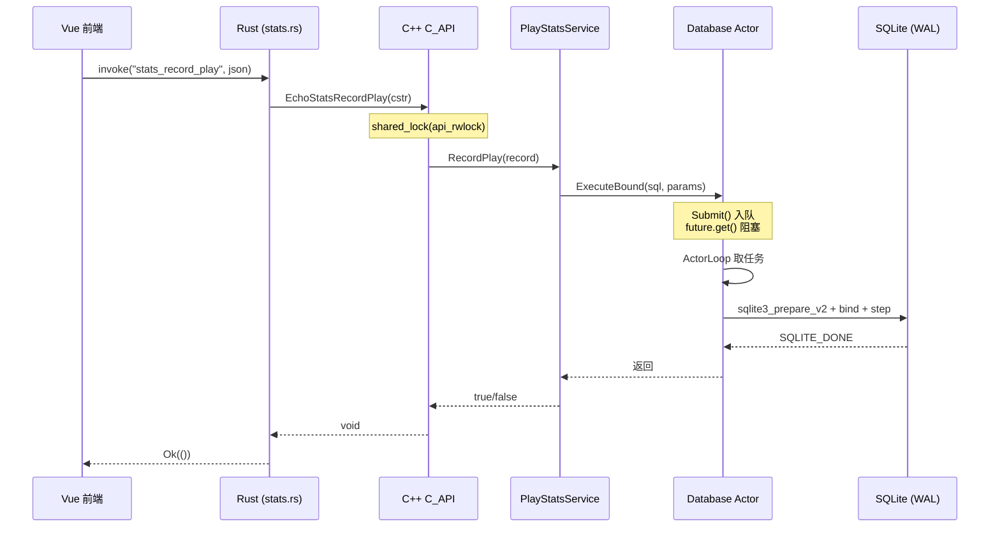
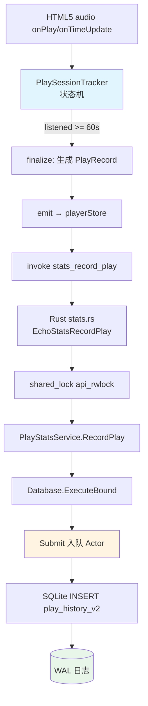
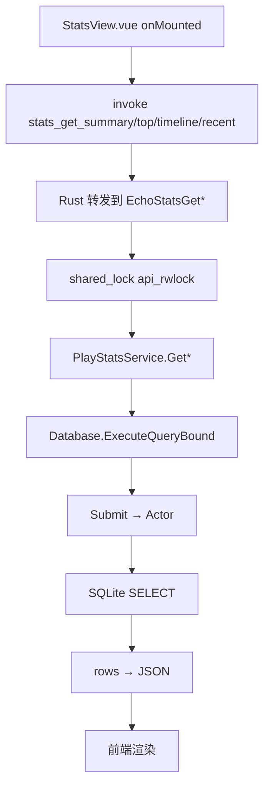

# 存储与数据层

> Code Wiki · 存储与数据层
> 基线 commit:`22ba7951`(main,codex/wiki-audit worktree)
> 事实来源:[evidence-report.md](./evidence-report.md) + 仓库源码核验(2026-07-23)

## 1. 概览

BottleMusic 的存储与数据层按**职责**分为四条独立通路,各自有不同的持久化介质、信任边界和生命周期:

| 分层 | 介质 | 信任边界 | 负责模块 |
|---|---|---|---|
| 播放统计 | SQLite(`play_history_v2`) | 本机明文,无敏感数据 | `Database` + `PlayStatsService` |
| 会话凭证 | SQLite(`kv_store`) + DPAPI | 当前 Windows 用户范围加密 | `SessionRepository` |
| 本地偏好 | `localStorage`(浏览器/Tauri webview) | 本机明文,无敏感数据 | 前端各 store |
| DeepSeek Key | 进程内存 `ref('')` | 仅当前页面会话,不入任何持久层 | `StatsView.vue` |

**关键设计决策**:

- **SQLite 单库多表**:统计、KV(会话/设备/设置)、API 缓存共用同一个 SQLite 数据库文件,通过 `Database` Actor 串行化所有访问,**不使用 TLS**(`thread_local`)快照隔离,而是线性一致性(linearizable)。生产环境文件名为 `bottlemusic.db`(见 §2.1),回退路径为 `echomusic-native.db`。
- **DPAPI 会话保护**:登录 token 等凭证经 `CryptProtectData` 加密后存入 `kv_store`,绑定当前 Windows 用户;明文读取路径在 2026-07-17 一次性迁移后已关闭。
- **前端偏好零信任**:播放队列、音量、音质、EQ、外观等纯偏好数据落在 `localStorage`,可随时清空而不影响功能;**DeepSeek Key 显式不入 localStorage**,旧版本残留 Key 在 `StatsView.vue` 模块加载时被清理。

存储层在三层架构中的定位:

- Vue 前端 → `localStorage` + Tauri IPC(`stats_*` 命令)
- Rust FFI 外壳 → `stats_record_play` 等命令转发到 C ABI
- C++ 核心 DLL → `Database` Actor + SQLite WAL

## 2. SQLite 数据库

### 2.1 数据库文件位置

数据库路径由 [C_API.cpp](../../native/core/C_API.cpp) 的 `EnsureInitializedLocked` 与 [AppPaths.cpp](../../native/storage/AppPaths.cpp) 共同决定:

- **生产路径**:`<app_data_dir>/bottlemusic.db` —— 当 `EchoInitializeWithPathsV2(app_data_dir)` 传入非空 `app_data_dir` 时使用(Tauri 生产环境始终传入,见 `C_API.cpp` L83-89)。
- **回退路径**:`<app_data_dir>/echomusic-native.db` —— 当 `app_data_dir` 为空时由 `GetDefaultDatabasePath()` 返回(见 `AppPaths.cpp`)。
- `GetAppDataDirectory()` 优先读 `ECHO_NATIVE_DATA_DIR` 环境变量(测试覆盖用);否则使用 `%LOCALAPPDATA%\EchoMusicNative`。
- 若 `LOCALAPPDATA` 不可用,回退到系统 temp 目录,确保只读环境也能初始化。

> 注:目录名为 `EchoMusicNative`(历史命名)。生产数据库文件名为 `bottlemusic.db`;`echomusic-native.db` 仅在无显式 `app_data_dir` 时作为回退路径。

### 2.2 连接初始化与 PRAGMA

[Database.cpp](../../native/storage/Database.cpp) 的 `InitializeSchema()` 在 Actor 线程内执行以下 PRAGMA 与建表:

```sql
PRAGMA journal_mode=WAL;
PRAGMA synchronous=NORMAL;
PRAGMA busy_timeout=5000;
```

- **WAL 模式**:写入不阻塞读,崩溃后可通过 `-wal` 日志恢复。
- **`synchronous=NORMAL`**:在 WAL 模式下足够安全,且避免 `FULL` 的 fsync 开销。
- **`busy_timeout=5000`**:并发连接(如开发期测试)争用时等待 5 秒而非立即报错;`ApplyBusyTimeout` 在每次 `OpenLocked` 后再次应用,确保连接级生效。

### 2.3 表结构

`InitializeSchema()` 创建五张表:

| 表 | 用途 | 关键字段 |
|---|---|---|
| `kv_store` | 通用键值存储(session/device/settings) | `key TEXT PK, value TEXT, updated_at INTEGER` |
| `api_cache` | API 响应缓存 | `cache_key TEXT PK, response_json, expires_at, created_at` |
| `play_history` | 旧版播放历史(已弃用,保留兼容) | `id, mix_song_id, played_at, progress_seconds` |
| `play_history_v2` | 当前播放统计 | 见下表 |
| `image_cache` | 封面图磁盘缓存元数据(预留,见 evidence-report §1.4) | `url PK, file_path, bytes, last_access_at, created_at` |

**`play_history_v2` schema**(当前播放统计的主表):

| 字段 | 类型 | 说明 |
|---|---|---|
| `id` | INTEGER PK AUTOINCREMENT | 自增主键 |
| `song_hash` | TEXT NOT NULL | 歌曲 FileHash 去重键 |
| `song_name` | TEXT NOT NULL | 歌名 |
| `singer_name` | TEXT | 歌手 |
| `album_id` | TEXT | 专辑 ID(分组键,避免同名合并) |
| `album_name` | TEXT | 专辑名 |
| `cover_url` | TEXT | 封面 URL |
| `duration_seconds` | REAL DEFAULT 0 | 歌曲总时长 |
| `completed` | INTEGER DEFAULT 0 | 是否听完(0/1) |
| `listened_seconds` | REAL DEFAULT 0 | 实际聆听秒数 |
| `quality` | TEXT | 播放音质 |
| `played_at` | INTEGER NOT NULL | 播放时间戳(ms) |

### 2.4 索引

```sql
CREATE INDEX idx_ph2_played_at ON play_history_v2(played_at DESC);
CREATE INDEX idx_ph2_song_hash ON play_history_v2(song_hash);
CREATE INDEX idx_ph2_singer ON play_history_v2(singer_name);
CREATE INDEX idx_api_cache_expires ON api_cache(expires_at);
```

- `played_at DESC` 索引支撑时间线查询与"最近播放"分页(`ORDER BY played_at DESC LIMIT ? OFFSET ?`)。
- `song_hash` 索引支撑歌曲维度 Top 统计与去重计数。
- `singer_name` 索引支撑歌手维度统计。
- `api_cache(expires_at)` 支撑过期清理扫描。

### 2.5 损坏文件隔离

`QuarantineInvalidSqliteFile`(Database.cpp 匿名命名空间)在打开前校验文件头是否为 `SQLite format 3\0`;若否,将文件重命名为 `<path>.invalid-<timestamp>` 并删除残留 `-wal`/`-shm`。`InitializeLocked()` 在 schema 初始化抛出 "file is not a database" 时也会执行同样隔离后重试,保证启动不会因损坏 DB 卡死。

## 3. Storage Actor 模式

### 3.1 设计

所有 SQLite 访问(读 + 写)都经 `Database` 内部单线程 Actor 串行化。核心声明见 [Database.h](../../native/include/echo/storage/Database.h):

- **无 TLS**:不依赖 `thread_local` 连接或快照,而是用单一 actor 线程 + 任务队列。
- **线性一致性**:`Submit` 在 `queue_mutex_` 下入队,`future.get()` 通过 actor 队列建立 happens-before 关系;一次完成的 `SetJson` 对后续 `GetJson` 可见。
- **防重入**:若调用方线程 id 等于 `actor_tid_`,直接抛 `actor_reentrancy`(避免在 actor 任务内再次 `Submit` 导致死锁)。

`Database::Submit` 是一个模板方法(Database.h),签名为:

```cpp
template <typename F>
auto Submit(F&& fn) const -> std::invoke_result_t<F>;
```

每个公开 API(`Execute` / `ExecuteBound` / `ExecuteQueryBound` / `SetJson` / `GetJson` / `PutApiCache` / `GetApiCache` / `PruneExpiredApiCache`)都通过 `Submit([this, ...]{ ...Locked(...); })` 把实际工作投递到 actor 线程,调用方阻塞在 `future.get()` 直到完成。

### 3.2 Actor 状态机

`ActorState` 枚举:`Closed → Starting → Open → Closing → Failed`。

- `StartActor()`:启动 actor 线程,通过 `std::promise` 等待线程内 `actor_tid_` 就绪。
- `ActorLoop()`:循环 `wait` 任务队列,逐个执行 `task()`;观察到 `Closing`/`Failed` 且队列空时退出。
- `Close()`:先在锁内将状态切到 `Closing` 并入队一个 `CloseLocked` 任务,确保在途任务执行完毕后再关闭连接;支持并发 `Close` 调用(peer 等待)。

### 3.3 时序:从 Vue 到 SQLite WAL



> 读路径(`GetSummary` 等)相同时序,差异仅在 `Submit` 返回值类型为 `std::vector<...>` 或 `std::optional<json>`。

## 4. PlayStatsService

[PlayStatsService.cpp](../../native/stats/PlayStatsService.cpp) 封装播放统计的六个操作,持有 `Database&` 引用,本身无独立 mutex——并发安全完全依赖 `Database` Actor 串行化。

### 4.1 RecordPlay

```cpp
bool RecordPlay(const PlayRecord& r);
```

- **门槛**:`listened_seconds <= kMinCountedListenedSeconds`(60 秒)直接返回 `false`,不写入。这避免切歌、误触产生的"伪播放"污染统计。
- **写入**:`INSERT INTO play_history_v2 (...) VALUES (?1..?11)`,全部字段用占位符绑定。
- **异常吞咽**:`catch (...)` 返回 `false`,保证统计失败不影响播放流程。

### 4.2 五个查询函数

| 函数 | 输出 | 关键 SQL |
|---|---|---|
| `GetSummary(range)` | 播放数/聆听秒数/独立歌/独立歌手/完成率 | `COUNT / SUM / COUNT(DISTINCT) / 完成率` |
| `GetTop(dim, range, limit)` | Top N 歌曲/歌手/专辑 | `GROUP BY <dim> ORDER BY cnt DESC` |
| `GetTimeline(range)` | 按日期计数 | `GROUP BY date(played_at/1000,'unixepoch','localtime')` |
| `GetRecent(limit, offset)` | 最近播放列表 | `ORDER BY played_at DESC LIMIT ? OFFSET ?` |
| `GetRecommendations(limit)` | 推荐歌手 | `GROUP BY singer_name ORDER BY cnt DESC` |

所有查询都用 `?N` 占位符 + `BindValue`(variant:`int64_t` / `double` / `string`)绑定参数,通过 [Database.cpp](../../native/storage/Database.cpp) 的 `BindParams` 分派到 `sqlite3_bind_int64` / `sqlite3_bind_double` / `sqlite3_bind_text`。

### 4.3 SQL 注入防护

**两道防线**:

1. **值参数绑定**:所有用户/运行时数据(song_hash、range、limit 等)走 `?N` 占位符,SQLite 原生转义,无字符串拼接。
2. **标识符白名单**:SQL 标识符(列名)无法用占位符绑定。`DimGroupCol(dim)` 函数对 `dim` 做硬编码白名单匹配:
   ```cpp
   if (dim == "song") return "song_hash";
   if (dim == "artist") return "singer_name";
   return "album_id";
   ```
   任何非预期 `dim` 值回退到 `album_id`,杜绝标识符注入。

### 4.4 album 分组策略

`GetTop(dim="album", ...)` 按 `album_id` 分组(而非 `album_name`)。这是有意为之:不同歌手可能发行同名专辑,按名字分组会错误合并;按 `album_id` 分组保证专辑实体唯一。

### 4.5 范围计算

`RangeToTimestamp(range)` 将 `"1d"`/`"7d"`/`"30d"` 转为毫秒时间戳下限;其他值(含 `"all"`)返回 0,表示无下限。

### 4.6 线程安全模型

- **PlayStatsService 自身**:无 mutex,无状态(仅持有 `Database&`)。
- **C ABI 层并发保护**:见 [C_API.cpp](../../native/core/C_API.cpp) 的 `EchoStatsRecordPlay` / `EchoStatsGetSummary` / `EchoStatsGetTop` / `EchoStatsGetTimeline` / `EchoStatsGetRecent` / `EchoStatsGetRecommendations`。每个入口第一行都是:
  ```cpp
  std::shared_lock<std::shared_mutex> lock(Ctx().api_rwlock);
  if (!Ctx().stats) return /* 空结果 */;
  ```
  `shared_lock` 保护 `Ctx().stats`(以及 `Ctx().db`)指针的读访问;`EchoShutdown` 在写侧(无锁原子写 + 独占写锁)拆解指针。
- **Database 内部并发**:由 `queue_mutex_` + Actor 单线程串行化所有 SQLite 调用。

因此跨线程的 `RecordPlay` 与 `GetSummary` 是线性一致的:不存在"读到半写入"的中间态。

## 5. 会话存储

[SessionRepository.cpp](../../native/storage/SessionRepository.cpp) 负责登录会话的持久化。

### 5.1 DPAPI 加密

`ProtectForCurrentUser(plaintext)` 调用 Windows `CryptProtectData`,描述字符串为 `L"BottleMusic account session"`,标志 `CRYPTPROTECT_UI_FORBIDDEN`。加密结果经 Base64 编码后存入 `kv_store` 的 `session.info` 键,结构:

```json
{
  "version": 1,
  "protected_data": "<base64 of DPAPI blob>"
}
```

- **绑定当前用户**:`CryptProtectData` 默认绑定调用方 Windows 用户 SID,其他用户(或同一机器的其他账户)无法解密。
- **解密**:`UnprotectForCurrentUser` 调用 `CryptUnprotectData`;失败返回 `std::nullopt`(用户切换、系统重装等场景安全降级)。
- **内存清零**:`Save` 完成后 `SecureZeroMemory` 清零明文缓冲,避免密文外泄前的明文驻留。

### 5.2 明文路径已关闭(一次性迁移)

`Load()` 中存在一次性迁移逻辑:

1. 读取 `session.info`,若 `version == 1` 且含 `protected_data`,走 DPAPI 解密路径(当前主路径)。
2. 否则检查 `session.encryption_migrated` 标志:
   - 若为 `true`:**拒绝**明文 payload,日志 `"refusing plaintext session.info after migration; ignoring"`,返回 `std::nullopt`。这防止迁移完成后被备份恢复或第三方写入的明文 session 被误用。
   - 若为 `false` 或不存在:执行**一次性迁移**——解析明文 JSON,调用 `Save()` 重新加密写入,然后写入 `session.encryption_migrated = true`。后续所有 `Load` 都走加密路径。

> 截至 2026-07-17 基线,该迁移已对所有线上用户执行完毕;新安装直接写入加密格式,明文路径仅作为历史兼容窗口保留。

### 5.3 SessionInfo 字段

`SessionInfo`(见 `echo/core/JsonHelpers`)包含:`token`、`userId`、`t1`、`nickname`、`pic`、`vip` 等。`IsEmptySession` 判断全字段为空时视为无会话。

## 6. 设备记录

[DeviceRepository.cpp](../../native/storage/DeviceRepository.cpp) 持久化 KuGou 设备指纹,存于 `kv_store` 的 `device.info` 键。

### 6.1 DeviceInfo 字段

`dfid`(设备指纹)、`mid`、`uuid` 等字段,由 [DeviceService.cpp](../../native/core/DeviceService.cpp) 的 `CreateDeviceInfo` / `NormalizeDeviceInfo` 生成与规范化。`dfid` 为空或 `"-"` 时视为占位,`NormalizeDeviceInfo` 会从 dfid 派生 `uuid = MD5(dfid + mid)` 保证一致性。

### 6.2 本地 + 远端双重管理

- **本地**:`DeviceRepository::Save/Load/Clear` 三个方法,均通过 `Database` Actor 访问 `kv_store`。
- **远端**:[DeviceRegisterService.cpp](../../native/core/DeviceRegisterService.cpp) 负责向 KuGou 注册设备,获取"受信任"的 `dfid`/`mid`/`uuid`。注册成功后,`/v5/url` 等接口返回完整 VIP URL;未注册时仅返回 60 秒试听。
- **用户覆盖**:前端 [SettingsView.vue](../../ui/src/views/SettingsView.vue) 提供 dfid/mid/uuid 输入框,用户可填入从官方渠道抓取的真实指纹覆盖自动生成值,用于解锁风控受限接口(如歌单 20017、song/url 试听)。

### 6.3 清除

`Clear()` 写入空 JSON 对象,设备退化为未注册占位状态,下次请求会触发重新注册或使用 `"-"` 占位。

## 7. 设置与缓存

### 7.1 SettingsRepository

[SettingsRepository.cpp](../../native/storage/SettingsRepository.cpp) 存于 `kv_store` 的 `app.settings` 键,管理三项原生侧设置:

- `volume`(0.0–1.0,`std::clamp` 钳制)
- `startupPage`(字符串,空时回退 `"home"`)
- `imageMemoryCacheMb`(8–128 MB,钳制)

读写均经 `Database::GetJson/SetJson` → Actor → SQLite。

### 7.2 ApiCache

[ApiCache.cpp](../../native/storage/ApiCache.cpp) 提供带 TTL 的 API 响应缓存,存于 `api_cache` 表:

- `Get(key)`:委托 `Database::GetApiCache(key, now)`,过期返回 `std::nullopt`。
- `Put(key, payload, ttl)`:写入 `expires_at = now + ttl.count()`。
- `PruneExpired()`:委托 `Database::PruneExpiredApiCache(now)`,扫描 `expires_at < now` 的行删除(由 `idx_api_cache_expires` 索引加速)。

`ApiCache` 是纯转发封装,所有 SQL 在 `Database` 的 `*Locked` 方法内执行,仍走 Actor 串行化。

## 8. 前端持久化

前端持久化完全落在 webview 的 `localStorage`,无敏感数据。

### 8.1 偏好键清单

| 键 | 用途 | 写入位置 |
|---|---|---|
| `player_queue` | 播放队列 | [playerPersistence.ts](../../ui/src/api/playerPersistence.ts) |
| `player_index` | 当前曲目索引 | playerPersistence.ts |
| `player_volume` | 音量 | [playerStore.ts](../../ui/src/api/playerStore.ts) / html5Backend.ts |
| `player_quality` | 音质(128/320/flac) | playerStore.ts |
| `player_eq_preset` / `player_eq_bands` / `player_eq_enabled` | EQ 预设/频段/开关 | [EqualizerView.vue](../../ui/src/views/EqualizerView.vue) / EqualizerPanel.vue |
| `player_loop_mode` / `player_queue_mode` | 循环/队列模式 | playerStore.ts |
| `appearance_accent` / `appearance_compact_list` / ... | 外观偏好/skin/mode | [appearanceStore.ts](../../ui/src/api/appearanceStore.ts) |
| `recent_played` | 最近播放(本地) | [recentPlayedStore.ts](../../ui/src/api/recentPlayedStore.ts) |
| `lyric_focus_*` | 歌词聚焦模式 | lyricFocusStore.ts |

### 8.2 recentPlayedStore

[recentPlayedStore.ts](../../ui/src/api/recentPlayedStore.ts) 是"最近播放"的前端本地缓存,设计要点:

- **本地优先**:构造时立即从 `localStorage` 加载,UI 不阻塞等待远端。
- **FileHash 去重**:`recordRecentPlayed` 用 `track.FileHash` 过滤重复项,新记录置于队首。
- **容量上限**:`MAX_RECENT_ENTRIES = 100`,超出截断。
- **mergeRemote(纯函数)**:本地与远端列表按 `FileHash` 去重,`playedAt` 大者胜出,按时间倒序排序。**不修改本地 store,不持久化远端条目**——调用方(HistoryView)持有合并后的展示列表。
- **reset**:登出/测试重置时清空内存 + 持久化。
- **容错**:`persist` 失败(quota 超限、隐私模式)静默吞咽,不破坏播放。

### 8.3 DeepSeek Key 不入 localStorage

[StatsView.vue](../../ui/src/views/StatsView.vue) 在模块加载时:

```ts
localStorage.removeItem('deepseek_api_key');  // L53
const aiApiKey = ref('');                      // L54
```

- **当前实现**:`aiApiKey` 是内存 `ref`,仅在当前页面会话存活,不写入 `localStorage`/磁盘。调用 `ai_analyze` 时传入内存值,Rust 侧 [ai_analysis.rs](../../ui/src-tauri/src/ai_analysis.rs) 用完即弃,不持久化。
- **清理遗留**:`removeItem` 是为清理升级用户的旧版 Key(历史版本曾存 localStorage),见 evidence-report §5。
- **测试覆盖**:[StatsView.test.ts](../../ui/src/views/__tests__/StatsView.test.ts) 断言旧 Key 被清理(`expect(localStorage.getItem('deepseek_api_key')).toBeNull()`)。

## 9. 数据流总览

### 9.1 写入流(播放完成 → 落库)



[PlaySessionTracker](../../ui/src/api/playSessionTracker.ts) 关键设计:

- **状态机**:`idle → pending → playing → paused`,只在真实 `play` 事件后开 session,避免 autoplay 被拒产生 ghost session。
- **聆听秒数累积**:`onTimeUpdate` 仅累加 `delta > 0 && delta < SEEK_THRESHOLD`(2 秒)的增量;大跳变(seek)和回跳(replay)被忽略,防止循环/后台挂起虚增。
- **门槛**:`MIN_RECORD_LISTENED_SECONDS = 60`,与 C++ 侧 `kMinCountedListenedSeconds` 一致,前后双重过滤。

### 9.2 读取流(查询时反向)



读取与写入共享同一 Actor 队列,因此**读永远看到最近一次完成的写**(线性一致性),无脏读。

## 10. 已知风险

**无重大风险**。存储层的并发模型经 Actor 串行化已系统性解决:

- **并发写**:`Database` 单线程 Actor 保证所有写操作串行,无需外部锁。
- **崩溃恢复**:WAL 模式 + `synchronous=NORMAL` 在崩溃后可恢复到最后一次提交的事务。
- **凭证泄露**:会话经 DPAPI 加密,绑定当前用户;明文路径已关闭。
- **SQL 注入**:值参数绑定 + 标识符白名单,双重防线。

**低风险观察**(非阻塞):

- `play_history`(v1 旧表)schema 仍保留(`CREATE TABLE IF NOT EXISTS`),但代码无任何读写引用。可在未来 schema 迁移时删除,当前保留以避免旧库升级时丢表。
- `image_cache` 表已创建,但 EchoImage 库未挂载主链路(见 evidence-report §1.4),表为空。
- `ExecuteQueryBoundLocked` 在 `sqlite3_prepare_v2` 失败时静默返回空结果(legacy tolerance),可能掩盖 schema 不一致;但生产 schema 在 `InitializeSchema` 中幂等创建,实际触发概率低。

## 11. 未来提案

### 11.1 一键清除本地数据

**提案**:在设置页提供"清除所有本地数据"按钮,一键清理:

- SQLite 统计数据(`play_history_v2` 全表清空或按时间范围清理)
- 会话凭证(`session.info` + `session.encryption_migrated`)
- 设备记录(`device.info`,触发下次启动重新注册)
- API 缓存(`api_cache` 全表)
- 前端 `localStorage`(播放队列/音量/EQ/外观/最近播放等)

**动机**:当前用户只能逐项清理或卸载重装,隐私控制粒度粗。一键清除提升用户对本地数据的掌控感,与 PRIVACY.md 的"用户数据自主"承诺对齐。

**设计约束**:

- 需区分"清除统计"与"清除全部"两档,避免误操作丢失登录会话。
- 清除后需刷新前端 store(recentPlayedStore.reset、playerStore 重载默认值)。
- SQLite 清除走 `DELETE FROM ...` 而非 `DROP TABLE`,保留 schema。

详见 [maintenance.md](./maintenance.md)(待创建)。

### 11.2 其它候选(不在本轮范围)

- `play_history` v1 表的最终删除(需 schema 版本迁移机制)。
- EchoImage 挂载主链路后,`image_cache` 表的实际使用。
- `ApiCache` 的 LRU 淘汰策略(当前仅按 TTL 过期,无容量上限)。

---

> 本文档所有结论以 [evidence-report.md](./evidence-report.md) 与仓库源码为准。行号仅作定位参考,不作长期锚点;引用以文件 + 类/函数名为主。
