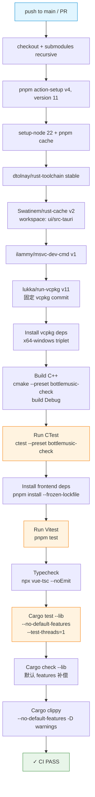

# Testing & Release — BottleMusic Code Wiki

> 本文档描述 BottleMusic 的测试体系、CI/CD pipeline 与 Release 流程。
> 事实来源:[evidence-report.md](./evidence-report.md)(基线 commit `22ba7951`,2026-07-23 核验)。
> 本文档明确区分 **当前实现**、**已知风险**、**未来提案** 三类信息。

## 概览

BottleMusic 采用 **三层测试 + CI/CD + Release** 的质量保障体系,**仅支持 Windows 平台**:

| 层 | 入口 | 测试用例规模 | CI 执行 |
|---|---|---|---|
| C++ 核心 | `ctest --preset bottlemusic-check` | 11 个测试可执行 | ✓ CI + Release 均执行 |
| Rust FFI 外壳 | `cargo test --lib --no-default-features` | 34 个 `#[test]` / `#[tokio::test]` | ✓ CI + Release 均执行 |
| Vue 3 前端 | `pnpm test`(`vitest run`) | 78 个 `.test.ts` 文件 | ✓ CI + Release 均执行 |

- **CI**([ci.yml](../../.github/workflows/ci.yml)):push 到 `main` 或任意 PR 触发,`runs-on: windows-latest`,执行全三层测试 + 类型检查 + clippy。
- **Release**([release.yml](../../.github/workflows/release.yml)):推送 `v*` tag 触发,`runs-on: windows-latest`,在三层测试通过后通过 `tauri-action` 构建 NSIS 安装包并上传 GitHub Releases。
- **平台约束**:C++ 依赖 WinHTTP / WIC / MSVC;Rust 依赖 `tray-icon`(Windows 托盘);前端通过 Tauri IPC 调用 native。无 macOS / Linux 构建路径。

---

## 测试体系

### C++ 测试

**当前实现**:

- 测试源码位于 [native/tests/](../../native/tests/),共 **11 个 `.cpp` 文件**,每个文件对应一个 `add_executable` + `add_test` 目标。
- 入口命令:`ctest --preset bottlemusic-check`(preset 定义在 `native/CMakePresets.json`)。
- **失败信号机制**:使用标准 `assert` 宏,**不使用 gtest / Catch2**。`assert(condition)` 失败即终止进程,CTest 据此报告 FAIL。
- **强制保留 assert**:即便 Release preset 定义了 `NDEBUG`,[native/CMakeLists.txt](../../native/CMakeLists.txt) 中 `ECHO_NATIVE_TESTS` 列表的每个目标都被强制加上 `/UNDEBUG`(MSVC)或 `-UNDEBUG`(其它编译器)编译选项,确保 `assert` 不被编译掉,避免 CTest 出现 false green。
- **PATH prepend 防 0xc0000135**:测试进程需要加载 vcpkg 提供的动态库(`sqlite3.dll` 等)。CMake 通过 `set_tests_properties(... PROPERTIES ENVIRONMENT_MODIFICATION "PATH=path_list_prepend:${ECHO_NATIVE_VCPKG_INSTALLED_DIR}/bin")` 把 `native/vcpkg_installed/x64-windows/bin` 前置到 PATH,避免启动时报 `0xc0000135`(DLL 未找到)。

**11 个测试目标**(对应 [native/CMakeLists.txt](../../native/CMakeLists.txt) 中 `ECHO_NATIVE_TESTS` 列表):

| # | 目标名 | 源文件 | 链接库 | 说明 |
|---|---|---|---|---|
| 1 | `EchoNativeSmokeTests` | `basic_contract_tests.cpp` | EchoCore + EchoAsync + EchoImage + EchoDiagnostics | 全量契约烟雾测试,含路由 / 加密 / 服务契约 |
| 2 | `EchoRouteContractTest` | `route_contract_test.cpp` | EchoCore + EchoStorage | 路由契约 |
| 3 | `EchoSongUrlContractTest` | `songurl_contract_test.cpp` | EchoCore | 歌曲 URL 契约 |
| 4 | `EchoPlaylistContractTest` | `playlist_contract_test.cpp` | EchoCore | 歌单契约 |
| 5 | `EchoProfileSignatureContractTest` | `profile_signature_contract_test.cpp` | EchoCore | 个人资料签名契约 |
| 6 | `EchoHomeContractTest` | `home_contract_test.cpp` | EchoCore | 首页契约 |
| 7 | `EchoHttpClientResilienceTest` | `http_client_resilience_test.cpp` | EchoCore + ws2_32 | HTTP 客户端韧性 |
| 8 | `EchoRequestSchedulerResilienceTest` | `request_scheduler_resilience_test.cpp` | EchoCore + EchoAsync | 请求调度器韧性 |
| 9 | `EchoDatabaseActorLifecycleTest` | `database_actor_lifecycle_test.cpp` | EchoStorage | Storage Actor 生命周期 + WAL 并发访问 |
| 10 | `EchoPlayStatsTest` | `play_stats_test.cpp` | EchoCore + EchoCAPI | 播放统计 |
| 11 | `EchoDatabaseWalConcurrencyTest` | `database_wal_concurrency_test.cpp` | EchoStorage | WAL 并发(条件编译:仅 `ECHO_NATIVE_SQLITE_AVAILABLE` 时启用) |

> 第 11 个目标仅在 SQLite 可用时编译。CI 通过 vcpkg 安装 `unofficial-sqlite3`,因此 CI 中 11 个目标全部执行。

**设计说明 — 为何用 `assert` 而非 gtest**:

当前 C++ 测试刻意选择标准 `assert` 宏作为失败信号,而非引入 gtest / Catch2 等测试框架。理由有二:

1. **零依赖**:不增加 `vcpkg.json` 依赖与构建时间,测试目标直接链接 `EchoCore` / `EchoStorage` 等内部库即可。
2. **契约验证场景**:大多数测试是"调用 API → 断言返回值 / 状态"的契约测试,`assert` 足够表达;复杂夹具与参数化需求不强。

代价是失败信息简陋(仅 `assertion failed` + 文件名 + 行号),且无 `EXPECT_*`(非致命)与 `ASSERT_*`(致命)区分。未来若测试复杂度增长,可考虑迁移 gtest(见 [未来提案 P2](#p2c-测试框架迁移-gtest))。

**`/UNDEBUG` 的必要性**:CMake 的 Release preset 会定义 `NDEBUG`,导致标准 `assert` 被编译为空操作。若测试目标在 Release 配置下编译,`assert` 失效会让 CTest 报告 false green(测试通过但实际未验证)。[native/CMakeLists.txt](../../native/CMakeLists.txt) 通过 `foreach` 循环对 `ECHO_NATIVE_TESTS` 中每个目标强制 `/UNDEBUG`(MSVC)或 `-UNDEBUG`(GCC/Clang),覆盖 `NDEBUG`,确保 assert 在所有配置下生效。

### Rust 测试

**当前实现**:

- 测试入口:`cargo test --lib --no-default-features -- --test-threads=1`(在 [ui/src-tauri/](../../ui/src-tauri/) 目录下执行)。
- **必须 `--no-default-features`**:default feature `desktop-shell` 会启用 `tauri/tray-icon` 与 `dep:tauri-plugin-global-shortcut`,导致测试 harness 启动时崩溃,错误码 `STATUS_ENTRYPOINT_NOT_FOUND`。此约束在 [ui/src-tauri/Cargo.toml](../../ui/src-tauri/Cargo.toml) 的 `[dependencies]` 注释中明确记录。
- **必须 `--test-threads=1`**:避免并发测试引发的资源竞争(部分测试涉及全局状态 / FFI 加载)。
- 测试用例统计:在 `ui/src-tauri/src/` 目录下共 **34 个 `#[test]` 或 `#[tokio::test]`**,分布如下:
  - `lib.rs`:7
  - `audio_proxy.rs`:18
  - `ai_analysis.rs`:3
  - `stats.rs`:2
  - `os_media_session.rs`:2
  - `backend_api.rs`:2
- **集成测试**:[ui/src-tauri/tests/playback_ffi_test.rs](../../ui/src-tauri/tests/playback_ffi_test.rs) 是唯一的集成测试文件,**需要 `EchoCAPI.dll` 存在**才能运行。CI 只跑 `cargo test --lib`,**不跑集成测试**。本地执行 `cargo test`(无 `--lib`)会尝试跑集成测试,若 DLL 不在搜索路径则会失败。

**CI 补偿策略**(因 `--no-default-features` 跳过了 default feature 编译):

| 步骤 | 命令 | 目的 |
|---|---|---|
| Cargo test | `cargo test --lib --no-default-features -- --test-threads=1` | 跑测试(避开 tray-icon 崩溃) |
| Cargo check | `cargo check --lib` | 用 **默认 features** 编译,确保 `tray-icon` / `global-shortcut` 在 PR 中不退化 |
| Cargo clippy | `cargo clippy --no-default-features -- -D warnings` | lint(与 test 同 feature 集,`-D warnings` 视警告为错误) |

> Release 流程([release.yml](../../.github/workflows/release.yml))的 Rust 验证步骤略有不同:执行 `cargo test`(不带 `--lib` / `--no-default-features`)与 `cargo clippy --all-targets -- -D warnings`。这是因为 Release 环境已构建好 `EchoCAPI.dll` 并配置好 PATH,集成测试可运行;同时 Release 需验证 default features 的完整路径。详见 [Release 流程](#release-流程)章节。

### 前端测试

**当前实现**:

- 测试入口:`pnpm test`,等价于 `vitest run`([ui/package.json](../../ui/package.json) 中 `"test": "vitest run"`)。
- 技术栈:
  - **vitest** `^4.1.7`(主测试框架)
  - **jsdom** `^29.1.1`(DOM 环境)
  - **@vue/test-utils** `^2.4.10`(Vue 组件挂载与交互)
  - **@vitejs/plugin-vue**(支持 SFC 编译)
- 配置文件 [ui/vitest.config.ts](../../ui/vitest.config.ts):
  - `environment: 'jsdom'` — 所有测试在 jsdom 中运行
  - `globals: true` — `describe` / `it` / `expect` 全局可用,无需 import
  - `setupFiles: ['./src/test/setup.ts']` — 全局 setup(含 `@tauri-apps/api` `invoke` mock 等公共桩)
- 测试文件规模:`ui/src/` 下共 **78 个 `.test.ts` 文件**,覆盖 `api/`、`components/`、`views/`、`navigation/`、`test/` 各目录。其中 `api/__tests__/` 占比最大(约 40 个),覆盖播放、歌词、收藏、首页、均衡器等核心状态机。
- 类型检查:CI 单独执行 `npx vue-tsc --noEmit`(`build` 脚本同样内含此步),与 vitest 解耦。

**前端测试模式**:

- **IPC mock**:`@tauri-apps/api` 的 `invoke` 在 [ui/src/test/setup.ts](../../ui/src/test/setup.ts) 中被全局 mock,测试用例通过 `vi.mock` 指定每个命令的返回值,使组件测试无需 Tauri runtime。
- **store 隔离**:涉及 Pinia / 组合式 store 的测试在 `beforeEach` 中重置状态,避免用例间污染。
- **无网络请求**:所有 `fetch` / `invoke` 调用均被 mock,测试不依赖网络或后端。
- **快照**:部分视觉组件(如 Aurora 皮肤)使用快照测试,但主要断言仍以行为为主。

### 测试设计约定

| 约定 | 说明 |
|---|---|
| C++ 用 `assert` 非 gtest | 轻量级,无外部测试框架依赖;`/UNDEBUG` 保证 Release 下 assert 不被剥离 |
| Rust 避免 `tray-icon` feature | `cargo test` 必须 `--no-default-features`,CI 用 `cargo check --lib` 补偿 default feature 编译 |
| 前端 mock `@tauri-apps/api` `invoke` | jsdom 无法运行 Tauri runtime,所有 IPC 调用在 `src/test/setup.ts` 中统一 mock |
| 无 E2E 生产化 | Playwright 仅用于设计 QA 截图,**不是 E2E 测试**(详见 [Playwright 审查](#playwright-审查)) |
| 无 coverage 阈值 | 当前不收集 / 不阻断覆盖率(详见 [覆盖率调研](#覆盖率调研)) |

---

## CI 流程

**当前实现**:

CI 由 [ci.yml](../../.github/workflows/ci.yml) 定义:

- **触发条件**:`push` 到 `main` 分支,或任意 `pull_request`。
- **运行环境**:`runs-on: windows-latest`(**Windows-only**)。
- **并发**:无显式 concurrency 控制(每个 push / PR 独立运行)。

### CI Pipeline



### CI 关键步骤说明

1. **vcpkg install**:使用 `lukka/run-vcpkg@v11`,锁定 `vcpkgGitCommitId: a0400024711b283056538ac19ced80b91a83c24c`,通过 `native/vcpkg.json` manifest 安装依赖到 `native/vcpkg_installed/`,triplet 为 `x64-windows`。
2. **CMake build**:配置 preset `bottlemusic-check`,构建 `Debug` 配置。测试目标强制 `/UNDEBUG`,因此即便 Debug 也会保留 assert。
3. **CTest**:在 `native/` 目录下执行 `ctest --preset bottlemusic-check`,跑全部 11 个测试目标。
4. **Vitest**:`pnpm test` = `vitest run`,跑全部 78 个 `.test.ts` 文件。
5. **Cargo test**:执行前将 `native\out\bottlemusic-check` 和 `native\vcpkg_installed\x64-windows\bin` 前置到 PATH,确保 Rust 测试能找到 `EchoCAPI.dll` 及 vcpkg 动态库。使用 `--no-default-features` 避开 tray-icon 崩溃,`--test-threads=1` 串行执行。
6. **Cargo check**:用默认 features(`desktop-shell` 含 `tray-icon`)编译,确保 PR 不破坏 default feature 路径。
7. **Cargo clippy**:`--no-default-features -D warnings`,与 test 同 feature 集,任何 warning 视为错误。

### CI 环境一致性

CI 与 Release 共享相同的基础工具链,确保本地与云端行为一致:

| 工具 | 版本锁定方式 |
|---|---|
| pnpm | `pnpm/action-setup@v4` 指定 `version: 11` |
| Node.js | `actions/setup-node@v4` 指定 `node-version: 22`,缓存依据 `ui/pnpm-lock.yaml` |
| Rust | `dtolnay/rust-toolchain@stable`(跟随 stable) |
| Rust 缓存 | `Swatinem/rust-cache@v2`,workspace 指向 `ui/src-tauri` |
| MSVC | `ilammy/msvc-dev-cmd@v1` |
| vcpkg | `lukka/run-vcpkg@v11`,锁定 `vcpkgGitCommitId: a0400024711b283056538ac19ced80b91a83c24c` |

> Rust 工具链未锁定具体版本(用 `stable`),意味着 stable 升级可能引入新 clippy lint 导致 CI 失败。这是已知的小风险,通过 `Swatinem/rust-cache` 缓存缓解构建时间,但 lint 行为仍可能漂移。

---

## Release 流程

**当前实现**:

Release 由 [release.yml](../../.github/workflows/release.yml) 定义:

- **触发条件**:推送 `v*` 格式的 tag(如 `v1.0.0`)。
- **运行环境**:`runs-on: windows-latest`。
- **并发控制**:`concurrency.group: release-${{ github.ref }}`,`cancel-in-progress: false` — 同一 tag 的多次触发不取消,串行执行。
- **权限**:`permissions.contents: write`(用于创建 GitHub Release)。

### Release Pipeline

```mermaid
flowchart TD
    A[tag v* pushed] --> B[checkout + submodules recursive]
    B --> C[pnpm + node 22 + rust stable\n+ rust-cache + msvc-dev-cmd]
    C --> D[Setup vcpkg + install deps]
    D --> E[Sync version\nnode scripts/sync-version.mjs]
    E --> F[Build C++ Release\ncmake --preset bottlemusic-release\nbuild Release --target EchoCAPI]
    F --> G[Sync DLL\nCopy EchoCAPI.dll → ui/src-tauri/libs/]
    G --> H[Install frontend deps\npnpm install --frozen-lockfile]
    H --> I[Verify native core\ncmake check + build + ctest]
    I --> J[Verify release\npnpm test + pnpm build]
    J --> K[Verify Rust bridge\ncargo test + cargo clippy --all-targets -D warnings]
    K --> L[tauri-apps/tauri-action@v0]
    L --> M[构建 NSIS 安装包\ninstallMode: currentUser]
    M --> N[minisign 签名更新包\nTAURI_SIGNING_PRIVATE_KEY from Secrets]
    N --> O[上传 GitHub Releases\nreleaseName: BottleMusic v*]
    O --> P[生成 latest.json\nupdater endpoint]
    P --> Q[✓ Release 完成]

    style A fill:#e1f5ff,stroke:#0288d1
    style Q fill:#e8f5e9,stroke:#388e3c
    style L fill:#f3e5f5,stroke:#7b1fa2
    style N fill:#fff3e0,stroke:#f57c00
```

### Release 关键步骤说明

1. **版本同步**:执行 `node scripts/sync-version.mjs`(详见 [版本同步](#版本同步)章节),以 [tauri.conf.json](../../ui/src-tauri/tauri.conf.json) 的 `version` 为唯一真实来源,同步到其余文件。
2. **C++ Release 构建**:preset `bottlemusic-release`,`--config Release --target EchoCAPI`,产出 `EchoCAPI.dll`。
3. **DLL 同步**:`Copy-Item native/out/bottlemusic-release/EchoCAPI.dll ui/src-tauri/libs/EchoCAPI.dll`,确保 Tauri 打包时能 `bundle.resources` 引用到 DLL。
4. **三层验证**:Release 流程在打包前**重新执行**全三层测试(C++ ctest + 前端 test/build + Rust test/clippy),作为发布前门禁。
   - **与 CI 的差异**:Release 的 Rust 验证用 `cargo test`(不带 `--lib` / `--no-default-features`),即跑 default features + 集成测试。这是因为 Release 环境已构建 `EchoCAPI.dll` 并配置 PATH,集成测试可运行;同时验证 default feature 完整路径,确保发布产物与实际运行配置一致。
   - **clippy 范围**:Release 用 `cargo clippy --all-targets`(含集成测试目标),CI 用 `cargo clippy --no-default-features`(仅 lib)。Release 覆盖更广。
5. **tauri-action**:由 [tauri-apps/tauri-action@v0](https://github.com/tauri-apps/tauri-action) 完成:
   - 构建 NSIS 安装包(`bundle.targets: "all"`,Windows 下实际产出 NSIS `.exe`)
   - `installMode: currentUser` — 安装到当前用户目录,无需管理员权限
   - `releaseDraft: false`,`prerelease: false` — 直接发布正式版
   - 上传到 GitHub Releases(`tagName` / `releaseName` 取自 tag)
   - 生成 `latest.json` 供 updater 使用

### 签名机制

- **更新包签名**:使用 minisign 私钥对 Tauri updater 产物签名。
- **私钥来源**:`TAURI_SIGNING_PRIVATE_KEY` 与 `TAURI_SIGNING_PRIVATE_KEY_PASSWORD` 从 GitHub Secrets 读取(见 [release.yml](../../.github/workflows/release.yml) 的 `env` 块)。
- **公钥内置**:[tauri.conf.json](../../ui/src-tauri/tauri.conf.json) 的 `plugins.updater.pubkey` 内置 minisign 公钥(base64),客户端据此验证更新包完整性。
- **updater endpoint**:`https://github.com/Ningbottle/BottlePlayer/releases/latest/download/latest.json` — 客户端轮询此 URL 获取最新版本信息。

> **注意**:签名仅覆盖 **Tauri updater 更新包**,NSIS 安装包本身无代码签名(无 Authenticode 证书)。Windows SmartScreen 可能对未签名安装包弹窗警告。

---

## 版本同步

**当前实现**:

版本号由 [ui/scripts/sync-version.mjs](../../ui/scripts/sync-version.mjs) 统一同步,以 [tauri.conf.json](../../ui/src-tauri/tauri.conf.json) 的 `version` 字段为**唯一真实来源**,同步到以下文件:

| 目标文件 | 字段 | 同步方式 |
|---|---|---|
| `ui/src-tauri/tauri.conf.json` | `version` | **读取源**(不修改) |
| `ui/package.json` | `version` | `pkg.version = version` |
| `ui/src-tauri/Cargo.toml` | `version` | 正则替换 `version = "..."` |
| `native/CMakeLists.txt` | `project(BottleMusicNative VERSION x.y.z)` | 正则替换 `VERSION\s+[\d.]+` |
| `native/vcpkg.json` | `version-string` | `vcpkg['version-string'] = version` |

- **调用入口**:Release 流程在 "Sync version" 步骤直接执行 `node scripts/sync-version.mjs`(`working-directory: ui`)。
- **本地后端同步**:[ui/package.json](../../ui/package.json) 中 `backend:sync` 脚本调用 `scripts/sync-backend.ps1`,用于本地开发时同步 DLL 到 `ui/src-tauri/libs/`(与版本号无关,仅同步二进制)。
- **测试模式**:`sync-version.mjs` 支持 `--root` 参数指向临时目录,用于单元测试(见 `ui/src/api/__tests__/syncVersion.test.ts`)。

---

## Changelog 现状

**当前实现**:**纯手工维护,严重滞后**。

**证据**:

- [CHANGELOG.md](../../CHANGELOG.md) 共 15 个条目,日期范围 `2026-02-03` 至 `2026-05-22`。
- git log 实际提交范围 `2026-02-02` 至 `2026-07-22`。
- **最后一条**:`2026-05-22 Frontend resilience for API calls`,早于 v1.0.0(2026-06-04 发布)。
- [release.yml](../../.github/workflows/release.yml) **无 changelog 生成步骤** — Release 流程不读取 / 不更新 / 不生成 CHANGELOG。
- [ui/package.json](../../ui/package.json) **无自动化工具依赖**(无 `standard-version` / `changesets` / `git-cliff`)。

**结论**:CHANGELOG 自 2026-05-22 起停滞约 2 个月,v1.0.0 及之后的所有发布(含功能、修复、重构)均未记录。当前无任何机制保证 CHANGELOG 与 git 历史同步。

**已知风险**:用户与维护者无法通过 CHANGELOG 了解版本间变更,只能 `git log`。这对发布说明、升级决策、回归追溯造成障碍。

---

## Playwright 审查

**当前实现**:**Playwright 在 devDependencies 中,但仅用于设计 QA 截图脚本,不是 E2E 测试。**

**证据**:

- [ui/package.json](../../ui/package.json) `devDependencies` 含 `playwright: ^1.61.1`。
- 截图脚本(在 [ui/scripts/](../../ui/scripts/) 目录):
  - `capture-aurora-qa.mjs` — `import { chromium } from 'playwright'`,产出 `ui/design-qa-captures/` 下的 Aurora 皮肤截图
  - `capture-stage-preview.mjs` / `capture-player-preview.mjs` — 同类截图脚本
- **`package.json` `scripts` 中无 playwright 命令**(无 `test:e2e` 等)。
- [ui/vitest.config.ts](../../ui/vitest.config.ts) **未启用** `@vitest/browser`。
- **CI 不执行 playwright**(无 `playwright install` 步骤)。

**结论**:Playwright 是**设计 QA 的人工辅助工具**,由开发者本地运行 `node scripts/capture-aurora-qa.mjs` 等脚本,对 dev server(`http://127.0.0.1:5173/`)截图,用于视觉回归人工比对。**不是自动化 E2E 测试**,不进入 CI,不阻断发布。

**阻塞条件**(为何不将 Playwright 升级为 E2E 烟测):

1. **浏览器二进制缺失**:Playwright 需 `playwright install` 下载浏览器内核(约 300MB),CI 未配置此步骤。
2. **Tauri 应用需打包后才能 E2E**:本地 dev server 只是 Vite 前端,无法 E2E 测试 Tauri IPC / native FFI 路径;完整 E2E 需先 `tauri build` 产出可执行文件,再驱动 Playwright 操作原生窗口,工具链复杂度高。

**处理**:不删除 playwright 依赖(截图脚本在用);不在本轮添加 E2E 烟测到 CI。阻塞条件记录于 [maintenance.md](./maintenance.md),待 Tauri E2E 工具链成熟后启用。

---

## 覆盖率调研

**当前实现**:**无 coverage 阈值,无覆盖率收集。**

- 前端:[ui/vitest.config.ts](../../ui/vitest.config.ts) 未配置 `coverage` 选项,CI 不加 `--coverage`。
- C++:[native/CMakeLists.txt](../../native/CMakeLists.txt) 未启用 `--coverage` / gcov,无覆盖率目标。
- Rust:无 `cargo-tarpaulin` / `cargo-llvm-cov` 依赖,CI 不收集 Rust 覆盖率。

**建议工具**(未来提案,本轮不实施):

| 层 | 工具 | 说明 |
|---|---|---|
| 前端 | `vitest coverage`(`@vitest/coverage-v8`) | vitest 内置,配置 `coverage.provider: 'v8'` 即可 |
| C++ | `gcov` 或 `llvm-cov` | MSVC 下可用 `OpenCppCoverage` 或切换 clang 配合 `llvm-cov` |
| Rust | `cargo-tarpaulin` 或 `cargo-llvm-cov` | tarpaulin 对 Windows 支持有限,llvm-cov 更稳 |

**本轮决策**:**不设置阻断阈值**。当前测试体系以"契约 + 烟雾 + 韧性"为目标,而非覆盖率驱动。强制阈值可能诱导低价值测试。覆盖率工具引入留待未来提案评估。

---

## 已知风险

| # | 风险 | 影响 | 证据 |
|---|---|---|---|
| R1 | **Cargo test feature 约束脆弱** | `cargo test --lib` 必须 `--no-default-features`,否则 `tray-icon` 崩溃(`STATUS_ENTRYPOINT_NOT_FOUND`)。若开发者忘记加该参数,本地测试直接崩溃;CI 用 `cargo check --lib` 补偿,但**不跑 default feature 的测试** | [ui/src-tauri/Cargo.toml](../../ui/src-tauri/Cargo.toml) 注释;[ci.yml](../../.github/workflows/ci.yml) Cargo test / check 步骤 |
| R2 | **CHANGELOG 滞后 2 个月** | v1.0.0 及之后所有发布无记录,用户无法通过 CHANGELOG 了解变更 | [CHANGELOG.md](../../CHANGELOG.md) 最后条目 2026-05-22,git 实际到 07-22 |
| R3 | **Playwright 非生产 E2E** | 无自动化端到端测试,Tauri IPC / native FFI / 窗口交互路径无回归保护 | [ui/package.json](../../ui/package.json) 无 `test:e2e` 脚本;CI 无 playwright 步骤 |
| R4 | **集成测试默认不跑** | `tests/playback_ffi_test.rs` 需 DLL 存在,CI 只跑 `--lib`,FFI 集成路径在 CI 中无覆盖(Release 流程会跑) | [ci.yml](../../.github/workflows/ci.yml) 仅 `cargo test --lib`;[release.yml](../../.github/workflows/release.yml) 跑 `cargo test` |
| R5 | **NSIS 安装包无代码签名** | 无 Authenticode 证书,Windows SmartScreen 可能弹窗警告,影响用户首次安装体验 | [release.yml](../../.github/workflows/release.yml) 仅有 `TAURI_SIGNING_PRIVATE_KEY`(updater 签名),无代码签名步骤 |
| R6 | **vcpkg commit 锁定** | CI 与 Release 锁定 `vcpkgGitCommitId: a0400024711b283056538ac19ced80b91a83c24c`,vcpkg 升级需手动改 workflow,可能遗漏 | [ci.yml](../../.github/workflows/ci.yml) 与 [release.yml](../../.github/workflows/release.yml) 的 `run-vcpkg` 步骤 |

---

## 未来提案

> 以下提案均为**讨论方向**,本轮不实施。详细 RFC 见对应文档。

### P1:Release tooling RFC

**动机**:CHANGELOG 滞后(R2)+ Release 流程无自动 changelog 生成,纯手工维护不可持续。

**候选方案**(详见 `release-tooling-rfc.md`):

| 方案 | 机制 | 优势 | 劣势 |
|---|---|---|---|
| **git-cliff** | 从 conventional commits 自动生成 CHANGELOG | Rust 实现,配置灵活,单文件 | 依赖提交信息遵循 conventional commits 规范 |
| **Release Please** | Google 自动化 release PR + CHANGELOG | 自动管理版本号 + release PR | 针对 npm / GCP 生态优化,Tauri 需适配 |
| **现有手工** | 维护者手动编辑 CHANGELOG | 零依赖,零工具学习成本 | 已证明不可持续(滞后 2 个月) |

**建议**:输出 `release-tooling-rfc.md` 比较三方案,不直接安装工具。

### P2:C++ 测试框架迁移 gtest

**动机**:当前 C++ 测试用 `assert` 宏,无结构化断言(无 `EXPECT_*` / `ASSERT_*` 区分,无测试夹具,无参数化测试),错误信息简陋(仅 `assertion failed` + 行号)。

**候选**:Google Test(gtest)是 C++ 生态事实标准,提供丰富断言宏、夹具、参数化、死亡测试。

**权衡**:
- 引入 gtest 依赖需加入 `vcpkg.json`,增加构建时间。
- 现有 11 个测试目标需重写断言(机械迁移,工作量可控)。
- 收益:更清晰的失败定位、更好的 CI 输出、支持夹具复用。

**状态**:提案阶段,未排期。

### P3:E2E 烟测

**动机**:当前无自动化端到端测试(R3),Tauri 应用打包后的关键路径(启动、IPC、窗口、播放)无回归保护。

**阻塞条件**(详见 [maintenance.md](./maintenance.md)):

1. Playwright 需安装浏览器二进制(~300MB),CI 未配置。
2. Tauri 应用需 `tauri build` 打包后才能 E2E,dev server 无法测 IPC / FFI。
3. Tauri 官方 E2E 工具链(`tauri-driver` / `webdriver-io`)成熟度待评估。

**建议**:待 Tauri E2E 工具链成熟后,先引入"启动 + 主窗口可见 + 播放一首歌"最小烟测,再逐步扩展。

### P4:Coverage 工具引入

**动机**:当前无覆盖率数据(见 [覆盖率调研](#覆盖率调研)),无法量化测试盲区。

**建议**:
- 前端优先引入 `@vitest/coverage-v8`(零额外依赖,vitest 原生支持)。
- **不设置阻断阈值**,仅作为可视化指标暴露。
- C++ / Rust 覆盖率工具引入成本较高,留待后期评估。

---

## 附录:测试命令速查

```bash
# C++ 测试(在 native/ 目录)
cmake -S native --preset bottlemusic-check
cmake --build native/out/bottlemusic-check --config Debug
ctest --preset bottlemusic-check                    # 在 native/ 下执行

# Rust 测试(在 ui/src-tauri/ 目录)
cargo test --lib --no-default-features -- --test-threads=1
cargo check --lib                                   # 补偿 default feature 编译
cargo clippy --no-default-features -- -D warnings

# 前端测试(在 ui/ 目录)
pnpm test                                           # = vitest run
pnpm test:watch                                     # = vitest(watch 模式)
npx vue-tsc --noEmit                                # 类型检查

# 设计 QA 截图(本地人工,在 ui/ 目录)
node scripts/capture-aurora-qa.mjs                  # 需先启动 dev server
```

---

## 附录:相关文件索引

| 文件 | 作用 |
|---|---|
| [.github/workflows/ci.yml](../../.github/workflows/ci.yml) | CI pipeline 定义 |
| [.github/workflows/release.yml](../../.github/workflows/release.yml) | Release pipeline 定义 |
| [native/CMakeLists.txt](../../native/CMakeLists.txt) | C++ 测试目标定义(`ECHO_NATIVE_TESTS`) |
| [native/tests/](../../native/tests/) | 11 个 C++ 测试源文件 |
| [ui/src-tauri/Cargo.toml](../../ui/src-tauri/Cargo.toml) | Rust feature 与测试约束 |
| [ui/src-tauri/tests/playback_ffi_test.rs](../../ui/src-tauri/tests/playback_ffi_test.rs) | Rust 集成测试(需 DLL) |
| [ui/vitest.config.ts](../../ui/vitest.config.ts) | 前端测试配置 |
| [ui/src/test/setup.ts](../../ui/src/test/setup.ts) | 前端测试全局 setup(invoke mock) |
| [ui/package.json](../../ui/package.json) | 测试脚本与依赖声明 |
| [ui/scripts/sync-version.mjs](../../ui/scripts/sync-version.mjs) | 版本号同步脚本 |
| [ui/scripts/capture-aurora-qa.mjs](../../ui/scripts/capture-aurora-qa.mjs) | Playwright 设计 QA 截图脚本 |
| [ui/src-tauri/tauri.conf.json](../../ui/src-tauri/tauri.conf.json) | Tauri 打包 / 签名 / updater 配置 |
| [CHANGELOG.md](../../CHANGELOG.md) | 手工维护的变更日志(滞后) |
| [evidence-report.md](./evidence-report.md) | 本文档的事实核验来源 |

---

> 本文档所有结论以 [evidence-report.md](./evidence-report.md) 为准。行号仅作定位参考,不作长期锚点;请以文件名 + 类 / 函数名作为稳定引用。
